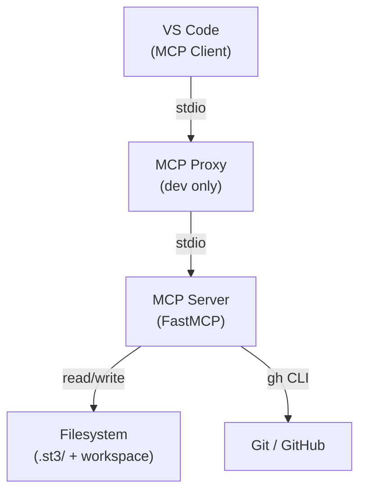
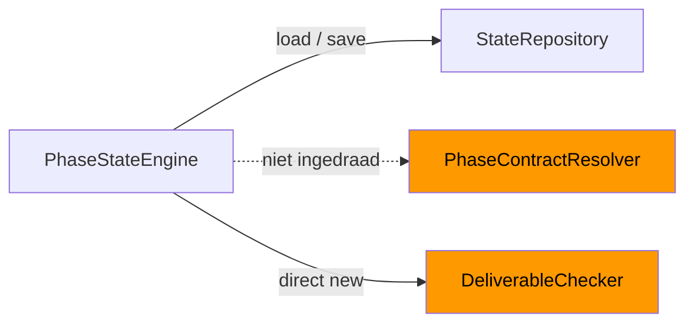
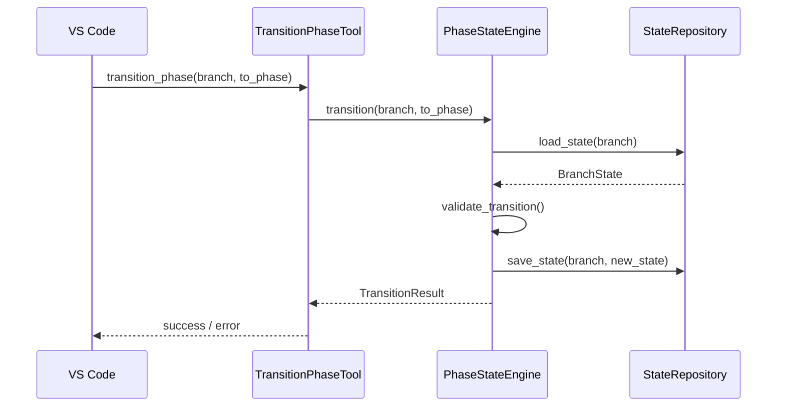

# Mermaid Voorbeelddiagrammen — Best Practice

Drie concrete voorbeelden: max 7–9 nodes, geen nesting dieper dan 2 niveaus.

---

## Diagram 1 — System Context (C4 Level 1)

---

## Diagram 2 — Workflow State Subsystem (integratiekloof zichtbaar)

> Oranje = gebouwd maar niet correct gekoppeld (integratiekloof RC-2).

---

## Diagram 3 — Sequence: `transition_phase`

