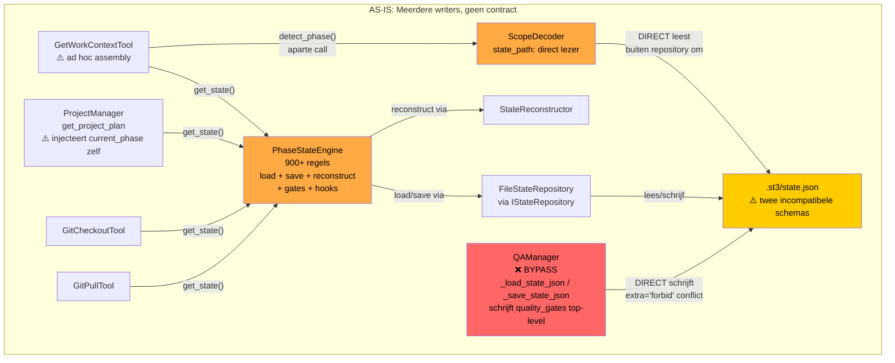
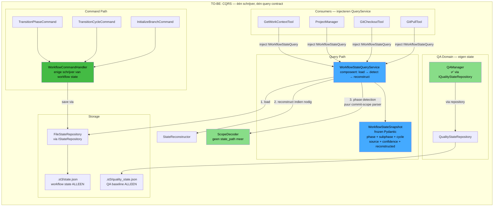

<!-- docs\development\issue231\research-issue231-292-state-cqrs.md -->
<!-- template=research version=8b7bb3ab created=2026-04-26T13:40Z updated= -->
# CQRS State Subsystem Redesign — Issues #231 & #292

**Status:** DRAFT  
**Version:** 1.0  
**Last Updated:** 2026-04-26

---

## Purpose

Research voor feature/231-state-snapshot-cqrs: clean-break redesign van het workflow state subsysteem als CQRS architectuur, waarmee issues #231 (typed snapshot) en #292 (state mutation concurrency / QAManager bypass) structureel worden opgelost.

## Scope

**In Scope:**
BranchState, FileStateRepository, InMemoryStateRepository, IStateRepository, IStateReader, PhaseStateEngine, StateReconstructor, ScopeDecoder (state_path koppeling), QAManager baseline persistence, GetWorkContextTool, GitCheckoutTool, GitPullTool, ProjectManager.get_project_plan, alle test bestanden die deze componenten raken

**Out of Scope:**
Issue #293 (cycle boundary semantics in PhaseContractResolver) — verwante maar aparte fix. Issue #295 (submit_pr atomicity). Issue #297 (create_branch upstream hardening). Geen UI/API contract wijzigingen buiten de MCP tool laag.

## Prerequisites

Read these first:
1. docs/coding_standards/ARCHITECTURE_PRINCIPLES.md — bindend contract
2. Issue #231: State reconciliation for get_state (typed snapshot API)
3. Issue #292: Workflow state mutation concurrency (QAManager bypass)
4. mcp_server/managers/state_repository.py — BranchState, FileStateRepository, InMemoryStateRepository
5. mcp_server/managers/phase_state_engine.py — huidige God Class
6. mcp_server/managers/qa_manager.py — _load_state_json / _save_state_json bypass
7. mcp_server/core/phase_detection.py — ScopeDecoder met directe state.json koppeling
8. mcp_server/core/interfaces/__init__.py — IStateRepository, IStateReader, IStateReconstructor
---

## Problem Statement

Het workflow state subsysteem heeft geen CQRS-scheiding: meerdere writers (PhaseStateEngine, QAManager, ScopeDecoder) raken hetzelfde .st3/state.json bestand via incompatibele schema's en bypass-paden. Tegelijk ontbreekt een typed read-model dat consumers een coherente workflow-snapshot geeft.

## Research Goals

- Identificeer alle writers en readers van .st3/state.json en hun contracten
- Bepaal de blast radius van een clean-break CQRS refactor (geen backward compat)
- Onderzoek of QAManager een eigen state-file krijgt of in BranchState past
- Bepaal de juiste structuur voor WorkflowStateSnapshot als typed query result
- Onderzoek hoe ScopeDecoder ontkoppeld kan worden van directe state.json toegang
- Beoordeel volledige test suite impact
- Definieer sluitende Expected Results die design en planning kunnen implementeren

---

## Background

Het platform heeft een werkend maar gefragmenteerd state subsysteem. BranchState is een bevroren Pydantic model met extra=forbid. FileStateRepository is de enige geautoriseerde schrijver — maar QAManager omzeilt dit volledig via eigen _load_state_json/_save_state_json static methods die een quality_gates top-level key schrijven die BranchState crasht bij validatie. ScopeDecoder leest state.json direct via een state_path parameter buiten FileStateRepository om. PhaseStateEngine (900+ regels) combineert load, save, reconstruction, gate enforcement en hook dispatch — een SRP overtreding. GetWorkContextTool assembleert cycle-info zelf door get_state() en detect_phase() apart aan te roepen — geen typed snapshot contract. Dit is de pre-research bevinding na code-inspectie op 2026-04-26.

## Related Documentation
- **[docs/development/issue290/research-issue231-state-snapshot.md][related-1]**
- **[docs/development/issue290/research-issue292-state-mutation-concurrency.md][related-2]**
- **[docs/development/issue290/research-issue293-cycle-boundary-semantics.md][related-3]**
- **[docs/coding_standards/ARCHITECTURE_PRINCIPLES.md][related-4]**

<!-- Link definitions -->

[related-1]: docs/development/issue290/research-issue231-state-snapshot.md
[related-2]: docs/development/issue290/research-issue292-state-mutation-concurrency.md
[related-3]: docs/development/issue290/research-issue293-cycle-boundary-semantics.md
[related-4]: docs/coding_standards/ARCHITECTURE_PRINCIPLES.md

---

## Huidige situatie — Architectuurdiagram



## TO-BE Visie — CQRS State Subsystem



---

## Findings

### Finding 1 — Huidige staat: drie onafhankelijke writers op één bestand

Code-inspectie op 2026-04-26 bevestigt dat `.st3/state.json` drie ongecoördineerde schrijvers heeft:

| Writer | Pad | Contract | Probleem |
|--------|-----|----------|---------|
| `FileStateRepository.save()` | `managers/state_repository.py` | Via `IStateRepository`, schrijft `BranchState` | Correct |
| `QAManager._save_state_json()` | `managers/qa_manager.py` | Static method, direct JSON, schrijft `quality_gates` top-level key | `BranchState(extra="forbid")` crasht bij laden na QA-write |
| `ScopeDecoder._read_state_json()` | `core/phase_detection.py` | Direct file-read via `state_path: Path \| None` | Tweede directe lezer buiten repository |

Het resultaat: `QAManager` kan een `state.json` produceren die `FileStateRepository.load()` niet kan valideren als `BranchState`, waarna `StateReconstructor` de QA-baseline data stil weggooit.

### Finding 2 — PhaseStateEngine is een God Class (SRP-overtreding)

`PhaseStateEngine` (900+ regels) combineert:
1. State laden (via `IStateRepository`)
2. State reconstrueren (via `IStateReconstructor`)
3. Gate enforcement (via `IWorkflowGateRunner`)
4. Phase/cycle transitie-logica
5. Hook dispatch (`on_enter_implementation_phase`, `on_exit_implementation_phase`)
6. Audit trail persistentie

Per ARCHITECTURE_PRINCIPLES §1.1 (SRP): "A class with more than one logical responsibility is a God Class. Always split."

### Finding 3 — ScopeDecoder heeft een directe file-koppeling die de repository bypassed

`ScopeDecoder.__init__` accepteert `state_path: Path | None`. De methode `_read_state_json()` leest dit bestand direct. Dit is een tweede lezer buiten `IStateRepository` om, en daarmee een DRY/SSOT overtreding (ARCHITECTURE_PRINCIPLES §2).

Als de query-service de compositie doet (load → detect → reconstruct), heeft `ScopeDecoder` geen `state_path` meer nodig. Hij wordt een pure commit-scope parser — eenvoudiger, beter testbaar, geen file-koppeling.

### Finding 4 — Consumers hebben geen typed snapshot contract

`GetWorkContextTool.execute()` doet twee losse calls:
1. `state_engine.get_state(branch)` → voor `current_cycle`
2. `ScopeDecoder.detect_phase(commit_message)` → voor `workflow_phase`, `sub_phase`, `source`, `confidence`

Dan assembleert de tool zelf het gecombineerde resultaat. Dit is "ad hoc assembly" in de consumer (ARCHITECTURE_PRINCIPLES §1.1 — cohesion). Ditzelfde patroon zit in `ProjectManager.get_project_plan()` (injecteert `current_phase` handmatig).

### Finding 5 — QA-state hoort in een eigen bestand (domein-scheiding)

`quality_gates` is QA-domein state (baseline sha, failed files). Het staat semantisch los van workflow-state (phase, cycle, transitions). Ze in hetzelfde bestand samenvoegen is een SRP-overtreding én een oorzaak van het `extra="forbid"` conflict.

**Beslissingsvraag A:** eigen `.st3/quality_state.json` (clean separation) vs. optioneel veld in `BranchState`. Architecturele voorkeur: **eigen bestand** vanwege SRP en domein-scheiding.

### Finding 6 — Blast radius: 26 bestanden geraakt bij clean-break

| Categorie | Bestanden | Actie |
|-----------|-----------|-------|
| State core (BranchState, repos, engine) | 4 | Volledig herschreven / gesplitst |
| QAManager | 1 | `_load/_save` verwijderd, eigen `IQualityStateRepository` |
| ScopeDecoder | 1 | `state_path` verwijderd, pure commit-parser |
| Tool consumers (discovery, git_tools, git_pull, git_checkout) | 5 | Migratie naar `IWorkflowStateQuery` |
| Unit tests state | 7 | Volledig herschreven |
| Integration tests | 2 | Herschreven |
| Tool tests | 6 | Aangepast |
| **Totaal** | **~26** | **Significante refactor** |

### Finding 7 — Open architectuurvragen (input gevraagd)

1. **Splitsing PhaseStateEngine:** `WorkflowCommandHandler` + `WorkflowStateQueryService`, of de naam `PhaseStateEngine` behouden als facade?
2. **QA state file:** `.st3/quality_state.json` separaat, of optioneel veld in `BranchState`?
3. **`WorkflowStateSnapshot` locatie:** `mcp_server/core/` (domein-type) of `mcp_server/managers/` (dicht bij state_repository)?
4. **Interface naam:** `IWorkflowStateQuery` of `IWorkflowStateReader`?

---

## Architecture Check

### Alignment met SRP (§1.1)
`PhaseStateEngine` splitsen is verplicht. Elke nieuwe klasse krijgt één reden om te wijzigen.

### Alignment met CQS (§5)
`get_state()` verdwijnt. Queries geven `WorkflowStateSnapshot` terug (frozen). Commands muteren, geven niets terug. Nooit allebei.

### Alignment met ISP (§1.4, §6)
Read-only consumers (`GetWorkContextTool`, `GitCheckoutTool`) krijgen `IWorkflowStateQuery` (read-only protocol). `WorkflowCommandHandler` krijgt `IStateRepository` (read-write).

### Alignment met DRY/SSOT (§2)
Één schrijver (`WorkflowCommandHandler` via `FileStateRepository`). Één lezer-contract (`IWorkflowStateQuery`). `ScopeDecoder` leest geen bestanden meer.

### Alignment met Explicit over Implicit (§8)
`WorkflowStateSnapshot` exposeert `source`, `confidence`, `reconstructed` als data. Geen silent precedence-regels verstopt in methode-implementaties.

### Alignment met YAGNI (§9)
Geen backward compat. Geen deprecated `get_state()` met deprecation warning. Clean break: consumers migreren direct.

---

## Expected Results

> **Status:** Conceptueel — nog niet bevestigd door user. Bestemd voor discussie.

### ER-1: `WorkflowStateSnapshot` bestaat als frozen Pydantic model in `mcp_server/core/`

```python
# mcp_server/core/snapshot.py
class WorkflowStateSnapshot(BaseModel):
    model_config = ConfigDict(frozen=True)
    branch: str
    issue_number: int | None
    workflow_name: str
    current_phase: str
    sub_phase: str | None
    current_cycle: int | None
    last_cycle: int | None
    source: Literal["state.json", "commit-scope", "reconstructed", "unknown"]
    confidence: Literal["high", "medium", "unknown"]
    reconstructed: bool
    parent_branch: str | None
    required_phases: list[str]
```

### ER-2: `IWorkflowStateQuery` protocol bestaat in `mcp_server/core/interfaces/`

```python
class IWorkflowStateQuery(Protocol):
    def get_snapshot(self, branch: str) -> WorkflowStateSnapshot: ...
```

### ER-3: `WorkflowStateQueryService` composeert load → detect → reconstruct

- Enige implementatie van `IWorkflowStateQuery`
- Injecteert `IStateReader`, `ScopeDecoder`, `IStateReconstructor`
- Pure queries — nooit `save()`

### ER-4: `WorkflowCommandHandler` is de enige writer van workflow state

- Vervangt de write-kant van `PhaseStateEngine`
- Injecteert `IStateRepository` (read-write)
- Commands: `initialize_branch`, `transition_phase`, `transition_cycle`, `force_transition`, `force_cycle_transition`

### ER-5: `ScopeDecoder` heeft geen `state_path` meer

- Constructor: `ScopeDecoder(workphases_config: WorkphasesConfig)` — geen `state_path`
- `detect_phase()` accepteert alleen `commit_message: str | None` — geen state.json fallback intern
- Fallback naar state.json is verantwoordelijkheid van `WorkflowStateQueryService`

### ER-6: `QAManager` schrijft naar eigen `IQualityStateRepository`

- `_load_state_json` en `_save_state_json` verwijderd
- Nieuw: `IQualityStateRepository` protocol + `QualityStateRepository` implementatie
- Schrijft naar `.st3/quality_state.json` (eigen bestand, eigen schema)
- `BranchState(extra="forbid")` kan nooit meer gecrasht worden door QA-writes

### ER-7: Alle consumers gebruiken `IWorkflowStateQuery`

- `GetWorkContextTool` injecteert `IWorkflowStateQuery`, roept `get_snapshot()` aan
- `ProjectManager.get_project_plan()` injecteert `IWorkflowStateQuery`
- `GitCheckoutTool` injecteert `IWorkflowStateQuery`
- `GitPullTool` injecteert `IWorkflowStateQuery`
- Geen consumer heeft meer directe kennis van `FileStateRepository` of `PhaseStateEngine`

### ER-8: Test suite volledig bijgewerkt, geen `get_state()` meer aanroepen

- Alle 14 test-bestanden die `get_state`, `BranchState`, `state_repository` of `_load_state_json` aanroepen zijn bijgewerkt
- Tests testen via `get_snapshot()` — publieke API (ARCHITECTURE_PRINCIPLES §14)
- `InMemoryStateRepository` blijft bestaan als test-double voor `IStateRepository`
- Nieuwe `InMemoryWorkflowStateQuery` als test-double voor `IWorkflowStateQuery`

---

## Architectural Decisions

### Decision A — QA state krijgt eigen bestand: `.st3/quality_state.json`

**Status:** BESLOTEN

**Opties overwogen:**
- Optie 1: Eigen `.st3/quality_state.json` met eigen `QualityStateRepository`
- Optie 2: Optioneel veld `quality_gates: QualityGatesState | None` in `BranchState`

**Beslissing:** Optie 1 — eigen bestand.

**Motivatie:**
- SRP (§1.1): QA-domein state (`baseline_sha`, `failed_files`) is semantisch los van workflow-state (`current_phase`, `current_cycle`, `transitions`). Ze in hetzelfde model plaatsen geeft beide klassen twee redenen om te wijzigen.
- Het `extra="forbid"` conflict op `BranchState` verdwijnt structureel: het bestand bevat nooit meer QA-velden.
- `QualityStateRepository` injecteert dezelfde `AtomicJsonWriter` als `FileStateRepository` — geen DRY-schending (§2), geen nieuw schrijfpad.

**DRY-bewaking:**
```
AtomicJsonWriter (één instantie, gedeeld via DI)
    ├── FileStateRepository    → schrijft .st3/state.json
    └── QualityStateRepository → schrijft .st3/quality_state.json
```

**Submit PR neutralisatie:**
`.st3/quality_state.json` wordt toegevoegd aan de branch-local artifacts lijst in `enforcement.yaml`. De bestaande `submit_pr` neutralisatie-logica handelt dit af zonder codewijziging — één config-regel.

**Gevolg voor ER-6:** `QAManager` krijgt `IQualityStateRepository` geïnjecteerd (via constructor DI conform §11). `_load_state_json` en `_save_state_json` static methods worden verwijderd. Geen directe file-toegang meer in `QAManager`.

---

### Decision B — PhaseStateEngine blijft als command-orchestrator, query-kant splitst af

**Status:** BESLOTEN

**Kern van de discussie:**
De vraag was niet "is het een God Class?" maar "is het een orchestrator zonder business logica?". Na code-inspectie: `PhaseStateEngine` is overwegend orchestrator, maar heeft de query-kant (`get_state()`) onterecht gecombineerd met de command-kant (`_save_state()`).

**CQS-analyse (§5):**
- `get_state()` is een pure query → hoort **niet** in een klasse die ook muteert
- `_save_state()` is een command → hoort in de command-orchestrator
- Combineren van beide in één klasse is een CQS-overtreding, ongeacht of er verder business logica zit

**Beslissing: harde CQS-split, geen facade, geen naamwijziging**

| Component | Rol | Verantwoordelijkheid |
|-----------|-----|----------------------|
| `PhaseStateEngine` | **Command-orchestrator** (blijft) | Laadt via query service, valideert, muteert, slaat op |
| `WorkflowStateQueryService` | **Query-service** (nieuw) | Composeert load → detect → reconstruct → snapshot |

**Wat blijft in `PhaseStateEngine`:**
- `transition()`, `force_transition()`, `transition_cycle()`, `force_cycle_transition()`, `initialize_branch()`
- `_save_state()` — command-kant
- `_validate_strict_cycle_progression()`, `_validate_cycle_phase()`, `_validate_cycle_number_range()` — business rules cohesief met transitie-orchestratie; horen hier, niet in config
- `on_enter_implementation_phase()`, `on_exit_implementation_phase()` als private helpers — zijn command-operaties (muteren state) getriggerd door transitie; geen business logica in de zin van domeinregels
- `_load_state_or_reconstruct()` — **vervangen** door aanroep naar `WorkflowStateQueryService.get_snapshot()`

**Wat vertrekt uit `PhaseStateEngine`:**
- `get_state()` → vervangen door `WorkflowStateQueryService.get_snapshot()`

**Wat PhaseStateEngine NIET krijgt:** een facade-wrapper, een deprecated `get_state()`, of een backward-compat laag. Clean break.

**Cycle-validatie correctie (discussiepunt):**
Initieel voorstel was om `_validate_strict_cycle_progression()` naar `WorkflowConfig` te verplaatsen. Dit is **teruggedraaid** na review: config bevat data, geen runtime business rules. De validatie is cohesief met de transitie-orchestratie en blijft in `PhaseStateEngine`.

**Gevolg voor de constructors:**

```python
# PhaseStateEngine (command-orchestrator)
def __init__(
    self,
    query_service: IWorkflowStateQuery,   # nieuw: injecteert query service
    state_repository: IStateRepository,    # read-write: voor saves
    workflow_config: WorkflowConfig,
    workflow_gate_runner: IWorkflowGateRunner,
    project_manager: ProjectManager,
    ...
) -> None: ...

# WorkflowStateQueryService (query-service)
def __init__(
    self,
    state_reader: IStateReader,            # read-only: nooit save()
    scope_decoder: ScopeDecoder,
    state_reconstructor: IStateReconstructor,
) -> None: ...
```

**ISP-conformiteit (§1.4, §6):**
- `PhaseStateEngine` injecteert `IStateRepository` (read-write) — correct, want hij schrijft
- `WorkflowStateQueryService` injecteert `IStateReader` (read-only) — correct, want hij nooit schrijft
- Tools die alleen lezen injecteren `IWorkflowStateQuery` — nooit `IStateRepository`

---

### Decision C — `WorkflowStateSnapshot` in `mcp_server/core/`, interfaces gesplitst naar eigen modules

**Status:** BESLOTEN

**Twee samenhangende keuzes:**

**C1 — Locatie van `WorkflowStateSnapshot`**

`WorkflowStateSnapshot` is een domein-type dat als contract tussen lagen dient. Implementaties leven in `managers/`, contracten en domein-typen in `core/`.

- `mcp_server/core/` — correct: interfaces en gedeelde domein-typen leven hier; tools importeren uit `core/`, niet uit `managers/` (Law of Demeter §7)
- `mcp_server/managers/` — incorrect: managers zijn implementaties, geen contracten

`WorkflowStateSnapshot` komt in `mcp_server/core/workflow_snapshot.py`.

`PhaseDetectionResult` (TypedDict, nu in `core/phase_detection.py`) is de conceptuele voorganger. Na de refactor is `WorkflowStateSnapshot` de vervanging voor consumers — `PhaseDetectionResult` blijft intern in `ScopeDecoder`.

**C2 — `mcp_server/core/interfaces/` splitsen naar eigen modules**

**Bevinding:** alle interfaces staan nu in één `__init__.py` (108 regels). Dit is een SSOT/SRP-overtreding: een `__init__.py` is een package-initializer, geen definitie-bestand. Er is geen structuur of scheiding tussen domeinen.

**Beslissing:** interfaces worden gesplitst naar semantisch benoemde modules:

```
mcp_server/core/interfaces/
    __init__.py         ← uitsluitend re-exports (publieke API van het package)
    state.py            ← IStateReader, IStateRepository, IStateReconstructor
    gates.py            ← IWorkflowGateRunner, GateReport, GateViolation
    pr_status.py        ← IPRStatusReader, IPRStatusWriter, PRStatus
    testing.py          ← IPytestRunner
    workflow_query.py   ← IWorkflowStateQuery (nieuw)
    quality_state.py    ← IQualityStateRepository (nieuw)
```

`__init__.py` wordt puur een re-export manifest:
```python
from mcp_server.core.interfaces.state import IStateReader, IStateRepository, IStateReconstructor
from mcp_server.core.interfaces.gates import IWorkflowGateRunner, GateReport, GateViolation
from mcp_server.core.interfaces.pr_status import IPRStatusReader, IPRStatusWriter, PRStatus
from mcp_server.core.interfaces.testing import IPytestRunner
from mcp_server.core.interfaces.workflow_query import IWorkflowStateQuery
from mcp_server.core.interfaces.quality_state import IQualityStateRepository
```

**Blast radius op consumers: nul.** Bestaande imports (`from mcp_server.core.interfaces import IStateReader`) blijven werken — de `__init__.py` re-exporteert alles. Consumers hoeven geen import-pad te wijzigen.

**Nieuwe interfaces worden direct in de juiste module gedefinieerd**, niet als noodoplossing in `__init__.py` geplakt.

---

### Decision D — Interface naam: `IWorkflowStateQuery`

**Status:** BESLOTEN

**Keuze:** `IWorkflowStateQuery`

**Motivatie:** De naamgeving moet de architectuur ademen (§8 — Explicit over Implicit). `IWorkflowStateQuery` communiceert de CQRS-intentie direct vanuit de naam:

- Een nieuwe engineer die `IWorkflowStateQuery` geïnjecteerd ziet, weet onmiddellijk: dit is de query-kant van CQRS
- Consistent met de CQS-analyse: `get_state` → query, `_save_state` → command — dezelfde naamgeving-logica op interface-niveau
- `IWorkflowStateReader` beschrijft het mechanisme ("leest"); `IWorkflowStateQuery` beschrijft de intentie ("beantwoordt een query")
- Vermijdt verwarring met `IStateReader` (low-level repository-interface op lagere abstractielaag)

**Bijproduct:** toekomstige command-interfaces volgen hetzelfde patroon — `IWorkflowStateCommand` als die ooit nodig is. De naamgeving schaalbaar naar het volledige CQRS-vocabulaire.

---

### Decision E — Methode-naamgeving ademt CQRS: `query_state` / `_command_save`

**Status:** BESLOTEN (door user, consistent met Decision D)

**Context:** De user stelt terecht dat de CQRS-intentie niet alleen in interface-namen maar ook in methode-namen terug moet komen. Implementatie-naamgeving die "query" en "command" expliciet bevat maakt architectuurregels zichtbaar voor nieuwe engineers zonder documentatie.

**Wijzigingen in methode-naamgeving:**

| Oud | Nieuw | Op klasse | Reden |
|-----|-------|-----------|-------|
| `get_state(branch)` | `query_state(branch)` | `WorkflowStateQueryService` | methode op query-service ademt CQRS |
| `_save_state(branch, state)` | `_command_save(branch, state)` | `PhaseStateEngine` | private command-methode; expliciete intentie |

**Noot:** `_command_save` is private — intern implementatie-detail van `PhaseStateEngine`. De public interface van `PhaseStateEngine` (transition, force_transition, initialize_branch, etc.) zijn al command-semantiek. `_command_save` maakt de interne structuur consistent.

**`IWorkflowStateQuery` interface definitie:**
```python
class IWorkflowStateQuery(Protocol):
    def query_state(self, branch: str) -> WorkflowStateSnapshot: ...
```

---

## Blast Radius — Volledige Impact Analyse

### Productie-code: `get_state` consumers (→ worden `query_state`)

Tools die nu `PhaseStateEngine.get_state()` aanroepen — na refactor injecteren ze `IWorkflowStateQuery` en roepen `query_state()` aan:

| Bestand | Calls | Huidig type injectie |
|---------|-------|----------------------|
| `mcp_server/tools/git_tools.py` | 2x `.get_state(branch)` + 9x `_get_state_engine()` helpers | `PhaseStateEngine` (concrete type) |
| `mcp_server/tools/git_pull_tool.py` | 1x `.get_state(branch)` via `run_sync` | `PhaseStateEngine` (concrete type) |
| `mcp_server/tools/discovery_tools.py` | 1x `.get_state(branch)` | `PhaseStateEngine` (concrete type) |

**Scope:** 3 productie-bestanden. Elke tool die alleen *leest* krijgt `IWorkflowStateQuery` als injectie in plaats van `PhaseStateEngine`. Tools die ook commands uitvoeren (transition, etc.) houden `PhaseStateEngine`.

### Productie-code: `_save_state` / `_command_save` (intern in PhaseStateEngine)

`_save_state` wordt uitsluitend intern aangeroepen binnen `phase_state_engine.py` zelf (lines 147, 193, 243). Na hernoemen naar `_command_save` zijn er **geen externe aanroepen** — dit is een puur interne refactor.

`mcp_server/managers/qa_manager.py` heeft een eigen `_save_state_json` (static method) — dit is Decision A-scope, volledig los van PhaseStateEngine.

### Productie-code: Interface consumers (`from mcp_server.core.interfaces import ...`)

Na de interface-splitsing (Decision C2) blijven alle imports op het zelfde pad (`from mcp_server.core.interfaces import ...`) werken via de re-export `__init__.py`. **Nul wijzigingen vereist bij consumers voor de interface-splitsing zelf.**

| Bestand | Importeert |
|---------|-----------|
| `mcp_server/managers/workflow_gate_runner.py` | `GateReport`, `GateViolation` |
| `mcp_server/managers/enforcement_runner.py` | `IPRStatusReader`, `PRStatus` |
| `mcp_server/managers/phase_state_engine.py` | `IStateReconstructor`, `IStateRepository` |
| `mcp_server/managers/github_manager.py` | `PRStatus` |
| `mcp_server/tools/cycle_tools.py` | `GateViolation`, `IWorkflowGateRunner` |
| `mcp_server/tools/test_tools.py` | `IPytestRunner` |
| `mcp_server/state/pr_status_cache.py` | `IPRStatusReader`, `IPRStatusWriter`, `PRStatus` |
| `mcp_server/tools/pr_tools.py` | `IPRStatusWriter`, `PRStatus` |

### Test suite blast radius

**Centrale test-factory (kritisch):**

| Bestand | Impact |
|---------|--------|
| `tests/mcp_server/test_support.py` | `make_phase_state_engine()` factory — centrale seam voor bijna alle tests. Na refactor: nieuw `make_workflow_state_query_service()` factory nodig naast de bestaande. |

**PhaseStateEngine unit tests (managers):**

| Bestand | Impact | Reden |
|---------|--------|-------|
| `test_phase_state_engine.py` | Herschrijven | Base tests |
| `test_phase_state_engine_workflow.py` | Herschrijven | Transition-tests; blijven op PhaseStateEngine |
| `test_phase_state_engine_persistence.py` | Herschrijven | `get_state` calls → `query_state` via WorkflowStateQueryService |
| `test_phase_state_engine_parent_branch.py` | Herschrijven | Gebruikt `get_state` voor state verificatie |
| `test_phase_state_engine_recovery.py` | Herschrijven | Recovery-logica split over command/query |
| `test_phase_state_engine_c1.py` | Aanpassen | |
| `test_phase_state_engine_c2.py` | Aanpassen | |
| `test_phase_state_engine_c3.py` | Aanpassen | |
| `test_phase_state_engine_c3_issue257.py` | Aanpassen | |
| `test_phase_state_engine_c4_issue257.py` | Aanpassen | |
| `tests/mcp_server/managers/test_phase_state_engine_async.py` | **Herschrijven** | Test `_save_state` direct (→ `_command_save`); test "GitCheckoutTool mag geen `_save_state` aanroepen" wordt obsoleet want `query_state` is nu op aparte service |

**PhaseStateEngine via tools (unit + integration):**

| Bestand | Impact |
|---------|--------|
| `tests/.../test_cycle_tools_legacy.py` | Zwaar aanpassen — gebruikt `get_state` + `_save_state` als fixture-setup |
| `tests/.../test_git_tools.py` | Aanpassen — mockt `engine.get_state` (4 plaatsen) |
| `tests/.../test_git_checkout_state_sync.py` | Aanpassen — mockt `engine.get_state` (3 plaatsen) |
| `tests/.../test_git_pull_tool_behavior.py` | Aanpassen — mockt `engine.get_state` |
| `tests/.../test_transition_phase_tool.py` | Aanpassen — verifieert state via `get_state` |
| `tests/.../test_project_tools.py` | Aanpassen — injecteert `make_phase_state_engine` |
| `tests/.../test_initialize_project_tool.py` | Aanpassen — injecteert `make_phase_state_engine` |
| `tests/.../test_server.py` | Aanpassen — `server.phase_state_engine` referentie |

**Interface-tests (consumers):**

| Bestand | Impact |
|---------|--------|
| `tests/.../test_state_repository.py` | Aanpassen — importeert `IStateReader`, `IStateRepository` (pad blijft, inhoud `state.py`) |
| `tests/.../test_pr_status_interfaces.py` | Geen wijziging — pad blijft |
| `tests/.../test_pr_status_cache.py` | Geen wijziging — pad blijft |
| `tests/.../test_enforcement_runner_c2.py` | Geen wijziging — pad blijft |

**Integration tests:**

| Bestand | Impact |
|---------|--------|
| `tests/.../test_issue39_cross_machine.py` | Aanpassen — 7x `get_state` aanroepen; test "pure query contract" wordt een test op `WorkflowStateQueryService` |
| `tests/.../test_workflow_cycle_e2e.py` | Aanpassen — 1x `get_state` |
| `tests/.../test_submit_pr_atomic_flow.py` | Geen wijziging — alleen `IPRStatusWriter` |
| `tests/.../test_pr_status_lockdown.py` | Geen wijziging — alleen `IPRStatusReader` |
| `tests/.../test_c5_cleanup_and_prstatus.py` | Geen wijziging — alleen `IPRStatusWriter` |

### Samenvatting blast radius

| Categorie | Aantal bestanden | Zwaarte |
|-----------|-----------------|---------|
| Productie-tools (get_state → query_state) | 3 | Gemiddeld — type-injectie wijzigt |
| PhaseStateEngine intern (_save_state → _command_save) | 1 | Klein — puur intern |
| QAManager (Decision A scope) | 1 | Groot — statische methodes vervangen |
| Interface-package splitsing | 1 (`__init__.py` → 6 modules) | Klein — blast radius nul voor consumers |
| Test: unit managers | 10 | Groot — directe dependency op PhaseStateEngine |
| Test: unit tools | 7 | Gemiddeld — mocks aanpassen |
| Test: integration | 5 | Gemiddeld — flows aanpassen |
| Test: centrale factory | 1 (`test_support.py`) | Kritisch — blokkeer alle andere tests |

**Kritisch pad voor implementatie:** `test_support.py` factory is de blocker — dit als eerste aanpassen zodat alle downstream tests compileerbaar zijn.

---

## Version History

| Version | Date | Author | Changes |
|---------|------|--------|---------|
| 1.0 |  | Agent | Initial draft |