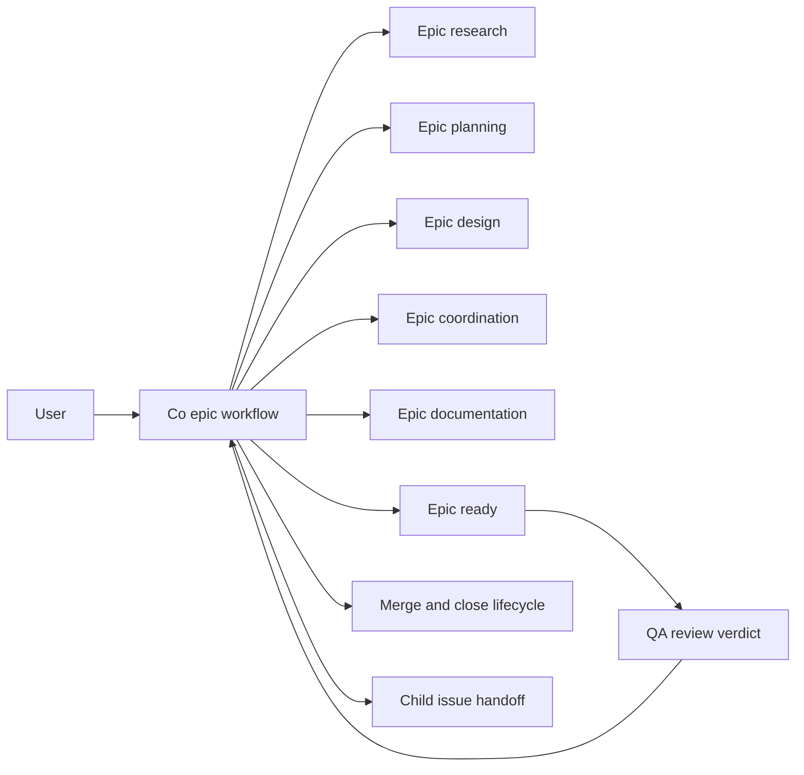

<!-- docs\development\issue341\design.md -->
<!-- template=design version=5827e841 created=2026-05-23T15:00Z updated=2026-05-24 -->
# Design: @co-owned epic workflow orchestration

**Status:** DRAFT  
**Version:** 1.1  
**Last Updated:** 2026-05-24

---

## Purpose

Define the smallest coherent design that makes `@co` the end-to-end owner of epic workflow execution while absorbing issues `#339` and `#340` inside the same branch scope.

## Scope

**In Scope:**
Epic workflow ownership, `@co` role and tool-contract changes, epic phase instruction and sub-role redesign, lifecycle prompt ownership, `implement-cycle.prompt.md` retirement, transition guidance notes, `get_work_context` invalid-state recovery behavior, and the shared tests these surfaces affect.

**Out of Scope:**
Generic runtime ownership enforcement, unrelated non-epic workflow redesign, production feature implementation outside orchestration surfaces, detailed planning slices, TDD cycles, and file-by-file implementation sequencing.

---

## 1. Context & Requirements

### 1.1. Problem Statement

The repository already models epic work as coordination-heavy governance, but the active contracts, prompts, tool rights, and workflow-phase instructions still route execution through `@imp`. This creates drift between epic semantics and runtime behavior, and leaves the transition guidance gap from issue `#339` and the invalid-workflow-phase warning gap from issue `#340` unresolved on the same orchestration surfaces.

### 1.2. Requirements

**Functional:**
- [ ] Epic workflow ownership must move to `@co` from research through ready.
- [ ] The design must define the exact `@co` tool allowlist needed for epic lifecycle execution without granting general implementation authority.
- [ ] Epic workflow phase instructions and sub-role hints must become coordination-scoped instead of `@imp`-flavored.
- [ ] Lifecycle entry and exit prompts must be aligned with `@co` ownership, including replacement or retirement of stale prompt surfaces.
- [ ] Transition success responses must nudge `get_work_context` after phase and cycle transitions as required by issue `#339`.
- [ ] `get_work_context` must render an explicit invalid workflow-phase recovery warning as required by issue `#340`.

**Non-Functional:**
- [ ] Preserve the architecture contract: no generic ownership framework, no hardcoded workflow-specific if-chain drift, and no hidden runtime policy.
- [ ] Keep the design within contract and interface boundaries; do not collapse into implementation planning.
- [ ] Prefer the smallest coherent diff across agent docs, contracts, prompts, tool output formatting, and tests.
- [ ] Preserve QA as a strictly external, write-free reviewer.
- [ ] Keep runtime changes narrow and reuse existing note rendering and config-driven workflow contracts where possible.

### 1.3. Constraints

- `@qa` remains write-free and outside the ownership chain.
- `@co` file edits stay limited to docs, prompts, contracts, and coordination surfaces.
- Force-transition semantics remain permissive; issue `#340` changes `get_work_context` feedback, not `force_phase_transition` policy.
- The standardized issue `#339` note appears only on the four transition tools in this issue scope.
- Issue `#341` remains a `feature` workflow even though it redesigns epic ownership.

---

## 2. Design Options

| Option | Summary | Advantages | Risks / Why Rejected |
|---|---|---|---|
| A. Prompt and docs realignment only | Move wording in docs and prompts toward `@co`, but leave epic workflow contracts and runtime behavior largely unchanged | Smallest apparent diff | Rejected: leaves the real ownership mismatch in `AGENTS.md`, `contracts.yaml`, tool allowlists, and transition/runtime behavior untouched |
| B. Generic runtime ownership framework | Introduce an agent-ownership abstraction or runtime gate that understands which agent owns which workflow or phase | Strongest formal enforcement | Rejected: violates the approved strategy, widens scope into a framework issue, and adds runtime policy where the repo already has narrower contract surfaces |
| C. Contract-first epic redesign plus narrow runtime follow-ups | Redesign epic ownership at the contract layer (`AGENTS.md`, agent docs, prompts, contracts), and implement only the two targeted runtime behaviors from `#339` and `#340` | Aligns semantics, ownership, and runtime behavior with the smallest coherent blast radius | Chosen direction |

### 2.1. Rejected Alternatives

**Why Option A is insufficient**

The repo already contains strong prior art that epic ownership is a lifecycle and coordination concern, not just a wording issue. Changing only prompts or prose would preserve conflicting sources of truth between `AGENTS.md`, `.github/agents/co.agent.md`, and `.phase-gate/config/contracts.yaml`.

**Why Option B is too broad**

The research already fixed the strategy boundary: this issue must not become a generic agent-ownership system. Existing repo mechanisms already provide narrower control points: agent tool allowlists, prompt ownership, workflow-phase instructions, and the note/rendering path. Introducing a runtime ownership framework would add architecture that this issue does not need.

---

## 3. Chosen Design

**Decision:** Adopt a contract-first redesign where `@co` becomes the explicit owner of epic workflow execution, epic phases get coordination-scoped sub-roles and hand-over paths, lifecycle prompts move to `@co`, `implement-cycle.prompt.md` is retired, and issues `#339` and `#340` are delivered as narrow runtime-contract improvements on the existing transition and `get_work_context` surfaces.

**Rationale:** This direction matches the repository's existing epic semantics and prior lifecycle-coordinator research, fixes the highest-friction orchestration mismatches without introducing a generic framework, and keeps the runtime blast radius limited to existing note, formatting, prompt, and contract surfaces.

### 3.1. Target Operating Model

| Concern | Owner | Allowed actions | Explicit non-goals |
|---|---|---|---|
| Epic workflow execution | `@co` | Read, document, transition phases, own lifecycle prompts, commit epic-scope docs/contracts/prompts, submit PR, merge after approval | No production-code or test implementation |
| Child technical implementation | `@imp` | Execute technical child work on child issues | No direct ownership of epic phases |
| Review and judgment | `@qa` | Review design, planning, implementation, and docs | No writes, no merges, no transitions |

The target state is that the epic branch becomes a coordination branch owned by `@co`. `@imp` remains available for child-issue technical execution, but that execution no longer defines epic-branch ownership.

The design distinguishes two operating postures:
- **Owned-branch execution:** `@co` is actively working on the epic-owned branch and may perform lifecycle mutations, phase transitions, prompt-driven entry or exit, doc/contract edits, commits, quality gates, and merge preparation.
- **Background coordination:** `@co` may also coordinate while `@imp` works on a child-issue branch or other active branch. In that posture `@co` reads status, updates issue or project coordination state, and produces directives or hand-backs, but does not silently become the owner of the active implementation branch.

Background coordination is therefore a supported operating posture, but not the normative branch-topology target that the lifecycle prompts should canonize. The prompt model should encode owned-branch lifecycle boundaries; the background posture remains a coordination mode, not a replacement for an explicit epic branch.

### 3.2. Contract Surfaces And Redesign Intent

| Surface | Current problem | Design intent | Boundary impact |
|---|---|---|---|
| `AGENTS.md` | Epic semantics point to coordination, but role table still centers execution on `@imp` and duplicates epic phase-order information outside the runtime contract | Reframe epic as `@co`-owned end-to-end workflow and stop enumerating epic phase order outside `.phase-gate/config/contracts.yaml` | Project-level ownership and SSOT boundary |
| `.github/agents/co.agent.md` | Tool allowlist and role boundary are too narrow for epic ownership | Expand `@co` to a narrow explicit epic-execution allowlist | Agent capability boundary |
| `.github/agents/imp.agent.md` | Still reads like the default executor for orchestration work | Clarify `@imp` as child-issue technical executor, not epic-phase owner | Role boundary clarification |
| `.github/agents/qa.agent.md` | Must remain outside the ownership path | Preserve read-only review posture and make epic hand-backs target `@co` | Review boundary |
| `.phase-gate/config/contracts.yaml` | Epic phases use generic or implementation-flavored sub-roles and weak coordination wording | Make epic instructions explicitly `@co`-scoped and keep epic phase sequence and instructions authoritative only here | Workflow contract SSOT |
| `.github/prompts/open-issue.prompt.md` | Owned by `@imp`, stale against current tool contract | Move to `@co`, update boot sequence, align with current orchestration rules | Lifecycle entry surface |
| new `.github/prompts/close-issue.prompt.md` | Missing entirely | Add symmetric lifecycle-exit surface for `@co` | Lifecycle exit surface |
| `.github/prompts/implement-cycle.prompt.md` | Obsolete boot and execution model | Retire as active prompt; replace only with a future child-issue prompt if actually needed | Prompt inventory cleanup |
| `mcp_server/tools/phase_tools.py` and `mcp_server/tools/cycle_tools.py` | No proactive post-transition context nudge | Append standardized `InfoNote` after success | Narrow runtime behavior |
| `mcp_server/tools/discovery_tools.py` | Invalid workflow-phase state is flattened into generic fallback | Surface explicit invalid-state recovery warning while staying non-error | Narrow runtime behavior |

### 3.3. Epic Phase Model

The repo currently disagrees on epic phase order: `AGENTS.md` advertises `research -> design -> planning`, while `.phase-gate/config/contracts.yaml` currently loads `research -> planning -> design`. Issue `#341` does not redesign epic sequencing.

To neutralize that mismatch without making a new phase-order policy decision, issue `#341` should remove epic phase-order enumeration from non-SSOT surfaces such as `AGENTS.md` and `.github/agents/co.agent.md`, and defer sequence authority to `.phase-gate/config/contracts.yaml`. That is a contract-boundary cleanup, not a sequencing redesign.

The phases below are therefore shown in the currently configured contract order from `.phase-gate/config/contracts.yaml`, but that order remains inherited runtime behavior rather than a new Approved Strategy choice made by this design.

The epic workflow contract should stop reusing generic sub-role names that are already semantically associated with `@imp` feature delivery.

| Epic phase | Target sub-role | Primary output | Primary review / hand-back |
|---|---|---|---|
| `research` | `epic-researcher` | Epic research artifact and approved strategy | User checkpoint; later planning input |
| `planning` | `epic-planner` | Child-issue decomposition and shared obligations | QA plan verification |
| `design` | `epic-designer` | Shared epic design for contracts, boundaries, and runtime surfaces | QA design review |
| `coordination` | `epic-coordinator` | Issue/status alignment and coordination notes | User or QA as applicable |
| `documentation` | `epic-documenter` | Updated epic-level docs and communication surfaces | QA doc review |
| `ready` | `epic-releaser` | Final branch packaging, PR, and merge/close preparation under the owning `@co` sub-role | Human approval, then lifecycle exit |

This keeps epic ownership explicit and prevents `@imp` vocabulary from leaking back into epic phases while neutralizing the current SSOT conflict without inventing a new sequencing policy inside design.

### 3.4. `@co` Wrapper And Allowlist Design

The design keeps `@co` narrow but sufficient. The existing repo read/search baseline remains in place, including local file reads/searches and `explore_subagent` capability where epic phase scripts depend on evidence gathering. Epic ownership adds only the extra mutation tools required to execute the documented epic phases and lifecycle boundaries.

**Add to `@co`:**
- `create_branch`
- `git_checkout`
- `initialize_project`
- `transition_phase`
- `force_phase_transition`
- `scaffold_artifact`
- `safe_edit_file`
- `git_add_or_commit`
- `git_push`
- `run_quality_gates`
- `submit_pr`
- `merge_pr`

The existing issue-admin baseline already includes `close_issue`, but the lifecycle-exit redesign does not use it as the normative epic-owned merged-path step. No additional `@co` tools are silently approved here beyond the research-boundary allowlist.

**Do not add to `@co`:**
- `transition_cycle`
- `force_cycle_transition`
- `run_tests`
- DTO/template validators
- general production-code implementation tools beyond docs/contracts/prompt editing
- `run_tests`
- DTO/template validators
- general production-code implementation tools beyond docs/contracts/prompt editing
The wrapper itself must expose two sub-role families in both `AGENTS.md` and `.github/agents/co.agent.md` rather than leaving epic vocabulary only inside `contracts.yaml`:
- coordination sub-roles preserved for non-lifecycle coordination: `triager`, `backlog-reviewer`, `tracker`, `issue-author`
- epic lifecycle sub-roles added for branch-owned epic execution: `epic-researcher`, `epic-planner`, `epic-designer`, `epic-coordinator`, `epic-documenter`, `epic-releaser`

The project-level and agent-level authorities must both change in five explicit ways:
- `AGENTS.md` and `.github/agents/co.agent.md` must advertise the same two-family `@co` vocabulary so the project-wide authority and the agent wrapper cannot drift apart
- both surfaces must describe the same two operating modes: owned-branch epic execution and background coordination around child work
- mission text must explicitly say that `@co` may execute epic-owned branch work end-to-end, while generic backlog and issue-authoring coordination remain available as the lighter mode
- startup protocol must stay aligned with the project-wide `get_work_context`-first rule for ordinary chat sessions in every mode; `open-issue` and `close-issue` are explicit lifecycle-boundary exceptions that follow their own scripted entry/exit sequences before control returns to a normal session
- frontmatter handoffs and boundary text must align on the same rule set: epic review and lifecycle return paths hand back to `@co`, child-work implementation directives still hand off to `@imp`, and `@co` may edit epic docs/contracts/prompts and perform lifecycle mutations on epic-owned branches but still may not edit production code or tests

Issue `#341` is an epic-specific extension of the lifecycle-coordinator prior art from issue `#268`, not a repo-wide replacement of it. Issue `#268` remains the baseline model for general issue entry or exit and for non-epic implementation branches. On epic-owned branches only, the broader `@co` allowlist is the approved override: because the branch itself is coordination work, `@co` may perform the branch-local commits, prompt-surface edits, phase transitions, PR submission, and merge or close actions required to execute the epic lifecycle end-to-end. For non-epic branches, the issue-268 baseline still applies and `@co` does not own the first implementation commit or push.
### 3.5. Lifecycle Prompt Design

**`open-issue.prompt.md`**
- ownership moves from `agent: imp` to `agent: co`
- this prompt models explicit lifecycle entry, not background coordination
- behavior is workflow-split:
  - for `epic`, the exact owned-branch bootstrap sequence is `get_issue -> create_branch -> git_checkout -> initialize_project(issue_number, issue_title, workflow_name) -> get_work_context -> get_project_plan -> first commit with the current workflow-aware commit contract -> git_push`
  - on that epic-owned path, `get_work_context` and `get_project_plan` are both explicit bootstrap verification steps; if `get_work_context` cannot load the startup phase context cleanly, or if `get_project_plan` returns a missing or inconsistent workflow or phase contract, `@co` must stop before the first commit or push
  - for non-epic workflows, preserve the issue-268 lifecycle-entry baseline rather than redefining it here: `@co` owns branch entry through `get_issue`, `create_branch`, `git_checkout`, `initialize_project(issue_number, issue_title, workflow_name)`, and `get_project_plan`, then hands off to `@imp`; in that inherited path, `get_project_plan` remains a hand-off verification step and must stop the flow if the initialized plan is missing or inconsistent, while `@imp` becomes the first agent to call `get_work_context` before the first commit or any further write action on that branch
- if `@co` is merely coordinating around ongoing `@imp` work, use a normal `@co` session rather than this prompt
- output contract should report branch, workflow, first phase, whether the flow stopped at `@co` hand-off or completed full owned-branch bootstrap, push result when applicable, and blockers

**`close-issue.prompt.md`**
- new `@co`-owned lifecycle-exit prompt
- this prompt models owned-branch lifecycle exit only, not general background coordination
- for ordinary non-epic lifecycle exit, preserve the issue-268 baseline rather than redefining it inside issue `#341`
- on epic-owned branches, the close-issue design adds post-merge coordination duties: after human approval and satisfied QA or handover conditions, merge the PR, return to the parent branch, verify that the merged work has landed there, confirm branch cleanup including remote-branch absence, then update the epic issue body when relevant and present the next planned or logically following issue
- `close_issue` is not the normative next action on that epic-owned path; repo-local evidence shows `merge_pr` itself only merges, while issue-closure intent currently lives in PR-body references such as `Closes #123`
- because the exact `@co` allowlist is frozen by the Approved Strategy, the design defines these as required epic-owned exit outcomes rather than silently approving additional `@co` tools here; planning must either realize them within the approved boundary or escalate an explicit allowlist amendment
- `close_issue` remains an explicit recovery action if post-merge verification shows the linked issue is still open and a human wants to close it deliberately
- the prompt must stay symmetric with issue `#268` at the lifecycle-boundary ownership level while keeping the richer merge-verify-cleanup model scoped to epic-owned exit rather than the general non-epic baseline

**`implement-cycle.prompt.md`**
- retired by removing it from the live prompt inventory and moving it into `.github/prompts/archive/`
- not repurposed for epic execution
- not reused to represent `@co` background coordination
- leaving a frontmatter-bearing live prompt file at `.github/prompts/implement-cycle.prompt.md` is not an allowed end state for issue `#341`
- if later needed for child issues, replace with a fresh `@imp` prompt that is explicitly child-branch-local and based on current workflow instructions rather than mutate the stale document in place

### 3.6. Runtime Contract For Issue `#339`

The existing note bus and server response assembly already support the desired user-visible behavior:
- transition tools can produce notes through `NoteContext`
- `mcp_server/server.py` renders notes after the primary result via `render_to_response(...)`
- `InfoNote` remains the better fit here because issue `#339` needs a post-success orchestration nudge; current repo usage of `SuggestionNote` is tied to advisory or error-preflight paths rather than success-path follow-up

**Chosen contract:**
- `transition_phase`, `force_phase_transition`, `transition_cycle`, and `force_cycle_transition` append the same `InfoNote`
- exact note text: `Call get_work_context to load the current phase context for this branch before proceeding.`
- note is appended after the primary success message
- note is emitted regardless of whether `context_loaded` enforcement is enabled
- note scope does not widen to `git_checkout` or `git_pull` in this issue

This design preserves current success formatting while adding the missing orchestration nudge as a secondary, rendered note.

### 3.7. Runtime Contract For Issue `#340`

The current `GetWorkContextTool` has three semantically different situations but only exposes two visible outcomes: normal instructions or generic unknown fallback.

The design separates them explicitly:

| Case | Current behavior | Target behavior |
|---|---|---|
| Missing or unreadable state | Graceful degradation | Preserve graceful unknown-context behavior |
| Known workflow + invalid phase in state | Generic `No instructions defined` fallback | Render explicit invalid-state warning with valid phases and recovery action |
| Unknown workflow-phase contract without proven invalid state | Generic fallback | Preserve generic unknown-contract fallback |

**Chosen invalid-state warning content:**
- active workflow name
- invalid phase from branch state
- valid ordered phases for that workflow
- recovery action: use `force_phase_transition` to a valid phase, then call `get_work_context` again
- warning placement: render as non-H3 header/context text before the phase-instructions block, preserve `### 🎯 Phase Instructions` as the first H3 block, and do not nest the warning inside the instructions body
**Important non-goal:**
- do not convert this case into a hard error result
- do not change `force_phase_transition` permissiveness
- do not add a new generic invalid-state enforcement layer in this issue

### 3.8. Affected Tests And Validation Strategy

The design implies four test clusters:

| Test cluster | Design obligation |
|---|---|
| `tests/mcp_server/unit/tools/test_transition_phase_tool.py`, `test_force_phase_transition_tool.py`, `test_cycle_tools.py` | Verify successful transition paths still emit the `#339` advisory note signal without mutating the primary success text at the raw tool boundary |
| `tests/mcp_server/unit/tools/test_discovery_tools.py` | Distinguish invalid workflow-phase warning from generic unknown fallback |
| `tests/mcp_server/unit/config/test_contracts_loader.py`, agent/prompt contract tests if present | Verify epic phase entries, coordination-scoped sub-role names, and contract schema changes remain loadable |
| `tests/mcp_server/unit/test_server.py`, integration note/enforcement tests | Prove user-visible appended `InfoNote` ordering for `#339` at the server/dispatch boundary and avoid regression in response composition |

Affected test-support surfaces must still be visible to planning and implementation even though the exact helper updates are not a design deliverable. The relevant support surfaces already visible in the repo are:
- `tests.mcp_server.test_support` builders used by transition and cycle tool tests
- the mock-based `GetWorkContextTool` setup in discovery tests
- contract-loader roundtrip helpers in `tests/mcp_server/unit/config/test_contracts_loader.py`
- server dispatch and note-rendering checks in `tests/mcp_server/unit/test_server.py`
- manual validation for prompt and agent surfaces, because no dedicated automated prompt-validation suite was confirmed during design

Design-level validation expectation for implementation and planning:
- contract surfaces must stay config-driven and avoid phase-name if-chains
- role allowlists, wrapper sub-roles, and prompt ownership must align with the Approved Strategy
- runtime changes for `#339` and `#340` must remain narrow and observable via existing note/rendering and discovery tests
- planning and implementation must account for the affected support surfaces above without turning the design artifact into a harness-level patch plan
### 3.9. Risks And Failure Modes

| Risk | Why it matters | Design response |
|---|---|---|
| `@co` allowlist grows too broad | Could silently turn `@co` into a second implementation agent | Keep the allowlist explicit and exclude cycle/test implementation tools |
| Epic sub-roles stay generic | Ownership ambiguity will survive under new wording | Rename epic sub-roles to coordination-scoped names |
| Prompt cleanup remains half-complete | Lifecycle ownership stays inconsistent at entry/exit | Treat `open-issue`, `close-issue`, and `implement-cycle` as one design set |
| Background coordination gets encoded as the default branch model | The current mixed topology would harden into policy instead of staying temporary debt | Keep lifecycle prompts branch-boundary only and treat background coordination as a supported but non-normative posture |
| `#339` implemented as inline success text mutation | Harder to preserve primary result contract and ordering | Reuse appended note rendering instead |
| `#340` implemented as hard failure | Changes current graceful operator flow and widens scope | Preserve non-error response, add explicit recovery warning |

### 3.10. Planning Consequences And Non-Blocking Questions

Planning should preserve four design consequences rather than collapse the work into one generic runtime change:
- agent and project contract surfaces
- lifecycle prompt surfaces
- epic workflow contract surfaces
- targeted runtime guidance surfaces for `#339` and `#340`

Within that runtime surface, planning must keep issues `#339` and `#340` as separate in-branch problem slices of issue `#341`:
- `#339 transition advisory`: the exact standardized post-transition note text defined in section 3.6 on the four transition tools
- `#340 invalid-state recovery`: the explicit `get_work_context` warning defined in section 3.7, including valid phases, recovery action, and header-layer placement before the phase-instructions block

Planning must also account for the lifecycle-exit cleanup asymmetry surfaced during design: local branch cleanup is tool-supported in the repository, while remote branch absence is only a required outcome. Implementation must therefore either rely on host-side auto-delete plus verification or surface explicit follow-up when the remote branch remains.

The current mixed branch topology remains relevant context, but exact debt-retirement sequencing belongs to planning and coordination rather than to this design artifact.
No design-blocking questions remain. The `#339` and `#340` wording and placement contracts are fixed by sections 3.6 and 3.7. Planning and implementation may still choose:
- the safest rollout order across docs, prompts, contracts, runtime code, and tests

### 3.11. Key Design Decisions

| Decision | Rationale |
|----------|-----------|
| Use a contract-first redesign instead of a generic runtime framework | Matches approved strategy and keeps the blast radius narrow |
| Keep epic phase sequencing out of scope for issue `#341` and preserve the active runtime contract rather than making a new policy decision in design | Avoids strategy drift while still letting the ownership redesign target the existing contract surfaces |
| Make epic phases explicitly `@co`-scoped via dedicated sub-role names | Removes lingering semantic overlap with `@imp` |
| Expand `@co` only within the research-approved narrow allowlist plus explicit wrapper sub-role redesign instead of broad implementation rights | Gives `@co` enough authority to own epic branches without silently broadening role boundaries |
| Keep `get_project_plan` as an explicit stop-go verification step wherever lifecycle entry retains it | Prevents a read-only routine call from surviving in the prompt flow without a decision attached |
| Move lifecycle prompts to `@co`, archive the stale cycle prompt, and scope merge-verify-cleanup to epic-owned exit without rewriting the inherited non-epic baseline from issue `#268` | Aligns lifecycle ownership while keeping issue `#341` inside its approved scope boundary |
| Keep `close_issue` available only as explicit post-merge recovery on the epic-owned override, not as the default next step after `merge_pr` there | Repo-local evidence shows merge and explicit issue closure are distinct actions, so the richer epic-owned exit flow must verify landed work and cleanup first |
| Deliver `#339` via appended `InfoNote` on successful transitions | Reuses existing note and rendering infrastructure with minimal runtime change |
| Deliver `#340` via explicit recovery warning inside `get_work_context` while keeping a non-error result | Improves operator guidance without widening into enforcement redesign |
## Related Documentation
- **[docs/development/issue341/research.md][related-1]**
- **[docs/development/issue268/research.md][related-2]**
- **[AGENTS.md][related-3]**
- **[.github/agents/co.agent.md][related-4]**
- **[.github/prompts/open-issue.prompt.md][related-5]**
- **[.github/prompts/implement-cycle.prompt.md][related-6]**
- **[.phase-gate/config/contracts.yaml][related-7]**
- **[mcp_server/tools/discovery_tools.py][related-8]**
- **[mcp_server/tools/phase_tools.py][related-9]**
- **[mcp_server/tools/cycle_tools.py][related-10]**
- **[mcp_server/server.py][related-11]**

<!-- Link definitions -->

[related-1]: docs/development/issue341/research.md
[related-2]: docs/development/issue268/research.md
[related-3]: AGENTS.md
[related-4]: .github/agents/co.agent.md
[related-5]: .github/prompts/open-issue.prompt.md
[related-6]: .github/prompts/implement-cycle.prompt.md
[related-7]: .phase-gate/config/contracts.yaml
[related-8]: mcp_server/tools/discovery_tools.py
[related-9]: mcp_server/tools/phase_tools.py
[related-10]: mcp_server/tools/cycle_tools.py
[related-11]: mcp_server/server.py

---

## Version History

| Version | Date | Author | Changes |
|---------|------|--------|---------|
| 1.1 | 2026-05-24 | Agent | Refined lifecycle prompt design after user review: added explicit rationale and stop-go consequences for retained `get_project_plan` calls, scoped merge-verify-cleanup to epic-owned exit without silently broadening the `@co` allowlist, kept the archive direction for `implement-cycle`, and clarified why `#339` keeps `InfoNote` |
| 1.0 | 2026-05-23 | Agent | Initial issue341 design draft covering epic ownership, prompt lifecycle, and runtime contracts for issues #339 and #340 |
