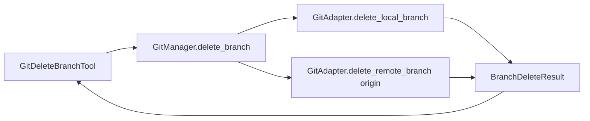

<!-- docs\development\issue345\design.md -->
<!-- template=design version=5827e841 created=2026-05-24T17:05Z updated=2026-05-24 -->
# Design: git_delete_branch remote deletion and lifecycle closeout alignment

**Status:** DRAFT  
**Version:** 1.3  
**Last Updated:** 2026-05-24

---

## Purpose

Define the smallest coherent design for issue #345 across the git delete capability, lifecycle closeout prompt, ready-phase closure contract, and branch-local state and first-push discipline.

## Scope

**In Scope:**
`git_delete_branch` contract and layering, lifecycle exit prompt replacement, ready-phase PR closeout requirements, branch-local state artifact wording, and first child-workflow push responsibility.

**Out of Scope:**
Implementation sequencing, generic workflow redesign, multi-remote support, host-provider policy changes, the `SubmitPRInput` tool schema, and unrelated git or GitHub tool behavior.

## Prerequisites

Read these first:
1. Issue #345
2. [docs/development/issue345/research.md][related-1]
3. [docs/coding_standards/ARCHITECTURE_PRINCIPLES.md][related-2]
4. [docs/coding_standards/DOCUMENTATION_STANDARD.md][related-3]

---

## 1. Context & Requirements

### 1.1. Problem Statement

The repository currently deletes branches locally only, while the approved closeout model for this branch also requires coordinated remote cleanup, ready-phase PR-closure decisions, and consistent branch-local state and push discipline across workflow and prompt surfaces.

Research established the smallest coherent blast radius, but the final design input changed one important contract decision: branch deletion should move to an explicit enum-based mode with `both` as the default because the normal phase-gate-mcp operating path expects both a local work branch and a remote branch for PR-driven completion. This design records that human-approved override explicitly so the contract break is treated as an intentional supersession of the earlier local-only-default direction, not as silent drift.

### 1.2. Requirements

**Functional:**
- [ ] Extend `git_delete_branch` with an explicit enum-based mode covering local-only, remote-only, and combined cleanup.
- [ ] Make `both` the default delete mode because the repository's normal branch lifecycle expects both local and remote branch cleanup.
- [ ] Define idempotent behavior for missing sides during cleanup, especially when the remote branch is already absent.
- [ ] Replace the stale lifecycle-exit prompt contract with a new `end-issue` flow aligned to the approved ownership model.
- [ ] Treat the PR body as the persistent `@imp` -> `@co` transfer artifact that survives machine and session boundaries.
- [ ] Use the ready-phase handover template as a completeness check for durable closeout facts, not as a 1:1 schema for the PR body.
- [ ] Ensure the PR body carries durable closeout facts needed by `@co`, including at minimum closure claims, deferred items/work, and tracking state.
- [ ] Align active documentation and role instructions so branch-local state artifacts travel with branch commits until `submit_pr` neutralizes them.
- [ ] Bind the first child-workflow upstream push responsibility to the first existing workphase completion checkpoint, with `git_push(set_upstream=true)` on the same todo line as the commit instruction.
- [ ] Allow `@co` to recommend the next logically following issue during lifecycle exit as an advisory judgment, not as an automatic reprioritization rule.

**Non-Functional:**
- [ ] Keep the existing tool -> manager -> adapter layering and preserve the protected-branch guard as the single policy enforcement point.
- [ ] Do not widen the remote contract into multi-remote support or a generic branch-cleanup framework.
- [ ] Preserve the `@co` versus `@imp` ownership split and keep `@qa` outside branch bootstrap and cleanup responsibilities.
- [ ] Keep the design bounded to interfaces, contracts, and responsibilities rather than implementation sequencing.
- [ ] Make the delete-mode contract explicit enough that prompts, docs, and tests can reason about partial cleanup and idempotent outcomes without hidden behavior.

### 1.3. Constraints

- `origin` remains the supported remote boundary for this issue.
- Remote branch existence is required only for the GitHub PR -> merge tool path, not for all local git work.
- Branch-local state artifacts must travel with branch history but must not reach `main`.
- The `end-issue` prompt may recommend a logically next issue, but that recommendation remains advisory rather than an automatic priority mutation.
- The delete-tool redesign may break callers that implicitly relied on the old local-only default, so migration must be explicit in docs, examples, and tests.

---

## 2. Design Options

### 2.1. Option A: Bool Remote Flag With Local Default

Keep the current local-only contract shape and add a `remote: bool = False` toggle.

**Pros:**
- Minimal code and documentation delta.
- Lowest short-term compatibility risk for existing callers.
- Closest to the current tool and test shape.

**Cons:**
- Conflicts with the approved product direction that the normal cleanup mode should assume both local and remote branches.
- Leaves remote-only cleanup awkward or under-specified.
- Keeps the public contract biased toward the old local-only worldview even though the normal PR path depends on remote branches.

### 2.2. Option B: Enum Delete Mode With `both` Default

Introduce an explicit delete mode enum with `local`, `remote`, and `both`, and make `both` the default.

**Pros:**
- Matches the repository's normal branch lifecycle more directly than a bool flag.
- Makes local-only and remote-only cleanup explicit instead of encoding policy in an omitted parameter.
- Gives prompt, documentation, and QA surfaces a clearer contract for reasoning about combined cleanup and idempotent no-op outcomes.
- Supports the approved `end-issue` flow without needing special-case wording around default behavior.

**Cons:**
- Deliberately breaks the current local-only default for callers that omit the new field.
- Requires documentation, examples, and tests to be updated together.
- Needs a clear migration note so local-only cleanup remains available as an explicit choice rather than an accidental regression.

### 2.3. Option C: Generic Cleanup Framework

Generalize branch deletion, issue closing, and post-merge cleanup into a broader workflow-closeout framework.

**Pros:**
- Could centralize future lifecycle policy decisions.
- Might reduce repeated prompt or contract wording later.

**Cons:**
- Widens scope well beyond the approved strategy.
- Blurs tool behavior, prompt behavior, and workflow policy into one larger abstraction.
- Adds architecture that this issue does not need.

---

## 3. Chosen Design

**Decision:** Adopt Option B. `git_delete_branch` becomes an enum-based cleanup tool with `mode in {local, remote, both}` and `both` as the default, and the same branch then carries the bounded prompt, ready-phase, and documentation changes needed to make that contract usable across the full lifecycle.

**Rationale:** The user's final design choices prioritize explicit lifecycle semantics over preserving the old local-only default. An enum-based contract is the clearest way to reflect the repo's normal branch mode, and it gives the surrounding prompt and ready-phase surfaces a stable vocabulary for combined cleanup, explicit PR closure intent, and advisory next-issue guidance. The blast radius remains bounded because repo search found no internal production call path using `git_delete_branch` beyond documentation examples and direct tool tests.

### 3.1. Public Delete Contract And Migration Boundary

The delete-tool input contract changes from a local-only shape to an explicit mode-based shape.

```python
class GitDeleteBranchInput(BaseModel):
    branch: str
    force: bool = False
    mode: Literal["local", "remote", "both"] = "both"
```

`mode="local"` preserves the old local-only behavior as an explicit choice. `mode="remote"` enables explicit remote-only cleanup on `origin`. `mode="both"` becomes the default and represents the normal work-branch cleanup path.

This is a deliberate contract revision. Existing callers that relied on omitted local-only behavior must now pass `mode="local"` when they intend to preserve the remote branch. Repo evidence suggests that the migration surface is currently narrow: documentation examples in [docs/reference/mcp/tools/git.md][related-4] and [docs/reference/mcp/MCP_TOOLS.md][related-5], plus direct tool tests in `tests/mcp_server/unit/tools/test_git_tools.py` and `tests/mcp_server/unit/integration/test_all_tools.py`. No additional production orchestration call path was found during design exploration.

### 3.2. Tool, Manager, And Adapter Responsibilities

The layering stays unchanged, but the responsibilities become more explicit.



- `GitDeleteBranchTool` owns input validation and user-facing result rendering.
- `GitManager.delete_branch(...)` remains the orchestration boundary and the single policy-enforcement point for protected branches and local-delete preconditions.
- `GitAdapter` gains a dedicated remote-delete operation rather than learning workflow policy.
- A small immutable result object, `BranchDeleteResult`, carries normalized side-specific outcomes back to the tool.

The result object should distinguish three side states for both the local and remote branch surfaces:
- `deleted`
- `absent`
- `skipped`

That keeps the tool message explicit without leaking GitPython details into prompt or documentation layers.

### 3.3. Delete-Mode Semantics

| Mode | Local side | Remote side | Missing-side behavior | Guard behavior |
|---|---|---|---|---|
| `local` | Requested | Skipped | Missing local branch remains an error | Protected-branch and current-branch checks apply |
| `remote` | Skipped | Requested on `origin` | Missing remote branch is a success no-op | Protected-branch check applies; current-branch check does not |
| `both` | Requested | Requested on `origin` | Missing local and/or remote side is reported as `absent`, not as a fatal cleanup error | Protected-branch check applies; current-branch check applies because local deletion is requested |

Additional semantics:
- `force` applies only to the local side.
- `both` mode performs local deletion first, then remote deletion. This preserves the current local-delete safety posture and keeps reruns straightforward when remote cleanup fails after local cleanup succeeds.
- If a policy guard fails before mutation, the whole operation fails before any deletion occurs.
- If remote deletion fails after a successful local deletion, the returned failure must describe the partial cleanup explicitly so rerunning with `mode="remote"` or `mode="both"` is safe and obvious.

The deliberate asymmetry is intentional: `both` is a cleanup mode and therefore idempotent on branch absence, while `local` remains an explicit request for a local branch that must exist.

### 3.4. Lifecycle Exit Prompt Design

The current [.github/prompts/close-issue.prompt.md][related-6] contract is replaced by a new `end-issue.prompt.md` surface. The old file should be removed, not archived, because the new prompt is not a minor wording edit; it is a clean replacement for the live lifecycle-exit contract.

`end-issue` is an `@co`-owned lifecycle-boundary action. Human invocation of the prompt is the required merge-approval signal for this flow. The prompt must not be interpreted as an automatic merge path for `@imp`, and `@qa` remains read-only and outside merge or cleanup execution.

The approved end-issue contract remains the normative F5 direction from research: one linear flow, one conditional epic-parent step, issue closure through PR-body `Closes #N`, and no normative `close_issue(...)` step.

Within that flow, the PR body becomes the persistent `@imp` -> `@co` transfer artifact. It replaces any need for a separate durable closeout report and survives different sessions, machines, and timing boundaries between ready and lifecycle exit.

The ready-phase handover template is a useful completeness check for that durable transfer, but it is not the normative schema for the PR body. The PR body and the final ready hand-over may overlap on durable facts, yet they serve different consumers and can differ in structure and level of detail.

The contract-level flow is therefore:
- `get_work_context()` identifies the closing branch, workflow, issue number, and parent branch.
- `merge_pr(pr_number=PR_NUMBER)` is the authoritative proof that the host-side merge was accepted.
- `git_checkout(branch=<parent_branch>)` exists to make local branch cleanup legal; it is not itself proof that the merge landed.
- `git_delete_branch(branch=<closing_branch>, mode="both")` performs the cleanup.
- `@co` reads the PR body as the persistent transfer surface for durable closeout facts prepared during ready.
- that PR body must carry the durable closeout facts `@co` needs later, including what was delivered, which issues were intended to close on merge, deferred items/work, and tracking state for those deferred items.
- a single conditional step updates epic-parent coordination state when relevant.
- `@co` may use the merged PR body plus live issue state to recommend the next logically following issue.

The design explicitly rejects stale local `git_diff_stat(...)` as the default merge-proof mechanism after `merge_pr(...)`. If planning keeps a landed-work consistency check, it must rely on an authoritative host-side merge result or on explicitly refreshed local refs, not on stale local branch state.

`close_issue(...)` is not part of the normative path. It remains recovery-only when the merged PR body claimed closure for a specific issue, the merge is complete, and that issue is still open unexpectedly.

### 3.5. Ready-Phase PR Body, Handover Basis, And Issue-Body Responsibilities
1. Verify whether the original issue body is still honest about the branch intent and in-scope breadth established during research.
2. If research broadened scope and the original issue body no longer reflects that intent honestly, update the original issue body before PR creation.
3. Review all issues explicitly claimed as in scope in `research.md` and decide which of them are actually closure-ready on this branch.
4. Build the definitive deferred-work transfer from authoritative issue artifacts only.
5. Check that every durable closeout fact `@co` may need after merge is present in the PR body, even when the ready hand-over also mentions it.
6. Use the ready-phase handover template as a completeness check for those durable facts, not as a 1:1 PR-body schema.
7. Encode the resulting closure-ready issues in the PR body via explicit `Closes #N` entries, and carry deferred items/work plus tracking state into the PR body as durable transfer content.
The original issue body, the PR body, and the ready hand-over serve different purposes and must not be collapsed:

| Artifact | Purpose | Update rule | Consumer |
|---|---|---|---|
| Original issue body | Honest statement of intent and approved scope | Update only when research widened or changed the intended scope enough that the body is no longer truthful | Humans, ready-phase verification |
| PR body | Delivered-work summary plus persistent `@imp` -> `@co` transfer, including explicit `Closes #N`, deferred items/work, and tracking state | Always scaffold and finalize during ready so durable closeout facts survive beyond the ready session | Reviewers, GitHub merge automation, `end-issue` |
| Ready-phase hand-over | Temporary human-loop rendering of overlapping ready facts | Produced at ready end for the human, but it does not define the PR-body schema and must not become the only durable closeout source | Human operator |

This keeps closure intent where GitHub actually acts on it: the PR body. It also ensures that the durable closeout content `@co` may need later on another machine or at another time is not trapped only in the transient ready hand-over.

The current ready contract and current PR template still expose a design gap: ready instructions in [.phase-gate/config/contracts.yaml][related-7] currently separate the PR narrative from the deferred-work transfer, and the current PR template does not yet provide an explicit deferred-work section. Planning and implementation must close that gap so the runtime contract matches this design.

The exact markdown shape for multi-issue closure claims and deferred-work sections belongs in planning and documentation. The design decision is that closure readiness is evaluated in ready against all explicitly in-scope issues, that the resulting durable transfer lives in the PR body, and that the handover template acts only as a completeness check for durable facts.


### 3.6. Branch-Local State And First-Push Discipline

The design keeps the existing branch-local artifact policy but makes it consistent across docs and role surfaces.

Required wording alignment:
- [docs/reference/mcp/tools/project.md][related-8] must stop describing `.phase-gate/state.json` as runtime-only or uncommitted.
- `.phase-gate/config/contracts.yaml` remains the authoritative source for the branch-local merge policy.
- `.github/agents/imp.agent.md` and `.github/agents/co.agent.md` must say explicitly that branch-local state artifacts travel with normal branch commits until `submit_pr` neutralizes them.

The design-level push rule is also explicit: for non-epic child workflows, upstream creation belongs to the first existing workflow-completion checkpoint after the `@co` hand-off, not to a standalone push todo and not back to `@co` or `@qa`.

That rule later maps to the existing first completion checkpoint already present in each workflow family, such as research completion for `feature`/`bug`/`refactor`, planning completion for `docs`, and the first completed implementation checkpoint for `hotfix`. In those workflow instructions, `git_push(set_upstream=true)` must appear on the same todo line as the corresponding commit instruction rather than as a separate todo item. Epic startup is unchanged because [.github/prompts/start-issue.prompt.md][related-9] already makes `@co` own the first commit and `git_push(set_upstream=true)` on epic branches.

### 3.7. Key Design Decisions

| Decision | Rationale |
|----------|-----------|
| Use an explicit `mode` enum instead of a bool flag | The user chose an explicit contract that models `local`, `remote`, and `both` directly, and `both` fits the repo's default branch lifecycle better than an omitted flag |
| Make `both` the default mode | The normal phase-gate-mcp path expects both a local work branch and a remote branch for PR-driven completion |
| Keep `origin` as the only supported remote | Research found current remote behavior is already `origin`-centric and there is no approved scope for multi-remote support |
| Keep policy enforcement in `GitManager` | Protected-branch safety and local-delete guardrails already have a single enforcement boundary there |
| Make `end-issue` an explicit `@co` lifecycle-boundary contract | Merge and post-merge cleanup remain human-approved coordination actions, not `@imp` work or `@qa` actions |
| Make the PR body the durable `@imp` -> `@co` transfer surface | It persists across machines and time, and GitHub already acts on its closure claims during merge |
| Use the ready handover template as a completeness check, not a schema | This keeps durable closeout facts aligned without forcing a 1:1 copy of the human hand-over into the PR body |
| Keep the original issue body limited to honest intent and scope | It should be corrected when research widens intent, but it must not become the delivered-work or closure-claim transport |
| Reject stale local diff as default merge proof | `merge_pr(...)` proves host-side merge acceptance; local consistency checks need refreshed refs if they are retained at all |
| Bind first upstream push to the same todo line as the first qualifying commit | This preserves the approved `@co` versus `@imp` ownership split while preventing a loose extra push checklist item |

---

## 4. Open Questions

No open design questions remain.

The user resolved the design checkpoint decisions on 2026-05-24:
- use an enum-based delete contract with `both` as the default
- apply explicit ready-phase issue-body and `Closes #N` checks to all PR-ending workflows
- allow `end-issue` to recommend the next logically following issue as an advisory judgment

## Related Documentation

- **[docs/development/issue345/research.md][related-1]**
- **[docs/coding_standards/ARCHITECTURE_PRINCIPLES.md][related-2]**
- **[docs/coding_standards/DOCUMENTATION_STANDARD.md][related-3]**
- **[docs/reference/mcp/tools/git.md][related-4]**
- **[docs/reference/mcp/MCP_TOOLS.md][related-5]**
- **[.github/prompts/close-issue.prompt.md][related-6]**
- **[.phase-gate/config/contracts.yaml][related-7]**
- **[docs/reference/mcp/tools/project.md][related-8]**
- **[.github/prompts/start-issue.prompt.md][related-9]**

<!-- Link definitions -->

[related-1]: docs/development/issue345/research.md
[related-2]: docs/coding_standards/ARCHITECTURE_PRINCIPLES.md
[related-3]: docs/coding_standards/DOCUMENTATION_STANDARD.md
[related-4]: docs/reference/mcp/tools/git.md
[related-5]: docs/reference/mcp/MCP_TOOLS.md
[related-6]: .github/prompts/close-issue.prompt.md
[related-7]: .phase-gate/config/contracts.yaml
[related-8]: docs/reference/mcp/tools/project.md
[related-9]: .github/prompts/start-issue.prompt.md

---

## Version History

| Version | Date | Author | Changes |
|---------|------|--------|---------|
| 1.3 | 2026-05-24 | Agent | Made the PR body the durable `@imp` -> `@co` closeout transfer, restored PR-body-owned closure claims, limited the original issue body to honest intent/scope correction, and required first-push coupling on the same todo line as the commit |
| 1.2 | 2026-05-24 | Agent | Repaired QA findings by making `@co` lifecycle authority explicit, defining issue-body closeout intent as the SSOT, rejecting stale local diff as merge proof, and reducing planning-like sequencing |
| 1.1 | 2026-05-24 | Agent | Locked the user-approved design choices for enum default behavior, all-workflow ready-phase closeout checks, and advisory next-issue recommendation |
| 1.0 | 2026-05-24 | Agent | Initial scaffolded design draft |
