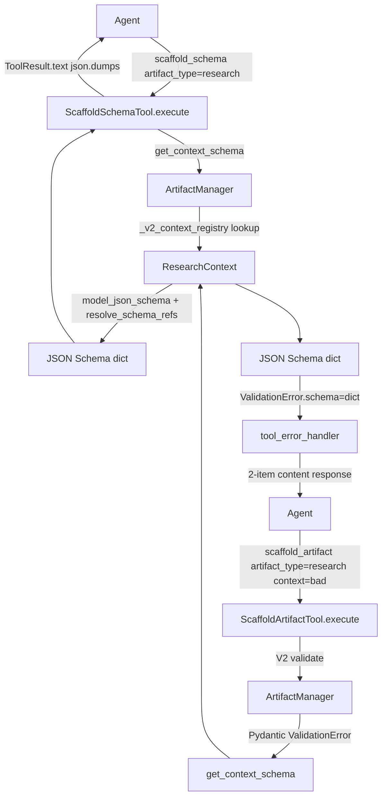

<!-- docs\development\issue350\design.md -->
<!-- template=design version=5827e841 created=2026-06-01T06:10Z updated= -->
# scaffold_artifact: proactive schema exposure and v1 doc-type coverage

**Status:** DRAFT
**Version:** 1.0
**Last Updated:** 2026-06-01

---

## 1. Context & Requirements

### 1.1. Problem Statement

`scaffold_artifact` has three gaps that force agents into multi-round-trip failure loops:

- **Gap A** — `context` is opaque at tool-discovery time (no per-type schema in MCP manifest)
- **Gap B** — validation error schema lists field names only; type mismatches cause identical retries
- **Gap C** — no proactive schema-discovery path: schema only reachable reactively after a failed call

### 1.2. Requirements

**Functional:**
- `ArtifactManager.get_context_schema(artifact_type)` returns a JSON Schema dict for any V2-registered artifact type; raises `ConfigError` for V1-only types
- `ScaffoldSchemaTool` exposes `get_context_schema` as a proactive MCP tool call
- The `ValidationError` error path returns the same JSON Schema format as `ScaffoldSchemaTool`
- `TemplateSchema` dataclass is removed entirely — no deprecation shim
- `start-issue.prompt.md` step 2 derives `base_branch` from the parent issue instead of hardcoding `"main"`

**Non-Functional:**
- Output format of `get_context_schema()` is identical to `BaseTool.input_schema` (JSON Schema Draft 7 via `model_json_schema()` + `resolve_schema_refs()`)
- `ScaffoldSchemaTool` is read-only: inherits `BaseTool`, not `BranchMutatingTool`
- No duplication: error path and `ScaffoldSchemaTool` call the same extraction method

### 1.3. Constraints

- A4 (ARCHITECTURE_PRINCIPLES): `input_schema` override on tool class only; `ScaffoldSchemaInput` Pydantic model stays pure
- A3 (ARCHITECTURE_PRINCIPLES): no config loading inside Pydantic context models
- SRP: `ScaffoldSchemaTool.execute()` must not contain extraction logic — delegates entirely to `ArtifactManager.get_context_schema()`
- `generic_doc` has no V2 Context class (deferred to #286) — `get_context_schema()` must handle this gracefully

---

## 2. Design Options

### Option 1 — Dual-mode scaffold_artifact (Approach A)

Extend `ScaffoldArtifactInput` with an optional `introspect: bool` flag. When `introspect=True`, `ScaffoldArtifactTool.execute()` returns the context schema instead of scaffolding.

| Aspect | Assessment |
|--------|------------|
| SRP | Violated — one tool does two things |
| Discovery UX | Awkward: agent must call `scaffold_artifact(artifact_type="research", introspect=True)` |
| A4 compliance | Borderline — logic belongs in execute(), not in schema |
| Rejected because | Dual-mode tools obscure intent; complicates `ScaffoldArtifactTool` tests; violates SRP |

### Option 2 — Inline context schema in ScaffoldArtifactTool.input_schema (Approach C)

Embed all 17 per-type context schemas inside the `context` property of `ScaffoldArtifactTool.input_schema` as a discriminated union or `oneOf`.

| Aspect | Assessment |
|--------|------------|
| Discovery UX | Agent gets schema at manifest time with zero extra calls |
| Schema size | ~17 schemas × ~10 fields = massive manifest payload; VS Code Copilot has $ref issues (#99 C9) |
| A4 compliance | Marginal: schema override stays on tool, but produces unusable manifest |
| Rejected because | Manifest bloat; discriminated unions with 17 branches are fragile; does not solve Gap B |

### Option 3 — Dedicated ScaffoldSchemaTool (Approach B) ← **Selected**

New `ScaffoldSchemaTool(BaseTool)` wraps a new `ArtifactManager.get_context_schema()` method. The same method is called by the V2 validation error path, replacing the inline `TemplateSchema` construction.

| Aspect | Assessment |
|--------|------------|
| SRP | Clean separation: discovery vs execution |
| Reuse | Single extraction method, two call sites |
| Test surface | Tool and manager method are independently testable |
| Manifest size | No change to `scaffold_artifact` manifest |
| Selected because | Aligns with established pattern (`ValidateDTOTool` is a precedent read-only tool); zero blast on `ScaffoldArtifactTool`; error path and proactive path share one implementation |

---

## 3. Chosen Design

**Decision:** Dedicated `ScaffoldSchemaTool` backed by `ArtifactManager.get_context_schema()`; `TemplateSchema` removed; error path updated to pass `dict` directly through `ValidationError.schema`.

### 3.1. ArtifactManager.get_context_schema()

**Interface:**

```
ArtifactManager.get_context_schema(artifact_type: str) -> dict[str, Any]
```

**Behaviour:**
- Looks up `artifact_type` in `_v2_context_registry` (module-level dict at `artifact_manager.py:44`)
- If found: imports the context class, calls `context_class.model_json_schema()`, applies `resolve_schema_refs()` (from `mcp_server/utils/schema_utils.py`)
- If not found (V1-only type, e.g. `generic_doc`): raises `ConfigError` with a message identifying the type and referencing issue #286
- Synchronous (no I/O, no async)
- No side effects

**Output contract (JSON Schema Draft 7):**

```json
{
  "type": "object",
  "properties": {
    "problem_statement": {"type": "string", "description": "Problem or question being investigated"},
    "goals": {"type": "array", "items": {"type": "string"}, "description": "Research goals / questions to answer"},
    "purpose": {"type": "string", "description": "Purpose of this research document"}
  },
  "required": ["title", "problem_statement", "goals"]
}
```

This is the exact structure produced by `model_json_schema()` + `resolve_schema_refs()` on any `XxxContext` Pydantic class. It is identical to the format already returned by `BaseTool.input_schema` for all tool input models.

**Rationale for method placement:** `ArtifactManager` already owns `_v2_context_registry` and the V2 pipeline. The extraction logic is a natural query on that registry. Placing it elsewhere would require exporting the registry or the context classes to a foreign layer.

### 3.2. ScaffoldSchemaTool

**Input model:**

```
ScaffoldSchemaInput(artifact_type: str)
```
- `artifact_type` gets an `enum` of all registered type IDs via the A4 `input_schema` override (same pattern as `ScaffoldArtifactTool` at `scaffold_artifact.py:64–66`)
- `model_config = ConfigDict(extra="forbid")`

**Tool class:**

```
ScaffoldSchemaTool(BaseTool)   ← NOT BranchMutatingTool (read-only)
  name = "scaffold_schema"
  description = "Return the JSON Schema for the context parameter of scaffold_artifact for a given artifact type."
  args_model = ScaffoldSchemaInput
```

**execute() contract:**
1. Call `self.manager.get_context_schema(params.artifact_type)`
2. If `ConfigError` raised (V1-only type): `tool_error_handler` converts it to `ToolResult.error()`
3. On success: `ToolResult.text(json.dumps(schema, indent=2))`
4. No business logic in `execute()` — all logic in manager

**input_schema override (A4):**

```
@property
def input_schema(self) -> dict[str, Any]:
    schema = resolve_schema_refs(self.args_model.model_json_schema())
    type_ids = self.manager.registry.list_type_ids()
    schema["properties"]["artifact_type"]["enum"] = type_ids
    return schema
```

Identical pattern to `ScaffoldArtifactTool.input_schema` (line 64–66), ensuring `artifact_type.enum` is populated for both tools with the same source of truth.

**Registration:** `server.py` — add `ScaffoldSchemaTool(manager=self.artifact_manager)` in the same tool list block as `ScaffoldArtifactTool`.

### 3.3. ValidationError Error Path

**Before (artifact_manager.py:694–701):**

```python
_required = [f for f, fi in context_class.model_fields.items() if fi.is_required()]
_optional = [f for f, fi in context_class.model_fields.items() if not fi.is_required()]
raise ValidationError(
    f"V2 pipeline: ...",
    schema=TemplateSchema(required=_required, optional=_optional),
)
```

**After:**

```python
raise ValidationError(
    f"V2 pipeline: ...",
    schema=self.get_context_schema(artifact_type),
)
```

`ValidationError.schema: Any` (typed as `Any` in `exceptions.py:L51`) — the type annotation does not need to change. The schema field now carries a `dict[str, Any]` instead of a `TemplateSchema`.

**error_handling.py change (line ~78):**

Before: `schema_dict = exc.schema.to_dict()` (calls `TemplateSchema.to_dict()`)
After: `schema_dict = exc.schema` (already a `dict`)

The two-item `content[]` response structure in `error_handling.py` is unchanged. Agents receive richer schema data (types + descriptions) with no change to the response envelope.

### 3.4. TemplateSchema Removal

`TemplateSchema` (`template_introspector.py:L36–48`) has exactly two consumers after the redesign:

1. `artifact_manager.py` — replaced by `get_context_schema()` call (see §3.3)
2. `error_handling.py` — `.to_dict()` call replaced by direct dict access

After both consumers are updated, `TemplateSchema` has no remaining call sites. It is **removed entirely** — no deprecation shim, no backward-compat alias. The only other references will be in tests, which are updated in the same cycle as the production change.

**What survives in `template_introspector.py`:** the `_find_imported_macro_names`, `_SCAFFOLD_SYSTEM_KEYS`, and any other introspection functions unrelated to `TemplateSchema`. Only the `TemplateSchema` class and `to_dict()` method are removed.

### 3.5. start-issue.prompt.md Correction

**Current text (step 2):**
```
create_branch(branch_type=WORKFLOW_TYPE, name="<short-slug-from-title>", base_branch="main")
```

**Problem:** hardcoded `"main"` — for child issues parented under an epic, the correct base branch is the epic's branch, not `main`.

**Why `get_parent_branch` cannot be used here:** `GetParentBranchTool` reads parent branch from PhaseStateEngine state, which only exists *after* `initialize_project` is called. At step 2 (before `create_branch`), no state exists yet. A different lookup strategy is required.

**Concrete derivation algorithm:**

The `parent_issue` field is available from the `get_issue()` result (step 1). The parent epic branch follows the naming convention `{workflow_type}/{parent_issue_number}-{slug}`. The lookup uses `git_list_branches()` to find the branch matching this pattern:

```
2. **Determine base branch**
   If the issue body or labels contain a `parent_issue` number:
     a. Call `git_list_branches(remote=True, verbose=False)`
     b. Filter results for a branch matching `*/{parent_issue_number}-*`
        (e.g. parent_issue=320 → match `epic/320-production-readiness-tracker`)
     c. If exactly one branch matches, use it as `base_branch`
     d. If zero or multiple branches match, stop and report the ambiguity to the user
   If no parent_issue, use `base_branch="main"`.

3. **Create the branch**
   `create_branch(branch_type=WORKFLOW_TYPE, name="<short-slug-from-title>", base_branch=<derived above>)`
```

The step number renaming (old step 2 → new step 3) shifts all subsequent step numbers in the prompt by one — the full prompt must be renumbered.

**Scope:** prompt file only (`.github/prompts/start-issue.prompt.md`). No production Python code is affected.

---

## 4. Interface & Boundary Impact

### Affected interfaces

| Interface | Before | After | Consumer impact |
|-----------|--------|-------|-----------------|
| `ArtifactManager` public API | No `get_context_schema` | + `get_context_schema(artifact_type)` | `ScaffoldSchemaTool` (new); error path (internal) |
| `ValidationError.schema` value type | `TemplateSchema` | `dict[str, Any]` | `error_handling.py` only |
| `error_handling.py` schema handling | `exc.schema.to_dict()` | `exc.schema` | No external consumer — internal only |
| `template_introspector.py` exports | `TemplateSchema`, `to_dict()` | Removed | No external consumer outside tests |
| MCP tool list | 17 tools | 18 tools (`scaffold_schema` added) | Agents gain a new discovery call |

### Affected test surface

| File | Change required | Risk |
|------|-----------------|------|
| `tests/mcp_server/unit/core/test_validation_error_enhancement.py` | Update assertions: `{required, optional}` → JSON Schema dict structure | High — format change |
| `tests/mcp_server/unit/tools/test_scaffold_artifact.py` | Update mock: `schema.to_dict()` → plain dict; update error-body assertions | Medium |
| `tests/mcp_server/integration/test_scaffold_validation_e2e.py` | Update expected error body to JSON Schema format | High |
| `tests/mcp_server/unit/integration/test_all_tools.py` | Add `ScaffoldSchemaTool` to expected tool list | Low |
| `tests/mcp_server/unit/tools/test_scaffold_schema_tool.py` | New file — full unit test suite for `ScaffoldSchemaTool` | New |
| `tests/mcp_server/unit/managers/test_artifact_manager.py` | Add tests for `get_context_schema()` — V2 types, V1 fallback error | Medium |

---

## 5. Data Flow



---

## 6. Validation Strategy

Planning and implementation must prove:

1. **`get_context_schema()` output is parseable as JSON Schema** — verify with `jsonschema.validate()` or equivalent in tests
2. **Output format matches `BaseTool.input_schema`** — property test: for any V2 type, `get_context_schema(t)` and `SomeTool.input_schema` share the same top-level structure (`type`, `properties`, `required`)
3. **V1-only type raises `ConfigError`** — test `get_context_schema("generic_doc")` raises `ConfigError`
4. **Error path produces same format as proactive call** — integration test: trigger a V2 validation failure on `scaffold_artifact`, assert error body has JSON Schema structure (not `{required, optional}`)
5. **`TemplateSchema` import is absent** — static check: no `from mcp_server.scaffolding.template_introspector import TemplateSchema` remains anywhere except its own deleted file
6. **`ScaffoldSchemaTool` appears in `test_all_tools`** — tool enumeration test
7. **`start-issue.prompt.md` step text** — manual review in QA; no automated test

---

## Related Documentation

- **[docs/development/issue350/research.md](docs/development/issue350/research.md)**
- `mcp_server/tools/base.py` — `BaseTool`, `input_schema`, `BranchMutatingTool`
- `mcp_server/managers/artifact_manager.py` — `_v2_context_registry`, inline extraction (L694–701)
- `mcp_server/scaffolding/template_introspector.py` — `TemplateSchema` (to be removed)
- `mcp_server/core/error_handling.py` — `tool_error_handler`, schema attachment (L67–83)
- `mcp_server/core/exceptions.py` — `ValidationError.schema: Any`
- `mcp_server/utils/schema_utils.py` — `resolve_schema_refs`
- `mcp_server/tools/validation_tools.py` — `ValidateDTOTool` (pattern reference)
- `.github/prompts/start-issue.prompt.md` — step 2 correction target

---

## Version History

| Version | Date | Author | Changes |
|---------|------|--------|---------|
| 1.0 | 2026-06-01 | Agent | Initial design — ScaffoldSchemaTool, get_context_schema, TemplateSchema removal, error path, prompt fix |
