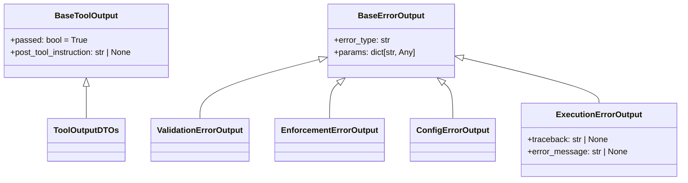
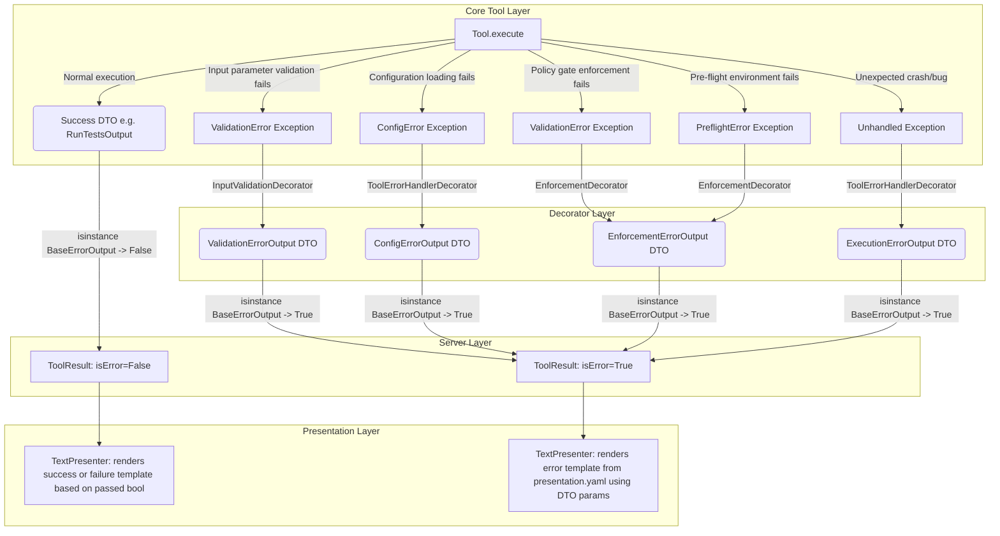
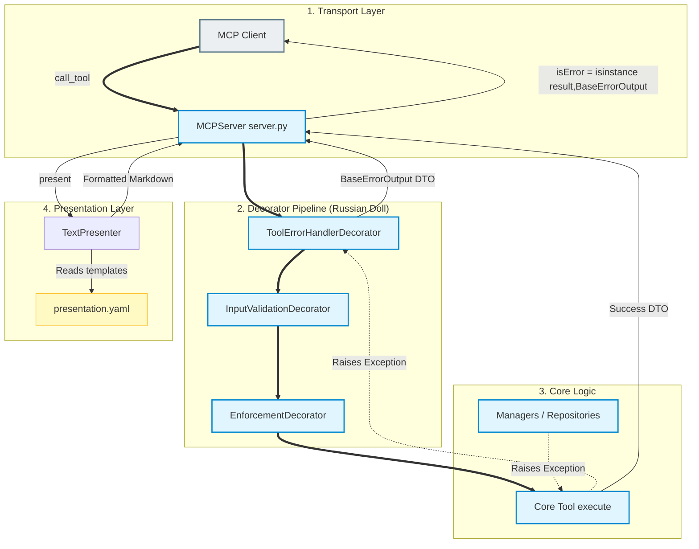

<!-- docs/development/issue289/research.md -->
<!-- template=research version=8b7bb3ab created=2026-06-26T08:48Z updated=2026-06-27T05:40Z -->
# Error Taxonomy Refactoring & DTO Segregation Research

**Status:** APPROVED  
**Version:** 1.2  
**Last Updated:** 2026-06-27

---

## 1. Problem Statement

The current error representation on the MCP platform violates the Single Responsibility Principle (SRP). Specifically:
1. `BaseToolOutput` contains both success-related and error-related concerns (`success` and `error_message` fields), enabling invalid error payloads in success states.
2. Error DTOs (inheriting from `ToolErrorOutput`) carry a redundant `success` boolean field (`success = False`), violating separation of concerns.
3. The platform's transport and presentation layers (`server.py` and `TextPresenter`) determine execution status by checking the value of the `success` attribute rather than using type-safe checks.
4. Internal exceptions and decorators hardcode human-readable `error_message` or `message` strings in Python, bypassing the declarative presentation boundary defined in `presentation.yaml`.

---

## 2. Research Goals

- Map the current Exception and DTO Taxonomy to understand exact coupling and dependencies.
- Define the absolute boundaries, constraints, and limits of the target architecture.
- Identify the blast radius of removing `error_message` from success DTOs and `success` from error DTOs.
- Formulate a strategy for handling legacy test assertions that couple tests to deprecated attributes.
- Evaluate the feasibility of isolating error DTO generation entirely to the decorator pipeline.
- Identify and eliminate redundant/obsolete error DTOs.

---

## 3. Findings

### Item 1: Current Exception & DTO Taxonomies

The codebase maintains two distinct taxonomies for error representation:

#### 1. Runtime Exceptions (`mcp_server/core/exceptions.py`)
These are raised in core modules during runtime and caught by decorators:
- `MCPError`: Base exception (inherits from `Exception`) containing `message`, `code` (defaults to `"ERR_INTERNAL"`), and `params: dict`.
  - `ConfigError`: Configuration parsing/loading errors, carrying `file_path`. Code: `"ERR_CONFIG"`.
  - `ValidationError`: Input or validation failures, carrying `schema`, `missing`, and `provided`. Code: `"ERR_VALIDATION"`.
    - `MetadataParseError`: Specific metadata-validation failures, carrying `file_path`.
  - `PreflightError`: Failures checked before tool execution. Code: `"ERR_PREFLIGHT"`.
  - `ExecutionError`: Execution failures in tools. Code: `"ERR_EXECUTION"`.
  - `MCPSystemError`: System/platform-level failures, carrying `fallback`. Code: `"ERR_SYSTEM"`.

#### 2. Tool Output DTOs (`mcp_server/schemas/`)
These are Pydantic models returned by tool execution and decorators:
- **Success DTOs** (`tool_outputs.py`): All inherit from `BaseToolOutput`.
  - `BaseToolOutput`: Contains `success: bool = True`, `error_message: str | None = None`, and `post_tool_instruction: str | None = None`.
- **Error DTOs** (`error_outputs.py`): All inherit from `ToolErrorOutput`.
  - `ToolErrorOutput`: Contains `success: bool = False`, `error_type: str`, `error_message: str | None = None`, `traceback: str | None = None`, and `params: dict`.
  - Subclasses: `ValidationErrorOutput`, `ExecutionErrorOutput`, `CacheErrorOutput`, `EnforcementErrorOutput`, `ConfigErrorOutput`.

### Item 2: Boundary Analysis & Mapping Points

Exceptions are mapped to DTOs in the **Decorator Pipeline** at specific boundary points:

| Source Exception / Error | Decorator | Resulting DTO | Presenter Template Mapping |
| :--- | :--- | :--- | :--- |
| `pydantic.ValidationError` | `InputValidationDecorator` | `ValidationErrorOutput` | Resolved via `failures.validation` or `failures.ERR_VALIDATION` |
| `mcp_server.core.exceptions.ValidationError` | `EnforcementDecorator` | `EnforcementErrorOutput` | Resolved via `failures` mapping in `presentation.yaml` using `error_code` |
| `ConfigError` | `ToolErrorHandlerDecorator` | `ConfigErrorOutput` | Resolved via `failures.config` or `failures.ERR_CONFIG` |
| Uncaught Python `Exception` | `ToolErrorHandlerDecorator` | `ExecutionErrorOutput` | Falls back to `default_failure_template` |

### Item 3: Redundant DTOs and Resilient Subsystems

- **`CacheErrorOutput` Redundancy:** 
  Analysis of `response_cache.py` shows that cache writing is completely resilient. The `put` method catches any internal exceptions and returns a `CachePublication` object containing `success=False` and `error_code="write_failed"`. It never raises an exception and never generates a `CacheErrorOutput` DTO. Thus, `CacheErrorOutput` is completely redundant and can be safely deleted.
- **Presenter Error Handling:**
  The `TextPresenter` catches formatting errors internally at runtime (`Format error: {exc}`), preventing presenter exceptions from crashing tool execution. Furthermore, template-schema alignment is verified at boot time via `validate_presentation_alignment`. Thus, no dedicated presenter error DTO is required.

---

## 4. Target Architecture Boundaries & Framework

To resolve the identified violations while preserving system stability, we define the following architectural boundaries and constraints:

### Constraint 1: Status Checking via Type Evaluation
- **Current Behavior:** `server.py` and `TextPresenter` evaluate whether an execution failed using boolean queries: `success = getattr(result, "success", True)`.
- **Target Boundaries:**
  1. The platform treats types as the single source of truth for execution status. `server.py` and `TextPresenter` must check if `isinstance(result, BaseErrorOutput)` to identify errors.
  2. **Protocol Flag (`isError`):** The `isError` flag at the MCP protocol level must be set to `True` if and only if the result is an instance of `BaseErrorOutput`.
  3. **Visual / Logical Success (`passed`):** To enforce "explicit over implicit", `BaseToolOutput` defines `passed: bool = True`. Successful tool results (like `RunTestsOutput` or `RunQualityGatesOutput`) can override this to `False` when logical/domain checks fail (e.g. failing tests). The presenter evaluates `data.passed` to select `template_success` vs `template_failure`. Since these are subclasses of `BaseToolOutput` (not `BaseErrorOutput`), `isError` remains `False`.
  4. **Presenter Note Integration:** Operations notes collected in `NoteContext` are unconditionally appended to both successful runs and error runs, keeping visual suggestions and structured payloads separated.

### Constraint 2: Elimination of Hardcoded Error Messages & Tracebacks
- **Current Behavior:** Internal exception handlers pass hardcoded strings in Python (e.g. `error_message=f"Invalid input"`).
- **Target Boundaries:**
  1. `BaseErrorOutput` and all internal DTOs (`ValidationErrorOutput`, `EnforcementErrorOutput`, `ConfigErrorOutput`) must **not** contain any form of `error_message`, `message`, `err_message`, or `msg` fields.
  2. All internal exceptions must only pass structured keys and parameters (such as `error_code`, `file_path`, `params`) to their corresponding DTOs.
  3. The `TextPresenter` is solely responsible for looking up and formatting user-facing messages from `presentation.yaml` using these parameters.
  4. **Traceback and message isolation:** The `traceback: str | None` and `error_message: str | None` fields are removed from `BaseErrorOutput` and live **exclusively** on `ExecutionErrorOutput`.
  5. **No tracebacks in templates:** Presentation templates in `presentation.yaml` must *never* contain `{traceback}` placeholders. The presenter only outputs a safe description and the cache resource URI (`pgmcp://cache/runs/{run_id}`) where the full traceback can be retrieved.
  6. **Boot-time validation:** `validate_presentation_alignment` will be verifiably executed as part of the centralized boot validation sequence (`BootstrapValidator`). It will use reflection to scan all subclasses of `BaseErrorOutput` and verify they have a matching template key under the `errors` block in `presentation.yaml`.

### Constraint 3: Tool-level Return Segregation (No Error DTOs in Core Tools)
- **Current Behavior:** Tool classes catch their own internal exceptions and return DTOs with `success=False` and `error_message`.
- **Target Boundaries:**
  1. Core tool classes must **only** generate and return their specific success DTOs (e.g., `CycleTransitionOutput`). They must **never** return error DTOs.
  2. For any execution, validation, pre-flight, or configuration failure, the core tool must raise a structured exception (e.g., `ValidationError`, `PreflightError`, `ConfigError`).
  3. The decorator pipeline wraps the core tool and is exclusively responsible for catching these exceptions and mapping them to `BaseErrorOutput` subclasses.
  4. The generic `ICoreTool` interface defines `execute` as returning `TOutput`. Under this architecture, the core tool's type signature remains `TOutput` (only success DTO). Only the outer decorated `ITool` interface returns `Union[BaseToolOutput, BaseErrorOutput]`.

### Diagram 1: DTO & Exception Class Hierarchy

### Diagram 2: Runtime Exception Mapping & Data Flow

### Diagram 3: Target Architecture Block Diagram

---

## 5. Approved Strategy

To establish a clean, non-compromised target state and clear the accumulated technical debt, we adopt a **Clean Break** strategy across all boundaries:

### Boundary Strategies

1. **DTO Schemas:**
   - *Clean Break:* Remove `error_message` and `success` from `BaseToolOutput` and replace them with `passed: bool = True`. Remove `success` and `error_message` from all internal DTOs (`ValidationErrorOutput`, `EnforcementErrorOutput`, `ConfigErrorOutput`, `CacheErrorOutput`) in a single step. Isolate `traceback` and `error_message` exclusively to `ExecutionErrorOutput`. Delete `CacheErrorOutput`.
   - *Rationale:* Keeping deprecated attributes would invite future coupling and violate the clean Separation of Concerns contract.

2. **Core Tools Execution Returns:**
   - *Clean Break:* Refactor all tool execute methods to bubble exceptions rather than catching and returning error DTOs. Core tools return only their successful DTO.

3. **Server & Presenter:**
   - *Clean Break:* Transition immediately to `isinstance(result, BaseErrorOutput)` checks. All code path branching in `server.py` and `text_presenter.py` will rely on type evaluations and `data.passed`.

4. **Test Suite refactoring:**
   - *Clean Break:* Refactor all assertions in the test suite that assert on legacy properties (such as `.success` or `.error_message` on error DTOs) to check DTO type (`isinstance(result, BaseErrorOutput)`) or check presence of structured parameters.
   - *Rationale:* Tests that verify legacy behavior are themselves technical debt. They must be cleaned up to align with the new schema contracts.

---

## 6. Expected Results & Verification Baseline

1. **Static Analysis & Type Checks:**
   - Standard strict static analysis (`mypy` and `pyright`) passes 100% on the entire codebase.
   - Tool `execute` signatures match `SuccessDTO`, and decorators return type-compatible `BaseErrorOutput` DTOs.
2. **Quality Gates:**
   - `run_quality_gates` passes 10.00/10 with no warnings or violations of Presentation Boundary (§15) or SOLID.
3. **Execution Correctness:**
   - System/pipeline/validation/pre-flight errors correctly set `isError=True` in the MCP protocol.
   - Domain outcomes (e.g. failing tests, git status differences) do not trigger protocol errors and are returned cleanly as markdown content.
   - All tests in the test suite pass 100%.

---

## 7. Scope and Coverage Analysis

### 7.1. Affected Files and Components

This refactoring affects several layers of the application. The table below represents the verifiable coverage of components that will be modified to remove legacy fields (`success`/`error_message`) and enforce the exception-to-DTO decorator mapping:

| Layer | Component / File | Current Status | Expected Status |
| :--- | :--- | :--- | :--- |
| **Schemas** | `mcp_server/schemas/tool_outputs.py` | Defines `success` and `error_message` on `BaseToolOutput` (inherited by all success DTOs). | `BaseToolOutput` has `passed: bool = True`. Legacy fields are completely removed. |
| **Schemas** | `mcp_server/schemas/error_outputs.py` | Defines `success`, `error_message`, and `traceback` on `ToolErrorOutput` (inherited by all error DTOs). Includes obsolete `CacheErrorOutput`. | `BaseErrorOutput` has no `success`, `error_message`, or `traceback` fields. `CacheErrorOutput` is deleted. `traceback` and `error_message` are exclusive to `ExecutionErrorOutput`. |
| **Server** | `mcp_server/server.py` | Uses `getattr(result_dto, "success", True)` for status checking and manual error response building. | Uses `isinstance(result_dto, BaseErrorOutput)` for checking execution errors and setting protocol `isError` flag. |
| **Presentation** | `mcp_server/presenters/text_presenter.py` | Relies on `success` field for rendering templates. Fallback formats `error_message` strings. | Relies on `data.passed` to select success/failure templates for success DTOs. Formats error DTOs using templates in `errors:` section of `presentation.yaml`. |
| **Presentation** | `.phase-gate/config/presentation.yaml` | Lacks a dedicated `errors` block. Templates for tools check legacy success/failure categories. | Contains a dedicated `errors` block mapping error DTO types to templates. |
| **Decorators** | `mcp_server/core/decorators/` | Inner decorators map caught validation errors but don't cover all exceptions. | Pipeline decorators map validation, enforcement, preflight, and system exceptions cleanly to the 4 error DTOs. |
| **Tools** | `mcp_server/tools/*.py` | Multiple tools (`cycle_tools`, `git_tools`, `pr_tools`, etc.) catch exceptions and return success=False DTOs. | 100% of tools only return success DTOs; all errors bubble up. |
| **Test Suite** | `tests/` | Over 100 unit/integration tests assert on DTO `.success` or `.error_message` properties. | 100% of tests are refactored to verify DTO types (`isinstance(..., BaseErrorOutput)`) or check structured parameter payloads. |

### 7.2. User-Facing Text Migration Coverage

Based on [user_facing_text_inventory.md](../issue404/user_facing_text_inventory.md) which identified 205 user-facing strings and exceptions:
- **Status Before Implementation:** Many exception messages and error outputs are hardcoded in Python files (e.g., `git_tools.py`, `cycle_tools.py`) and return unstructured error payloads.
- **Status After Implementation:** 100% of internal error-raising paths are converted to structured exceptions (without hardcoded string parameters except for raw external logs). The `TextPresenter` manages all user-facing formatting via the presentation template system, securing 100% coverage of the Presentation Boundary.

---

## 8. Related Documentation

- [ARCHITECTURE_PRINCIPLES.md](../../coding_standards/ARCHITECTURE_PRINCIPLES.md)
- [DOCUMENTATION_STANDARD.md](../../coding_standards/DOCUMENTATION_STANDARD.md)
- [presentation.yaml](../../.phase-gate/config/presentation.yaml)
- [exceptions.py](../../mcp_server/core/exceptions.py)
- [error_outputs.py](../../mcp_server/schemas/error_outputs.py)

---

## 9. Version History

| Version | Date | Author | Changes |
|---------|------|--------|---------|
| 1.0 | 2026-06-26 | Agent | Initial draft |
| 1.1 | 2026-06-26 | Agent | Approved target boundaries, clean break strategy, and test cleanup focus |
| 1.2 | 2026-06-27 | Agent | Refined target boundaries, removed Dutch terms, introduced explicit passed: bool on BaseToolOutput, isolated traceback to ExecutionErrorOutput, added 3 Mermaid diagrams, and added scope/coverage analysis. |
