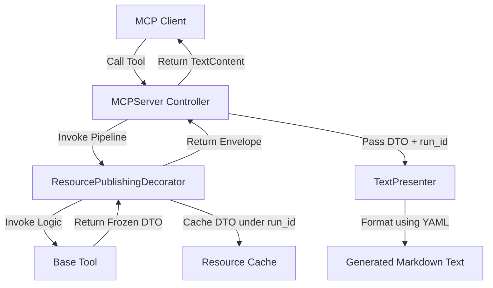

<!-- c:\temp\pgmcp\docs\development\issue402\design.md -->
<!-- template=design version=5827e841 created=2026-06-12T12:57Z updated=2026-06-14T17:19:00Z -->
# Design — Issue #402: Expose JSON data in MCP tools

**Status:** APPROVED  
**Version:** 2.0  
**Last Updated:** 2026-06-14

---

## Purpose

Establish the architectural and data-flow design for exposing structured JSON data in MCP tools using Pydantic DTOs and the MCP Resource channel, while enforcing strict separation of concerns via an ITool interface, MVP pipeline, and Resource Caching decorator.

## Scope

**In Scope:**
- All active, registered tools in the `mcp_server/tools/` directory.
- Implementation of the `ITool` interface and `ToolFactory`.
- The `ResourcePublishingDecorator` and `ToolExecutionEnvelope`.
- Refactoring the `MCPServer.handle_call_tool()` pipeline.
- Dropping `structuredContent` payload from the MCP protocol response entirely.

**Out of Scope:**
- Protocol changes outside MCP, client-side UI rendering implementations.

## Prerequisites

Read these first:
1. Approved Research Document under Issue #402.

---

## 1. Context & Requirements

### 1.1. Problem Statement

We must expose structured JSON data alongside human-readable text fallbacks. Initial attempts using `structuredContent` and dual-payloads in `ToolResult` caused severe architectural cohesion problems (`skip_json` hacks, `QUICKFIX` duplication, God-methods). The system must be refactored to cleanly separate tool logic (Domain), caching (Application State), and MCP responses (Protocol Boundary) while delivering the JSON data robustly.

### 1.2. Requirements

**Functional:**
- Migrate all tools to implement an `ITool` interface that returns pure Pydantic DTOs (no MCP types).
- Cache all tool DTO outputs as MCP Resources (`pgmcp://cache/runs/{run_id}`).
- Respond to the LLM solely with `TextContent` containing a human-readable summary and the resource URI.
- Remove `structuredContent` and `QUICKFIX` markdown JSON duplication from the server output.

**Non-Functional:**
- Adhere to `ARCHITECTURE_PRINCIPLES.md`: CQS (§5), Config-First (§3), SRP, and Dependency Inversion.
- Ensure DTOs are `frozen=True` and completely agnostic of `run_id` or caching metadata.

---

## 2. Design Options

### Option A: Server-side Mutation
* **Description:** The `MCPServer` modifies the tool's DTO to inject a `run_id` after execution.
* **Pros:** Easy to implement.
* **Cons:** Violates CQS and immutability by requiring mutable fields or `.model_copy(update=...)` on DTOs, polluting the pure domain models with infrastructure metadata.

### Option B: The Envelope Pattern & Decorators (Recommended)
* **Description:** The `ITool` returns a pure, frozen DTO. A `ResourcePublishingDecorator` generates the `run_id`, caches the DTO, and wraps both in a `ToolExecutionEnvelope`. The Server unpacks the Envelope to feed the cache and the Presenter.
* **Pros:** Complete separation of concerns. Pure domain DTOs. Caching remains modular and configurable via `ToolFactory`. Fits perfectly within a Model-View-Presenter (MVP) pipeline.
* **Cons:** Requires introducing a decorator and a factory.

---

## 3. Chosen Design

**Decision:** Option B: Implement the `ITool` interface, `ToolFactory`, `ResourcePublishingDecorator`, and an MVP pipeline in `MCPServer`. Completely drop `structuredContent`.

**Rationale:** Option B strictly enforces SRP and Dependency Inversion. It completely solves the "God-method" anti-pattern in `handle_call_tool()`, eliminates the need for OCP-violating `skip_json` hacks, and provides a lightweight, pure-text MCP response while reliably serving JSON via the robust Resource channel.

### 3.1. Core Components

| Component | Responsibility (MVP Role) |
|---|---|
| **Base Tool (`ITool`)** | **Model**: Pure business logic. Validates input schema, executes action, returns frozen domain DTO. Knows nothing of MCP, caching, or presentation. |
| **ToolExecutionEnvelope** | **Transport**: A dataclass coupling the pure DTO with infrastructure metadata (`run_id`). |
| **ResourcePublishingDecorator** | **Application State**: Wraps the base tool. Generates UUID `run_id`, caches the DTO, and returns the Envelope. |
| **ToolFactory** | **Composition Root**: Assembles the Base Tools and Decorators into ready-to-use `ITool` instances for the server. |
| **MCPServer** | **Controller**: Receives MCP request, delegates to the `ITool` pipeline, unpacks the Envelope, and passes DTO + `run_id` to the Presenter. |
| **TextPresenter** | **Presenter**: Formats the DTO into a Markdown string using `presentation.yaml`. Uses `run_id` to build the URI. |

### 3.2. Interfaces & Contracts

```python
class ITool(Protocol):
    @property
    def name(self) -> str: ...
    
    @property
    def description(self) -> str: ...
    
    @property
    def input_schema(self) -> type[BaseModel]: ...
    
    async def execute(self, params: BaseModel, context: NoteContext) -> ToolExecutionEnvelope:
        """Executes the tool pipeline (decorator + base tool)."""
        ...

@dataclass(frozen=True)
class ToolExecutionEnvelope:
    run_id: str
    data: BaseModel  # The pure domain DTO
```

### 3.3. Architecture & Data Flow



### 3.4. Dropping `structuredContent`
The server's `handle_call_tool()` method will be dramatically simplified. It will no longer build `CallToolResult(structuredContent=...)`. Instead, it will exclusively return `[TextContent(type="text", text=formatted_text)]`. 
The `QUICKFIX` block in `mcp_converters.py` will be removed.

---

## 4. Affected Test Suites
- All tests in `tests/mcp_server/unit/tools/` must be updated to expect pure DTOs (if testing the Base Tool) or Envelopes (if testing the decorated pipeline).
- The `assert_structured_tool_result` helper must be deprecated/rewritten to assert against the new `ExecutionEnvelope` or pure `TextContent` MCP outputs.

## 5. Design-Level Validation Strategy
- The Factory must successfully assemble all existing tools into `ITool` instances without compilation or typing errors.
- The Server must be able to serve the `list_tools` endpoint using the `ITool` metadata properties.
- The execution of any tool must result in the DTO appearing in the `ResourceCache` accessible via `pgmcp://cache/runs/{run_id}`.