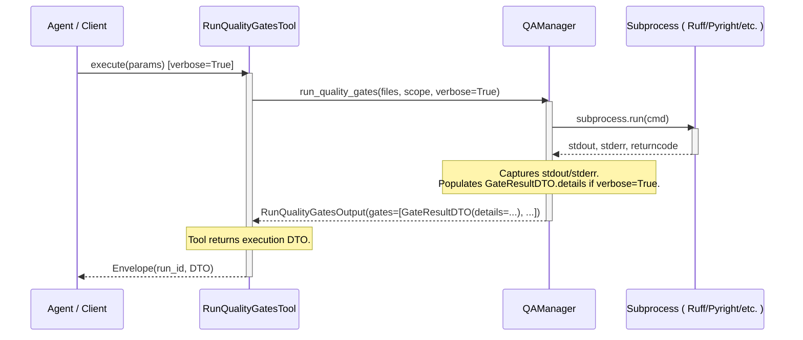
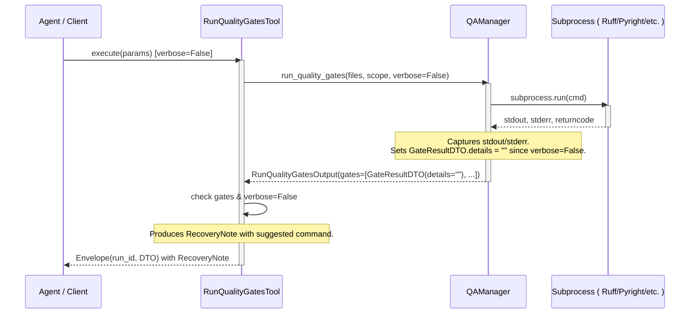

<!-- docs\development\issue402\quality_gates_verbose_design.md -->
<!-- template=design version=5827e841 created=2026-06-14T21:43Z updated=2026-06-15T00:10Z -->
# Quality Gates Verbose Output Design

**Status:** APPROVED  
**Version:** 1.0.0  
**Last Updated:** 2026-06-14

---

## 1. Context & Requirements

### 1.1. Problem Statement

The `run_quality_gates` tool runs quality gate checks (such as Ruff, Pyright, etc.) but does not expose the full verbose outputs (stdout/stderr) of failing checks. This makes debugging failed gates difficult and forces manual execution of these tools in a local terminal.

### 1.2. Requirements

**Functional:**
- Add a `verbose: bool = False` input option to `RunQualityGatesInput` to enable capturing complete tracebacks and output details from failing gates.
- Update the `GateResultDTO` (in `tool_outputs.py`) to include a `details: str = ""` field for storing full stdout and stderr when verbose mode is enabled.
- Ensure that the `QAManager` maps stdout and stderr of the underlying gate processes into the `details` field of the gate results only when `verbose` is True.
- Ensure that the presentation template for `run_quality_gates` remains extremely minimal (similar to `run_tests`) and does not print the verbose gate details directly in the markdown response to the LLM to prevent context pollution; instead, all detailed output must be saved exclusively in the Resource Cache under the `run_id`.
- When a gate fails and `verbose` is False, include a `RecoveryNote` instructing the caller to rerun the tool with `verbose=True` for specific failing files/scopes.

**Non-Functional:**
- Maintain full backward compatibility of existing tool inputs and output contracts.
- Keep the text response lightweight to prevent LLM context/token window explosion.
- Leverage the existing DTO and Resource Caching pipeline without introducing any god-methods or OCP violations.

### 1.3. Constraints

- Must maintain backward compatibility with existing `QAManager` invocations.
- Must keep the response payload size small to prevent token/context window explosion by caching details in the resource cache.
---

## 2. Design Options

| Option | Description | Pros | Cons |
|--------|-------------|------|------|
| **Option A:** Inline Verbose Output | Output full linter failures and tracebacks directly in the markdown presenter text returned to the LLM. | Simple implementation, doesn't require modifying the DTO or Resource Cache. | Extremely high risk of token/context window explosion. Violates the core architecture decision of Issue #402. |
| **Option B (Preferred):** Resource-Cached Verbose Output | Store process stdout/stderr in the `details` field of the DTO (GateResultDTO) only when `verbose=True` and cache the DTO as an MCP Resource. Presenter remains minimal. | Strong protection against token size explosion. Reuses the robust DTO and caching architecture of Issue #402. | Requires adding a field to the DTO and updating the presentation config. |

---

## 3. Chosen Design

**Decision:** Option B: Add `verbose: bool = False` to `RunQualityGatesInput`. Add a `details: str = ""` field to `GateResultDTO`. Store gate execution stdout and stderr in `details` when `verbose=True` and cache the resulting DTO as an MCP resource under `pgmcp://cache/runs/{run_id}`. Keep the markdown presenter output minimal and return a `RecoveryNote` on failures when `verbose=False`.

**Rationale:** This mirrors the pattern successfully used for the `run_tests` tool. It adheres to the MVP separation of concerns by keeping presentation, data structure (DTO), and execution logic isolated, and uses the Resource Cache to handle verbose payloads safely without token bloat.

### 3.1. Key Design Decisions

| Decision | Rationale |
|----------|-----------|
| Store verbose output in `details` field of `GateResultDTO` | Restricts the detail payload to the structured DTO, keeping the presenter output lightweight. |
| Restrict details inclusion to `verbose=True` | Avoids wasting memory and cache storage when verbose details are not needed. |
| Emit a `RecoveryNote` when gates fail and `verbose=False` | Directs the caller on how to rerun the tool to retrieve the full linter/checker output. |

### 3.2. Execution Flow

When `verbose` is disabled (`verbose=False`):

---

## 4. Affected Interfaces And Call Sites

| Component/File | Interface/Class/Method | Expected Changes |
|----------------|------------------------|------------------|
| [`mcp_server/schemas/tool_outputs.py`](file:///c:/temp/pgmcp/mcp_server/schemas/tool_outputs.py) | `GateResultDTO` | Add `details: str = ""` field (frozen, extra="forbid"). |
| [`mcp_server/tools/quality_tools.py`](file:///c:/temp/pgmcp/mcp_server/tools/quality_tools.py) | `RunQualityGatesInput` | Add `verbose: bool = Field(default=False, description="...")`. |
| [`mcp_server/tools/quality_tools.py`](file:///c:/temp/pgmcp/mcp_server/tools/quality_tools.py) | `RunQualityGatesTool.execute` | Pass `verbose=params.verbose` to `manager.run_quality_gates()`. If `verbose=False` and overall pass is False, produce a `RecoveryNote` suggesting to rerun with `verbose=True`. |
| [`mcp_server/managers/qa_manager.py`](file:///c:/temp/pgmcp/mcp_server/managers/qa_manager.py) | `QAManager.run_quality_gates` | Update signature to accept `verbose: bool = False` and pass it to `_execute_gate`. |
| [`mcp_server/managers/qa_manager.py`](file:///c:/temp/pgmcp/mcp_server/managers/qa_manager.py) | `QAManager._execute_gate` | Accept `verbose: bool = False` parameter. If `verbose` is True and the gate fails (or has output), populate the gate's `details` string with exit code, stdout, and stderr. Otherwise, keep `details` as `""`. |

---

## 5. Test Blast Radius

| Test File | Target Code | Expected Test Coverage |
|-----------|-------------|------------------------|
| [`tests/mcp_server/unit/tools/test_quality_tools.py`](file:///c:/temp/pgmcp/tests/mcp_server/unit/tools/test_quality_tools.py) | `RunQualityGatesInput` & `RunQualityGatesTool` | - Verify input validation accepts `verbose` parameter. - Verify `verbose` is propagated to `QAManager`. - Verify that `verbose=False` on failure produces a `RecoveryNote` suggesting to rerun with `verbose=True`. |
| [`tests/mcp_server/unit/managers/test_qa_manager.py`](file:///c:/temp/pgmcp/tests/mcp_server/unit/managers/test_qa_manager.py) | `QAManager` | - Verify that `verbose=True` populates the `details` field with stdout/stderr upon failure. - Verify that `verbose=False` leaves the `details` field as `""`. |

---

## 6. Design-Level Validation Strategy

- The Factory must assemble `RunQualityGatesTool` with the updated arguments correctly.
- Running quality gates with `verbose=True` must populate the `details` field in the cached DTO inside `pgmcp://cache/runs/{run_id}`.
- Running quality gates with `verbose=False` must result in empty `details` fields in the DTO, but produce a `RecoveryNote` listing the suggested rerun command.
- Presentation templates in `presentation.yaml` must not print the details to the LLM.

---

## Version History

| Version | Date | Author | Changes |
|---------|------|--------|---------|
| 1.0.0 | 2026-06-14 | Agent | Initial draft |
