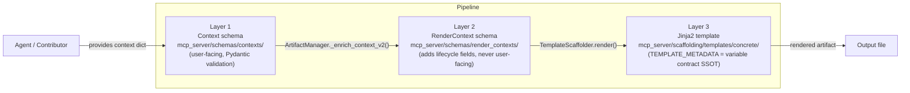

<!-- docs\development\issue286\design.md -->
<!-- template=design version=5827e841 created=2026-06-04T19:38Z updated=2026-06-04 -->
# Issue #286: Template/Scaffolding Pipeline Gaps and Documentation Alignment

**Status:** DRAFT  
**Version:** 1.0  
**Last Updated:** 2026-06-04

---

## Purpose

Define the fix direction for each gap in issue #286, establish the three-layer architecture as the organizing principle for the documentation cluster, and provide planning with the interface surfaces, affected tests, and validation obligations needed to execute.

## Scope

**In Scope:**
Generic artifact Layer 1/Layer 3 contract fix; adapter, resource, interface, validation-report full pipeline registration; revision of the six-document template/scaffolding reference cluster; new `docs/reference/mcp/README.md` navigation surface.

**Out of Scope:**
Broader MCP reference documentation outside the template/scaffolding cluster; changes to the legacy scaffolding components beyond registry enablement; issue #349 architecture for source-code-free template contribution; unrelated artifact types.

## Prerequisites

Read these first:
1. `docs/development/issue286/research.md`
2. `docs/coding_standards/ARCHITECTURE_PRINCIPLES.md`
3. `docs/coding_standards/DOCUMENTATION_STANDARD.md`

---

## 1. Context & Requirements

### 1.1. Problem Statement

The scaffolding pipeline has five concrete gaps:

1. **Generic contract mismatch**: `GenericContext.methods: list[str]` (Layer 1) is incompatible with `concrete/generic.py.jinja2` (Layer 3), which accesses `method.name`, `method.params`, `method.return_type`, `method.docstring`, and `method.body` as structured objects.
2. **Missing pipeline types**: `adapter`, `resource`, and `interface` are disabled in the artifact registry with no context class, no RenderContext class, and no concrete template.
3. **Missing validation-report type**: `validation-report` is not registered as an artifact type anywhere in the active scaffolding pipeline.
4. **Stale documentation cluster**: the six-document reference cluster describes legacy template paths, obsolete product branding, and does not explain the three-layer architecture.
5. **No navigation surface**: there is no `docs/reference/mcp/README.md` to make the cluster discoverable as a coherent unit.

### 1.2. Requirements

**Functional:**
- Fix the generic artifact schema-template contract so all three layers are consistent
- Add full pipeline support for adapter, resource, and interface artifact types
- Add full pipeline support for validation-report artifact type
- Revise the reference documentation cluster to accurately describe the three-layer architecture
- Create `docs/reference/mcp/README.md` as a navigation surface for the template/scaffolding cluster
- Every touched document must be fully free of legacy content after its editing cycle

**Non-Functional:**
- Generic artifact must remain broadly usable: only `name` is required for a method spec
- New artifact types must follow the same three-layer pattern as existing types
- Documentation must be actionable for future template editors without source code context needed for reading
- No version labels (V1/V2) may appear in documentation

### 1.3. Constraints

- Code is the source of truth for all design decisions
- Approved Strategy: clean break in documentation; hard removal of legacy per touched document; docs-first alignment
- `MethodSpec` fields beyond `name` must be optional with sensible defaults to preserve generic usability
- The three-layer model (Context schema → RenderContext schema → Jinja2 template) is the SSOT organizing principle
- Documentation must answer: what exactly must a contributor create to add a new artifact type?

---

## 2. Design Options

### 2.1. Gap 1: Generic artifact — Layer 1/Layer 3 contract mismatch

The template (`concrete/generic.py.jinja2`) generates valid Python method definitions using structured object access (`method.name`, `method.params`, `method.return_type`, `method.docstring`, `method.body`). The current Layer 1 schema declares `methods: list[str]`, which is structurally incompatible.

| Option | Description | Verdict |
|---|---|---|
| **A — Align Layer 1 to Layer 3** | Introduce `MethodSpec` value object. `name` required; all other fields optional with sensible defaults. Layer 3 unchanged. | **Selected** |
| **B — Align Layer 3 to Layer 1** | Rewrite template to render plain strings. Loses type annotation generation, body scaffolding, and docstring generation. | Rejected — degrades usability |
| **C — Status quo** | Leave mismatch. Runtime failure on any non-empty `methods` input. | Rejected — confirmed production defect |

**Comparison with `dto.fields`:** `DTOContext.fields: list[str]` uses flat strings (format `'name: type'`) because the DTO template only outputs raw field definitions without generating Python syntax structure. `generic.methods` is categorically different: the template generates full method signatures with type annotations, parameters, and bodies. Structured access is therefore appropriate and required, not over-engineering.

**Selected design for `MethodSpec`:**

```python
class MethodSpec(BaseModel):
    model_config = ConfigDict(frozen=True, extra="forbid")
    name: str                       # required — only mandatory field
    params: str = ""                # e.g. "x: int, y: str = 'default'"
    return_type: str = ""           # empty = no annotation (template uses if-guard)
    docstring: str = ""             # empty = template default "<name> method."
    body: str = "pass"              # default body
```

`MethodSpec` is a **frozen value object** (per ARCHITECTURE_PRINCIPLES frozen rule for value objects). It lives in `mcp_server/schemas/contexts/method_spec.py` (not inside `generic.py`) to allow reuse by `adapter`, `resource`, and `interface` if needed.

Minimal usage: `{"name": "calculate"}` → generates `def calculate(self): ...` with default body.  
Rich usage: all fields populated → generates fully annotated method signature.

### 2.2. Gap 2: adapter, resource, interface — no pipeline support + legacy scaffolder removal

User decision: build fully and delete the legacy scaffolders.

**Blast radius assessment for legacy scaffolder deletion:**

| Check | Finding |
|---|---|
| Production imports | Zero — no `.py` file outside the component files themselves imports any of the three classes |
| Tests | Zero — no test file references `AdapterScaffolder`, `ResourceScaffolder`, or `InterfaceScaffolder` |
| Jinja2 templates | `components/adapter.py.jinja2`, `components/resource.py.jinja2`, `components/interface.py.jinja2` do not exist in the filesystem — the fallback to `generic.py.jinja2` was the only code path that ever executed |
| Config | Only in commented-out lines in `artifacts.yaml` (`# scaffolder_class: "AdapterScaffolder"`) |
| Active documentation | None — archive docs only |

Conclusion: the three legacy scaffolders are fully orphaned. Deletion is a 3-file remove with zero blast radius. It belongs in the same cycle as pipeline addition.

| Option | Description | Verdict |
|---|---|---|
| **A — Full pipeline (all 6 elements) + delete legacy scaffolders** | Context schema + RenderContext + concrete template + registry entry + `__init__` exports + `artifacts.yaml` enabled; delete `components/adapter.py`, `components/resource.py`, `components/interface.py` | **Selected** |
| **B — Document as "not yet supported"** | Documentation change only; legacy fallback persists | Rejected — user requirement |
| **C — Pipeline without legacy removal** | Register in pipeline; keep orphaned legacy files | Rejected — user requirement: fully remove legacy |

**Selected pattern (identical for each of the three types):**

Each type needs all six elements plus legacy removal:

| Element | adapter | resource | interface |
|---|---|---|---|
| Context schema | `mcp_server/schemas/contexts/adapter.py` | `.../resource.py` | `.../interface.py` |
| RenderContext schema | `mcp_server/schemas/render_contexts/adapter.py` | `.../resource.py` | `.../interface.py` |
| Concrete template | `concrete/adapter.py.jinja2` | `concrete/resource.py.jinja2` | `concrete/interface.py.jinja2` |
| `_v2_context_registry` entry | `"adapter": "AdapterContext"` | `"resource": "ResourceContext"` | `"interface": "InterfaceContext"` |
| `__init__.py` export | `AdapterContext`, `AdapterRenderContext` | idem | idem |
| `artifacts.yaml` | enabled | enabled | enabled |
| **Legacy removal** | **delete** `components/adapter.py` | **delete** `components/resource.py` | **delete** `components/interface.py` |

**Context schema field contracts** (all follow the same usability principle: minimal required, rich optional):

| Type | Required | Optional |
|---|---|---|
| `AdapterContext` | `name: str` | `description`, `target_interface`, `methods: list[MethodSpec]` |
| `ResourceContext` | `name: str` | `description`, `resource_type`, `methods: list[MethodSpec]` |
| `InterfaceContext` | `name: str` | `description`, `methods: list[MethodSpec]` |

All three types reuse `MethodSpec` from Gap 1.
### 2.3. Gap 3: validation-report — not registered

User decision: build fully in this issue.

`validation-report` is a markdown document artifact (not a Python code artifact). The pipeline already handles document artifact types (research, design, planning, architecture, reference). This gap follows the same pattern.

| Element | Location |
|---|---|
| Context schema | `mcp_server/schemas/contexts/validation_report.py` |
| RenderContext schema | `mcp_server/schemas/render_contexts/validation_report.py` |
| Concrete template | `concrete/validation_report.md.jinja2` |
| `_v2_context_registry` entry | `"validation_report": "ValidationReportContext"` |
| `__init__.py` export | `ValidationReportContext`, `ValidationReportRenderContext` |
| `artifacts.yaml` | enabled |

**Context schema field contract:**

| Field | Required | Description |
|---|---|---|
| `title` | yes | What is being validated |
| `issue_number` | no | Issue reference (e.g. `286`) |
| `cycle` | no | TDD cycle label (e.g. `C_GENERIC.1`) |
| `phase` | no | Workflow phase being validated (e.g. `design`) |
| `status` | no | PASS / FAIL / PENDING |
| `scope` | no | Short description of validation scope |

### 2.4. Gap 4–5: Documentation cluster revision

**Organizing principle:** The three-layer architecture (Context schema → RenderContext schema → Jinja2 template) is the single authoritative model. All six reference documents must describe the same model consistently, with no legacy content.

**Primary audience:** Future template editors and template designers who need to know exactly what to create to introduce a new artifact type.

| Option | Description | Verdict |
|---|---|---|
| **A — Full in-place revision of all 6 docs + new README** | Each doc updated to three-layer model; README provides navigation | **Selected** |
| **B — Merge TEMPLATE_LIBRARY_USAGE + TEMPLATE_LIBRARY_QUICK_REFERENCE** | Reduce fragmentation | Deferred — separate audiences; USAGE = how-to, QUICK_REFERENCE = inventory |
| **C — New standalone contributor guide** | Separate doc for template editors | Rejected — fragment further instead of fixing existing cluster |

**Document-level decisions:**

| Document | Current problem | Design direction |
|---|---|---|
| `docs/architecture/TEMPLATE_LIBRARY.md` | Describes Jinja2 tiers (Layer 3) only; no Context/RenderContext mention | Expand to three-layer architecture; becomes the authoritative architecture home |
| `docs/reference/mcp/tools/scaffolding.md` | Stale paths; `generic_doc` legacy error path documented | Remove legacy; align paths; add context schema reference |
| `docs/reference/mcp/TEMPLATE_LIBRARY_USAGE.md` | `.st3/` paths; `S1mpleTraderV3`; no three-layer model | Full rewrite to current paths; add three-layer model usage guidance |
| `docs/reference/mcp/TEMPLATE_LIBRARY_QUICK_REFERENCE.md` | `.st3/` paths; `S1mpleTraderV3`; stale artifact inventory | Full rewrite; update artifact inventory to reflect all enabled types |
| `docs/reference/mcp/template_metadata_format.md` | Stale paths; `S1mpleTraderV3`; no Layer 1/Layer 2 link | Full rewrite; make `TEMPLATE_METADATA` the explicit Layer 3 variable contract SSOT |
| `docs/reference/mcp/validation_api.md` | Stale paths; `S1mpleTraderV3` | Full rewrite; align to current validation API |
| `docs/reference/mcp/README.md` | Does not exist | Create new navigation surface; groups all six docs with one-line descriptions |

**What the documentation must answer for template editors (non-negotiable):**

> "What exactly do I need to create and register to introduce a new artifact type into the scaffolding pipeline?"

Answer the documentation must provide (all six steps visible in one place):

1. Create `mcp_server/schemas/contexts/<type>.py` — the Context schema (Layer 1, user-facing)
2. Create `mcp_server/schemas/render_contexts/<type>.py` — the RenderContext schema (Layer 2, system-only)
3. Add export to `mcp_server/schemas/__init__.py` for both classes
4. Add entry to `_v2_context_registry` in `mcp_server/managers/artifact_manager.py`
5. Add entry to `.phase-gate/config/artifacts.yaml`
6. Create `mcp_server/scaffolding/templates/concrete/<type>.jinja2` (Layer 3, with `TEMPLATE_METADATA` block)

> **Note for issue #349:** Steps 1–4 require Python source code changes. Adding a new artifact type without source code access is not currently possible. This is the known constraint that issue #349 addresses.

---

## 3. Chosen Design

**Decision:** Fix all five gaps in a single issue: (1) introduce `MethodSpec` frozen value object with `name` as only required field; (2) add full pipeline support for `adapter`, `resource`, `interface`, and `validation-report` artifact types; (3) revise all six reference documents and create `docs/reference/mcp/README.md` with the three-layer architecture as the organizing principle.

**Rationale:** All five gaps sit on the same architectural seam. Fixing them together produces a coherent, accurate reference baseline for future work (including issue #349). The docs-first Approved Strategy is satisfied by treating documentation revision as the first implementation deliverables so that all subsequent code work is anchored to accurate documentation.

### 3.1. Key Design Decisions

| Decision | Chosen direction | Rejected alternative | Reason |
|---|---|---|---|
| Generic methods field | `list[MethodSpec]` with `name` required only | `list[str]` (status quo) / template simplification | Preserves rich template; maximum usability via optional fields |
| `MethodSpec` location | Shared value object in `method_spec.py` | Inline in `generic.py` | Reusable by adapter, resource, interface |
| `MethodSpec` type | Pydantic `BaseModel` with `frozen=True` | `dataclass(frozen=True)` | Consistent with existing schema pattern; Pydantic validation included |
| `adapter`/`resource`/`interface` | Full pipeline (all 6 elements) | Documentation-only | User binding decision: eliminate legacy fallback entirely |
| `validation-report` | Full pipeline as markdown document | Defer to follow-up | User binding decision: build in this issue |
| `validation_report` naming | `validation_report` (underscore) in both Python and config (`artifacts.yaml` `type_id`) | `validationreport` | Underscore is the established convention: consistent with `unit_test`, `integration_test` in both registry and YAML |
| Documentation organizing principle | Three-layer architecture as primary frame | Layer 3-only (Jinja2 tiers) | Root cause of current false-positive SSOT calls |
| Documentation target audience | Future template editors | General agent users | User binding decision; "super duidelijk" for template contribution |
| TEMPLATE_LIBRARY_USAGE + QUICK_REFERENCE | Keep separate, differentiate audience | Merge | USAGE = how-to guide; QUICK_REFERENCE = artifact inventory. Different lookup patterns. |
| Architecture home for three-layer model | `docs/architecture/TEMPLATE_LIBRARY.md` | New standalone guide | Existing file already owns template architecture; extend rather than fragment |

### 3.2. Three-Layer Architecture (the authoritative model)

This model governs all artifact types in the pipeline and must be explicitly described in the documentation cluster.



| Layer | Responsible for | Must NOT contain |
|---|---|---|
| 1 — Context schema | User-facing API contract; field types; Pydantic fail-fast validation | Lifecycle fields (`output_path`, `version_hash`, etc.); render logic |
| 2 — RenderContext schema | Lifecycle enrichment (`template_id`, `scaffold_created`, `version_hash`, `output_path`) | User input fields; business validation |
| 3 — Jinja2 template | Output rendering; `TEMPLATE_METADATA` block is Layer 3 variable contract SSOT | Input validation; lifecycle computation |

**Why this is not DRY duplication:** Each layer holds information the other two cannot:
- Layer 1 = user intention (what the caller specifies)
- Layer 2 = system state at render time (timestamps, paths, hashes)
- Layer 3 = structural output contract (how the artifact is formatted)

Three different concerns, three separate surfaces, zero accidental overlap when the contract is intact.

### 3.3. Affected Interfaces and Files

#### New files

| File | Type | Purpose |
|---|---|---|
| `mcp_server/schemas/contexts/method_spec.py` | Python — value object | `MethodSpec` frozen Pydantic model |
| `mcp_server/schemas/contexts/adapter.py` | Python — Layer 1 | `AdapterContext` |
| `mcp_server/schemas/contexts/resource.py` | Python — Layer 1 | `ResourceContext` |
| `mcp_server/schemas/contexts/interface.py` | Python — Layer 1 | `InterfaceContext` |
| `mcp_server/schemas/contexts/validation_report.py` | Python — Layer 1 | `ValidationReportContext` |
| `mcp_server/schemas/render_contexts/adapter.py` | Python — Layer 2 | `AdapterRenderContext` |
| `mcp_server/schemas/render_contexts/resource.py` | Python — Layer 2 | `ResourceRenderContext` |
| `mcp_server/schemas/render_contexts/interface.py` | Python — Layer 2 | `InterfaceRenderContext` |
| `mcp_server/schemas/render_contexts/validation_report.py` | Python — Layer 2 | `ValidationReportRenderContext` |
| `mcp_server/scaffolding/templates/concrete/adapter.py.jinja2` | Jinja2 — Layer 3 | Adapter concrete template |
| `mcp_server/scaffolding/templates/concrete/resource.py.jinja2` | Jinja2 — Layer 3 | Resource concrete template |
| `mcp_server/scaffolding/templates/concrete/interface.py.jinja2` | Jinja2 — Layer 3 | Interface concrete template |
| `mcp_server/scaffolding/templates/concrete/validation_report.md.jinja2` | Jinja2 — Layer 3 | Validation report template |
| `docs/reference/mcp/README.md` | Markdown — navigation | Cluster entry point |

#### Modified files

| File | Change |
|---|---|
| `mcp_server/schemas/contexts/generic.py` | `methods: list[str]` → `methods: list[MethodSpec]` |
| `mcp_server/schemas/render_contexts/generic.py` | Inherits updated `GenericContext`; no structural change needed |
| `mcp_server/schemas/__init__.py` | Add exports for 8 new classes (`*Context` + `*RenderContext` for adapter, resource, interface, validation_report) **and** `MethodSpec` — consistent with current convention that all user-facing schema types are exported from `__init__.py` |
| `mcp_server/managers/artifact_manager.py` | Add 4 entries to `_v2_context_registry`; keys use underscore convention (`validation_report` not `validation-report` — consistent with `unit_test`, `integration_test`) |
| `.phase-gate/config/artifacts.yaml` | Enable `adapter`, `resource`, `interface`, `validation_report`; `type_id` values use underscore to match registry keys; remove commented-out `scaffolder_class` lines |
| `docs/architecture/TEMPLATE_LIBRARY.md` | Full revision; add three-layer model as primary frame |
| `docs/reference/mcp/tools/scaffolding.md` | Remove legacy paths; align to current architecture |
| `docs/reference/mcp/TEMPLATE_LIBRARY_USAGE.md` | Full rewrite; current paths; three-layer model |
| `docs/reference/mcp/TEMPLATE_LIBRARY_QUICK_REFERENCE.md` | Full rewrite; updated artifact inventory |
| `docs/reference/mcp/template_metadata_format.md` | Full rewrite; Layer 3 contract explicitly linked to Layer 1 |
| `docs/reference/mcp/validation_api.md` | Full rewrite; current paths; no `S1mpleTraderV3` |

#### Deleted files

| File | Reason |
|---|---|
| `mcp_server/scaffolding/components/adapter.py` | Orphaned legacy scaffolder — no imports, no tests, template never existed; replaced by full pipeline |
| `mcp_server/scaffolding/components/resource.py` | Idem |
| `mcp_server/scaffolding/components/interface.py` | Idem |

### 3.4. Affected Tests

| Test file | Required update | Why |
|---|---|---|
| `tests/mcp_server/unit/tools/test_scaffold_schema_tool.py` | Verify that `generic_doc` error behavior is unaffected by the `generic` contract fix; update if test uses `list[str]` input directly | Existing test pins legacy error path |
| `tests/mcp_server/unit/templates/test_generic_doc_template.py` | Update to use `list[MethodSpec]` inputs instead of `list[str]` | Tests current broken contract; must reflect corrected contract |
| `tests/mcp_server/unit/config/test_artifacts_type_field_cycle1.py` | Uncomment the three `# DISABLED (issue #325)` lines for `adapter`, `resource`, and `interface` | These are disabled-type assertions that become enabled after the fix |
| Any test asserting exact `_v2_context_registry` key set | Update expected key set from 16 to 20 entries | New entries added |
| `tests/mcp_server/integration/test_v2_smoke_all_types.py` | Add `_SMOKE_CASES` entries for `adapter`, `resource`, `interface`, `validation_report`; each requires `context_kwargs` with at minimum `{"name": "..."}`; update docstring from "16" to "20 artifact types" | Hardcoded list does not auto-pick up new registry entries; integration smoke coverage gap otherwise |

### 3.5. Design-Level Validation Strategy

Planning and implementation must prove the following stop-go conditions:

| Condition | What to prove |
|---|---|
| Layer 1/Layer 3 contract consistency for `generic` | `MethodSpec` input renders without error through the full pipeline |
| Minimal usability | `{"name": "calculate"}` alone scaffolds valid Python |
| Rich usability | All `MethodSpec` fields populated renders complete method with annotation and body |
| New artifact types end-to-end | Each of `adapter`, `resource`, `interface`, `validation_report` can be scaffolded from name-only input through the full pipeline |
| Legacy fallback eliminated | Legacy scaffolder files deleted; no test scenario can reach them |
| Documentation hard-removal | No legacy paths, `.st3/` references, or `S1mpleTraderV3` remain in any touched document |
| Three-layer model present | A reviewer reading the doc cluster can answer "what do I need to create to add a new artifact type?" without source code access |

### 3.6. Assumptions and Open Questions

| Item | Type | Detail |
|---|---|---|
| `MethodSpec` used by adapter/resource/interface | Assumption | Design assumes `list[MethodSpec]` is an appropriate optional field for the three new Python artifact types. Planning must confirm the templates are consistent with this. |
| `validation_report` template format | Assumption | Design assumes it follows the pattern of other document artifact types (research, design, planning). Planning should confirm with the actual workflow usage. |
| `UnitTestContext.test_methods: list[Any]` | Open question | This uses `list[Any]` rather than a structured type. Design leaves `UnitTestContext` unchanged; this inconsistency is out of scope for this issue. |

## Related Documentation
- **[docs/development/issue286/research.md][related-1]**
- **[docs/reference/mcp/tools/scaffolding.md][related-2]**
- **[docs/architecture/TEMPLATE_LIBRARY.md][related-3]**
- **[docs/reference/mcp/TEMPLATE_LIBRARY_USAGE.md][related-4]**
- **[docs/reference/mcp/TEMPLATE_LIBRARY_QUICK_REFERENCE.md][related-5]**
- **[docs/reference/mcp/template_metadata_format.md][related-6]**
- **[docs/reference/mcp/validation_api.md][related-7]**

<!-- Link definitions -->

[related-1]: docs/development/issue286/research.md
[related-2]: docs/reference/mcp/tools/scaffolding.md
[related-3]: docs/architecture/TEMPLATE_LIBRARY.md
[related-4]: docs/reference/mcp/TEMPLATE_LIBRARY_USAGE.md
[related-5]: docs/reference/mcp/TEMPLATE_LIBRARY_QUICK_REFERENCE.md
[related-6]: docs/reference/mcp/template_metadata_format.md
[related-7]: docs/reference/mcp/validation_api.md

---

## Version History

| Version | Date | Author | Changes |
|---------|------|--------|---------|
| 1.0 | 2026-06-04 | Agent | Initial design for issue #286: MethodSpec, four new pipeline types, documentation cluster revision with three-layer model |
