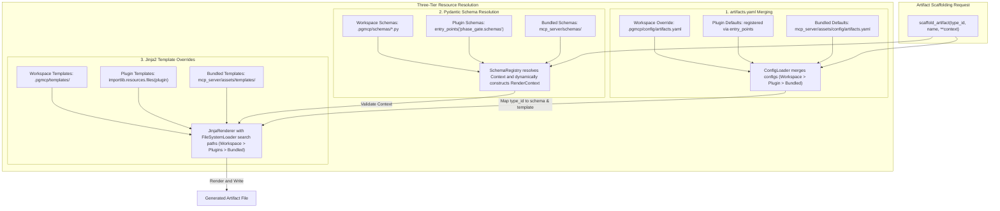

<!-- c:\temp\pgmcp\docs\development\issue349\research.md -->
<!-- template=research version=8b7bb3ab created=2026-07-14T20:39Z updated= -->
# Research: Template Workspace Initiative (workspace-owned templates, schema packs)

**Status:** APPROVED  
**Version:** 1.0  
**Last Updated:** 2026-07-14  

---

## Purpose

Investigate and design a system to decouple Jinja2 templates, Pydantic context schemas, and `artifacts.yaml` definitions from the core server package. This enables:
1. **Workspace-local overrides** of templates, schemas, and configurations.
2. **Schema packs (plugins)** distributed as Python packages and registered via entry points.
3. **Project-local design** of custom templates and schemas, enabling seamless reuse across different projects.

---

## Scope

**In Scope:**
* Jinja2 template fallback loading across multiple roots.
* Config Loader merging for `artifacts.yaml` overrides (Workspace > Plugin > Bundle).
* Dynamic plugin discovery for Pydantic context schemas via `importlib.metadata.entry_points`.
* Dynamic project-local schema loading from `.pgmcp/schemas/*.py`.
* Programmatic/dynamic generation of `RenderContext` schemas from user-facing `Context` schemas.

**Out of Scope:**
* Local HTTP server on `localhost:7890` (deferred stretch goal).
* Template registry versioning migrations/upgrades (deferred from #420).

---

## Problem Statement

Currently, Pydantic context schemas, Jinja2 templates, and `artifacts.yaml` are bundled inside the server wheel. 
Once the server is deployed as a standalone wheel, users cannot modify or customize scaffolding output without altering the Python source code.
Additionally, when working in an agentic orchestration setup, agents have no way to define new project-specific templates in one project and easily share/reuse them in other projects.

---

## Research Goals

1. **Identify Current Behavior**: Map existing paths for template loading, schema registration, and registry config parsing.
2. **Design Resolution Hierarchy**: Design fallback paths for template, schema, and config discovery.
3. **Explore Plugin Mechanisms**: Investigate standard Python entry points for schema pack distribution.
4. **Enable Workspace-Local Prototyping**: Define a mechanism to design templates/schemas project-locally.

---

## Findings & Analysis

### 1. Existing Pipeline Analysis

The current three-part trinity is tightly coupled to the packaged defaults. The table below details the current component resolution paths:

| Component | Packaging/Storage Location | Resolution Code Path | Limitation |
|---|---|---|---|
| **Jinja2 Templates** | `mcp_server/assets/templates/` | `Settings.server.resolved_template_root` (resolves to workspace `.pgmcp/templates/` if init'd) | Hardcodes a single root; copying is required via `--init`. No fallback search. |
| **Context Schemas** | `mcp_server/schemas/contexts/` | Dynamic `getattr` on `mcp_server.schemas` package globals | Cannot resolve schemas outside of the installed `mcp_server` package. |
| **artifacts.yaml** | `mcp_server/assets/config/artifacts.yaml` | `ConfigLoader._resolve_yaml_path("artifacts.yaml")` | Loads either workspace or packaged file. No merging/inheritance. |

### 2. Proposed Architecture

We propose a three-tier resolution hierarchy (Workspace > Plugin > Bundled) for templates, schemas, and configurations.



### 3. Detailed Component Designs

#### A. Template Resolution with Overrides
Using Jinja2's `FileSystemLoader`, we can pass a list of search paths instead of a single path:
```python
FileSystemLoader([
    str(workspace_template_root),
    # ... plugin template roots ...
    str(packaged_template_root)
])
```
Jinja2 automatically searches the directories in order. If a workspace-local template exists, it overrides the packaged default.
* **Inheritance Compatibility**: An overridden template (e.g. `concrete/dto.py.jinja2`) can still inherit from a packaged default base template (e.g. `tier1_base_code.jinja2`) because Jinja2 resolves inheritance chains through the same loader search paths.

#### B. Dynamic Schema Packs (Plugins)
* **Discovery**: Scan `importlib.metadata.entry_points(group="phase_gate.schemas")` at server startup (composition root).
* **Metadata Association**: The plugin registers its Pydantic Context class. To prevent plugin authors from having to write custom registry configuration, the Context class can expose metadata using class attributes:
  ```python
  class DjangoModelContext(BaseContext):
      # Default metadata
      __template_path__: ClassVar[str] = "concrete/django_model.py.jinja2"
      __artifact_type__: ClassVar[str] = "code"
  ```
* **Template Export**: If the plugin contains templates, the server resolves their path using `importlib.resources.files(plugin_module_name) / "templates"`.

#### C. Dynamic Local Workspace Schemas
To support project-local design before packaging a plugin, the server will dynamically compile and load schemas from `.pgmcp/schemas/*.py` at startup using `importlib.util.spec_from_file_location` and `module_from_spec`.

#### D. Dynamic RenderContext Generation
To keep the plugin creation overhead low, plugin authors or workspace developers should only define the user-facing `Context` class. The server will dynamically construct the system-enriched `RenderContext` by combining the `Context` with `LifecycleMixin` via Pydantic model subclassing:
```python
def create_render_context(context_cls: type[BaseContext]) -> type[BaseRenderContext]:
    name = context_cls.__name__.replace("Context", "RenderContext")
    class DynamicRenderContext(BaseRenderContext, context_cls):
        pass
    DynamicRenderContext.__name__ = name
    return DynamicRenderContext
```

---

## Strategy-Sensitive Boundaries & Migration Policy

We analyzed the migration options for each boundary in scope:

| Boundary | Preserve Compatibility (Recommended) | Temporary Bridge | Clean Break |
|---|---|---|---|
| **Existing Workspaces** | **Yes.** Old workspaces with copies of `artifacts.yaml` and `templates/` continue to work. The workspace-local files override the package defaults. | N/A | No. Rejecting old workspace formats would force unnecessary migrations. |
| **`artifacts.yaml` Format** | **Yes.** The schema of `artifacts.yaml` remains identical. Merging is done at the model level key-by-key (workspace entries override default ones). | N/A | No. |
| **Dynamic RenderContext** | **Yes.** Core components (DTO, Worker) continue using their explicitly defined `XxxRenderContext` classes, while external schemas dynamically auto-generate them. | N/A | No. |

---

## Approved Strategy

* **Boundary / consumer scope**: Applies to workspace-local configurations, custom templates, and installed Python schema packs.
* **Selected strategy**: **Preserve Compatibility**. All existing workspace structures remain supported. Overrides and plugins are additive, resolved via the new hierarchy.
* **Rationale**: This approach minimizes disruption for existing users, makes the transition completely transparent, and keeps the codebase backwards-compatible while introducing powerful modular extensions.
* **Constraints for later phases**:
  * **Version Tracking**: Workspace-local templates and schemas must be fully tracked in the version history and hash generation mechanism (`template_registry.json`). Any modification to workspace-local templates/schemas will compute a new version hash to guarantee provenance.
  * Design phase must define the explicit interface contracts for the new `SchemaRegistry`.
  * Dynamic loading of local Python files must run inside a fail-fast loader validation block to ensure syntax/import errors surface immediately at startup.

---

## Expected Results

1. **Tooling fallback**: Scaffolding works out-of-the-box on a clean checkout without running `pgmcp --init` (it falls back to bundled templates).
2. **Workspace overrides**: Placing a modified `concrete/dto.py.jinja2` under `.pgmcp/templates/concrete/` immediately alters `scaffold_artifact(artifact_type="dto")` output.
3. **Workspace schemas**: Placing `my_schema.py` in `.pgmcp/schemas/` and registering it in `.pgmcp/config/artifacts.yaml` makes it immediately scaffoldable.
4. **Plugin discovery**: Installing a package with `phase_gate.schemas` entry points registers new artifact types automatically, including their schemas and templates.

---

## Open Questions

1. **Security**: How should the server handle untrusted code in workspace-local `.pgmcp/schemas/`? (We assume workspaces are trusted by definition since the developer is running the MCP server locally).

---

## References

* **[docs/coding_standards/ARCHITECTURE_PRINCIPLES.md](../../coding_standards/ARCHITECTURE_PRINCIPLES.md)**
* **[docs/development/schema-template-maintenance.md](../schema-template-maintenance.md)**
* **[docs/reference/tools/scaffolding.md](../../reference/tools/scaffolding.md)**

---

## Version History

| Version | Date | Author | Changes |
|---------|------|--------|---------|
| 1.0 | 2026-07-14 | Agent | Detailed research findings, Mermaid architecture diagram, dynamic resolution logic, and Approved Strategy. |
