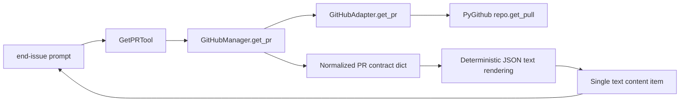

<!-- docs\development\issue354\design.md -->
<!-- template=design version=5827e841 created=2026-05-26T20:03Z updated=2026-05-26 -->
# Issue #354 — Design for get_pr tool with PR body support in end-issue flow

**Status:** DRAFT  
**Version:** 1.0  
**Last Updated:** 2026-05-26

---

## Purpose

Define the chosen design direction, boundaries, and validation obligations for a new `get_pr` read-only tool used by the `end-issue` flow.

## Scope

**In Scope:**
`mcp_server/adapters/github_adapter.py`; `mcp_server/managers/github_manager.py`; `mcp_server/tools/pr_tools.py`; PR tool registration in `mcp_server/server.py`; `.github/prompts/end-issue.prompt.md`; direct unit coverage for adapter, manager, PR tools, server registration, and MCP-visible result shape.

**Out of Scope:**
`merge_pr` behavior changes; `submit_pr` transaction changes; `get_work_context()` semantic changes; widening PR-tool availability without token; generic GitHub resource abstractions; MCP transport redesign; implementation sequencing or TDD slicing.

## Prerequisites

Read these first:
1. [docs/development/issue354/research.md][related-1]
2. [docs/coding_standards/ARCHITECTURE_PRINCIPLES.md][related-2]
3. [docs/coding_standards/DOCUMENTATION_STANDARD.md][related-3]
4. [.github/prompts/end-issue.prompt.md][related-4]
5. [mcp_server/tools/tool_result.py][related-5]

---

## 1. Context & Requirements

### 1.1. Problem Statement

The `end-issue` prompt currently depends on `get_work_context()` for `parent_branch` even though the authoritative branch and handover facts already live on the GitHub pull request resource. The repo has no dedicated `get_pr` tool exposing a stable contract for branch metadata plus PR body, so the prompt currently depends on a phase-state view for data that should come from the host-side PR.

Research fixed the authority boundary, but one design constraint is now explicit: under the current server transport, MCP-visible tool results are text content. The design must therefore preserve an exact PR contract without pretending that native structured MCP JSON survives the current server conversion layer.

### 1.2. Requirements

**Functional:**
- [ ] Expose a read-only `get_pr(pr_number)` tool for a single pull request.
- [ ] Return narrow semantic fields: `pr_number`, `title`, `state`, `base_branch`, `head_branch`, `merged_at`, `merge_sha`, and `body`.
- [ ] Keep `merge_pr(...)` as the authoritative merge proof.
- [ ] Allow `end-issue` to use `get_pr(...)` as the authoritative source for `base_branch` and PR body.
- [ ] Preserve the current `end-issue` use of `get_work_context()` for branch, workflow, and issue fallback context.
- [ ] Expose an exact MCP-visible response shape that planning and implementation can validate deterministically.

**Non-Functional:**
- [ ] Do not expose raw PyGithub objects through the tool contract.
- [ ] Do not change `get_work_context()` semantics.
- [ ] Do not widen PR-tool registration beyond the existing token-gated policy.
- [ ] Do not widen scope into server transport redesign.
- [ ] Keep the design aligned with [docs/coding_standards/ARCHITECTURE_PRINCIPLES.md][related-2] and [docs/coding_standards/DOCUMENTATION_STANDARD.md][related-3].
- [ ] Keep the blast radius bounded to the existing GitHub adapter -> manager -> tool layering plus the prompt consumer.

### 1.3. Constraints

- `merge_pr(...)` remains the only authoritative merge-acceptance signal in this flow.
- `get_work_context()` stays branch-phase context, not host-side PR lookup.
- The MCP-visible `get_pr(...)` contract must be exact under the current text-only server transport.
- `merged_at` and `merge_sha` must stay nullable because closed-unmerged PRs remain a valid state.
- The PR body is operationally relevant for closeout and deferred-work follow-up, so the design must not force a second issue-surface lookup to recover it.

---

## 2. Design Options

### 2.1. Option A — Keep `get_work_context()` For Branch Data And Reuse `get_issue()` For Body

Use `get_work_context()` as the source of `parent_branch` and read body-like context from the issue surface when needed.

**Pros:**
- Minimal code change.
- Reuses existing tools only.
- Lowest short-term surface-area increase.

**Cons:**
- Preserves the wrong authority boundary: `parent_branch` remains phase-state derived instead of PR-derived.
- Splits closeout facts across two different resources even though the PR already carries the durable handover.
- Conflicts with the approved strategy that the PR is the authoritative closeout surface for this workflow.
- Leaves the original blocker in place when branch-local phase state is absent or stale.

### 2.2. Option B — Add `get_pr(...)` But Return Only Human-Oriented Prose

Add a dedicated PR tool but mirror the current `GetIssueTool` pattern and return a markdown or prose summary.

**Pros:**
- Fits the dominant pattern in current GitHub tools.
- Simple to implement and easy for humans to read.
- Keeps the public surface visually consistent with `get_issue`.

**Cons:**
- Weakens the exact response-shape contract the issue explicitly asks for.
- Forces prompt consumers to parse prose instead of consuming a deterministic object-shaped payload.
- Makes strict validation of visible contract shape harder than necessary.

### 2.3. Option C — Add `get_pr(...)` With A Narrow Manager Contract And Deterministic JSON Text Output

Add a dedicated PR-read path in adapter -> manager -> tool, normalize the PR resource into a JSON-safe dict in the manager, and render that contract as a single deterministic JSON text payload at the tool boundary.

**Pros:**
- Matches the approved strategy: additive PR tool, no `get_work_context()` semantic drift, no issue-surface fallback.
- Keeps PyGithub-specific knowledge behind the adapter and manager boundary.
- Preserves the exact semantic response shape the issue asks for.
- Aligns to the current MCP-visible transport reality: text content, not native structured JSON.
- Keeps the blast radius bounded to the files already identified in research.

**Cons:**
- Slightly less visually consistent with the current `GetIssueTool` prose style.
- Requires explicit validation of the visible JSON text contract at tool and server level.
- Means the exact shape is guaranteed as deterministic JSON text rather than as a native structured MCP payload.

### 2.4. Option D — Widen Scope To Preserve Structured JSON End-To-End

Change the server transport or result conversion behavior so JSON items remain structured at the MCP boundary.

**Pros:**
- Would make structured tool contracts first-class across the server.
- Could benefit other tools later.

**Cons:**
- Exceeds the approved scope for issue #354.
- Turns a narrow PR-tool issue into a wider server-transport redesign.
- Would reopen compatibility and validation concerns beyond the PR feature itself.

---

## 3. Chosen Design

**Decision:** Adopt Option C. Add a new read-only `get_pr` path in `GitHubAdapter`, `GitHubManager`, `pr_tools`, and server registration; normalize the PR resource into a small semantic contract including `body`; render that contract as deterministic JSON text at the tool boundary; and update `end-issue` so `get_pr(...)` is the authoritative source for `base_branch` and PR body while `merge_pr(...)` remains the authoritative merge proof.

**Rationale:** This design keeps the contract aligned with the research-approved authority boundary: branch and durable handover facts come from the PR, workflow context comes from `get_work_context()`, and merge acceptance comes from `merge_pr(...)`. It also avoids raw PyGithub leakage, avoids reusing the issue surface for closeout logic, and preserves an exact visible response shape without widening scope into MCP transport redesign.

### 3.1. Public Contract And Visible Result Shape

The supported semantic `get_pr(...)` contract is:

```json
{
  "pr_number": 412,
  "title": "Close issue branch cleanly",
  "state": "closed",
  "base_branch": "epic/320-production-readiness-tracker",
  "head_branch": "feature/354-get-pr-tool",
  "merged_at": "2026-05-26T18:14:00+00:00",
  "merge_sha": "abc123...",
  "body": "Delivered scope...\nDeferred work...\nCloses #354"
}
```

Contract rules:

| Field | Source | Local type | Notes |
|---|---|---|---|
| `pr_number` | `pr.number` | `int` | identity field |
| `title` | `pr.title` | `str` | preserved as PR title |
| `state` | `pr.state` | `str` | preserved as returned by GitHub |
| `base_branch` | `pr.base.ref` | `str` | authoritative checkout target |
| `head_branch` | `pr.head.ref` | `str` | authoritative branch-match check |
| `merged_at` | `pr.merged_at` | `str | null` | normalized to ISO 8601 string or `null` |
| `merge_sha` | `pr.merge_commit_sha` | `str | null` | preserved as nullable |
| `body` | `pr.body` | `str` | normalized to empty string when absent |

Normalization belongs in `GitHubManager`, not in the tool. That keeps the manager responsible for translating raw host objects into a stable business contract and keeps the tool focused on input validation and result rendering.

The MCP-visible tool contract is one JSON text payload, not native structured MCP JSON. Under the current server transport, this is the correct exact contract to design against.

### 3.2. Layering And Responsibility Split



Boundary responsibilities:

- `GitHubAdapter.get_pr(pr_number)` fetches the raw `PullRequest` and maps GitHub exceptions into the existing repo error model.
- `GitHubManager.get_pr(pr_number)` narrows the raw PR object into the supported contract above.
- `GetPRTool.execute(...)` validates input, delegates to the manager, and returns one deterministic JSON text payload for the visible contract.
- `mcp_server/server.py` registers `get_pr` alongside the other PR tools only when a GitHub token is configured.

Rejected boundary placements:

- Normalizing in the adapter would mix external API access with business contract shaping.
- Reading `repo.get_pull(...)` directly inside the tool would violate the existing layering and leak low-level API knowledge into the tool boundary.
- Normalizing in the prompt would make the prompt depend on host-object field names and duplicate parsing logic outside the GitHub stack.
- Redesigning server transport to preserve structured JSON exceeds issue scope.

### 3.3. Tool Result Design Under Current Server Transport

Current server behavior converts `ToolResult` content into MCP text content. JSON content items are serialized to text during that conversion, so a design that depends on native structured JSON surviving the server boundary would be false under current code.

For issue #354, the tool boundary should therefore be:

- internal contract in manager: structured Python dict
- visible contract in tool/server: one deterministic JSON text blob representing that dict

Design implications:

- `GetPRTool` should not rely on `ToolResult.json_data(...)` as the visible contract because the current server conversion would serialize the JSON item to text and also preserve a second text fallback, creating duplicated text outputs.
- The tool should emit one canonical JSON-text representation instead.
- Planning and implementation must treat the visible JSON text shape as part of the supported contract and test it explicitly.

This keeps the contract exact without pretending the transport is richer than it is.

### 3.4. Prompt Consumer Design For `end-issue`

The prompt should keep `get_work_context()` for branch/workflow/issue context, but it should stop treating that result as the authoritative source for the parent branch.

The designed consumer flow is:

| Prompt concern | Source of truth | Reason |
|---|---|---|
| active branch | `get_work_context()` | branch-local workflow context |
| workflow | `get_work_context()` | workflow context, not PR metadata |
| issue fallback | `get_work_context()` | existing prompt behavior remains valid |
| base branch | `get_pr(...)` | host-side PR metadata is authoritative |
| PR body | `get_pr(...)` | durable closeout handover lives on the PR |
| merge acceptance | `merge_pr(...)` | authoritative merge proof remains unchanged |

Design-level prompt consequences:

- `end-issue` should call `get_pr(pr_number=PR_NUMBER)` before cleanup and record `base_branch`, `head_branch`, and `body`.
- The prompt should compare the active branch from `get_work_context()` with `head_branch` from `get_pr(...)` and stop on mismatch rather than risking cleanup against the wrong branch.
- `git_checkout(...)` should use `base_branch` from the PR contract rather than `parent_branch` from phase state.
- Step 5 of the prompt should consume the already captured PR `body` as the durable transfer artifact; it should not switch to `get_issue(...)` for that purpose.
- `merge_pr(...)` remains the only merge-proof step. The prompt must not reinterpret `state="closed"` or non-null `merged_at` as permission to skip merge execution.

This keeps the prompt additive: it consumes one new tool, but it does not redefine the role of `get_work_context()` or `merge_pr(...)`.

### 3.5. Error Model And Compatibility Semantics

`get_pr(...)` should follow the existing GitHub tool error conventions:

- missing PR -> `ExecutionError("Pull request #N not found")` surfaced as `ToolResult.error(...)`
- GitHub API failure -> existing GitHub adapter/system error mapping
- token missing -> no registration in `server.py`, consistent with current PR-tool policy

Compatibility semantics:

- `merged_at = null` and `merge_sha = null` are valid for non-merged PRs.
- `state = "closed"` does not imply merged.
- `body = ""` is valid and should not be treated as an error.
- The visible `get_pr(...)` contract is exact JSON text, not prose.

### 3.6. Validation Strategy And Test Impact

| Layer | Existing precedent | What implementation must prove |
|---|---|---|
| Adapter | `test_github_adapter.py` list/merge PR coverage | `get_pr(...)` success path, 404 path, generic API failure path |
| Manager | `test_github_manager.py` create/list/merge PR coverage | normalization of `base_branch`, `head_branch`, `merged_at`, `merge_sha`, and `body` |
| Tool | `test_pr_tools.py` list/merge coverage | `GetPRTool` returns one deterministic JSON text payload with the expected keys and values |
| Server | `test_server.py` GitHub tool registration checks | `get_pr` is registered with token and not exposed in the no-token branch |
| Transport boundary | current server converts tool results to text content | server-level proof that the visible call result for `get_pr` is one JSON text item rather than duplicated or prose-only output |
| Prompt | current prompt has no automated tests | manual review must confirm `end-issue` uses `get_pr` for `base_branch` and PR body, and stops on branch/PR mismatch |

Existing fixtures are sufficient. The current GitHub manager and PR tool tests already use `MagicMock`-based fixtures, so no helper or fixture redesign is required at design time.

### 3.7. Planning-Relevant Consequences

Planning and implementation must preserve these design obligations:

- the normalized contract above is the supported `get_pr(...)` semantic boundary
- the MCP-visible contract is deterministic JSON text under the current server transport
- `end-issue` must not retain `parent_branch` from `get_work_context()` as a co-equal authority once `get_pr(...)` exists
- branch/PR head mismatch must be treated as a stop condition in the prompt flow
- no implementation step may widen scope into generic GitHub resource browsing, no-token PR reads, or transport redesign

### 3.8. Key Design Decisions

| Decision | Rationale |
|----------|-----------|
| Add a dedicated `get_pr(...)` tool instead of reusing issue reads | PR branch and merge metadata are not issue-surface concerns, and the PR body is the durable closeout artifact for this workflow |
| Normalize the PR object in `GitHubManager` | Keeps the adapter low-level and the tool free of host-object field knowledge |
| Expose one deterministic JSON text payload at the tool boundary | Preserves an exact visible contract while staying honest about current server transport behavior |
| Keep PR tools token-gated in `server.py` | Respects the existing registration boundary and avoids widening scope |
| Normalize `body` to a string | The prompt consumer needs text processing, so empty-body handling should be stable and non-null |
| Keep `merged_at` and `merge_sha` nullable | They express real lifecycle state and must not be fabricated |
| Add a branch/PR mismatch guard in `end-issue` | Prevents merge or cleanup against the wrong branch when the supplied PR number does not match the active branch |
| Keep `merge_pr(...)` as the only merge proof | Preserves the approved workflow contract and avoids inference from passive fields |

---

## 4. Open Questions

None at design scope. Research resolved the only strategy-sensitive boundary by explicitly including `body` in the `get_pr(...)` contract.

## Related Documentation

- [docs/development/issue354/research.md][related-1]
- [docs/coding_standards/ARCHITECTURE_PRINCIPLES.md][related-2]
- [docs/coding_standards/DOCUMENTATION_STANDARD.md][related-3]
- [.github/prompts/end-issue.prompt.md][related-4]
- [mcp_server/tools/tool_result.py][related-5]

<!-- Link definitions -->

[related-1]: docs/development/issue354/research.md
[related-2]: docs/coding_standards/ARCHITECTURE_PRINCIPLES.md
[related-3]: docs/coding_standards/DOCUMENTATION_STANDARD.md
[related-4]: .github/prompts/end-issue.prompt.md
[related-5]: mcp_server/tools/tool_result.py

---

## Version History

| Version | Date | Author | Changes |
|---------|------|--------|---------|
| 1.0 | 2026-05-26 | Agent | Initial design draft with options, chosen contract, prompt integration, and transport-aware validation obligations |
