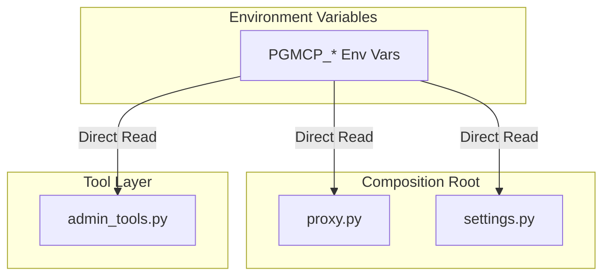

<!-- docs\development\issue386\research.md -->
<!-- template=research version=8b7bb3ab created=2026-07-08T19:31Z updated=2026-07-08T21:46Z -->
# Research on renaming env var prefix MCP to PGMCP

**Status:** APPROVED  
**Version:** 1.1  
**Last Updated:** 2026-07-08

---

## Problem Statement

Environment variables in the server currently use the generic prefix `MCP_` (e.g., `MCP_WORKSPACE_ROOT`, `MCP_SERVER_NAME`). This generic prefix can cause conflicts when multiple MCP servers run on the same machine. A project-specific prefix is required. The chosen prefix is `PGMCP_` — consistent with the CLI command name `pgmcp`.

## Research Goals

*   Identify all usages of `MCP_` environment variables in the codebase and test suite.
*   Define the blast radius and affected production, test, and documentation surfaces.
*   Formulate a compatibility and migration strategy for this breaking change.

---

## 1. Scope & Preservation Goals

The primary goal of this refactor is the complete rename of environment variables without changing their runtime behavior, defaults, or hierarchy.

### Invariants to Preserve:
1.  **Configuration Precedence:** Paths loaded from the YAML configuration file (`settings.yaml` overlay via config path) override defaults, but environment variables have the highest priority.
2.  **Settings Autonomy:** Paths must remain resolved dynamically in `Settings.from_env()`.
3.  **Standalone Proxy Isolation:** `mcp_server/core/proxy.py` derives the logs directory directly from the environment to avoid importing `Settings` and breaking test isolation. This standalone isolation must be preserved.

---

## 2. Codebase Findings & Blast Radius

The environment variables in scope for renaming from `MCP_*` to `PGMCP_*` are:

| Variable | Description |
|----------|-------------|
| `MCP_CONFIG_PATH` | Path to optional YAML configuration overlay |
| `MCP_SERVER_NAME` | Name of the server reported in the handshake |
| `MCP_WORKSPACE_ROOT` | Absolute path to the repository workspace root |
| `MCP_SERVER_PROJECT_DIR` | Directory name for phase-gate data (default: `.pgmcp`) |
| `MCP_LOGS_DIR` | Subdirectory name for server log files (default: `logs`) |
| `MCP_CONFIG_ROOT` | Resolved directory path for YAML workflow/settings config files |
| `MCP_TEMPLATE_ROOT` | Resolved directory path for scaffold templates |

### 2.1. Production Code Usages
*   **[mcp_server/config/settings.py](file:///c:/temp/pgmcp/mcp_server/config/settings.py):**
    *   Loads all 7 variables in `Settings.from_env()`.
*   **[mcp_server/core/proxy.py](file:///c:/temp/pgmcp/mcp_server/core/proxy.py):**
    *   Reads `MCP_WORKSPACE_ROOT`, `MCP_SERVER_PROJECT_DIR`, and `MCP_LOGS_DIR` to determine `_logs_dir` for proxy audit logging.
*   **[mcp_server/tools/admin_tools.py](file:///c:/temp/pgmcp/mcp_server/tools/admin_tools.py):**
    *   Reads `MCP_CONFIG_ROOT` in `verify_server_restarted` to locate the `.restart_marker` file.

### 2.2. Test Code Usages
*   **[tests/conftest.py](file:///c:/temp/pgmcp/tests/conftest.py):**
    *   Sets `MCP_TEMPLATE_ROOT` and `MCP_CONFIG_ROOT` in `pytest_sessionstart`.
*   **[tests/mcp_server/unit/conftest.py](file:///c:/temp/pgmcp/tests/mcp_server/unit/conftest.py):**
    *   Mocks `MCP_SERVER_NAME` as `test-server`.
*   **[tests/mcp_server/unit/config/test_settings.py](file:///c:/temp/pgmcp/tests/mcp_server/unit/config/test_settings.py):**
    *   Mocks `MCP_CONFIG_PATH`, `MCP_SERVER_PROJECT_DIR`, `MCP_LOGS_DIR`, `MCP_SERVER_NAME`, `MCP_WORKSPACE_ROOT`, and `MCP_CONFIG_ROOT` via `monkeypatch`.
*   **[tests/mcp_server/unit/test_c260_c2_state_root_injection.py](file:///c:/temp/pgmcp/tests/mcp_server/unit/test_c260_c2_state_root_injection.py):**
    *   Mocks `MCP_WORKSPACE_ROOT` and `MCP_CONFIG_ROOT` via `monkeypatch` to verify root directory injection logic.
*   **[tests/mcp_server/integration/mcp_server/conftest.py](file:///c:/temp/pgmcp/tests/mcp_server/integration/mcp_server/conftest.py):**
    *   Mentions `MCP_SERVER_NAME` in comments and docstrings regarding test isolation.
*   **[tests/mcp_server/unit/config/test_c_settings_structural.py](file:///c:/temp/pgmcp/tests/mcp_server/unit/config/test_c_settings_structural.py):**
    *   Will be updated with assertions verifying that no `MCP_*` prefixes are left in the source code of `settings.py`.

### 2.3. Active Documentation Usages
The following active documentation surfaces must be updated:
1.  [README.md](file:///c:/temp/pgmcp/README.md) - Main repository readme.
2.  [docs/reference/server-configuration.md](file:///c:/temp/pgmcp/docs/reference/server-configuration.md) - Server configurations guide.
3.  [docs/reference/config-loading-architecture.md](file:///c:/temp/pgmcp/docs/reference/config-loading-architecture.md) - Configuration loading details.
4.  [docs/reference/tools/README.md](file:///c:/temp/pgmcp/docs/reference/tools/README.md) - Tools manual index page.
5.  [docs/manuals/architecture.md](file:///c:/temp/pgmcp/docs/manuals/architecture.md) - Architecture manual.
6.  [docs/setup/dev-isolation.md](file:///c:/temp/pgmcp/docs/setup/dev-isolation.md) - Developer isolation diagram/guide.
7.  [docs/setup/README.md](file:///c:/temp/pgmcp/docs/setup/README.md) - Getting started machine setup guide.

### 2.4. Agent & Server Configuration Usages
User-facing and editor configuration templates must be updated:
*   [docs/agents/antigravity/mcp_config.json](file:///c:/temp/pgmcp/docs/agents/antigravity/mcp_config.json)
*   [docs/agents/vscode/copilot/mcp.json](file:///c:/temp/pgmcp/docs/agents/vscode/copilot/mcp.json)
*   [docs/setup/mcp.json](file:///c:/temp/pgmcp/docs/setup/mcp.json)

---

## 3. Architectural Tensions & Candidate Seams

### Architectural Tensions:
*   **Duplicate Parsing logic:** Since `proxy.py` cannot import `Settings` (to prevent test session isolation contamination), it duplicates the extraction of three workspace-related path variables. Any rename must touch both.
*   **Direct lookup in Tools:** `admin_tools.py` bypasses `Settings` to read `MCP_CONFIG_ROOT` directly from environment variables. Under clean architecture, the resolved directory path should be injected or requested via settings, but since the tool is designed to work in a standalone manner during restarts, the direct read is preserved.

### Candidate Seams:
1.  **Seam 1 (Settings & Tests):** Update `settings.py` and `test_settings.py` first to use and test `PGMCP_*`.
2.  **Seam 2 (Infrastructure & Tools):** Update `proxy.py` and `admin_tools.py`.
3.  **Seam 3 (Docs & Configurations):** Update markdown documentation and `mcp.json` templates.

---

## 4. Approved Strategy

*   **Selected Strategy:** **Clean break**.
*   **Rationale:** Supporting both `MCP_*` and `PGMCP_*` simultaneously would defeat the purpose of preventing namespace pollution (multiple MCP servers on the same host would still conflict if they use the legacy prefix). A direct, complete rename is cleaner and safer.
*   **Constraints:**
    *   No legacy `MCP_*` fallback logic will be written in production code.
    *   Users must be provided with a clear migration notice in the documentation.

---

## Expected Results

1.  All occurrences of `MCP_*` environment variables in production and test codes are renamed to `PGMCP_*`.
2.  The test suite is 100% green.
3.  Quality gates pass.
4.  A structural unit test ensures that no legacy `MCP_*` prefix remains in the source code of `settings.py`.

---

## Version History

| Version | Date | Author | Changes |
|---------|------|--------|---------|
| 1.0 | 2026-07-08 | Agent | Initial research and approved clean break strategy |
| 1.1 | 2026-07-08 | Agent | Expanded scope to include test files and setup/mcp.json based on QA feedback |
