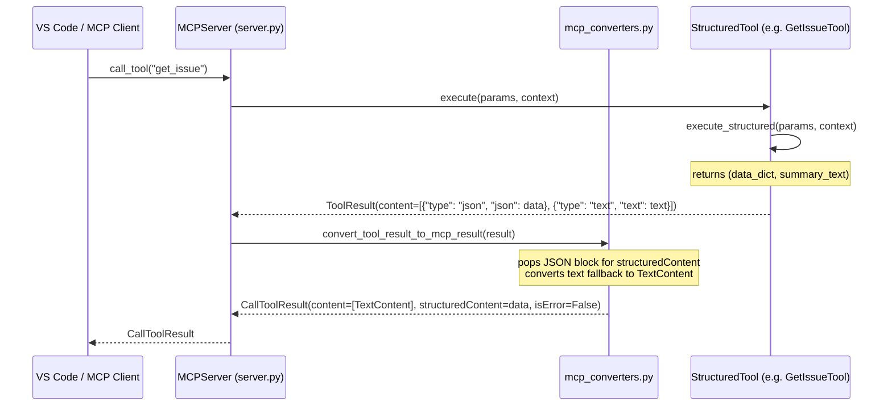

<!-- docs/development/issue390/design.md -->
<!-- template=design version=5827e841 created=2026-06-11T06:16:40Z updated=2026-06-11T08:24Z -->
# Design — Issue #390: Improve validation logic of save/update deliverables tools

**Status:** APPROVED  
**Version:** 1.1  
**Last Updated:** 2026-06-11

---

## Purpose

Design strict input validation and clean structured JSON output transport.

## Scope

**In Scope:**
* Introduction of the `StructuredTool` base class to unify JSON-producing tools.
* Separation of MCP result conversion logic to a new utility module `mcp_converters.py` to preserve SRP.
* Definition of strict Pydantic schemas for deliverables input validation (replacing the confusing `tdd_cycles` terminology with generic `cycles`).
* Updating `ProjectManager` to use constructor-injected `contracts_config` for conditional cycle checks.
* Centralizing structured tool assertions in `tests/mcp_server/test_support.py` to ensure DRY test code.
* Detailing a migration strategy and guide for developers working on other branches.

**Out of Scope:**
* Broad product redesigns of non-JSON tools.
* Implementation details of unrelated tools.

---

## 1. Context & Requirements

### 1.1. Problem Statement

The save/update deliverables tools accept dict[str, Any] at the boundary without verifying deep properties, leading to unhandled runtime exceptions. Additionally, ProjectManager hardcodes cycle planning requirements for non-cycle-based workflows, and client-side output truncation occurs due to double-serialization fallbacks.

### 1.2. Requirements

**Functional:**
* **REQ-1**: Strictly validate save and update deliverables parameters at tool boundary via declarative Pydantic schemas.
* **REQ-2**: Only enforce cycles configuration if the active workflow phase contains cycle-based phases in `contracts.yaml`.
* **REQ-3**: Return JSON data cleanly using MCP `structuredContent` to resolve client-side truncation and double-serialization.
* **REQ-4**: Provide a manual migration guide for developers working on older branches.

**Non-Functional:**
* **NREQ-1**: Strictly adhere to `ARCHITECTURE_PRINCIPLES.md` (specifically SRP, DIP, Config-First, Law of Demeter).
* **NREQ-2**: Maintain test coverage above 90% and pass all quality gates (mypy/pylint 10.0).
* **NREQ-3**: Eliminate duplicate JSON strings in client transport.

### 1.3. Constraints

* **DIP (§11)**: Constructor injection only, no import-time loading or raw config file reading.
* **Config-First (§3)**: Conditionally require cycles structure by dynamically reading workflow config from `ContractsConfig`.
* **SRP (§1.1)**: Extract MCP response serialization from `server.py` to a dedicated converter utility.
* **Law of Demeter (§7)**: Tools only interact with top-level managers, never internal details.

---

## 2. Design Options

### 2.1. Deliverables Input Validation

* **Option A: Full Pydantic validation on the tool boundary (Chosen)**
  * *Pros:* Fail-fast, clean JSON Schema discovery, unified model definitions.
  * *Cons:* Requires writing and maintaining Pydantic models for deliverables.
* **Option B: Manual dictionary-based parsing**
  * *Pros:* Simple, no new models.
  * *Cons:* Brittle, duplicates validation logic, bypasses automatic MCP JSON Schema generation.

### 2.2. JSON Output Transport & Conversion

* **Option A: Keep conversion in `server.py`**
  * *Pros:* Keeps all server logic in one place.
  * *Cons:* Violates SRP. `server.py` is already 400 lines and is a candidate for a God Class.
* **Option B: Extract conversion to `mcp_converters.py` (Chosen)**
  * *Pros:* Strictly adheres to SRP. Simplifies unit testing of conversion logic.
  * *Cons:* Requires creating a new utility file.

---

## 3. Chosen Design

### 3.1. Base Class `StructuredTool`

An abstract base class `StructuredTool` will be added in `mcp_server/tools/base.py`:

```python
class StructuredTool(BaseTool, ABC):
    """Abstract base class for all tools that return structured JSON data."""

    @abstractmethod
    async def execute_structured(
        self, params: Any, context: NoteContext
    ) -> tuple[dict[str, Any], str]:
        """Execute the tool and return (data_dict, summary_text)."""

    async def execute(self, params: Any, context: NoteContext) -> ToolResult:
        data, text = await self.execute_structured(params, context)
        return ToolResult.json_data(data, text=text)
```

This guarantees that all JSON-returning tools implement a uniform interface (`execute_structured`) returning both raw structured data and an optional text fallback.

### 3.2. Response Conversion and `mcp_converters.py`

To prevent `server.py` from growing, all tool-to-content conversion is moved to `mcp_server/utils/mcp_converters.py`.

The flow of execution from a structured tool through the converter into the final `CallToolResult` is illustrated below:



### 3.3. Pydantic Deliverables Models (Removing "TDD" Prefix)

A new module `mcp_server/schemas/deliverables.py` will define clean schemas. In compliance with CQS (§5), these boundary value objects are configured as frozen:

* `CycleModel`: Models a single cycle (cycle_number, exit_criteria, deliverables). Configured with `ConfigDict(frozen=True, extra="forbid")`.
* `PhaseCyclesModel`: Models the collection of cycles (total, cycles). Configured with `ConfigDict(frozen=True, extra="forbid")`.
* `CyclePlanningModel`: Main model representing planning deliverables (cycles, design, validation, documentation). Configured with `ConfigDict(frozen=True, extra="forbid")`.
* `UpdatePlanningModel`: Model representing permissive partial updates for merging. Configured with `ConfigDict(frozen=True, extra="forbid")`.

No aliases will be used on the boundary; the schema property is strictly `cycles` instead of `tdd_cycles`.

### 3.4. Conditional Validation in `ProjectManager`

`ProjectManager` will check if the active workflow requires cycles by inspecting the injected `ContractsConfig`:

```python
workflow_entry = self._contracts_config.workflows.get(workflow_name)
is_cycle_based = False
if workflow_entry:
    is_cycle_based = any(phase.cycle_based for phase in workflow_entry.phases)
```

If `is_cycle_based` is False, the `cycles` key is not required in `CyclePlanningModel` when saving deliverables.

### 3.5. DRY test support helper

We define `assert_structured_result` in `tests/mcp_server/test_support.py` to unify assertions for all structured tools under test:

```python
def assert_structured_result(result: ToolResult, expected_data: dict[str, Any] | None = None) -> None:
    # Locates type="json" and type="text" items, asserts presence and correctness...
```

---

## 4. Key Design Decisions & Architectural Principles

| Decision | Rationale | Principle Reference |
|----------|-----------|---------------------|
| Central `StructuredTool` base | Uniformity, eliminates duplication. | SRP (§1.1), DRY (§2) |
| Extracting converters to utils | Avoids making `server.py` a God Class. | SRP (§1.1) |
| Constructor injection of config | `ProjectManager` receives `ContractsConfig` at startup. | DIP (§11), §12 (no imports) |
| Reading `cycle_based` from config | No hardcoded workflow or phase names. | Config-First (§3) |
| Renaming `tdd_cycles` to `cycles` | Clarifies that cycles are phase-agnostic. | DRY / Domain Modeling (§10) |
| Frozen deliverables schemas | Prevents unexpected boundary value mutations. | CQS (§5) |

---

## 5. Blast Radius & Regression Plan

### 5.1. File Renaming Impact
* **Scaffolding Templates & Context Schemas**:
  * `mcp_server/scaffolding/templates/concrete/planning.md.jinja2`
  * `mcp_server/schemas/contexts/planning.py`
  * `mcp_server/schemas/render_contexts/planning.py`
  * These files will be updated to use the `cycles` variable and keys instead of `tdd_cycles`.
* **Core Code Modules**:
  * `mcp_server/managers/project_manager.py`
  * `mcp_server/managers/phase_state_engine.py`
  * `mcp_server/managers/phase_contract_resolver.py`
* **Test suites**: All unit/integration tests (ca. 88 occurrences) that construct or assert on deliverables JSON payloads will be updated to use `"cycles"` instead of `"tdd_cycles"`.
  * Key affected test modules:
    * `tests/mcp_server/unit/tools/test_project_tools.py` (Validates Save/Update planning tools execution)
    * `tests/mcp_server/unit/managers/test_project_manager.py` (Validates deliverables schema validation & merging)
    * `tests/mcp_server/unit/managers/test_phase_state_engine.py` (Validates cycle state transitions)
    * `tests/mcp_server/integration/test_workflow_cycle_e2e.py` (Validates end-to-end cycle workflow integration)
    * `tests/mcp_server/integration/test_document_templates.py` (Validates Jinja2 template rendering output)
    * `tests/mcp_server/unit/tools/test_scaffold_artifact.py` (Validates artifact scaffolding structured JSON output)
### 5.2. Migration Document
A manual migration guide will be created at `docs/development/issue390/migration.md` to instruct developers on how to migrate existing `deliverables.json` files in their active branches.

---

## 6. Version History

| Version | Date | Author | Changes |
|---------|------|--------|---------|
| 1.0 | 2026-06-11 | Agent | Initial draft containing structuredTool, SRP conversion, and cycles renaming decisions. |
| 1.1 | 2026-06-11 | Agent | Resolved QA review findings: added templates to blast radius, specified frozen schemas, listed affected test modules, and added Mermaid diagram. |
| 1.2 | 2026-06-11 | Agent | Backwards check: explicitly added ScaffoldArtifactTool to the JSON-producing tools scope, blast radius, and test modules. |
