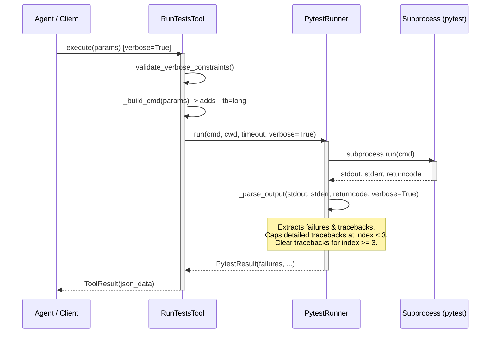
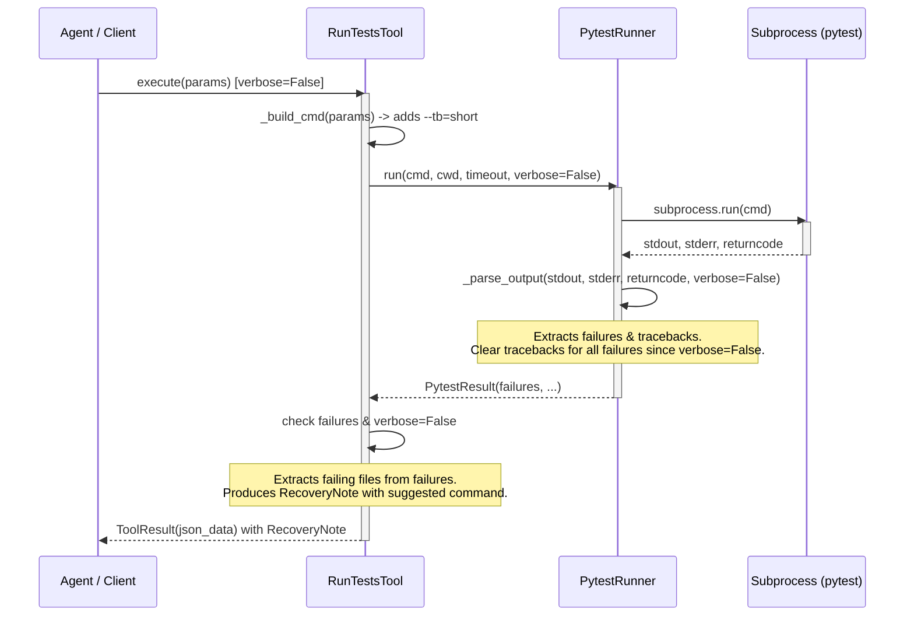

<!-- c:\temp\pgmcp\docs\development\issue397\design.md -->
<!-- template=design version=5827e841 created=2026-06-11T14:31Z updated=2026-06-11T16:40Z -->
# Add verbose traceback and stdout capture to run_tests tool

**Status:** PRELIMINARY  
**Version:** 1.0.0  
**Last Updated:** 2026-06-11

---

## Purpose

To specify the pre-implementation design decisions for adding verbose traceback and stdout capture to the run_tests tool.

## Scope

**In Scope:**
RunTestsInput, RunTestsTool, PytestRunner, RunQualityGatesTool dead code cleanup, related unit tests.

**Out of Scope:**
Changing settings structure, modifying third-party test execution engines.

## Prerequisites

Read these first:
1. docs/coding_standards/ARCHITECTURE_PRINCIPLES.md
2. docs/coding_standards/DOCUMENTATION_STANDARD.md
---

## 1. Context & Requirements

### 1.1. Problem Statement

The run_tests tool executes tests but lacks support for detailed tracebacks and captured stdout/stderr, which hampers developer experience and forces agents to run tests manually in the terminal.

### 1.2. Requirements

**Functional:**
- [ ] Support verbose parameter in RunTestsInput (Pydantic model) and propagate it to IPytestRunner.
- [ ] Raise a validation error if verbose is True and scope is not path-based with specific files (i.e. scope='full' is rejected, and path with directories is rejected).
- [ ] Limit detailed tracebacks and stdout/stderr capture to a maximum of 3 failed tests using a Python constant (MAX_FAILURES_DETAILED = 3).
- [ ] When verbose is False, keep failure tracebacks empty in the JSON payload, and produce a conditional RecoveryNote listing specific failing files.
- [ ] Remove the unused _render_text_output method from mcp_server/tools/quality_tools.py.

**Non-Functional:**
- [ ] Preserve existing IPytestRunner public interface signatures to maintain backward compatibility.
- [ ] Limit total response size to avoid context/token window explosion.

### 1.3. Constraints

- Must maintain backward compatibility with existing IPytestRunner invocations.
- Must keep the response payload size small to prevent token/context window explosion.
---

## 2. Design Options

| Option | Description | Pros | Cons |
|--------|-------------|------|------|
| **Option A:** Verbose allowed on any scope, no traceback limit | Allow `verbose=True` for any test execution scope (including full test suite runs) and return all tracebacks without limit. | Simple implementation with fewer validation rules. | Extremely high risk of context payload size explosion during large test suite failures. Violates resources guardrails. |
| **Option B (Preferred):** Verbose allowed on specific test files, capped at 3 failures | Only allow `verbose=True` in path-based execution mode targeting specific files. Limit detailed tracebacks to 3 failures. Empty tracebacks in JSON with a RecoveryNote when `verbose=False`. | Strong protection against response payload and token size explosion. Guarantees a highly targeted DX by directing agents to run specifically failing files. | Slightly more complex validation rules in `RunTestsInput`. |

---

## 3. Chosen Design

**Decision:** Introduce `verbose: bool = False` in `RunTestsInput` with strict path-based validation. Limit detailed tracebacks to 3 failures, and keep tracebacks empty with a RecoveryNote when `verbose=False`. Remove the dead `_render_text_output` method from `quality_tools.py`.

**Rationale:** This design ensures backward compatibility, provides agents with targeted tracebacks when needed, prevents context explosion by capping detailed tracebacks and restricting verbose mode to file paths, and cleans up legacy code.

### 3.1. Key Design Decisions

| Decision | Rationale |
|----------|-----------|
| Restrict `verbose=True` to path-based mode targeting specific files. | Protects the agent's context window from being flooded by tracebacks from a large number of tests. |
| Cap verbose traceback inclusion at `MAX_FAILURES_DETAILED = 3`. | Three detailed tracebacks provide sufficient variety to debug correlated issues without bloating the response payload. |
| Remove `_render_text_output` from `quality_tools.py`. | This method is completely unused and represents dead code that should be cleaned up. |

### 3.2. Execution Flow

The following sequence diagram outlines how the `verbose` flag is propagated and processed when enabled (`verbose=True`):



When verbose is disabled (`verbose=False`):



### 3.3. Illustrative Schema

```python
class RunTestsInput(BaseModel):
    model_config = ConfigDict(extra="forbid")

    path: str | None = Field(
        default=None,
        description=(
            "Path to test file or directory. "
            "Multiple paths can be space-separated, e.g. 'tests/unit tests/integration'."
        ),
    )
    scope: Literal["full"] | None = Field(
        default=None,
        description="Set to 'full' to run the entire test suite. Mutually exclusive with path.",
    )
    markers: str | None = Field(default=None, description="Pytest markers to filter by")
    timeout: int = Field(default=300, description="Timeout in seconds (default: 300)")
    last_failed_only: bool = Field(
        default=False,
        description="Re-run only previously failed tests (pytest --lf)",
    )
    coverage: bool = Field(
        default=False,
        description="Enable branch coverage and enforce the 90% threshold.",
    )
    verbose: bool = Field(
        default=False,
        description=(
            "Enable verbose mode to capture complete tracebacks and stdout/stderr output "
            "from failed tests. Only permitted in path-based execution mode targeting "
            "specific test files (directories or the full suite run are not supported)."
        ),
    )
```

---

## 4. Affected Interfaces And Call Sites

| Component/File | Interface/Class/Method | Expected Changes |
|----------------|------------------------|------------------|
| [`mcp_server/core/interfaces/__init__.py`](file:///c:/temp/pgmcp/mcp_server/core/interfaces/__init__.py) | `IPytestRunner.run` | Update signature to: `def run(self, cmd: list[str], cwd: str, timeout: int, *, verbose: bool = False) -> PytestResult:`. Keyword-only argument preserves backward compatibility. |
| [`mcp_server/tools/test_tools.py`](file:///c:/temp/pgmcp/mcp_server/tools/test_tools.py) | `RunTestsInput` | Add `verbose: bool = False` property with explicit description. Add model validator `validate_verbose_constraints` to reject verbose mode unless in path mode targeting files. |
| [`mcp_server/tools/test_tools.py`](file:///c:/temp/pgmcp/mcp_server/tools/test_tools.py) | `RunTestsTool` | Propagate `verbose` flag from params to `runner.run()`. Generate conditional `RecoveryNote` when `verbose=False` and tests fail. |
| [`mcp_server/managers/pytest_runner.py`](file:///c:/temp/pgmcp/mcp_server/managers/pytest_runner.py) | `PytestRunner.run` & `_parse_output` | Update `run` to accept `verbose` and pass it to `_parse_output`. |
| [`mcp_server/managers/pytest_runner.py`](file:///c:/temp/pgmcp/mcp_server/managers/pytest_runner.py) | `PytestRunner._parse_failures` | Accept `verbose` parameter. Limit tracebacks to `MAX_FAILURES_DETAILED = 3` if `verbose` is True; clear tracebacks if `verbose` is False. |
| [`mcp_server/tools/quality_tools.py`](file:///c:/temp/pgmcp/mcp_server/tools/quality_tools.py) | `RunQualityGatesTool` | Delete unused `_render_text_output` static method. |
| [`tests/mcp_server/fixtures/fake_pytest_runner.py`](file:///c:/temp/pgmcp/tests/mcp_server/fixtures/fake_pytest_runner.py) | `FakePytestRunner` | Update signature of `run` method to match the protocol. |

---

## 5. Test Blast Radius

| Test File | Target Code | Expected Test Coverage |
|-----------|-------------|------------------------|
| [`tests/mcp_server/unit/tools/test_test_tools.py`](file:///c:/temp/pgmcp/tests/mcp_server/unit/tools/test_test_tools.py) | `RunTestsInput` & `RunTestsTool` | - Validate that `verbose=True` raises ValueError if `path` is None or contains directories.<br/>- Verify that `verbose=True` builds pytest command with `--tb=long`.<br/>- Verify that `verbose=False` builds command with `--tb=short`.<br/>- Verify that `verbose=False` on failure produces a `RecoveryNote` suggesting the failing file(s). |
| [`tests/mcp_server/unit/managers/test_pytest_runner.py`](file:///c:/temp/pgmcp/tests/mcp_server/unit/managers/test_pytest_runner.py) | `PytestRunner` | - Verify that `verbose=True` and failure results populate tracebacks for up to 3 failures, and leave subsequent tracebacks empty.<br/>- Verify that `verbose=False` leaves all tracebacks empty. |
| [`tests/mcp_server/unit/tools/test_quality_tools.py`](file:///c:/temp/pgmcp/tests/mcp_server/unit/tools/test_quality_tools.py) | `RunQualityGatesTool` | Verify that the tool continues to pass quality gates and execute correctly after removal of `_render_text_output`. |

---

## 6. Design-Level Validation Strategy

| Requirement | Verification Method | Expected Outcome |
|-------------|---------------------|------------------|
| Functional Req 1 (verbose parameter support) | Unit tests in `test_test_tools.py` | Calling `run_tests` with `verbose=True` propagates the flag and runs pytest with `--tb=long`. |
| Functional Req 2 (verbose validation constraints) | Unit tests in `test_test_tools.py` | Passing `verbose=True` when `path` is None (full suite) or contains a directory raises `ValueError` in Pydantic validation. |
| Functional Req 3 (traceback limit cap of 3) | Unit tests in `test_pytest_runner.py` | Running in verbose mode with 4 failures returns tracebacks for the first 3 failures, and `""` for the 4th failure. |
| Functional Req 4 (verbose=False behavior & RecoveryNote) | Unit tests in `test_test_tools.py` | Running with `verbose=False` on failures returns empty tracebacks in the JSON payload, and context contains a `RecoveryNote` with the suggested rerun path command. |
| Functional Req 5 (quality_tools cleanup) | Unit tests in `test_quality_tools.py` & quality gates | Quality gates run cleanly, and unit tests verify the tool result contains the correct summary line. |
| Non-Functional Req 1 (backward compatibility) | Suite-wide tests run | Existing tests and invocations of `run_tests` continue to pass without modification. |

---

## Related Documentation
- **[docs/development/issue397/research.md][related-1]**

<!-- Link definitions -->

[related-1]: docs/development/issue397/research.md

---

## Version History

| Version | Date | Author | Changes |
|---------|------|--------|---------|
| 1.0.0 | 2026-06-11 | Agent | Initial draft |
