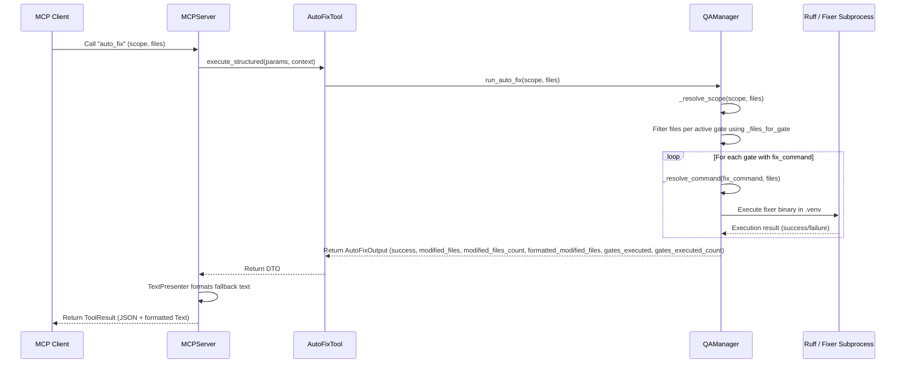

<!-- c:\temp\pgmcp\docs\development\issue402\auto_fix_design.md -->
<!-- template=design version=5827e841 created=2026-06-13T06:34Z updated= -->
# Design — Auto-Fix Tool

**Status:** DRAFT  
**Version:** 1.0  
**Last Updated:** 2026-06-13

---

## Purpose

Establish the architectural and data-flow design for the tool-agnostic auto-fix (or lint-fix) MCP tool, ensuring compliance with CQS, SRP, and explicit-over-implicit principles.

## Scope

**In Scope:**
Design of the auto_fix MCP tool, extending quality.yaml configuration with fix_command lists, and reusing QAManager's file and command execution logic.

**Out of Scope:**
Changing the core check behavior of existing quality gates or modifying the client-side execution environment.

## Prerequisites

Read these first:
1. Approved Research Document under Issue #402
2. docs/coding_standards/ARCHITECTURE_PRINCIPLES.md
---

## 1. Context & Requirements

### 1.1. Problem Statement

To automate code linting and formatting fixes, we need a tool-agnostic auto_fix MCP tool. The design must allow executing different fixer binaries (e.g. ruff, mypy-stubgen, etc.) configured in quality.yaml without violating CQS, SRP, or hardcoding checker/fixer logic in python code.

### 1.2. Requirements

**Functional:**
- [ ] Provide a new MCP tool named auto_fix (or lint_fix)
- [ ] Read explicit fix_command config from quality.yaml for each quality gate
- [ ] Delegate execution to QAManager.run_auto_fix()
- [ ] Support file scope filtering and venv-aware command execution
- [ ] Return structured output containing success status and list of modified files

**Non-Functional:**
- [ ] Prevent import-time configuration/side-effects
- [ ] Reuse QAManager's internal scope and file-filtering logic (DRY)
- [ ] Ensure the schema is validated at startup

### 1.3. Constraints

- Must conform to Command-Query Separation (CQS) by having a separate auto_fix tool rather than extending run_quality_gates
- Must conform to Explicit over Implicit by requiring explicit fix_command definitions in quality.yaml
---

## 2. Design Options

### 2.1. Option A: Option A: Implicit command derivation (regex flag replacement)

Derive the fix commands dynamically in Python by parsing and stripping checker-specific check/diff flags (like replacing '--check' or '--diff' with '--fix' or nothing).

**Pros:**
- ✅ Does not require adding new fields to quality.yaml

**Cons:**
- ❌ Violates 'Explicit over Implicit' principle
- ❌ Fragile and error-prone as flags vary widely across different linters and tools (ruff, pylint, black, etc.)

### 2.2. Option B: Option B: Explicit config-driven fix commands (Recommended)

Add an explicit, optional 'fix_command' string array to each quality gate configuration in quality.yaml, and run it directly if provided.

**Pros:**
- ✅ Highly explicit, clear, and robust
- ✅ Agnostic of underlying tool; fits any checker/fixer command
- ✅ No complex regex logic or implicit assumptions in python code

**Cons:**
- ❌ Requires extending quality.yaml schema and config model
---

## 3. Chosen Design

**Decision:** Option B: Explicit config-driven fix commands.

**Rationale:** Option B aligns perfectly with the 'Explicit over Implicit' prime directive, avoiding fragile string-manipulation hacks and ensuring that any tool's auto-fix behavior can be configured cleanly in quality.yaml.

### 3.1. Key Design Decisions

| Decision | Rationale |
|----------|-----------|
| Add `fix_command` field to `ExecutionConfig` | Allows declaring the exact fixer command-line array in quality.yaml, avoiding implicit derivation from the check command. |
| Startup Configuration Validation Check | Raises `ConfigError` at startup if any quality gate has `supports_autofix: true` but lacks a non-empty `fix_command` array, enforcing fail-fast and combination validation rules. |
| Separate `auto_fix` MCP tool | Keeps checking (queries) and fixing (mutations) strictly separated, adhering to CQS (Command-Query Separation). |
| Reuse `QAManager` internal methods | Leverages existing file filtering, scope resolution, and virtualenv command execution to ensure maximum code reuse and DRY. |
| Pre-computed formatting fields in `AutoFixOutput` | Exposes counts and a pre-formatted string of modified files inside the output DTO, keeping the presenter layer strictly declarative and preventing custom formatting function code smells. |

### 3.2. Architecture & Data Flow



### 3.3. DTO Schema & Interface Contracts

We will define the input and output DTOs in `mcp_server/schemas/tool_outputs.py` (or `mcp_server/schemas/contexts/` for input):

```python
class AutoFixInput(BaseModel):
    model_config = ConfigDict(extra="forbid")

    scope: str = Field(
        default="auto",
        description="Scope of files to fix ('auto', 'branch', 'project', 'files')",
    )
    files: list[str] | None = Field(
        default=None,
        description="Explicit list of files to fix (only valid when scope='files')",
    )

class AutoFixOutput(BaseToolOutput):
    success: bool = Field(description="Overall success status of the auto-fix run")
    modified_files: list[str] = Field(
        description="List of files that were modified/fixed by the tool"
    )
    modified_files_count: int = Field(
        description="Pre-computed count of modified files for declarative templates"
    )
    formatted_modified_files: str = Field(
        description="Pre-formatted bullet list of modified files for declarative templates"
    )
    gates_executed: list[str] = Field(
        description="List of quality gates that were executed for autofixing"
    )
    gates_executed_count: int = Field(
        description="Pre-computed count of executed gates for declarative templates"
    )
    error_message: str | None = Field(
        default=None,
        description="Error message if the execution failed"
    )
```

### 3.4. Configuration Extension

We will extend the `ExecutionConfig` in `quality.yaml` to include the optional `fix_command` list:

```yaml
# .phase-gate/config/quality.yaml
gates:
  gate0_ruff_format:
    name: "Ruff Format"
    priority: 0
    glob_patterns: ["*.py"]
    check_command: ["ruff", "format", "--check"]
    fix_command: ["ruff", "format"]
    supports_autofix: true

  gate1_formatting:
    name: "Ruff Lint"
    priority: 1
    glob_patterns: ["*.py"]
    check_command: ["ruff", "check"]
    fix_command: ["ruff", "check", "--fix"]
    supports_autofix: true
```

We will also define the declarative presentation template in `presentation.yaml`:

```yaml
# mcp_server/config/presentation.yaml
tools:
  auto_fix:
    template_success: |
      **Auto-Fix Run Completed Successfully**
      - Gates executed: {gates_executed_count} ({gates_executed})
      - Files modified: {modified_files_count}
      {formatted_modified_files}
    template_failure: |
      **Auto-Fix Run Failed**
      - Error: {error_message}
      - Gates executed: {gates_executed_count} ({gates_executed})
      - Files modified: {modified_files_count}
```

### 3.5. Internal Code Reuse & QAManager Integration

The `QAManager` will implement `run_auto_fix` by:
1. Retrieving all configured quality gates from the config layer.
2. Filtering gates where `supports_autofix` is True (validated at startup to ensure `fix_command` is non-empty).
3. Resolving the target files based on the requested `scope` using `_resolve_scope(scope, files)`.
4. For each gate, filtering the target files using `_files_for_gate(gate, resolved_files)` to check if they match `glob_patterns`.
5. Resolving the full execution command using `_resolve_command(gate.fix_command, filtered_files)`.
6. Executing the resolved command in the correct virtual environment using subprocess.
7. Detecting any modified/dirty files in git or via file status to populate the `modified_files` list, pre-computing counts and formatted fields.

---
## 4. Open Questions

| Question | Options | Status |
|----------|---------|--------|
| Should the auto_fix tool accept a dry-run flag to preview changes as a diff before applying? (Deferred to future YAGNI decision) |  |  |
## Related Documentation
- **[docs/development/issue402/research.md][related-1]**
- **[docs/development/issue402/design.md][related-2]**

<!-- Link definitions -->

[related-1]: docs/development/issue402/research.md
[related-2]: docs/development/issue402/design.md

---

## Version History

| Version | Date | Author | Changes |
|---------|------|--------|---------|
| 1.0 | 2026-06-13 | Agent | Initial draft |