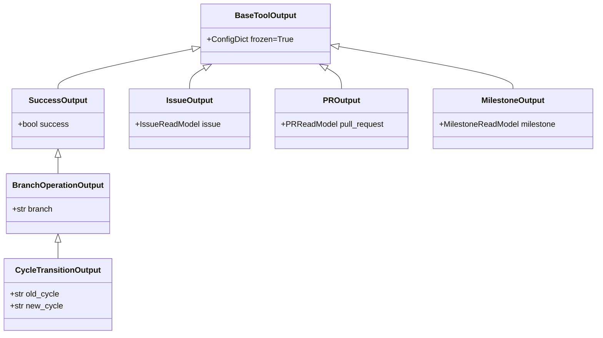
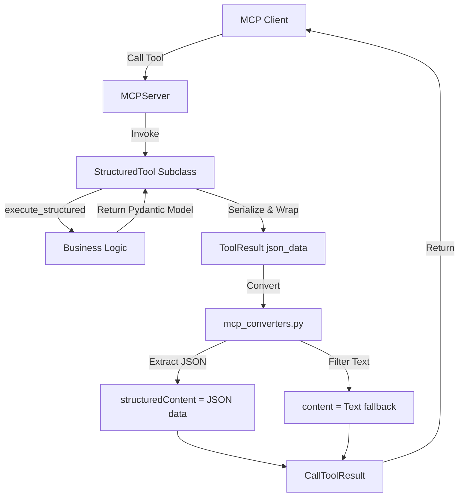

<!-- c:\temp\pgmcp\docs\development\issue402\design.md -->
<!-- template=design version=5827e841 created=2026-06-12T12:57Z updated= -->
# Design — Issue #402: Expose JSON data in MCP tools

**Status:** DRAFT  
**Version:** 1.0  
**Last Updated:** 2026-06-12

---

## Purpose

Establish the architectural and data-flow design for exposing structured JSON data in MCP tools.

## Scope

**In Scope:**
All tools in mcp_server/tools/ except admin/health tools.

**Out of Scope:**
Protocol changes outside MCP, client-side UI rendering implementations.

## Prerequisites

Read these first:
1. Approved Research Document under Issue #402.
---

## 1. Context & Requirements

### 1.1. Problem Statement

MCP tools currently return plain text responses. We need to expose structured JSON data alongside human-readable text fallbacks in the ToolResult responses of MCP tools (in accordance with the design contract established in #301) to support both machine consumption and chat presentation.

### 1.2. Requirements

**Functional:**
- [ ] Migrate all MCP tools (except HealthCheckTool and RestartServerTool) to StructuredTool.
- [ ] Return structured JSON payload as first block (content[0]) and text fallback summary as second block (content[1]) in ToolResult.
- [ ] Define explicit Pydantic models for all tool outputs to ensure schema enforcement.

**Non-Functional:**
- [ ] Adhere to ARCHITECTURE_PRINCIPLES.md, specifically CQS (§5) and Explicit over Implicit (§8).
- [ ] Ensure backwards compatibility with test assertions checking result.content[0]['text'] by introducing a test helper.

### 1.3. Constraints

- Must not violate the single responsibility principle.
- No breaking changes for tools expecting non-JSON output (HealthCheck, RestartServer).
---

## 2. Design Options

To expose JSON data in the MCP tools, two design options were considered:

### Option A: Raw Untyped Python Dicts (`dict[str, Any]`)
* **Description:** Tools return raw Python dictionaries directly from their `execute_structured` methods, bypassing any explicit schema definitions.
* **Pros:** 
  * Minimal development overhead.
  * No extra boilerplate files to manage.
* **Cons:**
  * Violates `ARCHITECTURE_PRINCIPLES.md` §8 (Explicit over Implicit) and §5 (CQS).
  * No validation at system boundaries, raising the risk of deserialization errors on the client side.
  * Difficult to type-check and document.

### Option B: Declarative Pydantic Models for Tool Output (Recommended)
* **Description:** Explicitly define output schemas for every tool (where applicable) using Pydantic models in `mcp_server/schemas/tool_outputs.py`.
* **Pros:**
  * Highly explicit and type-safe boundary contracts.
  * Automatic validation of structured output at execution time.
  * Directly aligned with the project's type-checking policies and architecture directives.
  * Allows frozen models (`ConfigDict(frozen=True)`) to maintain CQS and prevent mutation.
* **Cons:**
  * Requires creating and maintaining output schemas in `mcp_server/schemas/tool_outputs.py`.

---

## 3. Chosen Design

**Decision:** Option B: Define declarative Pydantic models in `mcp_server/schemas/tool_outputs.py` and migrate tools to `StructuredTool` using `execute_structured`.

**Rationale:** Option B provides static type safety at boundary interfaces, ensures explicit contract definitions, and aligns fully with CQS and type-checking standards, preventing client serialization drift.

### 3.1. Key Design Decisions

| Decision | Rationale |
|---|---|
| **Dedicated Schemas File** | Define all output models in `mcp_server/schemas/tool_outputs.py` to prevent circular imports and centralize API contracts. |
| **CQS Compliant Schemas** | Use `frozen=True` or `ConfigDict(frozen=True)` on all output models to enforce immutability at the boundary. |
| **Signal-Only Exclusions** | Exclude `RestartServerTool` and `HealthCheckTool` from migration. They return plain text since they carry no domain payload. |
| **Unified Test Helper** | Implement `get_text_content(result: ToolResult) -> str` to extract the text block regardless of its position, preventing a massive test-suite break. |

### 3.2. Schema Hierarchy & Code Reuse (DRY)

To avoid declaring 48 boilerplate schemas and violating the DRY principle, we will implement a schema hierarchy using inheritance and reuse existing domain read models from `mcp_server/state/github_read_models.py`:



#### Shared Base Schemas:
1. **`BaseToolOutput`**: Base model enforcing `frozen=True` and `extra="forbid"` for CQS compliance.
2. **`SuccessOutput(BaseToolOutput)`**: Used by simple status tools. Contains `success: bool = True`.
3. **`BranchOperationOutput(SuccessOutput)`**: Adds `branch: str`. Used by branch operations.
4. **`CycleTransitionOutput(BranchOperationOutput)`**: Adds `old_cycle: str` and `new_cycle: str`. Used by cycle transition tools.

#### Resource Wrappers (Reusing `github_read_models.py`):
1. **`IssueOutput(BaseToolOutput)`**: Wraps `IssueReadModel` (used by `CreateIssueTool`, `GetIssueTool`, `UpdateIssueTool`).
2. **`PROutput(BaseToolOutput)`**: Wraps `PRReadModel` (used by `GetPRTool`, `SubmitPRTool`).
3. **`MilestoneOutput(BaseToolOutput)`**: Wraps `MilestoneReadModel` (used by `CreateMilestoneTool`, `CloseMilestoneTool`).

#### Collection List Schemas:
1. **`ListIssuesOutput(BaseToolOutput)`**: Contains `issues: list[IssueReadModel]`.
2. **`ListPRsOutput(BaseToolOutput)`**: Contains `pull_requests: list[PRReadModel]`.
3. **`ListMilestonesOutput(BaseToolOutput)`**: Contains `milestones: list[MilestoneReadModel]`.
4. **`ListLabelsOutput(BaseToolOutput)`**: Contains `labels: list[LabelOutputModel]`.

### 3.3. Architecture & Data Flow



### 3.4. Affected Interfaces & Class Diagram

All migrated tools will inherit from `StructuredTool` (which inherits from `BaseTool`) and implement `execute_structured` instead of `execute`.

```python
class StructuredTool(BaseTool, ABC):
    @abstractmethod
    async def execute_structured(
        self,
        params: Any,
        context: NoteContext,
    ) -> tuple[dict[str, Any], str]:
        """Execute the tool and return (data_dict, summary_text)."""
```

Each tool will import its corresponding model from `mcp_server/schemas/tool_outputs.py` and call `model.model_dump()` or return the raw dict matching the schema definition.

### 3.5. Test Suite Strategy & Backward Compatibility

Because converting tools to dual-payload output shifts the text payload from `content[0]` to `content[1]` (or similar), more than 200 unit tests checking `result.content[0]["text"]` would throw `KeyError`.

We will introduce a helper in `tests/mcp_server/test_support.py`:
```python
def get_text_content(result: ToolResult) -> str:
    """Extract the text fallback content block from ToolResult, regardless of position."""
    for item in result.content:
        if item.get("type") == "text":
            return item["text"]
    raise ValueError("No text content found in ToolResult")
```
All unit tests will be updated to use this helper instead of direct index assertions.

### 3.6. Tool-Specific Optimization Decisions

To maximize token efficiency and robust behavior, the following tool-specific optimizations are applied:

1. **`RunQualityGatesTool` (Dynamic Text Fallback)**:
   Because the set of active quality gates is dynamic and configurable (via `quality.yaml`), the chat presentation text will be generated dynamically by iterating over the list of executed gates, instead of using a hardcoded template structure.

2. **`SafeEditTool` (Conditional Diff Generation)**:
   To prevent massive token consumption during routine file edits (where agents usually read the file immediately afterwards anyway), we introduce a `return_diff: bool = False` parameter to the input schema. Diff generation and transmission will be completely bypassed unless this parameter is explicitly set to `True`.

3. **`TemplateValidationTool` (Exposure Clarification)**:
   The tool is registered and exposed to the server under the public name `validate_template`. We retain the class name `TemplateValidationTool` for design consistency.

4. **`RunTestsTool` (Verbose Traceback Management)**:
   This tool is already a `StructuredTool`. Complete long tracebacks triggered by the `verbose` option will be stored in the `"failures"` block of the JSON payload. The chat-text fallback will strictly remain a compact summary (`FAILED test_id — short_reason`) to protect the context window.

### 3.7. Batch-by-Batch Specifications

To ensure no information loss (maintaining 100% data fidelity) while optimizing chat token usage, the following specific JSON schemas and text fallback structures are defined:

#### Batch 1 & 2: Git Local & Remote Operations
* **`GitStatusTool` (`GitStatusOutput`)**:
  * JSON: `{"branch": str, "is_clean": bool, "modified_files": list[str], "untracked_files": list[str]}`
  * Text: Summarizes branch name and status. Lists changed files up to a maximum of 5 items, appending a summary line for remaining files.
* **`CreateBranchTool` (`CreateBranchOutput` inherits `BranchOperationOutput`)**:
  * JSON: `{"success": bool, "branch_name": str, "base_branch": str}`
  * Text: `✅ Created branch '{branch_name}' from base '{base_branch}'.`
* **`GitCheckoutTool` (`GitCheckoutOutput`)**:
  * JSON: `{"success": bool, "branch": str, "from_branch": str}`
  * Text: `✅ Checked out branch '{branch}' (switched from '{from_branch}').`
* **`GitCommitTool` (`GitCommitOutput`)**:
  * JSON: `{"sha": str, "branch": str, "message": str, "files": list[str]}`
  * Text: Summary of branch and SHA. Lists total count of files committed (full list in JSON).
* **`GitRestoreTool` / `GitStashTool`**:
  * JSON: Inherits `SuccessOutput` (with extra `files` / `action` properties).
  * Text: Compact verification message (e.g. `✅ Successfully performed stash action: {action}`).
* **`GitListBranchesTool` (`GitListBranchesOutput`)**:
  * JSON: `{"branches": list[str], "current_branch": str}`
  * Text: Compact list of first 5 branches, showing active branch, with counts of hidden branches.

#### Batch 3: Project & Workflow Management
* **`TransitionPhaseTool` / `TransitionCycleTool`**:
  * JSON: `{"success": bool, "branch": str, "old_phase/cycle": str, "new_phase/cycle": str}`
  * Text: `✅ Transitioned phase/cycle on branch '{branch}' from '{old}' to '{new}'.`
* **`ForcePhaseTransitionTool` / `ForceCycleTransitionTool`**:
  * JSON: `{"success": bool, "branch": str, "from_phase/cycle": str, "to_phase/cycle": str, "forced_reason": str, "human_approval": str, "skipped_gates": list[str], "passing_gates": list[str]}`
  * Text: High-visibility warnings highlighting `forced_reason`, `human_approval`, and bullet-pointing all `skipped_gates` (vital for human inspection).
* **`InitializeProjectTool` (`InitializeProjectOutput`)**:
  * JSON: Complete metadata including issue title, parent branch, required phases, and files created.
  * Text: Rich markdown summary presenting all initialization details to give the human moderator a 100% verified status check.
* **`GetProjectPlanTool` (`GetProjectPlanOutput`)**:
  * JSON: Full list of phases, statuses, and phase tasks.
  * Text: Dynamically rendered markdown status table showing phases and active status (detailed task lists left in JSON payload).

#### Batch 4: GitHub Issues (Reusing `IssueReadModel`)
* **`CreateIssueTool` / `UpdateIssueTool` / `GetIssueTool`**:
  * JSON: Wraps `IssueReadModel`.
  * Text: High-level metadata summary (Issue number, title, url, state, labels). Detailed issue body is skipped in text to save tokens.
* **`ListIssuesTool` (`ListIssuesOutput`)**:
  * JSON: `{"issues": list[IssueReadModel]}`
  * Text: Lists up to 5 issues with status, showing remaining count.

#### Batch 5: GitHub Labels & Milestones (Reusing `MilestoneReadModel`)
* **`ListLabelsTool` (`ListLabelsOutput`)**:
  * JSON: `{"labels": list[LabelOutputModel]}`
  * Text: Simple summary of total available label count (e.g. `📋 GitHub Labels: 12 labels available`) to avoid verbose list duplication.
* **`DeleteLabelTool`**:
  * JSON: `{"success": bool, "label": str}` (limited to 1 label per input specification).
  * Text: `✅ Deleted GitHub label '{label}'.`
* **`ListMilestonesTool` / `GetMilestoneTool`**:
  * JSON: Wraps `MilestoneReadModel`.
  * Text: Compact count or metadata summary.

### 3.8. Text Fallback Formatting Guidelines

To enforce consistency across all MCP tool text responses and prevent implementation agents from introducing ad-hoc formatting styles, all text fallbacks must comply with the following strict guidelines:

1. **Consistent Emoji Usage**:
   - `✅` (Success): Used for all successful state changes, mutations, and creations (e.g., branch creation, commit, merge, phase transition).
   - `❌` (Failure): Used for all errors, failed actions, or strict validation rejections.
   - `⚠️` (Warning): Used for all forced actions, skipped checks, drift warnings, or interactive overrides.
   - `📋` (Query/Status): Used for all read-only information retrieval, listings, and status checks (e.g., status, list issues, get project plan).
   - `🚀` (Bootstrap): Exclusively used for project initialization (`initialize_project`).

2. **Standardized JSON Reference**:
   Whenever details are omitted or summarized in the text fallback to conserve tokens, the text fallback **must** conclude with the exact trailing string:
   `*(Full details available in the structured JSON payload)*`
   No variation of this phrase is permitted.

3. **Logical Text Layout**:
   - **Action/Mutation Results**: Must follow the format:
     `[Emoji] [Action verb in past tense] [resource] successfully. [Immediate key-details if applicable]. *(Full details available in the structured JSON payload)*`
     *Example:* `✅ Pushed active branch to remote 'origin/feature/123'.`
   - **Query/List Results**: Must follow a key-value list structure:
     `[Emoji] **[Resource Type] List / Status Summary**`
     `- [Key]: [Value]`
     `*(Full details available in the structured JSON payload)*`
     *Example:*
     `📋 **GitHub Milestones Summary**`
     `- Total Milestones: 12`
     `*(Full details available in the structured JSON payload)*`

## Related Documentation
- **[docs/development/issue402/research.md][related-1]**
- **[docs/coding_standards/ARCHITECTURE_PRINCIPLES.md][related-2]**

<!-- Link definitions -->

[related-1]: docs/development/issue402/research.md
[related-2]: docs/coding_standards/ARCHITECTURE_PRINCIPLES.md

---

## Version History

| Version | Date | Author | Changes |
|---------|------|--------|---------|
| 1.0 | 2026-06-12 | Agent | Initial draft |