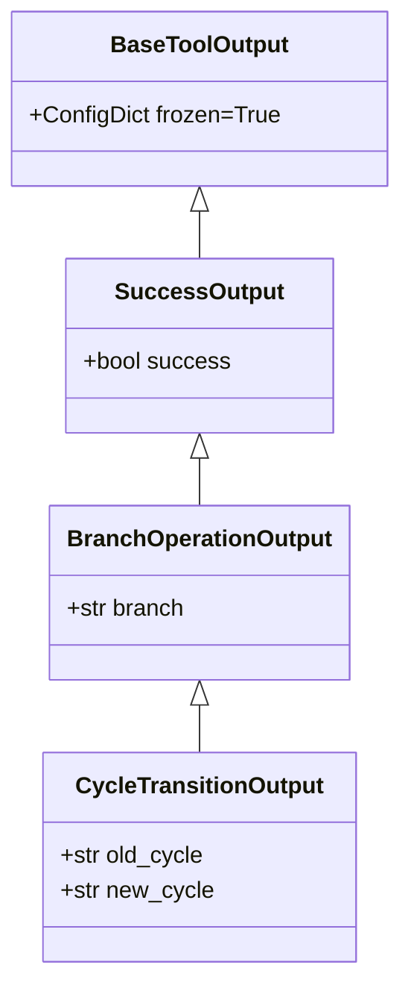
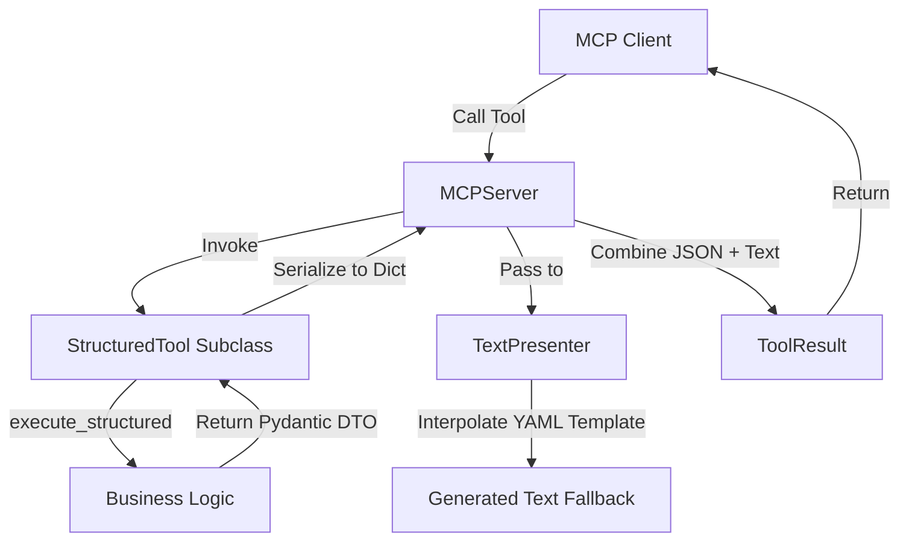

<!-- c:\temp\pgmcp\docs\development\issue402\design.md -->
<!-- template=design version=5827e841 created=2026-06-12T12:57Z updated=2026-06-12T18:50Z -->
# Design — Issue #402: Expose JSON data in MCP tools

**Status:** DRAFT  
**Version:** 1.5
**Last Updated:** 2026-06-12

---

## Purpose

Establish the architectural and data-flow design for exposing structured JSON data in MCP tools via a declarative, config-driven presentation layer, using Pydantic Data Transfer Objects (DTOs) for all tools without exception.

## Scope

**In Scope:**
All active, registered tools in the `mcp_server/tools/` directory (including admin/health/signal tools).

**Out of Scope:**
Protocol changes outside MCP, client-side UI rendering implementations, and legacy or unregistered tools (specifically `DetectLabelDriftTool` in `label_tools.py` which is not loaded in `bootstrap.py`).
## Prerequisites

Read these first:
1. Approved Research Document under Issue #402.

---

## 1. Context & Requirements

### 1.1. Problem Statement

MCP tools currently return plain text responses. We need to expose structured JSON data alongside human-readable text fallbacks in the ToolResult responses of MCP tools (in accordance with the design contract established in #301) to support both machine consumption and chat presentation.

### 1.2. Requirements

**Functional:**
- Migrate all MCP tools to `StructuredTool` (eliminating direct use of `BaseTool` for active tools).
- Return structured JSON payload as the first block (`content[0]` of type `"json"`) and text fallback summary as the second block (`content[1]` of type `"text"`) in `ToolResult`.
- Define explicit, frozen Pydantic models (DTOs) for all tool outputs to ensure schema enforcement and CQS compliance.
- Implement a declarative, config-first text presentation layer (`presentation.yaml`) to generate human-readable summaries without hardcoded text formatters, covering all tools.

**Non-Functional:**
- Adhere to `ARCHITECTURE_PRINCIPLES.md`, specifically CQS (§5), Config-First (§3), Fail-Fast (§4), and Explicit over Implicit (§8).
- Ensure backwards compatibility and improve DRY principles in test assertions by introducing test helpers and pytest fixtures.
- Prevent schema/template drift through automated startup and test-time validation checks.

---

## 2. Design Options

### Option A: Raw Untyped Python Dicts (`dict[str, Any]`)
* **Description:** Tools return raw Python dictionaries directly from their `execute_structured` methods, bypassing any explicit schema definitions.
* **Pros:** Minimal development overhead; no extra boilerplate files.
* **Cons:** Violates `ARCHITECTURE_PRINCIPLES.md` §8 (Explicit over Implicit) and §5 (CQS); no validation at system boundaries.

### Option B: Declarative Pydantic Models (DTOs) for Tool Output (Recommended)
* **Description:** Explicitly define output schemas for every tool using Pydantic models in `mcp_server/schemas/tool_outputs.py`.
* **Pros:** Highly explicit and type-safe boundary contracts; automatic validation; compliance with CQS.
* **Cons:** Requires creating and maintaining output schemas.

---

## 3. Chosen Design

**Decision:** Option B: Define declarative Pydantic DTOs in `mcp_server/schemas/tool_outputs.py` and migrate all tools to `StructuredTool` using `execute_structured`.

**Rationale:** Option B provides static type safety at boundary interfaces, ensures explicit contract definitions, and aligns fully with CQS and type-checking standards, preventing client serialization drift.

| Decision | Rationale |
|---|---|
| **Dedicated Schemas File** | Define all output models (DTOs) in `mcp_server/schemas/tool_outputs.py` to prevent circular imports and centralize API contracts. |
| **CQS Compliant Schemas** | Use `frozen=True` or `ConfigDict(frozen=True)` on all output DTOs to enforce immutability at the boundary. |
| **Flattened Output DTOs** | To comply with historical precedents (`392140ce`, `5a708277`) and prevent LLM (Claude/Copilot) parsing/serialization errors, nested read models are completely flattened. Only flat primitive types, lists, and validated sub-DTOs (e.g. `PhaseDTO` and `LabelOutputModel`) are returned. |
| **Unified Structured Path** | Migrate all tools (including `RestartServerTool` and `HealthCheckTool`) to `StructuredTool` returning simple DTOs (e.g. `RestartServerOutput` or `HealthCheckOutput`), eliminating exceptions and ensuring 100% architectural consistency. |
| **Config-First Presentation** | Manage all text summaries and layouts in a centralized YAML file (`mcp_server/config/presentation.yaml`). No hardcoded emojis or string literals in Python. |
| **Config Loader Integration** | Load `presentation.yaml` via the existing `ConfigLoader` class at the composition root (`server.py` bootstrap), validating it into a `PresentationConfig` model and storing it in `ConfigLayer` (complying with ARCHITECTURE_PRINCIPLES.md §12). |
| **Server-Level Presenter Routing** | Inject `TextPresenter` directly into `MCPServer`. The server intercepts `StructuredTool` execution in `handle_call_tool()`, formats it using the presenter, and creates the dual-payload `ToolResult`, keeping tool classes focused on logic (SRP) and avoiding modifying 28+ tool constructors. |
| **Compatibility Bridge** | Allow `StructuredTool.execute_structured` to return *either* a `BaseModel` DTO *or* the legacy `tuple[dict[str, Any], str]` during the migration, ensuring the server and tests never break. This bridge will be completely removed in Cycle 9. |
| **Separate Presentation Category** | To avoid conflicts with enforcement runner policies (which use `tool_category` like `"branch_mutating"`), tools will declare a separate `presentation_category: ClassVar[str]` attribute (values: `"mutation"`, `"query"`, `"admin"`, `"bootstrap"`, `"testing"`) for presenter emoji mapping. |
| **No Custom Python Formatters** | Avoid code smells by keeping the presentation layer completely declarative. Dynamic summary-level data (e.g. counts, comma-separated lists) is computed by the business logic/tool and included in the Pydantic DTOs, allowing simple string-formatting in YAML. |
| **Static Drift Validation** | Scan and validate all templates in `presentation.yaml` against their Pydantic models at server startup and test-time (Fail-Fast). The validator ignores tools that do not define an `output_model` yet, allowing incremental migration. |
| **Unified Test Assertions** | Implement `assert_structured_tool_result` helper in `tests/mcp_server/test_support.py` to enforce the dual-payload contract and reduce test boilerplate (DRY). |
### 3.2. Schema Hierarchy & Code Reuse (DRY)

We will implement a schema hierarchy using inheritance and reuse existing domain read models from `mcp_server/state/github_read_models.py`:



Every tool's output schema will inherit from `BaseToolOutput` (enforcing `frozen=True` and `extra="forbid"`).

### 3.3. Architecture & Data Flow



### 3.4. Affected Interfaces

All migrated tools will inherit from `StructuredTool` (which inherits from `BaseTool`) and implement `execute_structured` instead of `execute`. During the migration, a compatibility bridge is preserved: `execute_structured` may return either a `BaseModel` DTO (migrated) or a legacy `tuple[dict[str, Any], str]` (unmigrated).

```python
class StructuredTool(BaseTool, ABC):
    output_model: ClassVar[type[BaseModel]] | None = None

    @abstractmethod
    async def execute_structured(
        self,
        params: Any,
        context: NoteContext,
    ) -> tuple[dict[str, Any], str] | BaseModel:
        """Execute the tool and return either a Pydantic DTO (new) or a legacy tuple."""
```
### 3.5. Config-Driven Text Presenter

The presentation configuration is managed in `mcp_server/config/presentation.yaml`:

```yaml
global:
  emojis:
    success: "✅"
    failure: "❌"
    warning: "⚠️"
    query: "📋"
    bootstrap: "🚀"
  json_reference: "*(Full details available in the structured JSON payload)*"
  default_failure_template: "Failed: {error_message}"
  advisories:
    context_reset: "\n\n🚀 REQUIRED NEXT STEP: Call get_work_context now before any other tool call to load the current phase context for this branch."
    server_restart: "\n\n⏳ WAIT 3 SECONDS before continuing - server needs time to reload. Service will be unavailable briefly during restart."
    branch_lockdown: "\n\n⚠️ Warning: Branch is now locked down. Branch-mutating tools are blocked until the PR is merged."
    todo_discipline: "\n\n📋 TODO discipline: create or refresh your TODO list now; keep exactly one item in progress and update it after each material step."

tools:
  git_checkout:
    template_success: "Switched branch '{previous_branch}' -> '{branch}' (Current Phase: '{current_phase}')."
    advisory: "context_reset"
    
  git_status:
    template_success: |
      **Git Status Summary**
      - Branch: {branch}
      - Clean: {is_clean}
      - Modified: {modified_count} files
      - Untracked: {untracked_count} files

  health_check:
    template_success: |
      **Server Health Status**
      - Status: {status}
      - Version: {version}
      - Process ID: {pid}
      - Platform: {platform}
      - Uptime: {uptime_seconds} seconds

  restart_server:
    template_success: "Server restart initiated successfully (Reason: {reason})."
    advisory: "server_restart"
```

The `TextPresenter` dynamically formats the fallback text by mapping fields from the tool's Pydantic DTO:
1. **Emoji Prefixing**: It automatically prepends the correct status emoji based on the tool's metadata and execution status. To make this metadata explicit and avoid implicit conventions:
    - Every tool class (inheriting from `BaseTool` / `StructuredTool`) declares a class-level attribute `presentation_category: ClassVar[str | None] = None` (with values like `"mutation"`, `"query"`, `"admin"`, `"bootstrap"`, or `"testing"`).
    - If execution fails (`success` is False), the presenter always prepends `emoji_failure` (`❌`).
    - If execution succeeds, the presenter maps the `presentation_category` to the corresponding global emoji: `"mutation"`/`"admin"` maps to `emoji_success` (`✅`), `"query"`/`"testing"` maps to `emoji_query` (`📋`), and `"bootstrap"` maps to `emoji_bootstrap` (`🚀`).
2. **Default Failure Handling**: If a tool execution fails and does not define a custom `template_failure` in the configuration, the presenter automatically falls back to rendering the `default_failure_template` (`Failed: {error_message}`).
3. **Advisory Resolution**: If the tool config defines an `advisory` key, the presenter resolves the advisory text from the global advisories lookup and appends it.
4. **Conditional JSON Reference**: It dynamically appends the standard JSON reference `*(Full details available in the structured JSON payload)*` under the following conditions:
    - If `append_json_reference` is statically configured as `true` in the tool config.
    - OR dynamically if the DTO contains rich structured data (such as a non-empty `diff`, `failures` list, `validation_schema`, or lists of items). This keeps simple results clean and uncluttered.
#### Config Loader Integration:
In compliance with `ARCHITECTURE_PRINCIPLES.md` §12:
- `presentation.yaml` is loaded and validated by `ConfigLoader` at composition root (`mcp_server/bootstrap.py`), producing a `PresentationConfig` model.
- The `PresentationConfig` is stored in the immutable `ConfigLayer`.
- At composition root, `TextPresenter` is instantiated with the `PresentationConfig` injected into its constructor: `TextPresenter(config=configs.presentation_config)`.
- `TextPresenter` is then constructor-injected into `MCPServer`.

#### Server-Level Presenter Routing:
- The `MCPServer` manages the routing and execution of tools.
- When `MCPServer` executes a `StructuredTool`, it calls `await tool.execute_structured(validated, note_context)`.
- If the result is a Pydantic `BaseModel` DTO (migrated tool):
  - `MCPServer` delegates formatting to the injected `TextPresenter`: `text = self.presenter.present(tool_name=tool.name, success=dto.success, presentation_category=tool.presentation_category or "query", data=dto)`.
  - It then packs the serialized DTO and the formatted text fallback into a dual-payload `ToolResult`.
- This ensures that individual tool classes remain completely unaware of formatting templates, emojis, and advisories, complying with SRP (Single Responsibility Principle) and DIP (Dependency Inversion Principle).

#### Fail-Fast Drift Validation:
At server startup (within `ConfigValidator().validate_startup`) and within the unit test suite, `validate_presentation_alignment` will:
1. Parse all placeholder keys from `presentation.yaml` templates using `string.Formatter().parse()`. The parser uses `yaml.safe_load()` which automatically and safely resolves YAML anchors and aliases at parse-time, preventing raw string scanning risks, circular references, or injection vulnerabilities.
2. Verify that every placeholder (except those prefixed with `emoji_`) matches a field defined in the corresponding tool's Pydantic `output_model`.
3. Raise a `ConfigError` immediately if drift is detected, blocking server start and failing the build.
### 3.6. Test Suite Strategy & DRY Reparations

To prevent a massive test-suite break and clean up boilerplate code, we apply two key reparations:

#### 1. Contract Assertion Helper (`assert_structured_tool_result`)
We introduce a shared assertion helper in `tests/mcp_server/test_support.py` to enforce the dual-payload structure:

```python
def assert_structured_tool_result(
    result: ToolResult,
    text_contains: str | None = None,
    json_keys: list[str] | None = None,
    expected_json: dict[str, Any] | None = None,
) -> dict[str, Any]:
    """Verifies the ToolResult dual-payload structure and content."""
    assert len(result.content) == 2, f"Expected 2 content items, got {len(result.content)}"
    assert result.content[0]["type"] == "json"
    assert result.content[1]["type"] == "text"
    
    json_data = result.content[0]["json"]
    text_content = result.content[1]["text"]
    
    if text_contains:
        assert text_contains in text_content
    if json_keys:
        for key in json_keys:
            assert key in json_data
    if expected_json:
        assert json_data == expected_json
        
    return json_data
```

#### 2. Mock Fixture Consolidation
Test suites (e.g. `test_git_tools.py`, `test_pr_tools.py`) will be refactored to reuse class- or module-level pytest fixtures for tool instantiation and manager mock configuration, eliminating repetitive mock setup code.

---

## 4. Tool-Specific Summary & Schema Mapping

The following table provides the mapping for candidate Pydantic model fields designed to support simple, declarative templates:

| Tool Class | Model Type | Core Custom Veld (Summary Data) | Fallback template focus |
|---|---|---|---|
| `GitStatusTool` | `GitStatusOutput` | `modified_count`, `untracked_count` | Summary of branch status, clean state, and counts. |
| `RunQualityGatesTool` | `RunQualityGatesOutput` | `gates` | Status of all gates, explicitly showing failed gates if applicable. |
| `RunTestsTool` | `RunTestsOutput` | `verbose_output` | Total passed/failed counts, plus tracebacks in verbose mode. |
| `SearchDocumentationTool` | `SearchDocumentationOutput` | `results_count` | Number of found documents matching the query. |
| `ListIssuesTool` | `ListIssuesOutput` | `issues_count` | Total count of issues matching the filter. |
| `ListPRsTool` | `ListPRsOutput` | `prs_count` | Total count of pull requests. |
| `SafeEditTool` | `SafeEditOutput` | `issues`, `diff`, `has_diff` | Success status, validation warnings, and conditional diff output. |
| `TemplateValidationTool` | `TemplateValidationOutput` | `errors_count` | Summary of linting errors and validation status. |
| `HealthCheckTool` | `HealthCheckOutput` | `status`, `version` | Simple server health status and version exposure. |
| `RestartServerTool` | `RestartServerOutput` | `reason` | Server restart status and reason. |
| `TransitionCycleTool` | `CycleTransitionOutput` | `passed_gates_count` | TDD cycle transition details and total passed gates. |
| `ForceCycleTransitionTool` | `ForceCycleTransitionOutput` | `skipped_gates_count`, `passing_gates_count` | Forced cycle transition audit trail with passed/skipped gate counts. |
| `TransitionPhaseTool` | `PhaseTransitionOutput` | `passing_gates_count` | Phase transition details and total passed gates. |
| `ForcePhaseTransitionTool` | `PhaseTransitionOutput` | `skipped_gates_count`, `passing_gates_count` | Forced phase transition audit trail with passed/skipped gate counts. |
| `ScaffoldArtifactTool` | `ScaffoldArtifactOutput` | `schema_info` | Scaffolded files or inline validation schema if validation fails. |
| `ScaffoldSchemaTool` | `ScaffoldSchemaOutput` | `schema_data` | Retrieved schema for artifact type. |

---

## Related Documentation

- **[docs/development/issue402/research.md](file:///c:/temp/pgmcp/docs/development/issue402/research.md)**
- **[docs/coding_standards/ARCHITECTURE_PRINCIPLES.md](file:///c:/temp/pgmcp/docs/coding_standards/ARCHITECTURE_PRINCIPLES.md)**

---

## Version History

| Version | Date | Author | Changes |
|---------|------|--------|---------|
| 1.3 | 2026-06-12 | Agent | Update to incorporate Batch 5 comments (transition gates counts, verbose test tracebacks, safe edit diffs, scaffold schemas) |
| 1.4 | 2026-06-12 | Agent | Resolved QA NOGO verification feedback (flattened DTOs, presenter routing, separate presentation_category, test suite impact) |
| 1.5 | 2026-06-12 | Agent | Resolved QA Ronde 2 feedback (presentation_category fix, server routing clarifications) |
