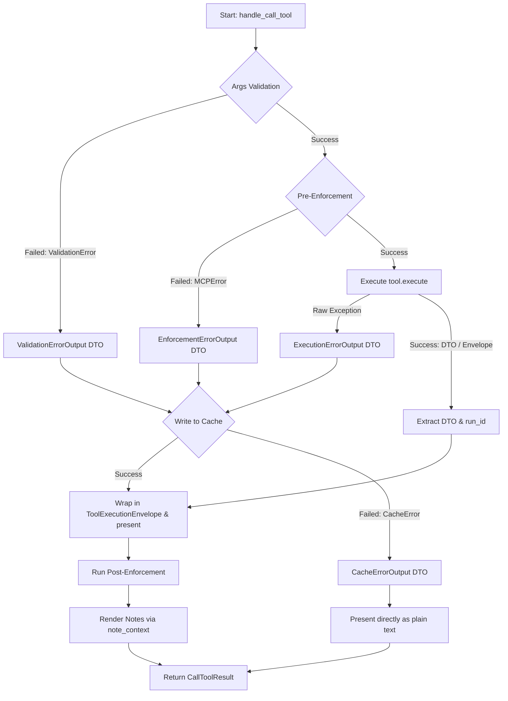
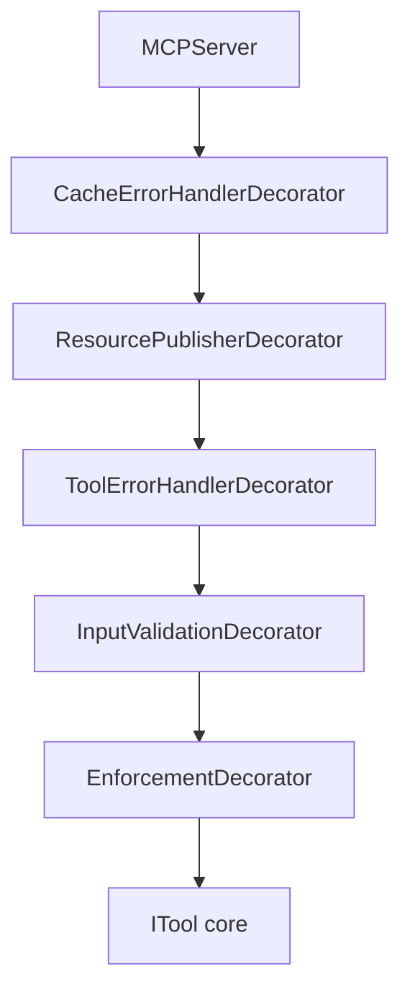

<!-- docs\development\issue404\design.md -->
<!-- template=design version=5827e841 created=2026-06-17T15:59Z updated=2026-06-17T21:35Z -->
# Design: Resolving TextPresenter Formatting Gaps & Error Propagation

**Status:** DRAFT  
**Version:** 1.4.0  
**Last Updated:** 2026-06-17

---

## Purpose

To define the technical architecture for resolving TextPresenter formatting gaps and error propagation.

## Prerequisites

Read these first:
1. Understanding of the ITool and DTO migration (Issue #402)
2. Understanding of the TextPresenter template configuration (Issue #404)
3. [Documentation Standard](../../coding_standards/DOCUMENTATION_STANDARD.md)
4. [Architecture Principles](../../coding_standards/ARCHITECTURE_PRINCIPLES.md)

---

## 1. Context & Requirements

### 1.1. Problem Statement

Uncaught exceptions, validation errors, and enforcement checks are currently evaluated using hardcoded blocks inside the `MCPServer`. This violates SRP, pollutes the LLM context with raw JSON schemas during validation errors, and lacks a unified error schema. Additionally, None values are rendered literally as `'None'` in text templates, and transition advisory notes are duplicated.

### 1.2. Requirements

**Functional:**
- Define explicit DTOs for all error types (`ValidationErrorOutput`, `EnforcementErrorOutput`, `ExecutionErrorOutput`, `CacheErrorOutput`) in a dedicated schemas file [error_outputs.py](file:///c:/temp/pgmcp/mcp_server/schemas/error_outputs.py).
- Ensure validation errors expose the full JSON schema via the resource cache.
- Catch validation, enforcement, and execution exceptions inside [server.py](file:///c:/temp/pgmcp/mcp_server/server.py) and map them to error DTOs formatted via `TextPresenter` using global failure templates in `presentation.yaml`.
- Format `None` values as `"-"` in the `TextPresenter`, configured via `global.formatting.none_value`.
- Remove redundant python transition advisory notes from tools and rely solely on `presentation.yaml` `next_instructions`.
- Complete migration of all operation notes to the presenter-driven model. Note classes in [operation_notes.py](file:///c:/temp/pgmcp/mcp_server/core/operation_notes.py) must be simplified to pure metadata dataclasses, with templates moved to `presentation.yaml` under a `notes` configuration section.
- Completely remove all legacy `to_message()` Python methods before closing Issue #404 (Clean Break).

**Non-Functional:**
- SOLID / Single Responsibility Principle compliance.
- Zero context pollution (large tracebacks/schemas in cache).
- Double Fault Prevention (Cache/Publisher failures caught by outer handler and returned as plain text).

### 1.3. Constraints

- The MCP server uses `sys.stdout` for JSON-RPC transport; no direct print to stdout is allowed.
- All DTOs must be frozen (`frozen=True`, `extra='forbid'`).
- The Approved Strategy must be explicitly defined per boundary (Topic 1: Notes Redesign, Topic 2: Error Presentation).

---

## 2. Design Options

| Option | Pros | Cons |
|:---|:---|:---|
| **Option A: Protocol Boundary Handling** | - Simple and straightforward implementation path.<br>- No deep abstraction layers to trace. | - Violates Single Responsibility Principle (SRP) by combining protocol handling, validation, enforcement, and error presentation.<br>- Validation errors bypass cache and are sent as raw JSON schemas to LLM.<br>- Poor cache/publisher fault tolerance (cache failures crash the connection). |
| **Option B: Abstract Base Class (AbstractTool)** | - Centralized error handling and validation logic in a single base class. | - Violates composition over inheritance established in Issue #402.<br>- God class anti-pattern where the base class accumulates unrelated pipeline duties. |
| **Option C: Full Decorator Pipeline (Phased)** | - Isolates each cross-cutting concern to a single decorator class.<br>- Allows automatic caching of validation/enforcement DTOs.<br>- Double Fault Prevention (outer `CacheErrorHandler` catches publisher disk failures and returns text directly).<br>- Phased rollout protects the test suite by keeping the public JSON-RPC boundaries identical between phases. | - Requires maintaining a temporary integration bridge in `server.py` during Phase 1 (Issue #404). |

---

## 3. Chosen Design

**Decision:** Implement the Phased Migration Strategy: Phase 1 (Issue #404) focuses on defining DTOs in `error_outputs.py`, configuring `presentation.yaml`, and building a temporary integration bridge in `server.py`. Phase 2 (Deferred) will refactor the backend into a Russian Doll decorator pipeline wrapped by the Tool Factory.

**Rationale:** Allows us to isolate visual presentation formatting fixes and error propagation contract establishment in Issue #404 without a massive backend rewrite, keeping the test suite protected. Placing error DTOs in their own file avoids contaminating `tool_outputs.py` and keeps error types isolated.

### 3.1. Error DTOs mapping per Category

The 6 system error categories are mapped to their producers and output formats:

| Error Category | Description | Producer (Phase 1) | Producer (Phase 2) | Error DTO / Format |
|:---|:---|:---|:---|:---|
| **1. Server Startup** | Configuration or bootstrap failures | `bootstrap.py` | `bootstrap.py` | None (Logged only) |
| **2. Tool Input Schema Validation** | Pydantic validation failures of LLM arguments | `_validate_tool_arguments` in `server.py` | `InputValidationDecorator` | `ValidationErrorOutput` |
| **3. Tool Platform Errors** | Unexpected infrastructural errors bubbling from tools | `tool.execute()` in `server.py` | `ToolErrorHandlerDecorator` | `ExecutionErrorOutput` |
| **4. Tool Domain Errors** | Expected business logic failures | `ITool` (Domain logic) | `ITool` (Domain logic) | Domain DTO (success=False) |
| **5. MCP Server / Cache Errors** | Failures within the caching pipeline itself | `server.py` bridge | `CacheErrorHandlerDecorator` | `CacheErrorOutput` |
| **6. Enforcement Errors** | Phase-guard or lifecycle rule blocks | `_run_tool_enforcement` in `server.py` | `EnforcementDecorator` | `EnforcementErrorOutput` |

### 3.2. Phase 1 Integration Bridge (Flow Diagram)

The temporary bridge inside `server.py` intercepts errors, writes them to the cache, and formats them:



### 3.3. Phase 2 Decorator Pipeline (Flow Diagram)

The long-term decorator architecture for backend execution:



### 3.4. Detailed Implementation Contracts

#### 3.4.1. The Error Contract DTOs
We establish a strict taxonomy of errors modeled as DTOs in `mcp_server/schemas/error_outputs.py`:

```python
from typing import Any
from pydantic import BaseModel, ConfigDict, Field

class ToolErrorOutput(BaseModel):
    """Base DTO for all decorator pipeline errors."""
    model_config = ConfigDict(frozen=True, extra="forbid")
    
    success: bool = False
    error_type: str
    message: str
    traceback: str | None = None

class ExecutionErrorOutput(ToolErrorOutput):
    """Fails during actual tool execution."""
    error_type: str = "ExecutionError"

class CacheErrorOutput(ToolErrorOutput):
    """Fails during resource caching."""
    error_type: str = "CacheError"

class ValidationErrorOutput(ToolErrorOutput):
    """Input validation errors. Contains the complete expected input_schema."""
    error_type: str = "ValidationError"
    validation_errors: list[dict[str, Any]] | str
    input_schema: dict[str, Any]

class EnforcementErrorOutput(ToolErrorOutput):
    """Phase-guards or business rules blocking the tool execution."""
    error_type: str = "EnforcementError"
    error_code: str
```

#### 3.4.2. Pydantic Configuration Extensions (`presentation_config.py`)

To support notes rendering and failure templates without triggering Pydantic validation failures due to `extra="forbid"`, the following schema configurations are defined:

```python
class FormattingConfig(BaseModel):
    """Configuration for global text formatting."""
    model_config = ConfigDict(frozen=True, extra="forbid")
    none_value: str = "-"

class NoteGroupConfig(BaseModel):
    """Configuration for a note group's header and emoji."""
    model_config = ConfigDict(frozen=True, extra="forbid")
    emoji: str
    header: str

class GlobalNotesConfig(BaseModel):
    """Global configuration for note groups and fallback templates."""
    model_config = ConfigDict(frozen=True, extra="forbid")
    groups: dict[str, NoteGroupConfig] = Field(default_factory=dict)
    templates: dict[str, dict[str, str]] = Field(default_factory=dict)

# GlobalPresentationConfig is extended with formatting, notes, and failures
class GlobalPresentationConfig(BaseModel):
    model_config = ConfigDict(frozen=True, extra="forbid")
    emojis: EmojisConfig = Field(default_factory=EmojisConfig)
    default_failure_template: str = "Failed: {error_message}"
    next_instruction_texts: dict[str, str] = Field(default_factory=dict)
    formatting: FormattingConfig = Field(default_factory=FormattingConfig)
    notes: GlobalNotesConfig = Field(default_factory=GlobalNotesConfig)
    failures: dict[str, str] = Field(default_factory=dict)

# ToolPresentationConfig is extended with allowed note groups
class ToolPresentationConfig(BaseModel):
    model_config = ConfigDict(frozen=True, extra="forbid")
    template_success: str | None = None
    template_failure: str | None = None
    next_instructions: list[str] = Field(default_factory=list)
    exclusions: dict[str, str] = Field(default_factory=dict)
    suggestions: dict[str, str] = Field(default_factory=dict)
    recoveries: dict[str, str] = Field(default_factory=dict)
    info: dict[str, str] = Field(default_factory=dict)
```

#### 3.4.3. Notes Redesign (Topic 1)

Operation notes in `operation_notes.py` are simplified to pure metadata dataclasses:

```python
@dataclass(frozen=True)
class OperationNote:
    """Base class for all presenter-driven metadata notes."""
    pass

@dataclass(frozen=True)
class ExclusionNote(OperationNote):
    file_path: str

@dataclass(frozen=True)
class SuggestionNote(OperationNote):
    subject: str
    message: str  # Kept temporarily for backward compatibility

@dataclass(frozen=True)
class BlockerNote(OperationNote):
    message: str  # Kept temporarily for backward compatibility

@dataclass(frozen=True)
class RecoveryNote(OperationNote):
    message: str  # Kept temporarily for backward compatibility

@dataclass(frozen=True)
class InfoNote(OperationNote):
    message: str  # Kept temporarily for backward compatibility
```

#### 3.4.4. Note Rendering Loop & Multiplicity

`TextPresenter` exposes a public interface to format, group, and render note entries:

```python
class TextPresenter:
    # Existing methods omitted for brevity

    def present_notes(self, tool_name: str, notes: list[NoteEntry]) -> str | None:
        """Formats and groups note entries into a single markdown block.
        
        Args:
            tool_name: The name of the active tool.
            notes: A list of note entries to render.
            
        Returns:
            The presented Markdown string or None if no notes exist.
        """
```

**Algorithmic Rendering Loop Steps:**
1. **Configuration Lookup:** Retrieve the active tool's local configuration (`tool_cfg`) and global note groups config (`groups_cfg` from `global.notes.groups`).
2. **Grouping Initialization:** Initialize a dictionary mapping each group name (e.g., `exclusions`, `suggestions`, `recoveries`, `info`) to an empty list.
3. **Note Resolution:** For each note entry in `notes`:
   - Map legacy typed notes to their key-parameter dictionary representation via the compatibility mapper.
   - Resolve the template template string:
     - Check the tool-local template: `tool_cfg.<group_name>.<key>`.
     - Fallback to the global template: `global.notes.templates.<group_name>.<key>`.
   - Substitute template placeholders using parameters (applying the None-Value replacement filter).
   - Append the rendered note to the corresponding group list.
4. **Markdown Generation:**
   - Iterate through groups in priority order: `exclusions`, `suggestions`, `recoveries`, `info`.
   - If a group has rendered notes, append the group's emoji and header (e.g., `🚫 Excluded files:`).
   - Append each note in the group as an indented bullet point (`  - {note_text}`).
5. **Output:** Return the joined markdown string block, or `None` if no notes were generated.

#### 3.4.5. None-Value filter in TextPresenter

`TextPresenter` will substitute `None` values with `global.formatting.none_value` (configured in `presentation.yaml`, default: `"-"`) for all placeholders in success, failure, and note templates.

#### 3.4.6. Backward Compatibility Mapper (Phase 1 Bridge)

During Phase 1, `NoteContext.render_to_response` routes note formatting requests through `TextPresenter.present_notes`. A translation mapper maps legacy typed notes to generic key-parameter tuples:

```python
def map_legacy_note_to_event(note: NoteEntry) -> tuple[str, dict[str, Any]]:
    """Maps legacy typed notes to generic key-parameter tuples for the presenter.
    
    Args:
        note: The note entry to map.
        
    Returns:
        A tuple of (template_key, parameter_dict).
    """
```

Legacy `to_message()` Python methods are kept temporarily for backward compatibility with existing unit tests but will be deleted at the end of Issue #404 (Clean Break).

#### 3.4.7. Architectural Rules & Design Refinements

##### 1. Global Note Templates Fallback (DRY & SSOT)
To prevent template duplication across tools, the presenter falls back to `global.notes.templates.<group_name>.<key>` in `presentation.yaml` if a tool-local template is missing.

##### 2. Error Code Mapping for Custom Exceptions
To comply with the Config-First principle, custom exceptions raised by our code (e.g., `PreflightError`, `ValidationError`, `DeliverableCheckError`) carry an `error_code` and semantic parameters instead of hardcoded strings:
- **Exception Signature:** `raise PreflightError(error_code="dirty_workdir", params={"branch": branch})`
- **Config Representation:** `global.failures.dirty_workdir: "Branch '{branch}' is not in a clean state -- commit or stash changes."`
- **Presenter Resolution:** The presenter catches the custom exception, looks up `global.failures.<error_code>`, resolves placeholders, and presents the text. Raw/unexpected external exceptions (e.g., subprocess crashes) fallback to `default_failure_template` using the raw exception message.

##### 3. Strict "No-Message-Backdoor" Rule
To prevent developers from bypassing configuration-driven presentation by passing pre-formatted strings:
- **Constraint:** The `params` dictionary of any note or custom exception must contain ONLY raw semantic data (file paths, counts, branch names), **never** user-facing sentences, phrases, or pre-formatted strings. No `{message}` or `{error_message}` parameters are allowed in notes or custom exceptions.
- **Enforcement:** The drift validator (`validate_presentation_alignment`) scans all templates in `presentation.yaml`. If it detects `{message}` or `{error_message}` within any custom note or failure template, it raises a startup `ConfigError`, failing boot. (Note: `{error_message}` is permitted only in `global.default_failure_template` for raw external exceptions).

##### 4. Drift Validator Extension (`validate_presentation_alignment`)
We extend the drift validator to verify that:
- All placeholders inside `global.failures.<error_type>` exist as fields in the corresponding `ToolErrorOutput` DTO class.
- Placeholders in tool-local and global note templates correspond to the constructor parameters of the mapped note classes.

---

## 4. Test & Verification Plan

### 4.1. Affected Test Suites

| Test File | Verification Goal |
|:---|:---|
| `tests/mcp_server/unit/test_presenter.py` | Verify that `None` values are formatted as `"-"`. Verify Note template rendering. |
| `tests/mcp_server/unit/test_server.py` | Verify that validation, enforcement, and execution exception handling map to the correct error DTOs and present them using global failure templates. |
| `tests/mcp_server/integration/` | Verify E2E protocol-level JSON-RPC error responses wrap presenter outputs. |

### 4.2. Verification Commands

```powershell
# Run presenter unit tests
run_tests(path="tests/mcp_server/unit/test_presenter.py")

# Run server unit tests
run_tests(path="tests/mcp_server/unit/test_server.py")

# Run full test suite
run_tests(scope="full")

# Run quality gates
run_quality_gates(scope="branch")
```

---

## 5. Version History

| Version | Date | Author | Changes |
|---------|------|--------|---------|
| 1.3.0 | 2026-06-17 | Agent | Cleaned design focusing strictly on Phase 1, added error mapping and Mermaid flowcharts |
| 1.4.0 | 2026-06-17 | Agent | Incorporated configuration schemas, Note Rendering Loop details, Backward Compatibility mapper, strict No-Message-Backdoor rules, and Drift Validator extensions |
