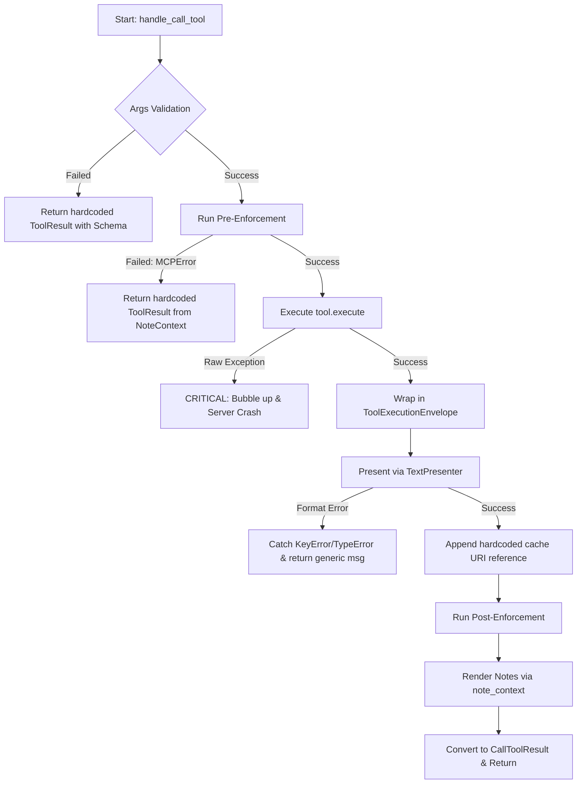

<!-- docs/development/issue404/research.md -->
<!-- template=research version=8b7bb3ab created=2026-06-15T19:45:50Z updated=2026-06-17T15:10:00Z -->
# Research: Resolving TextPresenter Formatting Gaps & Error Propagation

**Status:** APPROVED  
**Version:** 1.1.0  
**Last Updated:** 2026-06-17  

---

## 1. Context & Purpose

This document investigates the problem space of TextPresenter formatting gaps and error propagation in the MCP server. It analyzes the current state of `MCPServer.handle_call_tool()`, catalogs user-facing text leakages, identifies the blast radius of error handling changes, and defines the compatibility and migration policy for rolling out these updates.

---

## 2. Scope

### 2.1. In Scope (Phase 1: Issue #404)
* **Notes Redesign (Topic 1):** Complete migration of all operation notes to the presenter-driven model. This includes simplifying note classes to pure metadata dataclasses, centralizing note formatting templates in `presentation.yaml`, and the complete removal of all legacy `to_message()` Python methods before Issue #404 is closed.
* **Error DTOs & Bridge (Topic 2):** Introduction of structured error DTO schemas in a new file `mcp_server/schemas/error_outputs.py`. Implementing a temporary integration bridge inside `server.py` (`handle_call_tool`) to catch validation, enforcement, and execution exceptions, write them to the cache, and present them via `TextPresenter` using global failure templates.
* **Drift Validation:** Extending `validate_presentation_alignment` to verify failure templates.
* **Unit and Integration Testing:** Verifying both notes and error presentation paths via the TextPresenter and the MCP/JSON-RPC API boundary.

### 2.2. Out of Scope (Phase 2: Subsequent Issue)
* **Decorator Refactoring (Topic 2 Bridge Removal):** Developing the `InputValidationDecorator`, `EnforcementDecorator`, `ToolErrorHandlerDecorator`, and `CacheErrorHandlerDecorator` classes in `decorators.py` to replace the temporary error bridge inside `server.py`.
* **Tool Factory Composition:** Modifying `ToolFactory` in `bootstrap.py` to compose the decorator chain.
* **Server Cleanup:** Deleting validation/enforcement methods and error catching blocks from `server.py`.

---

## 3. Background & Findings

### 3.1. Evolution of Error Propagation
The error handling flow in the MCP server has evolved across five milestones:
1. **Issue #77:** Introduced a global `@tool_error_handler` to catch exceptions and return `ToolResult.error()` to keep tools enabled in VS Code.
2. **Issue #120:** Appended inline schema details to `ValidationError` responses.
3. **Issue #283:** Decoupled presentation formatting by introducing `NoteContext` to make the decorator context-agnostic.
4. **Issue #300:** Restored `stderr`/`stdout` details for pytest execution failures instead of masking them.
5. **Issue #327:** Added early-return validation failures from the server.

### 3.2. Deactivation of `@tool_error_handler`
Following the removal of `BaseTool` in Issue #402, the `@tool_error_handler` decorator is no longer applied in production. As a result, uncaught exceptions from `tool.execute()` bubble up directly, posing a critical risk of VS Code disabling the tools.

### 3.3. The 6 Error Categories
We classify the error space into 6 distinct categories:
1. **Server Startup Errors:** Configuration errors, handled during bootstrap.
2. **Tool Input Schema Validation:** Pydantic validation failures.
3. **Tool-related Platform Errors:** Unexpected infrastructural errors (e.g., File I/O, network timeout).
4. **Tool-specific Domain Errors:** Expected business logic failures (e.g., test fails, git merge conflicts).
5. **MCP Server / Cache Errors:** Failures within the caching pipeline itself (e.g., cache disk full).
6. **Enforcement Errors:** Phase-guard blocks.

---

## 4. Current State: `MCPServer.handle_call_tool()` Analysis

Currently, `MCPServer.handle_call_tool()` handles multiple cross-cutting concerns (validation, enforcement, caching, presentation, note rendering, and error handling) in a single, tightly coupled execution block.

### 4.1. Sequence of Execution

### 4.2. Concrete Gaps and File Paths
* **Pydantic Validation Bypass:** Validations in [server.py:L108-L171](file:///c:/temp/pgmcp/mcp_server/server.py#L108-L171) return hardcoded `ToolResult` messages instead of routing through `TextPresenter`.
* **Enforcement Bypass:** Enforcement checks in [server.py:L183-L216](file:///c:/temp/pgmcp/mcp_server/server.py#L183-L216) bypass the presenter and generate hardcoded texts in the note context.
* **Hardcoded Cache URI Notice:** Appended manually in [server.py:L320-L323](file:///c:/temp/pgmcp/mcp_server/server.py#L320-L323).
* **Broad Exception Catching for Presenter:** KeyError, AttributeError, and TypeError failures inside the presenter are caught in [server.py:L366-L384](file:///c:/temp/pgmcp/mcp_server/server.py#L366-L384) and return a hardcoded error message.
* **Uncaught Exception Vulnerability:** The invocation of `tool.execute()` in [server.py:L295](file:///c:/temp/pgmcp/mcp_server/server.py#L295) is not wrapped in a try-except block, allowing unexpected runtime exceptions to bubble out of the server.

---

## 5. Identification of Presenter Gaps

| Gap ID | Problem Statement | Affected Files & Lines |
|:---|:---|:---|
| **GAP-01** | Hardcoded cache URI reference notice appended in python instead of configuration. | [server.py:L320-L323](file:///c:/temp/pgmcp/mcp_server/server.py#L320-L323) |
| **GAP-02** | Note classes implement a hardcoded `to_message()` method in Python. | [operation_notes.py:L198](file:///c:/temp/pgmcp/mcp_server/core/operation_notes.py#L198) |
| **GAP-03** | Emojis hardcoded in note messages (e.g., `🩹`, `❌`), causing visual double-emojis. | [operation_notes.py:L138](file:///c:/temp/pgmcp/mcp_server/core/operation_notes.py#L138) |
| **GAP-04** | Duplicate next instructions (InfoNote in Python vs next_instructions in YAML). | [phase_tools.py:L30-L33](file:///c:/temp/pgmcp/mcp_server/tools/phase_tools.py#L30-L33) |
| **GAP-05** | Literal `"None"` rendering when DTO fields are explicitly `None`. | [text_presenter.py:L123](file:///c:/temp/pgmcp/mcp_server/presenters/text_presenter.py#L123) |
| **GAP-06** | ToolResult fails back to `success=True` because it lacks a success attribute. | [server.py:L307](file:///c:/temp/pgmcp/mcp_server/server.py#L307) |
| **GAP-07** | Emojis and status headers hardcoded in tool files. | [safe_edit_tool.py:L308](file:///c:/temp/pgmcp/mcp_server/tools/safe_edit_tool.py#L308) |

---

## 6. Blast Radius Assessment (Traceability Table)

Refactoring the error propagation and presentation layer affects several layers of the application:

| Target Component / File | Type / Dependency | Role in Refactoring / Risk |
|:---|:---|:---|
| `mcp_server/server.py` | Production / Core | **High Risk:** Changing `handle_call_tool` exception handling, validation routing, and enforcement mapping. |
| `mcp_server/presenters/text_presenter.py` | Production / View | **Medium Risk:** Extending presentation logic to render structured failure/validation templates. |
| `mcp_server/schemas/error_outputs.py` | Production / DTO | **Low Risk:** New file defining the DTO schemas for the 5 pipeline error outputs. |
| `mcp_server/core/operation_notes.py` | Production / Core | **Medium Risk:** Transitioning Note classes to a generic dataclass `Note(key, params)`. |
| `mcp_server/managers/enforcement_runner.py` | Production / Core | **Medium Risk:** Shifting enforcer messages from raw strings to error codes and metadata. |
| `mcp_server/tools/` (50+ files) | Production / Tools | **Medium Risk:** Stripping hardcoded emojis/texts from return strings and DTO variables. |
| `tests/mcp_server/unit/test_presenter.py` | Test / Presenter | **Medium Risk:** Verifying new error template rendering and None value formatting. |
| `tests/mcp_server/unit/test_server.py` | Test / Server | **High Risk:** Verifying server exception catching and mock validation/enforcement failure paths. |
| `tests/mcp_server/integration/` | Test / E2E | **High Risk:** Verifying that protocol-level JSON-RPC error results are formatted correctly. |

---

## 7. Strategy Approval Gate: Migration & Compatibility Policy

We establish specific rollout strategies for the two primary scopes of this issue to manage regressions safely:

### 7.1. Topic 1: Notes Redesign (Original Scope)
* **Strategy:** **Temporary Bridge with Clean Break**. 
* **Rollout:** During implementation, a temporary `to_message()` fallback can be retained on Note classes to keep legacy unit tests green while migrating tools and managers. However, by the end of Issue #404, all tools, note classes, and tests must be fully refactored to use the presenter. The temporary `to_message()` fallback methods must be completely deleted before the issue is closed (Clean Break). Transition advisory info notes in Python are deleted immediately.

### 7.2. Topic 2: Error Presentation & DTOs (Scope Expansion)
* **Strategy:** **Temporary Bridge**.
* **Rollout:** In Issue #404 (Phase 1), we will catch validation, enforcement, and execution exceptions directly inside `server.py` (`handle_call_tool`), instantiate the new DTO contracts from `error_outputs.py`, write them to the cache, and present them via `TextPresenter` using global failure templates. This temporary bridge in `server.py` allows us to verify the presenter formatting flow safely. The integration tests created in Phase 1 will target the public MCP protocol boundaries, meaning they will remain 100% active and unmodified when the temporary bridge is removed and replaced by decorators in a subsequent issue (Phase 2).

---

## 8. Expected Results

The implementation of both phases must satisfy the following validation baseline:

### 8.1. Operation Notes
* No Python note class in `operation_notes.py` contains formatting logic, emojis, or raw text templates.
* All note-rendering logic is processed via `TextPresenter` using definitions in `presentation.yaml`. Notes are grouped into bullets under their respective global emoji/header.
* Transition advisory messages are rendered once using `next_instructions` and never duplicated in note blocks.

### 8.2. Error Presentation
* Validation errors (Pydantic), enforcement errors (phase-guards), and unhandled tool exceptions are fully intercepted and do not crash the MCP server connection.
* Large data structures (such as validation schemas or traceback strings) are cached and excluded from the main LLM response text, which instead appends a clickable `pgmcp://cache/runs/{run_id}` notice.
* The LLM response text for errors is composed using global failure templates under `global.failures` in `presentation.yaml`.

---

## Related Documentation
- **[docs/coding_standards/ARCHITECTURE_PRINCIPLES.md](../../coding_standards/ARCHITECTURE_PRINCIPLES.md)**
- **[docs/development/issue404/decorator_pipeline_design.md](decorator_pipeline_design.md)**
- **[docs/development/issue404/user_facing_text_inventory.md](user_facing_text_inventory.md)**

---

## Version History

| Version | Date | Author | Changes |
|---------|------|--------|---------|
| 1.0.0 | 2026-06-15 | Agent | Initial research draft approved |
| 1.1.0 | 2026-06-17 | Agent | Revised to comply with documentation standards: removed design solutions, added Mermaid current-flow diagram, added Blast Radius table, and formulated the migration policy under the Approved Strategy. |
| 1.2.0 | 2026-06-17 | Agent | Added "Expected Results" section and detailed the separate rollout strategies for Topic 1 (Clean Break by end of issue) and Topic 2 (Temporary Bridge removed in Phase 2). |
