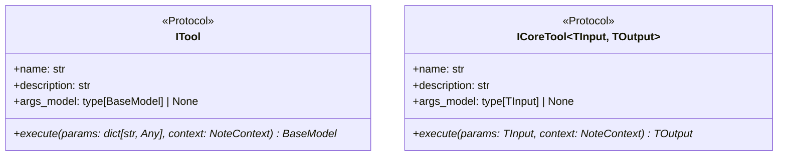

<!-- docs\development\issue406\design.md -->
<!-- template=design version=5827e841 created=2026-06-18T16:12Z updated= -->
# Design: Russian Doll Decorator Pipeline for Exception Mapping

**Status:** DRAFT  
**Version:** 1.0.0  
**Last Updated:** 2026-06-18

## Table of Contents & Sequence of Operations

This design document is structured as a living specification. To maintain high architectural cohesion and prevent chaos, the design is elaborated sequentially in the following order:

1. **[DESIGN-1] Domain & Execution Contracts (`ITool` and `ICoreTool` Generics)**
   - Status: *DRAFTED*
   - Focus: Defining the core interfaces and generic parameter/return types to protect tool developer productivity.
2. **[DESIGN-2] Execution Decorators (Russian Doll pipeline)**
   - Status: *PENDING*
   - Focus: Defining validation, enforcement, and error-handling decorators, including parameter translation and exception interception.
3. **[DESIGN-3] Persistence Subsystem Contract (`IToolResponseCache`)**
   - Status: *PENDING*
   - Focus: Defining cache boundaries, key/URI generation, and file/storage resilience.
4. **[DESIGN-4] Presentation Subsystem Contract (`IPresenter`)**
   - Status: *PENDING*
   - Focus: Defining markdown layout rendering, emoji classification, note presentation, and formatting fallbacks.
5. **[DESIGN-5] Transport Orchestration (`server.py` Flow)**
   - Status: *PENDING*
   - Focus: Defining the clean, sequential orchestrator pipeline without try-except recovery blocks.
6. **[DESIGN-6] Composition & Construction (`ToolFactory` in `bootstrap.py`)**
   - Status: *PENDING*
   - Focus: Defining composition root assembly, dependency injection, and wiring order.

---

## 1. Context & Requirements

### 1.1. Problem Statement

The monolithic exception mapping and validation bridge in server.py violates SRP and DIP. Refactoring requires decoupled subsystems with clean type-safe boundaries without hurting tool developer productivity.

### 1.2. Requirements

**Functional:**
- [ ] Decouple validation and enforcement from server.py transport layer
- [ ] Guarantee DTO-only returns from the tool execution pipeline
- [ ] Implement self-resilient caching and presentation to eliminate try-except blocks in the orchestrator

**Non-Functional:**
- [ ] Maintain 100% JSON-RPC backward compatibility
- [ ] Pass strict Pyright type checking with 0 ignores
- [ ] No import-time configuration loading or side-effects

### 1.3. Constraints

- Must preserve JSON-RPC public API contracts
- No implementation code or file path configurations in pure schema classes
- All decorators must implement ITool or ICoreTool protocols
---

## 2. Design Options

### 2.1. Option A: Option A: Single ITool interface with Any parameters

Simple interface but lacks IDE autocomplete and type checks for developers writing tools.

**Pros:**

**Cons:**

### 2.2. Option B: Option B: Dual generic ITool and ICoreTool interfaces

Provides full type safety and autocomplete in the IDE by separating outer and inner tool contracts.

**Pros:**

**Cons:**
---

## 3. Chosen Design

**Decision:** Implement a two-stage execution pipeline using generic ITool and ICoreTool interfaces, with self-resilient caching and presentation subsystems coordinated sequentially by the transport layer.

**Rationale:** Option B prevents runtime parameter bugs, enables instant IDE checks during tool development, and completely decouples the transport layer.

### 3.1. Key Design Decisions

| Decision | Rationale |
|----------|-----------|
| Dual Generic Interfaces | Hides generic complexity inside the framework while providing autocomplete and type safety to tool developers. |

### 3.2. [DESIGN-1] Domain & Execution Contracts (`ITool` and `ICoreTool` Generics)

To enforce strict boundary interfaces, the execution contracts are divided into two distinct protocols (outer and inner) to isolate the transport layer from tool-specific type requirements while preserving complete autocomplete and type safety for tool developers.



#### 3.2.1. The Outer Interface: `ITool`
This interface defines the contract that the transport layer (`server.py`) and the outermost decorators (such as `ToolErrorHandlerDecorator` and `InputValidationDecorator`) communicate through. It accepts raw parameters and guarantees a Pydantic DTO return.

**File:** [itool.py](file:///c:/temp/pgmcp/mcp_server/core/interfaces/itool.py) [NEW]

```python
from typing import Any, Protocol, runtime_checkable
from pydantic import BaseModel
from mcp_server.core.operation_notes import NoteContext

@runtime_checkable
class ITool(Protocol):
    """Outer execution contract used by the transport layer and validator."""

    @property
    def name(self) -> str:
        """The JSON-RPC name of the tool."""
        ...

    @property
    def description(self) -> str:
        """The docstring description passed to the LLM."""
        ...

    @property
    def args_model(self) -> type[BaseModel] | None:
        """The Pydantic input arguments schema class."""
        ...

    async def execute(self, params: dict[str, Any], context: NoteContext) -> BaseModel:
        """Execute the tool pipeline with raw parameters and return a DTO."""
        ...
```

#### 3.2.2. The Inner Interface: `ICoreTool`
This interface is implemented by all actual business-logic tools (e.g., `CreateBranchTool`) and inner decorators (e.g., `EnforcementDecorator`) that run after parameter validation has occurred. It leverages Pydantic generics to enforce strict type-safe signatures.

**File:** [icore_tool.py](file:///c:/temp/pgmcp/mcp_server/core/interfaces/icore_tool.py) [NEW]

```python
from typing import Generic, Protocol, TypeVar, runtime_checkable
from pydantic import BaseModel
from mcp_server.core.operation_notes import NoteContext

TInput = TypeVar("TInput", bound=BaseModel)
TOutput = TypeVar("TOutput", bound=BaseModel)

@runtime_checkable
class ICoreTool(Protocol, Generic[TInput, TOutput]):
    """Inner execution contract implemented by type-safe tool classes."""

    @property
    def name(self) -> str:
        ...

    @property
    def description(self) -> str:
        ...

    @property
    def args_model(self) -> type[TInput] | None:
        ...

    async def execute(self, params: TInput, context: NoteContext) -> TOutput:
        """Execute the core tool logic with type-safe validated input parameters."""
        ...
```

#### 3.2.3. The Bridge: `InputValidationDecorator`
The `InputValidationDecorator` bridges the outer and inner contracts by implementing `ITool` (outer) and wrapping `ICoreTool` (inner). It is the sole component responsible for converting raw dictionaries to validated BaseModel instances.

```python
class InputValidationDecorator(ITool):
    """Bridges the untyped transport layer with the typed core execution layer."""

    def __init__(self, inner_tool: ICoreTool[BaseModel, BaseModel]) -> None:
        self._inner_tool = inner_tool

    @property
    def name(self) -> str:
        return self._inner_tool.name

    @property
    def description(self) -> str:
        return self._inner_tool.description

    @property
    def args_model(self) -> type[BaseModel] | None:
        return self._inner_tool.args_model

    async def execute(self, params: dict[str, Any], context: NoteContext) -> BaseModel:
        if not self.args_model:
            # Bypass validation if no input arguments model is defined
            return await self._inner_tool.execute(None, context) # type: ignore
        
        try:
            validated = self.args_model.model_validate(params)
        except ValidationError as e:
            return ValidationErrorOutput(
                message=f"Invalid input for {self.name}",
                validation_errors=[
                    {"field": ".".join(map(str, err["loc"])), "error": err["msg"]}
                    for err in e.errors()
                ]
            )
        
        return await self._inner_tool.execute(validated, context)
```

## Related Documentation
None
---

## Version History

| Version | Date | Author | Changes |
|---------|------|--------|---------|
| 1.0.0 | 2026-06-18 | Agent | Initial draft |