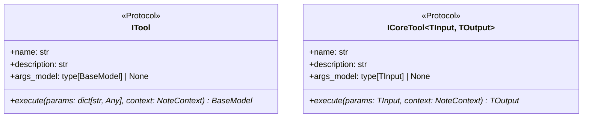
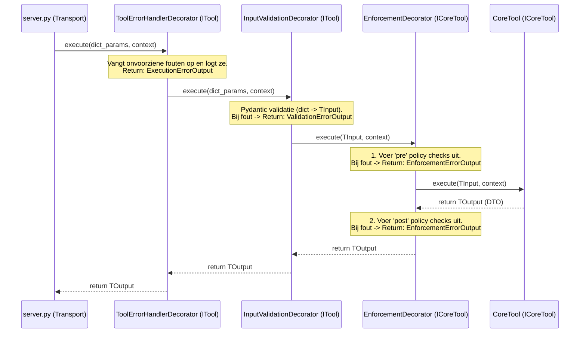
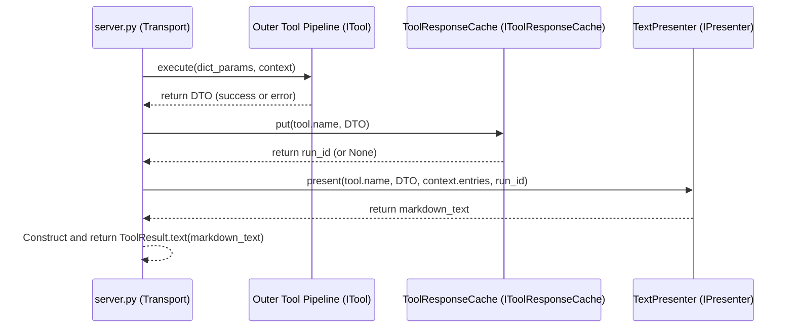

<!-- docs\development\issue406\design.md -->
<!-- template=design version=5827e841 created=2026-06-18T16:12Z updated= -->
# Design: Russian Doll Decorator Pipeline for Exception Mapping

**Status:** DRAFT  
**Version:** 1.0.0  
**Last Updated:** 2026-06-18

## Table of Contents & Sequence of Operations

This design document is structured as a living specification. To maintain high architectural cohesion and prevent chaos, the design is elaborated sequentially in the following order:

1. **[DESIGN-1] Domain & Execution Contracts (`ITool` and `ICoreTool` Generics)**
   - Status: *DRAFTED*
   - Focus: Defining the core interfaces and generic parameter/return types to protect tool developer productivity.
2. **[DESIGN-2] Execution Decorators (Russian Doll pipeline)**
   - Status: *DRAFTED*
   - Focus: Defining validation, enforcement, and error-handling decorators, including parameter translation and exception interception.
3. **[DESIGN-3] Persistence Subsystem Contract (`IToolResponseCache`)**
   - Status: *DRAFTED*
   - Focus: Defining cache boundaries, key/URI generation, and file/storage resilience.
4. **[DESIGN-4] Presentation Subsystem Contract (`IPresenter`)**
   - Status: *DRAFTED*
   - Focus: Defining markdown layout rendering, emoji classification, note presentation, and formatting fallbacks.
5. **[DESIGN-5] Transport Orchestration (`server.py` Flow)**
   - Status: *DRAFTED*
   - Focus: Defining the clean, sequential orchestrator pipeline without try-except recovery blocks.
6. **[DESIGN-6] Composition & Construction (`ToolFactory` in `bootstrap.py`)**
   - Status: *DRAFTED*
   - Focus: Defining composition root assembly, dependency injection, and wiring order.
---

## 1. Context & Requirements

### 1.1. Problem Statement

The monolithic exception mapping and validation bridge in server.py violates SRP and DIP. Refactoring requires decoupled subsystems with clean type-safe boundaries without hurting tool developer productivity.

### 1.2. Requirements

**Functional:**
- [ ] Decouple validation and enforcement from server.py transport layer
- [ ] Guarantee DTO-only returns from the tool execution pipeline
- [ ] Implement self-resilient caching and presentation to eliminate try-except blocks in the orchestrator

**Non-Functional:**
- [ ] Maintain 100% JSON-RPC backward compatibility
- [ ] Pass strict Pyright type checking with 0 ignores
- [ ] No import-time configuration loading or side-effects

### 1.3. Constraints

- Must preserve JSON-RPC public API contracts
- No implementation code or file path configurations in pure schema classes
- All decorators must implement ITool or ICoreTool protocols
---

## 2. Design Options

### 2.1. Option A: Option A: Single ITool interface with Any parameters

Simple interface but lacks IDE autocomplete and type checks for developers writing tools.

**Pros:**

**Cons:**

### 2.2. Option B: Option B: Dual generic ITool and ICoreTool interfaces

Provides full type safety and autocomplete in the IDE by separating outer and inner tool contracts.

**Pros:**

**Cons:**
---

## 3. Chosen Design

**Decision:** Implement a two-stage execution pipeline using generic ITool and ICoreTool interfaces, with self-resilient caching and presentation subsystems coordinated sequentially by the transport layer.

**Rationale:** Option B prevents runtime parameter bugs, enables instant IDE checks during tool development, and completely decouples the transport layer.

### 3.1. Key Design Decisions

| Decision | Rationale |
|----------|-----------|
| Dual Generic Interfaces | Hides generic complexity inside the framework while providing autocomplete and type safety to tool developers. |

### 3.2. [DESIGN-1] Domain & Execution Contracts (`ITool` and `ICoreTool` Generics)

To enforce strict boundary interfaces, the execution contracts are divided into two distinct protocols (outer and inner) to isolate the transport layer from tool-specific type requirements while preserving complete autocomplete and type safety for tool developers.



#### 3.2.1. The Outer Interface: `ITool`
This interface defines the contract that the transport layer (`server.py`) and the outermost decorators (such as `ToolErrorHandlerDecorator` and `InputValidationDecorator`) communicate through. It accepts raw parameters and guarantees a Pydantic DTO return.

**File:** [itool.py](file:///c:/temp/pgmcp/mcp_server/core/interfaces/itool.py) [NEW]

```python
from typing import Any, Protocol, runtime_checkable
from pydantic import BaseModel
from mcp_server.core.operation_notes import NoteContext

@runtime_checkable
class ITool(Protocol):
    """Outer execution contract used by the transport layer and validator."""

    @property
    def name(self) -> str:
        """The JSON-RPC name of the tool."""
        ...

    @property
    def description(self) -> str:
        """The docstring description passed to the LLM."""
        ...

    @property
    def args_model(self) -> type[BaseModel] | None:
        """The Pydantic input arguments schema class."""
        ...

    async def execute(self, params: dict[str, Any], context: NoteContext) -> BaseModel:
        """Execute the tool pipeline with raw parameters and return a DTO."""
        ...
```

#### 3.2.2. The Inner Interface: `ICoreTool`
This interface is implemented by all actual business-logic tools (e.g., `CreateBranchTool`) and inner decorators (e.g., `EnforcementDecorator`) that run after parameter validation has occurred. It leverages Pydantic generics to enforce strict type-safe signatures.

**File:** [icore_tool.py](file:///c:/temp/pgmcp/mcp_server/core/interfaces/icore_tool.py) [NEW]

```python
from typing import Generic, Protocol, TypeVar, runtime_checkable
from pydantic import BaseModel
from mcp_server.core.operation_notes import NoteContext

TInput = TypeVar("TInput", bound=BaseModel)
TOutput = TypeVar("TOutput", bound=BaseModel)

@runtime_checkable
class ICoreTool(Protocol, Generic[TInput, TOutput]):
    """Inner execution contract implemented by type-safe tool classes."""

    @property
    def name(self) -> str:
        ...

    @property
    def description(self) -> str:
        ...

    @property
    def args_model(self) -> type[TInput] | None:
        ...

    async def execute(self, params: TInput, context: NoteContext) -> TOutput:
        """Execute the core tool logic with type-safe validated input parameters."""
        ...
```

#### 3.2.3. The Bridge: `InputValidationDecorator`
The `InputValidationDecorator` bridges the outer and inner contracts by implementing `ITool` (outer) and wrapping `ICoreTool` (inner). It is the sole component responsible for converting raw dictionaries to validated BaseModel instances.

```python
class InputValidationDecorator(ITool):
    """Bridges the untyped transport layer with the typed core execution layer."""

    def __init__(self, inner_tool: ICoreTool[BaseModel, BaseModel]) -> None:
        self._inner_tool = inner_tool

    @property
    def name(self) -> str:
        return self._inner_tool.name

    @property
    def description(self) -> str:
        return self._inner_tool.description

    @property
    def args_model(self) -> type[BaseModel] | None:
        return self._inner_tool.args_model

    async def execute(self, params: dict[str, Any], context: NoteContext) -> BaseModel:
        if not self.args_model:
            # Bypass validation if no input arguments model is defined
            return await self._inner_tool.execute(None, context) # type: ignore
        
        try:
            validated = self.args_model.model_validate(params)
        except ValidationError as e:
            return ValidationErrorOutput(
                error_message=None,
                validation_errors=[
                    {"field": ".".join(map(str, err["loc"])), "error": err["msg"]}
                    for err in e.errors()
                ]
            )
        
        return await self._inner_tool.execute(validated, context)
```

### 3.3. [DESIGN-2] Execution Decorators (Russian Doll pipeline)

The decorators are organized in a nested Russian Doll structure. The outer layer (`ToolErrorHandlerDecorator`) handles top-level execution exceptions. The middle layer (`InputValidationDecorator`) validates incoming raw dictionaries. The inner layer (`EnforcementDecorator`) runs before/after policies.



#### 3.3.1. `ToolErrorHandlerDecorator`
The `ToolErrorHandlerDecorator` acts as the outermost boundary of the execution pipeline. It catches any unhandled exceptions from the inner decorators or tool execution, logs the traceback with `exc_info=True` to `stderr`, and returns an `ExecutionErrorOutput` DTO.

**File:** [tool_error_handler_decorator.py](file:///c:/temp/pgmcp/mcp_server/core/decorators/tool_error_handler_decorator.py) [NEW]

```python
import logging
from typing import Any
from pydantic import BaseModel
from mcp_server.core.interfaces.itool import ITool
from mcp_server.core.operation_notes import NoteContext
from mcp_server.schemas.error_outputs import ExecutionErrorOutput

logger = logging.getLogger(__name__)

class ToolErrorHandlerDecorator(ITool):
    """Outermost decorator that traps unhandled exceptions and converts them to error DTOs."""

    def __init__(self, inner_tool: ITool) -> None:
        self._inner_tool = inner_tool

    @property
    def name(self) -> str:
        return self._inner_tool.name

    @property
    def description(self) -> str:
        return self._inner_tool.description

    @property
    def args_model(self) -> type[BaseModel] | None:
        return self._inner_tool.args_model

    async def execute(self, params: dict[str, Any], context: NoteContext) -> BaseModel:
        try:
            return await self._inner_tool.execute(params, context)
        except Exception as exc:
            import traceback
            # Log traceback to stderr
            logger.error(
                "Unhandled exception during tool execution for %s: %s",
                self.name,
                str(exc),
                exc_info=True,
            )
            return ExecutionErrorOutput(
                error_message=f"{exc.__class__.__name__}: {str(exc)}",
                traceback=traceback.format_exc(),
                params=params,
            )
```

#### 3.3.2. `EnforcementDecorator`
The `EnforcementDecorator` executes policy preflights and rules checks (both `pre` and `post` execution). It implements the `ICoreTool` interface and wraps the inner core tool implementation. It catches `ValidationError` or any policy-level `MCPError` raised by the `EnforcementRunner` and maps them to an `EnforcementErrorOutput` DTO.

**File:** [enforcement_decorator.py](file:///c:/temp/pgmcp/mcp_server/core/decorators/enforcement_decorator.py) [NEW]

```python
from typing import TypeVar
from pydantic import BaseModel
from mcp_server.core.interfaces.icore_tool import ICoreTool
from mcp_server.core.operation_notes import NoteContext
from mcp_server.core.exceptions import ValidationError, MCPError
from mcp_server.managers.enforcement_runner import EnforcementRunner, EnforcementContext
from mcp_server.schemas.error_outputs import EnforcementErrorOutput, ToolErrorOutput

TInput = TypeVar("TInput", bound=BaseModel)
TOutput = TypeVar("TOutput", bound=BaseModel)

class EnforcementDecorator(ICoreTool[TInput, TOutput]):
    """Inner decorator that runs policies before/after execution and traps enforcement errors."""

    def __init__(
        self,
        inner_tool: ICoreTool[TInput, TOutput],
        enforcement_runner: EnforcementRunner,
    ) -> None:
        self._inner_tool = inner_tool
        self._enforcement_runner = enforcement_runner

    @property
    def name(self) -> str:
        return self._inner_tool.name

    @property
    def description(self) -> str:
        return self._inner_tool.description

    @property
    def args_model(self) -> type[TInput] | None:
        return self._inner_tool.args_model

    @property
    def tool_category(self) -> str | None:
        return getattr(self._inner_tool, "tool_category", None)

    async def execute(self, params: TInput, context: NoteContext) -> TOutput:
        # 1. Run "pre" execution policy checks
        try:
            self._enforcement_runner.run(
                event=self.name,
                timing="pre",
                tool_category=self.tool_category,
                enforcement_ctx=EnforcementContext(
                    workspace_root=self._enforcement_runner.workspace_root,
                    tool_name=self.name,
                    params=params,
                ),
                note_context=context,
            )
        except ValidationError as exc:
            return EnforcementErrorOutput(
                error_message=None,
                error_code=exc.code,
                params=exc.params,
            )  # type: ignore[return-value]

        # 2. Execute target tool
        result = await self._inner_tool.execute(params, context)

        # Skip "post" checks if tool execution returned a validation or other error DTO
        if isinstance(result, ToolErrorOutput):
            return result

        # 3. Run "post" execution policy checks
        try:
            self._enforcement_runner.run(
                event=self.name,
                timing="post",
                tool_category=self.tool_category,
                enforcement_ctx=EnforcementContext(
                    workspace_root=self._enforcement_runner.workspace_root,
                    tool_name=self.name,
                    params=params,
                ),
                note_context=context,
            )
        except ValidationError as exc:
            return EnforcementErrorOutput(
                error_message=None,
                error_code=exc.code,
                params=exc.params,
            )  # type: ignore[return-value]

        return result
```

#### 3.3.3. Schema Modification for Error DTOs
To prevent the propagation of ad-hoc user-facing text strings from python code, and to maintain consistency with `BaseToolOutput`, the base `ToolErrorOutput` schema is modified to replace `message: str` with `error_message: str | None = None`.

Developers must not use `error_message` for user-facing texts. Instead, all policy check failures must register an explicit `error_code` and supply required variables in `params`, allowing `TextPresenter` to resolve user-facing text templates from `presentation.yaml`.

**File:** [error_outputs.py](file:///c:/temp/pgmcp/mcp_server/schemas/error_outputs.py) [MODIFY]

```python
class ToolErrorOutput(BaseModel):
    """Base class for all structured tool error outputs."""

    model_config = ConfigDict(frozen=True, extra="forbid")

    success: bool = False
    error_type: str
    error_message: str | None = None
    traceback: str | None = None
    params: dict[str, Any] = Field(default_factory=dict)
```

### 3.4. [DESIGN-3] Persistence Subsystem Contract (`IToolResponseCache`)

The persistence subsystem provides a structured interface for storing and retrieving tool outputs on disk. It must be resilient against disk failures (e.g. disk full, read/write errors) and enforce strict type safety for retrieved DTOs.

**File:** [itool_response_cache.py](file:///c:/temp/pgmcp/mcp_server/core/interfaces/itool_response_cache.py) [NEW]

```python
from typing import Protocol, Type, TypeVar
from pydantic import BaseModel

T = TypeVar("T", bound=BaseModel)

class IToolResponseCache(Protocol):
    """Interface for publishing and retrieving tool execution results."""

    def put(self, tool_name: str, output: BaseModel) -> str | None:
        """Publish the output DTO to the cache and return a unique run_id.

        If a cache write fails (e.g. disk full), the implementation must trap
        the exception, log a warning/error, and return None. It must never
        crash the tool execution pipeline.
        """
        ...

    def get(self, run_id: str, response_model: Type[T]) -> T | None:
        """Retrieve and deserialize a cached DTO using the expected type-safe model."""
        ...

    def exists(self, run_id: str) -> bool:
        """Check if a cached result exists for the run_id."""
        ...
```

### 3.5. [DESIGN-4] Presentation Subsystem Contract (`IPresenter`)

The presentation subsystem translates structured DTOs and note contexts into formatted markdown. It has a single public layout method, keeping all styling, emojis, next instructions, and layout alignment rules fully decoupled from the transport layer.

**File:** [ipresenter.py](file:///c:/temp/pgmcp/mcp_server/core/interfaces/ipresenter.py) [NEW]

```python
from typing import Protocol
from pydantic import BaseModel
from mcp_server.core.operation_notes import Note

class IPresenter(Protocol):
    """Interface for translating execution results and notes into markdown."""

    def present(
        self,
        tool_name: str,
        data: BaseModel,
        notes: list[Note],
        run_id: str | None = None,
    ) -> str:
        """Format the output DTO and operation notes into a single user-facing markdown string.

        If run_id is None, the presenter will format the output without the
        URI reference link or with a fallback message. The server/orchestrator
        does not participate in run_id logic.
        """
        ...
```

### 3.6. [DESIGN-5] Transport Orchestration (`server.py` Flow)

The orchestrator in `server.py` acts as a pure, sequential controller. It coordinates tool execution, caching, and presentation linearly without any try-except blocks for error mapping or layout creation.



The core flow in `server.py`'s protocol handler will be:

```python
# 1. Initialize per-call notes bus
context = NoteContext()

# 2. Execute target tool (guaranteed to return a BaseModel DTO)
result_dto = await tool_pipeline.execute(arguments, context)

# 3. Publish result to cache (resilient; returns None on failure)
run_id = self.cache.put(tool.name, result_dto)

# 4. Generate user-facing markdown output (resilient; formats both DTO and notes)
markdown = self.presenter.present(
    tool_name=tool.name,
    data=result_dto,
    notes=context.entries,
    run_id=run_id,
)

# 5. Return standardized ToolResult
return ToolResult.text(markdown)
```

### 3.7. [DESIGN-6] Composition & Construction (`ToolFactory`)

A new `ToolFactory` handles the construction and Russian Doll decoration of all tools. This decouples the construction layer from the transport layer.

**File:** [tool_factory.py](file:///c:/temp/pgmcp/mcp_server/core/tool_factory.py) [NEW]

```python
from mcp_server.core.interfaces.itool import ITool
from mcp_server.core.interfaces.icore_tool import ICoreTool
from mcp_server.core.decorators.tool_error_handler_decorator import ToolErrorHandlerDecorator
from mcp_server.core.decorators.input_validation_decorator import InputValidationDecorator
from mcp_server.core.decorators.enforcement_decorator import EnforcementDecorator
from mcp_server.managers.enforcement_runner import EnforcementRunner

class ToolFactory:
    """Composition root for wrapping business logic tools into decorators."""

    def __init__(self, enforcement_runner: EnforcementRunner) -> None:
        self._enforcement_runner = enforcement_runner

    def create_tool(self, core_tool: ICoreTool) -> ITool:
        """Compose the Russian Doll decorator stack for a core tool."""
        # 1. Wrap the core tool with Enforcement policy checking
        enforcement_stacked = EnforcementDecorator(core_tool, self._enforcement_runner)
        
        # 2. Wrap with validation checking (Bridges ICoreTool to ITool)
        validated_stacked = InputValidationDecorator(enforcement_stacked)
        
        # 3. Wrap with catch-all error handling
        return ToolErrorHandlerDecorator(validated_stacked)
```

#### 3.7.1. Wiring in `bootstrap.py`
The `bootstrap` method in `bootstrap.py` is updated to instantiate `ToolFactory` using the constructed `EnforcementRunner`, wrap the core tools returned by `_build_tools`, and pass the list of decorated `ITool` instances to `MCPServer`.

**File:** [bootstrap.py](file:///c:/temp/pgmcp/mcp_server/bootstrap.py) [MODIFY]

```python
    def bootstrap(self) -> MCPServer:
        # ... (logging, registry, config, and manager graph setup) ...

        # 1. Build core tools (now implementing ICoreTool)
        core_tools = self._build_tools(configs, managers)
        resources = self._build_resources(configs, managers)

        # 2. Instantiate composition factory and decorate tools
        tool_factory = ToolFactory(enforcement_runner=managers.enforcement_runner)
        tools = [tool_factory.create_tool(t) for t in core_tools]

        # 3. Instantiate presenter
        presenter = TextPresenter(config=configs.presentation_config)
        validate_presentation_alignment(presenter, core_tools)

        # 4. Return composed server
        from mcp_server.server import MCPServer
        return MCPServer(
            settings=settings,
            configs=configs,
            managers=managers,
            tools=tools,
            resources=resources,
            presenter=presenter,
        )
```

#### 3.7.2. Ruff `T20` (print-check) Configuration
To enforce that no `print()` statements are introduced, Ruff's `T20` rule is added to both the local developer baseline and the authoritative Quality Gate configuration.

**File:** [pyproject.toml](file:///c:/temp/pgmcp/pyproject.toml) [MODIFY]
```toml
[tool.ruff.lint]
select = [
    # ... (existing rules) ...
    "T20", # flake8-print
]
```

**File:** [quality.yaml](file:///c:/temp/pgmcp/.phase-gate/config/quality.yaml) [MODIFY]
```yaml
  gate1_formatting:
    execution:
      command:
        [
          "python",
          "-m",
          "ruff",
          "check",
          "--isolated",
          "--output-format=json",
          "--select=E,W,F,I,N,UP,ANN,B,C4,DTZ,T10,T20,ISC,RET,SIM,ARG,PLC",
          "--ignore=E501,PLC0415",
          "--per-file-ignores=tests/**/*.py:ANN,ARG",
          "--line-length=100",
          "--target-version=py311"
        ]
      fix_command: [
        "python",
        "-m",
        "ruff",
        "check",
        "--isolated",
        "--fix",
        "--select=E,W,F,I,N,UP,ANN,B,C4,DTZ,T10,T20,ISC,RET,SIM,ARG,PLC",
        "--ignore=E501,PLC0415",
        "--per-file-ignores=tests/**/*.py:ANN,ARG",
        "--line-length=100",
        "--target-version=py311"
      ]
```
## Verification Plan

To guarantee that the refactored target server architecture works correctly, doesn't break backward compatibility, and passes all gates, the following verification plan will be implemented:

### Automated Tests

1. **Unit Tests (TDD cycles)**
   - Decorator pipeline testing: Assert that validation, enforcement, and catch-all error decorators correctly trap exceptions, format error-free DTOs (e.g. `ValidationErrorOutput`, `EnforcementErrorOutput`, `ExecutionErrorOutput`), and log tracebacks to stderr.
   - Cache resilience testing: Mock disk full and directory read/write permissions failures, verifying that `IToolResponseCache` handles them gracefully, logs warnings, and returns `None` for `run_id` without raising exceptions.
   - Presentation fallback testing: Verify that `TextPresenter` correctly extracts placeholders, applies the `SafeNoneFormatter`, resolves templates from `presentation.yaml` based on the error code, and filters out the `traceback` from the presented markdown output for `ExecutionErrorOutput` to prevent context leakage.

2. **E2E Integration Test**
   - A complete end-to-end integration test will be implemented in `tests/mcp_server/integration/test_pipeline_e2e.py`.
   - It will instantiate a factory-decorated test tool, run it through the orchestrator pipeline, verify note gathering, DTO serialization, disk-based cache writing, presenter-based formatting, and output assertions.

### Linting & Static Code Analysis
- Verify that the codebase passes strict type checking with Pyright and MyPy with zero ignored errors.
- Ensure Ruff formatting and lint rules are met.
- Auditing rule `T20` (Ruff `flake8-print` rule): Verify that no stdout `print()` calls are introduced, as writing directly to standard output will corrupt the JSON-RPC communication stream of the MCP server.

## Related Documentation
None
---

## Version History

| Version | Date | Author | Changes |
|---------|------|--------|---------|
| 1.0.0 | 2026-06-18 | Agent | Initial draft |
