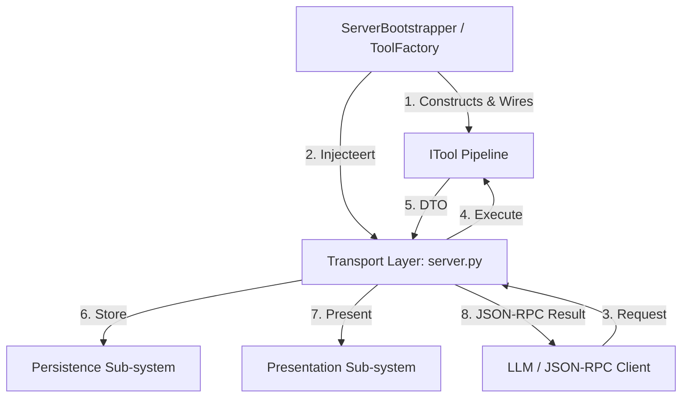

<!-- docs\development\issue406\research.md -->
<!-- template=research version=8b7bb3ab created=2026-06-18T11:15s updated=2026-06-18T16:55s -->
# Research: Russian Doll Decorator Pipeline for Exception Mapping

**Status:** APPROVED  
**Version:** 1.1.0  
**Last Updated:** 2026-06-18

## Prerequisites

Read these first:
1. [docs/development/issue404/design.md](../issue404/design.md)
2. [docs/development/issue404/validation.md](../issue404/validation.md)
3. [docs/development/issue404/decorator_pipeline_design.md](../issue404/decorator_pipeline_design.md)
---

## Problem Statement

The current monolithic implementation of `server.py` (`handle_call_tool`) violates the Single Responsibility Principle (SRP) and Dependency Inversion Principle (DIP) by tightly coupling protocol transport (JSON-RPC) with parameter validation, lifecycle enforcement (guards), response caching, and markdown presentation. To establish a clean, maintainable architecture, the server must be refactored into decoupled subsystems that communicate via strict interface contracts, delegating execution guards to a Russian Doll decorator pipeline and leaving caching, presentation, and double-fault handling to sequential server orchestration.

## Research Goals

- Define a target server architecture of decoupled subsystems (Transport, Execution, Persistence, Presentation, Construction).
- Map execution-related errors (Validation, Enforcement, Platform crashes) to specific decorators in a Russian Doll chain.
- Design a resilient post-execution flow in `server.py` that handles persistence failures and provides a fallback view (Double Fault Prevention).
- Define strict protocols (`ITool`, `IPresenter`, `IToolResponseCache`) to decouple the subsystems and eliminate implementation leaks (such as `presentation_category`).
- Restructure the `interfaces/` package to follow the pure facade pattern, removing definitions from `__init__.py`.

---

## 1. Scope

### 1.1. In Scope
- **Subsystem Refactoring:** Refactoring the monolithic bridge in `server.py` (`handle_call_tool`) into sequential subsystem invocations.
- **Execution Pipeline:** Designing the modular `ITool` decorators for validation, enforcement, and tool error handling.
- **Construction Layer:** Updating `ToolFactory` in `bootstrap.py` to assemble the decorator chain and inject required dependencies.
- **Presenter Interface Contract:** Designing and defining the `IPresenter` interface protocol, shifting all presentation-specific logic (notes formatting, next instructions, and JSON dumps) to the presenter.
- **Persistence Interface Contract:** Updating the `IToolResponseCache` protocol to delegate `run_id` generation to the caching subsystem.
- **Interfaces Packaging:** Reorganizing the `interfaces/` package to move protocol definitions into separate, well-named modules.
- **Test Suite Refactoring:** Refactoring `tests/mcp_server/unit/test_server.py` to assert against the decorated tools and subsystem boundaries.

### 1.2. Out of Scope
- Changing the public JSON-RPC API contracts or response structures.
- Changing the Pydantic schemas of the error DTOs established in Issue #404.
- Adding new tool actions or modifying core execution logic within managers/adapters.

---

## 2. Background & Prior Art

In Issue #404, we resolved the formatting gaps and established the taxonomical error DTO models (`ValidationErrorOutput`, `EnforcementErrorOutput`, `ExecutionErrorOutput`, `CacheErrorOutput`). To protect the test suite, we built a temporary integration bridge directly in `server.py` inside `handle_call_tool` to intercept exceptions and map them to DTOs.

While this bridge successfully proved the DTO contracts, it resulted in high coupling inside `server.py`. The blueprint in `decorator_pipeline_design.md` outlined a 6-layer decorator chain. However, based on our target server architecture, we refine this blueprint: caching and presentation are cross-cutting infrastructure concerns rather than tool execution concerns. They are extracted from the decorator pipeline and handled sequentially in the server orchestrator, keeping the decorator pipeline focused purely on execution-related integrity.

---

## 3. Findings & Analysis

### 3.1. Target Server Architecture Model
The server refactoring is grounded in a clean separation of five distinct subsystems:

1. **Construction Layer (Composition Root - `ToolFactory`):**
   * **Role:** Composes and wires the subsystems at startup. Constructs the decorator chain around the core tools and injects necessary dependencies (such as `EnforcementRunner` and the cache).
   * **Boundary:** All concrete class instantiations (`new`, `Decorator(...)`) are restricted to this layer (`bootstrap.py`).

2. **Transport Layer (The Orchestrator / Controller - `server.py`):**
   * **Role:** Manages the LLM JSON-RPC connection over stdin/stdout, parses incoming tool calls, and serializes outgoing responses.
   * **Boundary:** Implements the protocol transportation layer. It has zero knowledge of validation schemas, lifecycle policies, caching formats, or presentation templates. It orchestrates the other subsystems purely through abstract interfaces.

3. **Execution Sub-system (The Model / Domain Boundary - `ITool` Pipeline):**
   * **Role:** Guards and executes the domain logic. It validates input parameters, checks pre/post enforcement guards, executes the core tool code, and catches execution exceptions, mapping them to taxonomical error DTOs.
   * **Boundary:** Exposed via the `ITool` protocol. It guarantees that `await tool.execute(...)` always returns a valid DTO (success or error) without leaking exceptions.

4. **Persistence Sub-system (The Caching Layer - `IToolResponseCache`):**
   * **Role:** Manages the storage and retrieval of tool outputs (DTOs) to make them accessible as MCP resources.
   * **Boundary:** Exposed via `IToolResponseCache`. It is the sole authority responsible for key generation (`run_id`), URI construction (`pgmcp://cache/runs/{run_id}`), and storage operations.

5. **Presentation Sub-system (The View / Presenter - `IPresenter`):**
   * **Role:** Translates data DTOs and operational notes into formatted markdown strings based on configuration templates (`presentation.yaml`).
   * **Boundary:** Exposed via `IPresenter`. It encapsulates all template lookups, formatting functions, fallback JSON dumps (in case of cache failure), and note presentation.

### 3.2. Systemic Mis-Alignment Analysis
The current monolithic implementation of `MCPServer.handle_call_tool` violates the core architecture contract in several critical areas:

| Current Violation | Architectural Mis-Alignment | Target Architecture Alignment |
| :--- | :--- | :--- |
| **Inline Validation & Guards:** `server.py` contains try-except blocks for `ValidationError` and `MCPError`. | Violates SRP and OCP. Transport layer changes when validation or business guards change. | Validation and enforcement are encapsulated in `InputValidationDecorator` and `EnforcementDecorator`. |
| **Transport Handles Key Gen:** `server.py` generates `run_id` and constructs the cache URI. | Violates DIP and SoC. Key structure and storage location are leaked to the orchestrator. | Caching subsystem (`IToolResponseCache.put`) generates and returns the `run_id` upon successful write. |
| **Monolithic Formatting & Assembly:** `server.py` resolves templates, formats links, and parses note context lists. | Violates Presentation Boundary and Demeter. Server needs internal knowledge of `NoteContext` and formatter. | Presenter (`IPresenter.present_result`) accepts DTO, `run_id` (or `None`), and `NoteContext`, returning the final markdown. |
| **Loose Coupling / Missing Contracts:** Server directly accesses concrete classes with no interface boundaries. | Violates DIP. Components cannot be mocked or refactored independently. | Server communicates with other subsystems strictly via `ITool`, `IToolResponseCache`, and `IPresenter` protocols. |

### 3.3. Control and Data Flow (Outside-in)
The execution of a tool call flows through the subsystems sequentially, communicating purely via DTOs and interfaces:

1. **Transport Layer** receives JSON-RPC request and routes it to the matching `ITool` instance.
2. **Execution Sub-system** (`ITool` pipeline) executes:
   - `InputValidationDecorator` validates arguments against schema -> returns `ValidationErrorOutput` on failure.
   - `EnforcementDecorator` runs pre-guards -> returns `EnforcementErrorOutput` on failure.
   - Core `ITool` executes business logic -> returns success DTO.
   - `ToolErrorHandlerDecorator` catches any unexpected tool crash -> returns `ExecutionErrorOutput` DTO.
3. **Transport Layer** receives the resulting DTO and calls `IToolResponseCache.put(dto)` to persist it.
4. **Persistence Sub-system** caches the DTO, generates a unique `run_id`, and returns it. If caching fails (e.g., disk full), the exception is caught by the server, which sets `run_id = None`.
5. **Transport Layer** calls `IPresenter.present_result(..., data=dto, run_id=run_id, note_context=note_context)` to format the output.
6. **Presentation Sub-system** looks up templates and formats the DTO, notes, and cache link (or provides a JSON fallback dump if `run_id` is `None`).
7. **Transport Layer** packages the formatted text into the final JSON-RPC response and writes to stdout.

### 3.4. Double Fault Prevention Flow
Robust double fault prevention requires that a crash in the caching/presentation steps (such as a full disk or permissions failure) does not crash the client connection:
- If tool execution fails or succeeds, a DTO is returned to the server orchestrator.
- The server orchestrator attempts to write the DTO to the response cache. If this write fails (raising a caching exception), the server catches it, logs the warning to `sys.stderr`/`mcp_audit.log`, and calls the presenter with `run_id = None`.
- The presenter formats the output normally using the template but appends a fallback JSON dump of the DTO to ensure the LLM still receives 100% of the data.
- This ensures the JSON-RPC channel remains completely stable.

### 3.5. Blast Radius & Test Suite Coupling
- **`mcp_server/tools/decorators.py`**: Will host all new decorator classes.
- **`mcp_server/bootstrap.py`**: `ToolFactory.build_tool` will assemble the decorators. `ServerBootstrapper` must pass the required dependencies (`response_cache`, `enforcement_runner`).
- **`mcp_server/server.py`**: The bridge in `handle_call_tool` will be replaced with the clean, sequential invocation of the subsystems.
- **`tests/mcp_server/unit/test_server.py`**: Currently asserts exceptions directly on `server.py` mock targets. These tests will be refactored to verify decorator behavior.

### 3.6. Logging and Stderr Hygiene
We analyzed the logging architecture and identified a minor gap in the current implementation:
- **Current Gap:** Unexpected tool execution exceptions (`exec_exc`) are caught by the temporary bridge in `server.py`, converted to `ExecutionErrorOutput`, and returned. However, they are **not** written to the system error logger or `sys.stderr`/`mcp_audit.log`. This makes it difficult for administrators to monitor errors on the server side.
- **Hygiene Requirement:** Conform to `decorator_pipeline_design.md` §3 by implementing explicit logging inside the decorators:
  - `ToolErrorHandlerDecorator` will log caught execution exceptions to `sys.stderr` / `mcp_audit.log` via the structured logger with `exc_info=True`.
  - The server orchestrator will log publishing/caching failures with `exc_info=True`.
  - Standard output (`sys.stdout`) remains strictly protected for JSON-RPC messages.

### 3.7. Strategy Options & Trade-offs
We compare three options for composing the wrapper pipeline:

| Option | Cost | Risk | Impact | Trade-offs / Verdict |
| :--- | :--- | :--- | :--- | :--- |
| **Option A: Dynamic Runtime Decorators (Russian Doll)** | **Low** (Simple subclassing of `ITool`, reuse existing decorator pattern). | **Low** (Decoupled decorators can be unit tested individually. No reflection required). | **Excellent** (Zero impact on JSON-RPC boundaries. Highly modular, complies with SRP). | **Selected**. Clean, composable, and leverages standard Python class delegation. |
| **Option B: Static Compile-Time Composition** | **Medium** (Requires building custom tool runner classes or compile-time codegen). | **Medium** (Increases complexity in `ToolFactory`, hard to mock or dynamically swap). | **Good** (Keeps execution path flat). | Rejected due to over-engineering and rigidity. |
| **Option C: Middleware-based Pipeline (ASGI/FastAPI style)** | **High** (Requires writing a custom middleware registration layer, request/response context wrappers). | **High** (Complex stack traces, harder to debug within simple MCP connection). | **Excellent** (Highly generic). | Rejected. The MCP server does not run an ASGI server or require full middleware frameworks. |

---

## 4. Resolved Architectural Questions

1. **Decorator Construction Dependency Injection:**
   - **Decision:** `ToolFactory` constructor will be injected with narrow interfaces (`IToolResponseCache` and `EnforcementRunner`) rather than the full configuration settings or `ServerBootstrapper`. This enforces the Interface Segregation Principle (ISP) and keeps the factory decoupled.
2. **NoteContext Routing & Presentation:**
   - **Decision:** Keep note context presentation at the server orchestrator layer rather than creating a new decorator (avoiding YAGNI/overcomplication). The server remains responsible for calling `TextPresenter.present_notes(tool.name, notes)` on the accumulated note entries after tool execution completes and appending the rendered markdown block to the final response.
3. **Caching and Error DTO Presentation:**
   - **Decision:** Caching the output DTOs, presenting the DTOs using `TextPresenter`, and handling any caching-related double faults will remain under the responsibility of the server orchestrator rather than being delegated to custom decorators. This avoids YAGNI, simplifies the decorator pipeline to only execution-related concerns, and keeps the server as the central orchestrator of transport/presentation.
4. **Interface Reorganization:**
   - **Decision:** Establish a facade pattern for the `interfaces/` package. Protocols are moved to dedicated modules and re-exported from `interfaces/__init__.py`. Move the `ITool` protocol to `mcp_server/core/interfaces/itool.py`.

## 5. Approved Strategy

The refactoring strategy is explicitly defined per affected boundary with strict guardrails and sequential implementation steps to prevent regressions:

### 5.1. Refactoring Sequence of Operations (The "Safe-Path" Plan)
To prevent breaking the entire system during this rigorous refactor, the implementation must proceed in the following order:
1. **Interface Extraction & Packaging:** Move protocol definitions to dedicated modules under `mcp_server/core/interfaces/` and refactor `mcp_server/interfaces/__init__.py` to be a pure export facade. Confirm all existing imports are green by running tests.
2. **Decorator Core Implementation:** Implement `InputValidationDecorator`, `EnforcementDecorator`, and `ToolErrorHandlerDecorator` in `mcp_server/tools/decorators.py`. Write isolated unit tests in `tests/mcp_server/unit/test_decorators.py` to assert their behavior under mock inputs and exceptions. Do not wire them to the server yet.
3. **ToolFactory Refactor:** Update `ToolFactory.build_tool` to assemble the decorators around the core tools. Write assembly verification tests.
4. **Server Orchestration Refactor:** Remove the temporary exception-handling bridge from `server.py:handle_call_tool` and replace it with sequential calls to the execution pipeline, caching layer (with try-except double-fault fallback), and presentation layer.
5. **Test Suite Refactoring & Cleanup:** Refactor `tests/mcp_server/unit/test_server.py` to target the decorated tools and verify sequential orchestrator flow. Delete any legacy code.
6. **Validation & Quality Gates:** Run `run_quality_gates` and execute the full test suite to guarantee 100% correctness.

### 5.2. Subsystem Boundary Guardrails
- **Protocol / JSON-RPC Boundary (Preserve Compatibility):** No changes to public JSON-RPC response formats, error schemas, or DTO structures.
- **Transport Layer (`server.py` Guardrails):**
  * `server.py` must contain **no** try-except blocks for tool execution exceptions (e.g. `ValidationError`, `MCPError`). All execution safety is delegated to the decorator pipeline.
  * `server.py` is permitted to catch exceptions only from the persistence layer (`IToolResponseCache.put`), logging a warning to `stderr` and setting `run_id = None`.
- **Execution Pipeline (`ITool` Decorator Guardrails):**
  * All decorators must implement the `ITool` protocol.
  * The execution pipeline must guarantee that `ITool.execute()` returns a DTO (success or error) and never propagates an exception.
- **Persistence Subsystem (`IToolResponseCache` Guardrails):**
  * Generation of `run_id` and formatting of the cache URI (`pgmcp://cache/runs/...`) must be encapsulated within the cache subsystem. `server.py` must not generate keys.
- **Presentation Subsystem (`IPresenter` Guardrails):**
  * Formatting of DTOs, notes, and cache links must be handled exclusively by the presentation layer.
  * If `run_id` is `None` (caching failed), the presenter must format the DTO normally and append a raw JSON block containing the full DTO output to prevent data loss.

---

## 6. Expected Results

To verify the success of the refactoring and ensure it is fully actionable, the implementation must meet the following measurable criteria:

### 6.1. Metrics & Decoupling Targets
- **Code Reduction:** At least 80 lines of try-except mapping, presentation formatting, and key-generation logic removed from `server.py`.
- **Flat Orchestration Flow:** `MCPServer.handle_call_tool` reduced to a linear sequence of 4 subsystem operations: execution, persistence, presentation formatting, and note routing.
- **Type Checking Pass:** Strict Pyright and MyPy checks pass with 0 errors on all modified files, with no global type ignores.
- **Facade Purity:** `interfaces/__init__.py` has exactly 0 lines of execution or protocol definition logic, serving solely as an export catalog.

### 6.2. Test Coverage & Verification Criteria
- **Decorator Unit Tests:** 100% coverage of the newly created `decorators.py` with at least 15 distinct unit tests in `tests/mcp_server/unit/test_decorators.py` verifying:
  * `InputValidationDecorator` returns `ValidationErrorOutput` on schema mismatch.
  * `EnforcementDecorator` returns `EnforcementErrorOutput` on pre/post guard violations.
  * `ToolErrorHandlerDecorator` intercepts arbitrary crashes and returns `ExecutionErrorOutput` while logging traceback to `stderr`.
  * Context parameters and call arguments are correctly forwarded.
- **Double-Fault Integration Verification:** A unit test in `tests/mcp_server/unit/test_server.py` where `IToolResponseCache.put` is mocked to raise an `OSError` (e.g., disk full), verifying that:
  * The server orchestrator does not crash or raise an exception.
  * A warning with tracebacks is logged to standard error.
  * The returned markdown contains a fallback raw JSON block representing the complete DTO.
- **No Regressions:** All 2873+ existing tests pass.

---

## 7. Version History

| Version | Date | Author | Changes |
|---------|------|--------|---------|
| 1.0.0   | 2026-06-18 | Agent  | Initial validation and decorator analysis report |
| 1.1.0   | 2026-06-18 | Agent  | Re-oriented research from outside-in server target architecture and added the construction layer |
| 1.2.0   | 2026-06-18 | Agent  | Added guardrails, sequence of operations strategy, and actionable expected results for refactoring boundaries |
