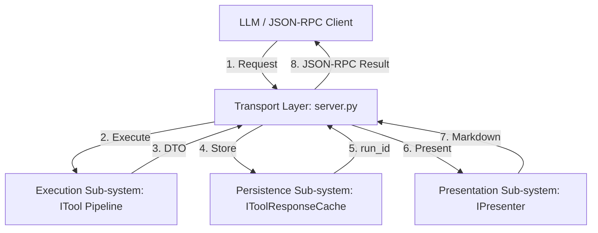

<!-- docs\development\issue406\research.md -->
<!-- template=research version=8b7bb3ab created=2026-06-18T11:15s updated= -->
# Research: Russian Doll Decorator Pipeline for Exception Mapping

**Status:** APPROVED  
**Version:** 1.0.0  
**Last Updated:** 2026-06-18

## Prerequisites

Read these first:
1. [docs/development/issue404/design.md](../issue404/design.md)
2. [docs/development/issue404/validation.md](../issue404/validation.md)
3. [docs/development/issue404/decorator_pipeline_design.md](../issue404/decorator_pipeline_design.md)
---

## Problem Statement

Exception interception is currently implemented as a temporary bridge directly in server.py (handle_call_tool). This violates the Single Responsibility Principle (SRP) by coupling transport/control logic with validation, enforcement, caching, and exception mapping. To scale the architecture and clean up server.py, we need a modular middleware/decorator pipeline to wrap tool execution.

## Research Goals

- Map the 6 system error categories to specific decorators in a Russian Doll chain.
- Ensure robust double fault prevention by separating CacheErrorHandler and ToolErrorHandler.
- Decouple server.py from direct try-except, validation, and enforcement blocks.
- Maintain 100% backward compatibility of JSON-RPC response boundaries and error DTO formats.

---

## 1. Scope

### 1.1. In Scope
- Refactoring the temporary integration bridge in `server.py` (`handle_call_tool`) into modular `ITool` decorators.
- Defining decorators for tool error handling, argument validation, and lifecycle/phase enforcement.
- Updating `ToolFactory` in `bootstrap.py` to assemble the decorator chain.
- Refactoring `tests/mcp_server/unit/test_server.py` to target the decorated tools instead of raw server methods.
- Designing and defining the `IPresenter` interface protocol to decouple the server from presentation-specific logic.
- Designing the refactoring of the interfaces package (moving protocols out of `mcp_server/core/interfaces/__init__.py` into dedicated modules, and moving `ITool` and `ToolExecutionEnvelope` to `mcp_server/core/interfaces/itool.py`).
- Designing the updated cache contract (`IToolResponseCache.put`) to delegate `run_id` generation to the cache subsystem.
- Defining a resilient fallback mechanism (Option B: JSON dump fallback) for cache failures.

### 1.2. Out of Scope
- Changing the public JSON-RPC API contracts or response structures.
- Changing the Pydantic schemas of the error DTOs established in Issue #404.
- Adding new tool actions or modifying core execution logic within managers/adapters.

---

## 2. Background & Prior Art

In Issue #404, we resolved the formatting gaps and established the taxonomical error DTO models (`ValidationErrorOutput`, `EnforcementErrorOutput`, `ExecutionErrorOutput`, `CacheErrorOutput`). 
To keep the test suite protected and stable, we built a temporary integration bridge directly in `server.py` inside `handle_call_tool`.
This temporary bridge intercepts:
1. `ValidationError` (from argument checking) -> `ValidationErrorOutput`
2. `MCPError` (from pre-enforcement guards) -> `EnforcementErrorOutput`
3. Generic `Exception` (from tool execution) -> `ExecutionErrorOutput`
4. Caching failures (double fault validation) -> `CacheErrorOutput`
5. `MCPError` (from post-enforcement guards) -> `EnforcementErrorOutput`

While this bridge successfully achieved 100% of functional goals, it resulted in high coupling inside `server.py` and mixed protocol transportation logic with domain execution concerns. The blueprint in `decorator_pipeline_design.md` outlines the decorator pipeline pattern as the target solution.

---

## 3. Findings & Analysis

### 3.1. Target Server Architecture Model
To align the MCP server with the core project principles (SOLID, DIP, Separation of Concerns), the server must be refactored from a monolithic controller into four logically isolated, decoupled subsystems that communicate exclusively via strict interfaces:

1. **Transport Layer (The Orchestrator / Controller - `server.py`):**
   * **Role:** Manages the LLM JSON-RPC connection over stdin/stdout, parses incoming tool calls, and serializes outgoing responses.
   * **Boundary:** Implements the protocol transportation layer. It has zero knowledge of validation schemas, lifecycle policies, caching formats, or presentation templates. It orchestrates the other subsystems purely through abstract interfaces.

2. **Execution Sub-system (The Model / Domain Boundary - `ITool` Pipeline):**
   * **Role:** Guards and executes the domain logic. It validates input parameters, checks pre/post enforcement guards, executes the core tool code, and catches execution exceptions, mapping them to taxonomical error DTOs.
   * **Boundary:** Exposed via the `ITool` protocol. It guarantees that `await tool.execute(...)` always returns a valid DTO (success or error) without leaking exceptions.

3. **Persistence Sub-system (The Caching Layer - `IToolResponseCache`):**
   * **Role:** Manages the storage and retrieval of tool outputs (DTOs) to make them accessible as MCP resources.
   * **Boundary:** Exposed via `IToolResponseCache`. It is the sole authority responsible for key generation (`run_id`), URI construction (`pgmcp://cache/runs/{run_id}`), and storage operations.

4. **Presentation Sub-system (The View / Presenter - `IPresenter`):**
   * **Role:** Translates data DTOs and operational notes into formatted markdown strings based on configuration templates (`presentation.yaml`).
   * **Boundary:** Exposed via `IPresenter`. It encapsulates all template lookups, formatting functions, fallback JSON dumps (in case of cache failure), and note presentation.

### 3.2. Systemic Mis-Alignment Analysis
The current monolithic implementation of `MCPServer.handle_call_tool` violates the core architecture contract in several critical areas:

| Current Violation | Architectural Mis-Alignment | Target Architecture Alignment |
| :--- | :--- | :--- |
| **Inline Validation & Guards:** `server.py` contains try-except blocks for `ValidationError` and `MCPError`. | Violates SRP and OCP. Transport layer changes when validation or business guards change. | Validation and enforcement are encapsulated in `InputValidationDecorator` and `EnforcementDecorator`. |
| **Transport Handles Key Gen:** `server.py` generates `run_id` and constructs the cache URI. | Violates DIP and SoC. Key structure and storage location are leaked to the orchestrator. | Caching subsystem (`IToolResponseCache.put`) generates and returns the `run_id` upon successful write. |
| **Monolithic Formatting & Assembly:** `server.py` resolves templates, formats links, and parses note context lists. | Violates Presentation Boundary and Demeter. Server needs internal knowledge of `NoteContext` and formatter. | Presenter (`IPresenter.present_result`) accepts DTO, `run_id` (or `None`), and `NoteContext`, returning the final markdown. |
| **Loose Coupling / Missing Contracts:** Server directly accesses concrete classes with no interface boundaries. | Violates DIP. Components cannot be mocked or refactored independently. | Server communicates with other subsystems strictly via `ITool`, `IToolResponseCache`, and `IPresenter` protocols. |

### 3.3. Control and Data Flow (Outside-in)
The execution of a tool call flows through the subsystems sequentially, communicating purely via DTOs and interfaces:

1. **Transport Layer** receives JSON-RPC request and routes it to the matching `ITool` instance.
2. **Execution Sub-system** (`ITool` pipeline) executes:
   - `InputValidationDecorator` validates arguments against schema -> returns `ValidationErrorOutput` on failure.
   - `EnforcementDecorator` runs pre-guards -> returns `EnforcementErrorOutput` on failure.
   - Core `ITool` executes business logic -> returns success DTO.
   - `ToolErrorHandlerDecorator` catches any unexpected tool crash -> returns `ExecutionErrorOutput` DTO.
3. **Transport Layer** receives the resulting DTO and calls `IToolResponseCache.put(dto)` to persist it.
4. **Persistence Sub-system** caches the DTO, generates a unique `run_id`, and returns it. If caching fails (e.g., disk full), the exception is caught by the server, which sets `run_id = None`.
5. **Transport Layer** calls `IPresenter.present_result(..., data=dto, run_id=run_id, note_context=note_context)` to format the output.
6. **Presentation Sub-system** looks up templates and formats the DTO, notes, and cache link (or provides a JSON fallback dump if `run_id` is `None`).
7. **Transport Layer** packages the formatted text into the final JSON-RPC response and writes to stdout.

### 3.4. Double Fault Prevention Flow
Robust double fault prevention requires that a crash in the caching/presentation steps (such as a full disk or permissions failure) does not crash the client connection:
- If tool execution fails or succeeds, a DTO is returned to the server orchestrator.
- The server orchestrator attempts to write the DTO to the response cache. If this write fails (raising a caching exception), the server catches it, logs the warning to `sys.stderr`/`mcp_audit.log`, and calls the presenter with `run_id = None`.
- The presenter formats the output normally using the template but appends a fallback JSON dump of the DTO to ensure the LLM still receives 100% of the data.
- This ensures the JSON-RPC channel remains completely stable.

### 3.5. Blast Radius & Test Suite Coupling
- **`mcp_server/tools/decorators.py`**: Will host all new decorator classes.
- **`mcp_server/bootstrap.py`**: `ToolFactory.build_tool` will assemble the decorators. `ServerBootstrapper` must pass the required dependencies (`response_cache`, `enforcement_runner`).
- **`mcp_server/server.py`**: The bridge in `handle_call_tool` will be replaced with the clean, sequential invocation of the subsystems.
- **`tests/mcp_server/unit/test_server.py`**: Currently asserts exceptions directly on `server.py` mock targets. These tests will be refactored to verify decorator behavior.

### 3.6. Logging and Stderr Hygiene
We analyzed the logging architecture and identified a minor gap in the current implementation:
- **Current Gap:** Unexpected tool execution exceptions (`exec_exc`) are caught by the temporary bridge in `server.py`, converted to `ExecutionErrorOutput`, and returned. However, they are **not** written to the system error logger or `sys.stderr`/`mcp_audit.log`. This makes it difficult for administrators to monitor errors on the server side.
- **Hygiene Requirement:** Conform to `decorator_pipeline_design.md` §3 by implementing explicit logging inside the decorators:
  - `ToolErrorHandlerDecorator` will log caught execution exceptions to `sys.stderr` / `mcp_audit.log` via the structured logger with `exc_info=True`.
  - The server orchestrator will log publishing/caching failures with `exc_info=True`.
  - Standard output (`sys.stdout`) remains strictly protected for JSON-RPC messages.

### 3.7. Strategy Options & Trade-offs
We compare three options for composing the wrapper pipeline:

| Option | Cost | Risk | Impact | Trade-offs / Verdict |
| :--- | :--- | :--- | :--- | :--- |
| **Option A: Dynamic Runtime Decorators (Russian Doll)** | **Low** (Simple subclassing of `ITool`, reuse existing decorator pattern). | **Low** (Decoupled decorators can be unit tested individually. No reflection required). | **Excellent** (Zero impact on JSON-RPC boundaries. Highly modular, complies with SRP). | **Selected**. Clean, composable, and leverages standard Python class delegation. |
| **Option B: Static Compile-Time Composition** | **Medium** (Requires building custom tool runner classes or compile-time codegen). | **Medium** (Increases complexity in `ToolFactory`, hard to mock or dynamically swap). | **Good** (Keeps execution path flat). | Rejected due to over-engineering and rigidity. |
| **Option C: Middleware-based Pipeline (ASGI/FastAPI style)** | **High** (Requires writing a custom middleware registration layer, request/response context wrappers). | **High** (Complex stack traces, harder to debug within simple MCP connection). | **Excellent** (Highly generic). | Rejected. The MCP server does not run an ASGI server or require full middleware frameworks. |

---

## 4. Resolved Architectural Questions

1. **Decorator Construction Dependency Injection:**
   - **Decision:** `ToolFactory` constructor will be injected with narrow interfaces (`IToolResponseCache` and `EnforcementRunner`) rather than the full configuration settings or `ServerBootstrapper`. This enforces the Interface Segregation Principle (ISP) and keeps the factory decoupled.
2. **NoteContext Routing & Presentation:**
   - **Decision:** Keep note context presentation at the server orchestrator layer rather than creating a new decorator (avoiding YAGNI/overcomplication). The server remains responsible for calling `TextPresenter.present_notes(tool.name, notes)` on the accumulated note entries after tool execution completes and appending the rendered markdown block to the final response.
3. **Caching and Error DTO Presentation:**
   - **Decision:** Caching the output DTOs, presenting the DTOs using `TextPresenter`, and handling any caching-related double faults will remain under the responsibility of the server orchestrator rather than being delegated to custom decorators. This avoids YAGNI, simplifies the decorator pipeline to only execution-related concerns, and keeps the server as the central orchestrator of transport/presentation.

## 5. Approved Strategy

The strategy is explicitly defined per affected boundary:

- **Protocol / JSON-RPC Boundary:** **Preserve compatibility**. There will be zero changes to the public JSON-RPC response shapes, payload contracts, or the error DTO schemas.
- **Tool Composition / Instantiation Boundary:** **Clean break**. The temporary try-except, validation, and enforcement blocks inside `server.py` (`handle_call_tool`) will be completely removed and replaced with the modular decorator pipeline.
- **Test Suite Boundary:** **Clean break / Refactoring**. Mocked tests in `test_server.py` that currently target `server.py` exception mapping will be refactored to verify decorators or target the fully wrapped tools. New unit tests will be introduced in `test_decorators.py`.
- **Logging & Diagnostics Boundary:** **New requirement**. Standardize exception logging inside the decorators to write tracebacks to `sys.stderr` / `mcp_audit.log`, resolving the logging gaps.
- **Presentation Boundary / Content Separation:** **Clean break / Strict Contract**. In accordance with Section 15 of `ARCHITECTURE_PRINCIPLES.md`, no core domain, business logic, or adapter code may contain hardcoded user-facing text, emojis, or formatting templates. All human-readable outputs and formatting must be resolved in the presentation layer (via `TextPresenter`) or external configuration (`presentation.yaml`).

## 6. Expected Results

Complete decoupling of server.py from validation, enforcement, and exception handling blocks. Clean, modular decorators in decorators.py that implement the ITool interface. 100% test success across all 2873 unit and integration tests.

---

## 7. Version History

| Version | Date | Author | Changes |
|---------|------|--------|---------|
| 1.0.0 | 2026-06-18 | Agent | Initial validation and decorator analysis report |
| 1.1.0 | 2026-06-18 | Agent | Re-oriented research from outside-in server target architecture |
