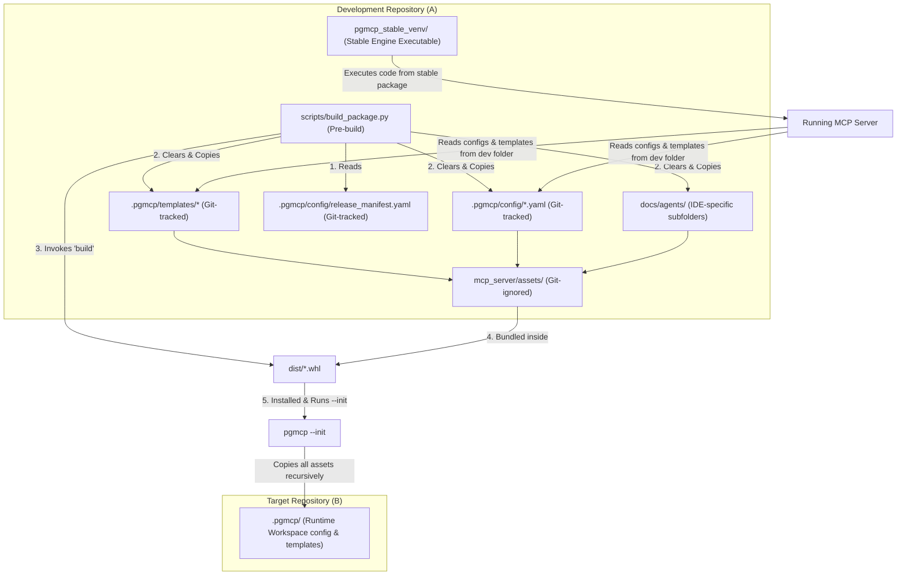

<!-- c:\temp\pgmcp\docs\development\issue420\design.md -->
<!-- template=design version=5827e841 created=2026-07-07T09:58Z updated= -->
# Release Assets Sync and Config Validation Design

**Status:** DRAFT  
**Version:** 1.0  
**Last Updated:** 2026-07-07

---

## 1. Context & Requirements

### 1.1. Problem Statement

Clean repository checkouts lack .pgmcp/templates. CLI pgmcp --init lacks complete assets copy. Build/release packaging sync is deferred. Configuration updates require a clean-break fail-fast mechanism.

### 1.2. Requirements

**Functional:**
- [ ] Track .pgmcp/templates/ under version control in Git to solve checkout chicken-and-egg blocker.
- [ ] Refactor pgmcp --init to recursively copy the entire mcp_server/assets/ directory (flat recursive copy).
- [ ] Delete the duplicate mcp_server/scaffolding/templates directory and update test suite to use Settings-resolved template paths.
- [ ] Add a version validation check for configuration files at server startup, raising a user-friendly ConfigError on mismatch.
- [ ] Implement build-time pre-build sync script (scripts/build_package.py) that parses .pgmcp/config/release_manifest.yaml and copies source assets to mcp_server/assets/ prior to building.

**Non-Functional:**
- [ ] Maintain strict separation of production runtime from developer workspace setups (no dev-specific code paths in CLI).
- [ ] Ensure no duplicate templates exist in Git (assets folder must be ignored).
- [ ] Keep the version checking logic minimal and non-invasive, avoiding any auto-merge or migration code.

### 1.3. Constraints

None
---

## 2. Design Options

### 2.1. Option A: Clean-break validation with friendly error messages (Chosen)

Define simple schema versions (expected: '1.0.0'). If a validation or version mismatch is found, fail fast with a friendly ConfigError indicating how to fix it.

**Pros:**
- ✅ Extremely simple implementation.
- ✅ No risk of data loss via automated writes.
- ✅ Keeps codebase lean.

**Cons:**
- ❌ Requires manual user updates to configuration files on breaking upgrades.

### 2.2. Option B: Strict versioning with automated upgrade tool

Define a schema version for the workspace, perform fail-fast validation, and implement pgmcp --upgrade to backup and migrate old configurations.

**Pros:**
- ✅ Automated migration for users.
- ✅ Prevents manual config edits.

**Cons:**
- ❌ High codebase complexity.
- ❌ Requires parsing/merging YAML files.
- ❌ Increases maintenance debt.
---

## 3. Chosen Design

**Decision:** Establish Git-tracked templates, flat-copy initialization, config version fail-fast checks, and build-time sync scripting.

**Rationale:** This approach keeps the CLI code clean and generic, eliminates template duplication, and guarantees startup stability with friendly errors on mismatch without adding complex upgrade machinery.

### 3.1. Key Design Decisions

| Decision | Rationale |
|----------|-----------|
| Templates tracked in Git | Ensures clean clones are immediately usable without executing CLI bootstrap commands. |
| CLI --init flat copy | Performs a flat recursive copy of packaged assets, excluding transient log files like `template_registry.json`. |
| Clean-break config version validation | Maintains code simplicity while providing clear developer feedback on mismatch. |
| Build-time manifest copying | Automates packaging of release assets dynamically without checking generated files into Git. |
| Dynamic environment override for tests (Richtung 1) | Resolves the test templates path dynamically using Settings defaults in conftest.py, keeping tests DRY and avoiding template file copying. |
| IDE-Specific Agent Layout | Gathers instructions, roles, and rules under `docs/agents/` separated by IDE (VS Code and Antigravity 2.0). Bypasses brittle automated sync scripts in favor of manual/agent-guided deployment. |

### 3.2. Component Architecture



### 3.3. IDE-Specific Agent Instructions Layout (SSOT)

To avoid dependency on fluid and changing IDE instruction path structures, the repository gathers all instructions under `docs/agents/` partitioned by target environment. No automated sync scripts are implemented. Copying files to active runtime paths is a developer-driven or agent-guided manual bootstrap step.

```
docs/agents/
├── vscode/
│   ├── AGENTS.md                  # VS Code global rules
│   └── .github/agents/            # VS Code agent personas
│       ├── co.agent.md
│       ├── imp.agent.md
│       └── qa.agent.md
└── antigravity/
    ├── AGENTS.md                  # Antigravity/Gemini global rules
    ├── rules/                     # Antigravity agent personas
    │   ├── co.agent.md
    │   ├── imp.agent.md
    │   └── qa.agent.md
    └── workflows/                 # Antigravity slash commands
        ├── create-issue.md
        ├── end-issue.md
        ├── go.md
        └── start-issue.md
```

### 3.4. Illustrative Code Design

#### CLI Flat Copy (mcp_server/cli.py)
In `mcp_server/cli.py`, replace individual directory copies with a single flat recursive copy:
```python
# In mcp_server/cli.py:
resolved_server_root.mkdir(parents=True, exist_ok=True)
# Perform a flat recursive copy of the entire assets/ directory
shutil.copytree(assets_dir, resolved_server_root, dirs_exist_ok=True)
```

#### Centralized Version Validation Check (mcp_server/config/loader.py)
In `mcp_server/config/loader.py`, check the `version` field from loaded configuration YAML files. If the version is not `"1.0.0"`, fail fast with a friendly `ConfigError`:
```python
# In mcp_server/config/loader.py:
def _validate_schema(
    self,
    schema_cls: type[SchemaT],
    data: dict[str, Any],
    resolved_path: Path,
) -> SchemaT:
    # Validate version field (clean-break)
    config_version = data.get("version")
    expected_version = "1.0.0"
    if config_version is not None and config_version != expected_version:
        raise ConfigError(
            f"Config version mismatch in {resolved_path.name}: "
            f"expected version '{expected_version}', found '{config_version}'. "
            f"Please update your configuration to match the current server version.",
            file_path=str(resolved_path),
        )
    try:
        return schema_cls.model_validate(data)
    except ValidationError as exc:
        raise ConfigError(
            f"Config validation failed for {resolved_path.name}: {exc}",
            file_path=str(resolved_path),
        ) from exc
```

#### Dynamic Env Var Override for Tests (tests/conftest.py)
Configure the test environment globally to resolve templates dynamically from Settings and point to the dev repository's templates:
```python
# In tests/conftest.py:
import os
from pathlib import Path
from mcp_server.config.settings import Settings

_project_root = Path(__file__).resolve().parent.parent

# Read default server root directory dynamically from Settings class
default_settings = Settings()
dev_server_root = default_settings.server.server_root_dir  # Dynamically resolved to ".pgmcp"

# Configure default templates root for settings path resolution in tests
os.environ["MCP_TEMPLATE_ROOT"] = str(
    (_project_root / dev_server_root / "templates").resolve()
)
```

#### DRY Template Root Access in Tests (tests/mcp_server/test_support.py)
Update `get_template_root` in the test support module to read directly from Settings, eliminating duplicate fallback definitions:
```python
# In tests/mcp_server/test_support.py:
def get_template_root() -> Path:
    """Get the template root directory from settings."""
    from mcp_server.config.settings import Settings
    return Settings.from_env().server.resolved_template_root
```

#### Build Manifest Structure (.pgmcp/config/release_manifest.yaml)
The build manifest defines mappings of files to package assets, excluding `template_registry.json`:
```yaml
# .pgmcp/config/release_manifest.yaml
version: "1.0.0"

assets:
  - source: ".pgmcp/config"
    target: "config"
  - source: ".pgmcp/templates"
    target: "templates"
  - source: "docs/agents/vscode"
    target: "agents/vscode"
  - source: "docs/agents/antigravity"
    target: "agents/antigravity"
```

#### Build Package Sync Pipeline (scripts/build_package.py)
The pre-build automation script:
```python
# In scripts/build_package.py:
from pathlib import Path

def clean_assets(assets_dir: Path) -> None:
    """Clean the package assets directory prior to copying."""
    ...

def read_manifest(manifest_path: Path) -> dict:
    """Read and return manifest mappings, failing fast if the manifest is missing."""
    ...

def copy_assets(project_root: Path, assets_dir: Path, manifest: dict) -> None:
    """Copy assets declared in the manifest, validating existence (Fail-Fast)."""
    ...

def build_package() -> None:
    """Main build orchestration logic (Composition Root).
    
    Cleans target assets, reads build manifest, copies files, and
    triggers python package build ('python -m build').
    """
    ...
```

### 3.5. Architectural Principles Compliance

The script `scripts/build_package.py` adheres to the binding `ARCHITECTURE_PRINCIPLES.md` contract as follows:
* **SRP (Single Responsibility Principle):** The script separates build steps into distinct, cohesive functions (`clean_assets`, `read_manifest`, `copy_assets`). The `build_package()` orchestrator acts as the sole coordinator.
* **Fail-Fast:** The script aborts immediately and raises `FileNotFoundError` if:
  - The `release_manifest.yaml` file is missing.
  - Any source file or directory declared in the manifest does not exist.
  This prevents building incomplete wheels.
* **DRY (Don't Repeat Yourself):** Source paths are not hardcoded in the Python script; the manifest file `.pgmcp/config/release_manifest.yaml` is the Single Source of Truth (SSOT).
* **No Import-Time Side Effects:** The script encapsulates all execution logic inside functions and guards execution with `if __name__ == "__main__":`, allowing the module to be safely imported.
* **Presentation Boundary:** The script outputs clean logs without hardcoded decoration or emojis.

### 3.6. Execution of the Build Pipeline

The build pipeline is executed manually by the developer or via CI/CD workflows using a standard terminal command:
```bash
python scripts/build_package.py
```
This command performs the pre-build asset synchronization (clean and copy from workspace to `mcp_server/assets/`), and then triggers the standard Python package build process (`python -m build`), resulting in the generated wheel file inside the `dist/` directory.

## Related Documentation
- [docs/reference/mcp/release-assets-procedure.md](file:///c:/temp/pgmcp/docs/reference/mcp/release-assets-procedure.md)
---

## Version History

| Version | Date | Author | Changes |
|---------|------|--------|---------|
| 1.0 | 2026-07-07 | Agent | Initial draft |