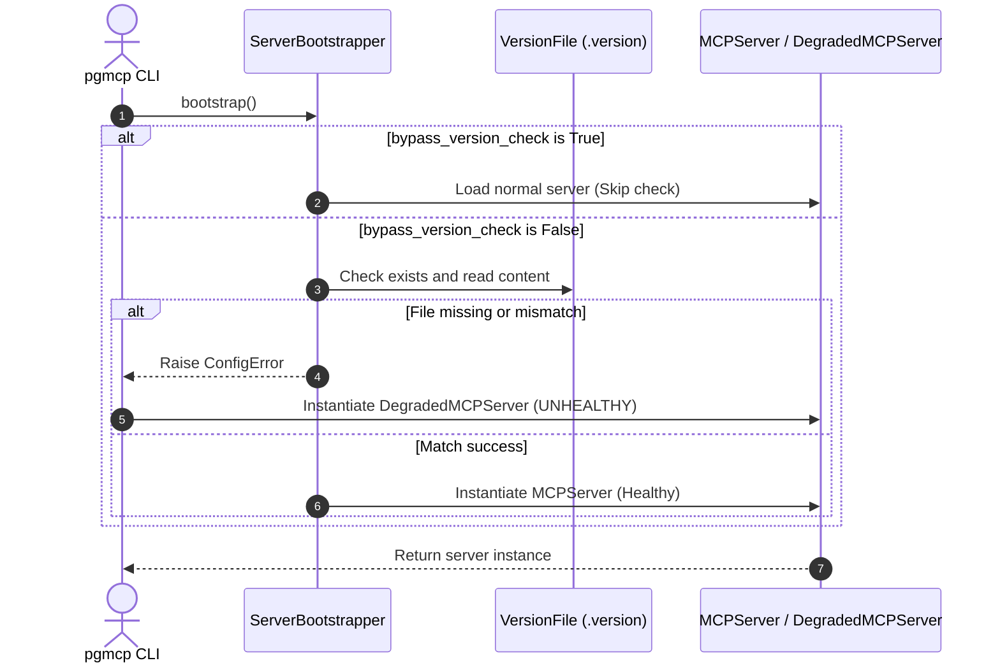

<!-- docs\development\issue435\design.md -->
<!-- template=design version=5827e841 created=2026-07-19T20:07Z updated= -->
# Design - Issue #435: Workspace Version Tracking

**Status:** APPROVED  
**Version:** 1.0  
**Last Updated:** 2026-07-19

---

## 1. Context & Requirements

### 1.1. Problem Statement

No version file exists in `.pgmcp/` to verify asset-to-code alignment, causing potential crashes when config/template schemas change between package releases.

### 1.2. Requirements

**Functional:**
- [x] Record the package/wheel version in `.pgmcp/.version` during `pgmcp --init`.
- [x] Validate that `.version` exists and matches the running server version during startup.
- [x] Transitions to degraded server mode (`UNHEALTHY` status, health check tool only) on validation failure.
- [x] Bypass version verification automatically when running tests.

**Non-Functional:**
- [x] Zero file I/O operations inside Settings configuration instantiation (preserves purity).
- [x] Graceful degradation that does not cause unhandled process termination.
- [x] Easy integration for the future `--upgrade` command.

### 1.3. Constraints
- **Preserve Compatibility:** The system must not crash if `.version` is missing; it must transition to degraded mode.
- **Architectural Purity:** `ServerSettings` must remain a pure value object without I/O responsibilities.

---

## 2. Design Options

### 2.1. Option A: Plain text version marker with degraded mode (Chosen)

Store version as plain text in `.pgmcp/.version`. Raise `ConfigError` on bootstrapper mismatch, falling back to `DegradedMCPServer`.

**Pros:**
- ✅ Simple and lightweight.
- ✅ Easy to read by external scripts.
- ✅ Fails fast and clean.

**Cons:**
- ❌ Cannot record additional structured metadata (like install timestamp).

### 2.2. Option B: JSON structured version marker with warn-only enforcement

Store version as JSON metadata. Output warnings during boot instead of raising errors.

**Pros:**
- ✅ Extensible for future fields.

**Cons:**
- ❌ Higher parsing failure risk.
- ❌ Silent failures can go unnoticed by agents.

---

## 3. Chosen Design

**Decision:** Implement plain-text version tracking file (`.version`) under `.pgmcp/` during initialization, enforced via `ServerBootstrapper` validation checking against `Settings().server.version`. In case of mismatch or missing file, raise `ConfigError` causing transition to `DegradedMCPServer` with `UNHEALTHY` status. Skip check in test environments by configuring default bypass in settings.

**Rationale:** Plain-text storage is simple, reliable, and avoids JSON decoding error risks. Hard validation via `DegradedMCPServer` ensures developers receive immediate, actionable feedback on outdated workspaces without crashing the client. Default bypass in pytest prevents breaking the massive test suite's dynamic mocks.

### 3.1. Key Design Decisions

| Decision ID | Decision Title | Chosen Option | Rationale | Status |
|:---|:---|:---|:---|:---|
| **DEC_1** | Version Storage File Format | Plain text file containing version string only | Simplest and most robust format, avoiding JSON decoding risks. | APPROVED |
| **DEC_2** | Enforcement Severity | Hard validation error leading to `DegradedMCPServer` | Guarantees clear, fast feedback when workspaces are outdated. | APPROVED |
| **DEC_3** | Test Suite Isolation | Default bypass in pytest via `ServerSettings` factory | Automatically disables validation in tests using `PYTEST_CURRENT_TEST` env var detection, preventing regressions in mock workspaces. | APPROVED |

---

## 4. Component Mapping & Data Flow

### 4.1. Affected Components
- **`mcp_server/config/settings.py`:** Add `bypass_version_check: bool = Field(default_factory=lambda: bool(os.environ.get("PYTEST_CURRENT_TEST")))` to `ServerSettings`.
- **`mcp_server/cli.py`:** Inside `args.init` block, write version to `.version` after `shutil.copytree`.
- **`mcp_server/bootstrap.py`:** In `ServerBootstrapper.bootstrap()`, perform the version file validation first (raise `ConfigError` if check fails).

### 4.2. Control Flow Diagram

---

## 5. Design Validation & Verification Plan

### 5.1. Automated Test Plan
- **`test_cli.py`:**
  - Test that `pgmcp --init` successfully writes the correct package version to `.pgmcp/.version`.
- **`test_bootstrap.py`:**
  - Test that missing `.version` file raises `ConfigError` when `bypass_version_check=False`.
  - Test that version mismatch raises `ConfigError` when `bypass_version_check=False`.
  - Test that version match successfully passes validation.
  - Test that `bypass_version_check=True` skips all validation checks.

### 5.2. Manual Verification
- Rename `.pgmcp/.version` to a mismatching version (e.g. `9.9.9`), start the server, and verify using `health_check` tool that status is `UNHEALTHY` and the mismatch reason is reported.

---

## 📖 Version History

| Version | Date | Author | Changes |
|---------|------|--------|---------|
| 1.0 | 2026-07-19 | Agent | Initial Definitive Design Document |
