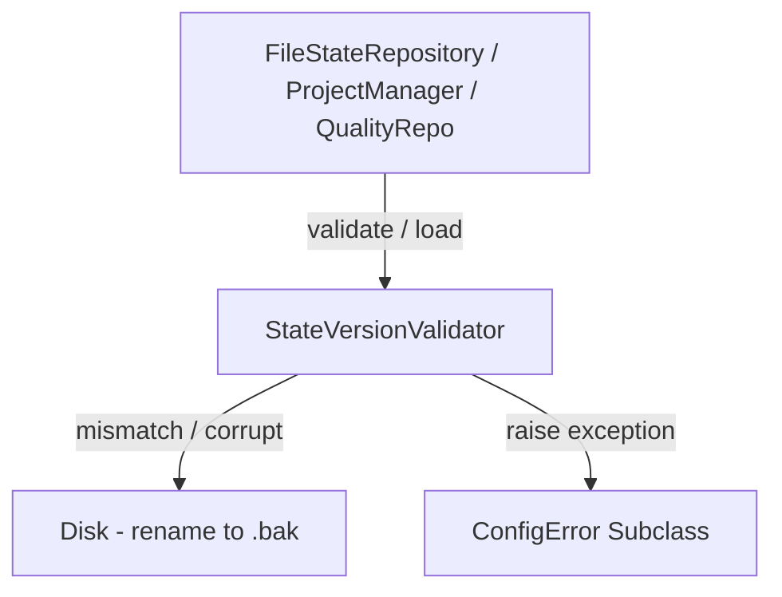

<!-- c:\temp\pgmcp\docs\development\issue438\design.md -->
<!-- template=design version=5827e841 created=2026-07-20T20:38Z updated=2026-07-20T22:45Z -->
# Dynamic State File Versioning Design

**Status:** DRAFT  
**Version:** 1.0  
**Last Updated:** 2026-07-20

---

## Purpose

Define the architectural and interface design for dynamic state file version validation and SRP bootstrapper refactoring.

## Scope

**In Scope:**
- Exception hierarchy subclassing `ConfigError` for state errors.
- Design of the `StateVersionValidator` utility service.
- Integration points in `FileStateRepository`, `ProjectManager`, and `FileQualityStateRepository`.
- Removal of the git-log silent reconstruction fallback in `PhaseStateEngine`.
- Schema additions (`schema_version: str = "1.0.0"`) to all state DTO models.
- Design of the `WorkspaceVersionValidator` service and `ServerBootstrapper` cleanup.

**Out of Scope:**
- Python-level database-like JSON schema migration scripts.

## Prerequisites

1. Approved Strategy from the Research phase
2. Familiarity with the Russian Doll Decorator Pipeline

---

## 1. Context & Requirements

### 1.1. Problem Statement

Dynamic state files (`state.json`, `deliverables.json`, `quality_state.json`) lack version validation and consistent error mapping. Mismatches and file corruptions cause unhandled Python exception crashes and raw tracebacks, and silent overwrites in `PhaseStateEngine` violate the Single Source of Truth.

### 1.2. Requirements

**Functional:**
- **DFV.1 (Lazy Validation):** Verify state schema versions dynamically during load-time.
- **DFV.2 (Backup & Reset):** Rename mismatched or corrupt files to a `.bak` suffix (without timestamps) and raise standard `ConfigError` subclasses.
- **DFV.3 (Enforce SSOT):** Eliminate the silent git-log reconstruction fallback in `PhaseStateEngine` on state read/load failure.
- **DFV.4 (Version Headers):** Add `schema_version` to `state.json`, `deliverables.json` (root-level), and `quality_state.json` DTOs in SemVer format (`x.y.z`).
- **DFV.5 (SRP Bootstrapper):** Decouple `.version` file verification out of `ServerBootstrapper` to a separate class.

**Non-Functional:**
- **NFR.1 (DRY Error Handling):** Map all state exceptions to `ConfigError` to leverage the existing `ToolErrorHandlerDecorator`.
- **NFR.2 (Graceful context degradation):** Do not allow `get_work_context` to crash when state files are missing; return success with warnings in instructions.

### 1.3. Constraints

- SemVer format (`x.y.z`) for all schema versions (e.g. `"1.0.0"`).
- Backup renaming must strictly use `{filename}.bak` suffix without timestamps.
- All dependencies must be constructor-injected; no direct instantiation inside execution paths.

---

## 2. Design Options

### 2.1. Option 1: Central StateVersionValidator service called lazy at runtime (Preferred)

A dedicated manager service `StateVersionValidator` performs load-time file validation, schema-version checking, and backup rename logic.

**Pros:**
- Keeps logic DRY, co-located in managers, reusable, and respects load-time/branch-switch dynamics.
- Isolates disk manipulation (`.bak` renaming) in one place.

**Cons:**
- Requires modifying repositories to compose the validator service.

### 2.2. Option 2: Automatic Pydantic schema migration in Python code

Implement python-level migration logic to translate older schema versions to new schema formats on the fly.

**Pros:**
- Preserves existing state data across minor version changes.

**Cons:**
- Extremely complex to maintain, prone to version-migration bugs (migration hell), violates YAGNI.

---

## 3. Chosen Design

**Decision:** Implement a central `StateVersionValidator` service called lazy by repositories at load-time. Mismatches/corruptions rename files to `*.bak` and raise custom `ConfigError` subclasses caught and formatted cleanly by the Russian Doll Decorator pipeline.

### 3.1. Key Design Decisions

| Decision | Rationale |
|----------|-----------|
| **File-wide version envelope (Option A)** | Wraps the deliverables project dictionary in a root envelope: `{ "schema_version": "1.0.0", "projects": { ... } }`. Highly cohesive, avoids nested structural diving. |
| **Quality State Auto-Reset** | Rename to `quality_state.json.bak`, log warning, and auto-initialize a fresh empty `QualityState` DTO (transient cache data only). |
| **Remove Silent Reconstruct** | Remove `PhaseStateEngine._load_state_or_reconstruct` entirely to enforce `state.json` as the strict Single Source of Truth (SSOT). |
| **Workspace Version Delegation** | Extract `.version` checking out of `ServerBootstrapper` to `WorkspaceVersionValidator`. |

---

## 4. Technical Specification

### 4.1. Class Structure & Interfaces



#### State Exceptions (`mcp_server/core/exceptions.py`)
```python
from mcp_server.core.exceptions import ConfigError

class StateNotFoundError(ConfigError):
    """Raised when a dynamic state file is missing."""
    def __init__(self, message: str, file_path: str) -> None: ...

class StateCorruptedError(ConfigError):
    """Raised when a dynamic state file contains malformed JSON."""
    def __init__(self, message: str, file_path: str) -> None: ...

class StateVersionMismatchError(ConfigError):
    """Raised when state.json schema version does not match expected version."""
    def __init__(self, message: str, file_path: str, actual_version: str, expected_version: str) -> None: ...

class PlanningVersionMismatchError(ConfigError):
    """Raised when deliverables.json schema version does not match expected version."""
    def __init__(self, message: str, file_path: str, actual_version: str, expected_version: str) -> None: ...
```

#### State Version Validator (`mcp_server/managers/state_version_validator.py`)
```python
from pathlib import Path
from typing import Any

class StateVersionValidator:
    """Service responsible for validating dynamic state file schema versions and corruptions."""
    
    def validate_and_load(
        self,
        file_path: Path,
        expected_version: str,
        is_planning: bool = False
    ) -> dict[str, Any] | None:
        """Validate dynamic state file schema version and contents.
        
        If missing: returns None.
        If corrupt: renames file to {filename}.bak and raises StateCorruptedError.
        If version mismatch: renames file to {filename}.bak and raises appropriate VersionMismatchError.
        If valid: returns parsed json dictionary.
        """
        ...
```

#### Workspace Version Validator (`mcp_server/core/workspace_validator.py`)
```python
from mcp_server.config.settings import ServerSettings

class WorkspaceVersionValidator:
    """Validator for workspace .version compatibility checking at server boot."""
    
    def validate(self, settings: ServerSettings) -> None:
        """Validate workspace .version file against server package version.
        
        Bypasses if bypass_version_check is configured.
        Raises ConfigError on mismatch or missing file.
        """
        ...
```

### 4.2. DTO Models Schema Updates

#### `BranchState` (`mcp_server/managers/state_repository.py`)
```python
class BranchState(BaseModel):
    schema_version: str = "1.0.0"
    branch: str
    workflow_name: str
    current_phase: str
    # ... other fields
```

#### `QualityState` (`mcp_server/state/quality_state.py`)
```python
class QualityState(BaseModel):
    schema_version: str = "1.0.0"
    baseline_sha: str | None = None
    failed_files: list[str] = Field(default_factory=list)
```

---

## 5. Design Validation & Test Plan

### 5.1. Unit and Integration Test Plan
1. **Validator Tests (`test_state_version_validator.py`):**
   - Verify missing file returns `None`.
   - Verify corrupt file renames to `.bak` and raises `StateCorruptedError`.
   - Verify mismatched version renames to `.bak` and raises `StateVersionMismatchError`.
2. **Repository Integration Tests:**
   - Verify `FileStateRepository.load()` raises `StateNotFoundError` when missing, and handles corrupt/mismatch correctly.
   - Verify `ProjectManager` handles deliverables envelop load-time mismatches.
   - Verify `FileQualityStateRepository` auto-resets on mismatch/corruption after backing up.
3. **Graceful degradation in get_work_context:**
   - Verify that when `FileStateRepository.load()` raises `StateNotFoundError` or `StateCorruptedError`, `get_work_context` tool intercepts it and returns a clean warning instructing the agent to run `initialize_project` instead of crashing.

---

## 6. Open Questions & Risks

### 6.1. Resolved Questions
- **Version Format:** Use standard SemVer string format (e.g. `"1.0.0"`) for all schema version fields to ensure consistency.
- **Backup Naming:** Use simple `{filename}.bak` suffix without timestamps. Mismatches will overwrite the backup, avoiding disk clutter.
- **Silent Reconstruct Removal Risk:** We must ensure all transition test suites mock the repository states properly instead of relying on git-based auto-reconstructs.

---

## Related Documentation
- **[docs/coding_standards/ARCHITECTURE_PRINCIPLES.md][related-1]**
- **[docs/coding_standards/DOCUMENTATION_STANDARD.md][related-2]**

<!-- Link definitions -->

[related-1]: docs/coding_standards/ARCHITECTURE_PRINCIPLES.md
[related-2]: docs/coding_standards/DOCUMENTATION_STANDARD.md

---

## Version History

| Version | Date | Author | Changes |
|---------|------|--------|---------|
| 1.0 | 2026-07-20 | Agent | Initial design artifact for dynamic state version validation and bootstrapper refactoring. |
