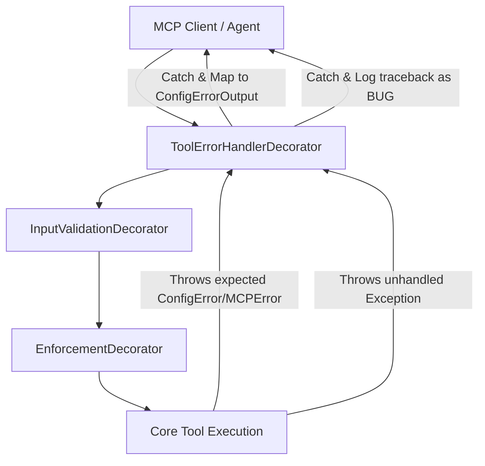

<!-- c:\temp\pgmcp\docs\development\issue438\research.md -->
<!-- template=research version=8b7bb3ab created=2026-07-20T20:17Z updated=2026-07-20T22:25Z -->
# Dynamic State File Versioning Research

**Status:** APPROVED  
**Version:** 1.0  
**Last Updated:** 2026-07-20

---

## Purpose

Define the error boundaries, exception mapping rules, and versioning strategy for dynamic state files.

## Scope

**In Scope:**
- Mapping tool-level boundary consequences of missing or corrupt state files.
- Aligning exception mapping with the Russian Doll Decorator Pipeline.
- Removing silent reconstruction fallbacks in `PhaseStateEngine`.
- Implementing load-time schema version validation and backup-on-mismatch actors.
- Decoupling workspace version validation logic from the `ServerBootstrapper` composition root (SRP).

**Out of Scope:**
- Implementing active Python-level data schema migration logic (field mapping).
- Refactoring configuration file validation (handled by `ConfigLoader` at startup).

## Prerequisites

1. Familiarity with the Russian Doll Decorator Pipeline (Issue #406 / #410).
2. Understanding of state repositories (`state_repository.py`, `quality_state_repository.py`, `project_manager.py`).

---

## Problem Statement

Dynamic state files (`state.json`, `deliverables.json`, `quality_state.json`) lack schema versioning and consistent boundary-level exception mapping. When these files are missing, corrupt, or mismatched:
- Raw I/O and parse exceptions (like `FileNotFoundError` or `JSONDecodeError`) bubble to the server boundary.
- Unhandled exceptions trigger `[BUG]` traceback logging in the server stderr, making normal workspace scenarios appear as system defects.
- Inconsistent fallbacks exist (such as silent reconstruction of `state.json` based on git history), violating the Single Source of Truth (SSOT) principle.

---

## Research Goals

- Analyze the actual tool-level boundary consequences of missing or corrupt state files.
- Establish a clean exception-mapping model using the existing Russian Doll Decorator Pipeline.
- Evaluate version detection timing and dynamic state migration versus defensive backup-and-reset policies.
- Decouple workspace version validation logic from the ServerBootstrapper composition root.

---

## Background: Exception Flow in the Russian Doll Decorator Stack

The MCP server wraps core tools in a decorator pipeline composed in `mcp_server/core/tool_factory.py`:

Under this architecture:
- Core tools must not return error DTOs themselves (Constraint 3).
- Expected failures must bubble up as structured exceptions (inheriting from `MCPError`).
- The `ToolErrorHandlerDecorator` traps these and converts them to structured error outputs (`ConfigErrorOutput`, `ValidationErrorOutput`).
- Unhandled standard python exceptions (like raw `JSONDecodeError` or `StateNotFoundError`) trigger the `[BUG]` fallback with verbose traceback output.

---

## Findings: Boundary Consequences of Missing/Corrupt Files

The table below maps the exact consequences across all state-bound tools when a file is missing or corrupt:

| File | Tool / Function | Consequence of Missing File | Consequence of Corrupt File (Invalid JSON) |
| :--- | :--- | :--- | :--- |
| **`state.json`** | `get_work_context` | Silently caught. Returns `phase_source="unknown"`. Blocks agent context without crashing. | Silently caught. Same behavior, but logs a warning. |
| **`state.json`** | `git_add_or_commit` | `success=False` with a clean error message suggesting manual phase parameters. | Fails with `JSONDecodeError`, bubbling to the outer try-except and returning `success=False` with raw error text. |
| **`state.json`** | `transition_phase` | **Silent Reconstruct:** Catches `FileNotFoundError`, calls `StateReconstructor`, and writes a new `state.json` silently. | **Silent Reconstruct:** Catches `json.JSONDecodeError` or `ValidationError` and reconstructs/overwrites the file silently. |
| **`state.json`** | `transition_cycle` / `save_planning_deliverables` | Throws `StateNotFoundError`. Bubbles out of `get_project_plan` and crashes the tool. | Throws `StateNotFoundError`. Crashes the tool execution. |
| **`deliverables.json`** | `get_project_plan` | Returns `None` (graceful degradation). | Raises `JSONDecodeError`, bubbling to the server boundary and crashing the tool. |
| **`deliverables.json`** | `initialize_project` | Starts with an empty `projects = {}` dict and writes a fresh plan. | Raises `JSONDecodeError`, bubbling to the server boundary and crashing the tool. |
| **`quality_state.json`** | `run_quality_gates` | Returns a default empty `QualityState()`. | Catches the error, logs a warning, and returns a default `QualityState()`. |

### Key Vulnerabilities Identified:
1.  **Silent Reconstruct Fallback:** `PhaseStateEngine._load_state_or_reconstruct` automatically re-creates `state.json` from git history on mismatch or missing files. This violates the SSOT decision (Issue #298) and hides version mismatches.
2.  **Raw JSONDecodeError Crashes:** Malformed JSON in `deliverables.json` or `state.json` crashes tools instead of returning a clean error output.
3.  **Traceback Noise:** `StateNotFoundError` behaves as a raw `Exception` instead of an `MCPError`, triggering `[BUG]` traceback logging.

---

## Approved Strategy

1.  **Sequence Uniformization First:** Fix error handling for missing/corrupted files before writing version checking or backup actors.
2.  **Enforce SSOT:** Remove the silent reconstruction fallback in `PhaseStateEngine`. If `state.json` is missing or corrupt, it is a hard error that must be resolved via `initialize_project`.
3.  **Align Exceptions with Decorator:**
    - Subclass `StateNotFoundError`, `StateCorruptedError`, and `StateVersionMismatchError` from `ConfigError`.
    - This allows `ToolErrorHandlerDecorator` to trap them automatically and convert them to a structured `ConfigErrorOutput` DTO.
    - The presenter will format `ConfigErrorOutput` to markdown, returning a clean description without traceback logs or protocol errors.
4.  **Defensive Backup & Reset (YAGNI on Migrations):**
    - Perform schema version checking on load in the repositories.
    - If a version mismatch is detected, rename the file to `{filename}.<timestamp>.bak` and raise a version mismatch exception.
    - The calling tool will return the presented markdown failure, prompting the agent to run the re-initialization tool (`initialize_project` or `save_planning_deliverables`).
    - *Exception:* For `quality_state.json`, rename the mismatched file and auto-initialize a fresh empty baseline to prevent blocking runs.
5.  **SRP Refactor:** Extract `.version` file verification from `ServerBootstrapper` to a dedicated `WorkspaceVersionValidator` class.

---

## Expected Results

- Missing, corrupt, or mismatched state files will trigger a clean `ConfigErrorOutput` handled by decorators and presented as diagnostic markdown (no traceback noise).
- Silent reconstructions are eliminated, guaranteeing `state.json` is the sole source of truth.
- Mismatched files are backed up automatically, allowing the agent/user to perform re-initialization cleanly.

---

## Related Documentation
- **[mcp_server/core/decorators/tool_error_handler_decorator.py][related-1]**
- **[mcp_server/core/error_handling.py][related-2]**
- **[mcp_server/managers/state_repository.py][related-3]**
- **[docs/development/archive/issue289/tools_error_mapping_research.md][related-4]**

<!-- Link definitions -->

[related-1]: mcp_server/core/decorators/tool_error_handler_decorator.py
[related-2]: mcp_server/core/error_handling.py
[related-3]: mcp_server/managers/state_repository.py
[related-4]: docs/development/archive/issue289/tools_error_mapping_research.md

---

## Version History

| Version | Date | Author | Changes |
|---------|------|--------|---------|
| 1.0 | 2026-07-20 | Agent | Expanded draft with comprehensive tool mapping, decorator exception flow, and boundary definitions. |
