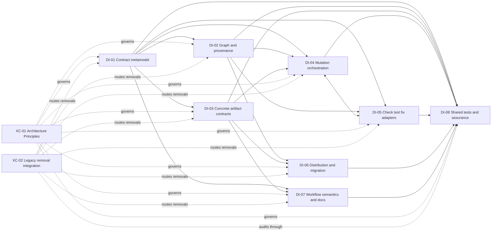

<!-- docs/development/issue460/design-intake-map.md -->
<!-- template=generic_doc version=43c84181 created=2026-08-26 updated=2026-08-30 -->
# Issue #460 Research-to-Design Intake Map

**Status:** NARROW F-20 ROUTING AMENDMENT — DESIGN PAUSED FOR QA; REST FROZEN  
**Version:** 1.24  
**Last Updated:** 2026-09-05  
**Issue:** #460  
**Workflow Boundary:** Refactor / Research → Design

## Purpose and Authority

This document is the authoritative Research-to-Design scope index for issue 460. It proves that every Research obligation has one primary Design destination without selecting target mechanisms, method bodies, patch sequences, or implementation cycles.

Research was reopened on 2026-09-04 for F-20 after Design investigation showed that the earlier F-19 package would leave checks, behavioral tests, and fixes behind incompatible extension paths. DI-05 now owns one cohesive language-agnostic adapter extension suite with separate versioned check/test/fix contracts, the PGMCP 3.0 public/configuration clean break, fix authorization, adapter ownership/trust/version/fingerprinting, and independent conformance evidence. F-20 does not move scaffold/safe-edit persistence into DI-05, collapse tests into checks, or alter template-suite/package provenance and renewal. Independent QA preserved that substantive assessment through the census reviews; the workspace-root correction routes `pyproject.toml` to DI-05 and root `README.md` plus the hidden generated VS Code/Copilot coordination-agent variant to DI-07. The human owner formally authorized Design on 2026-09-04. Research content and this intake scope are now frozen.

[Research](research.md) remains the sole authority for approved strategy, invariants, expected results, and the Research gate. [Research Findings](research-findings.md) owns evidence and rationale. The [Template Suite Work Catalog](template-suite-catalog.md) owns per-component dispositions. The [Pre-Implementation Documentation Contract](README.md) governs the form and navigation of the full set. This map owns only Design coverage and primary responsibility.

A Design package is a cohesive grouping tool, not a mandatory wrapper around every obligation. Complete coverage is mandatory. A standalone or already-resolved obligation is not forced into an artificial package.

## Bounded Retesting Amendment Routing — 2026-09-05

Current authority is the [narrow F-20 amendment](research.md#narrow-check-retesting-amendment--2026-09-05).
Design is paused for independent QA; previous freeze/GO statements below describe the
earlier baseline, except for this explicitly authorized amendment. No finding, strategy,
invariant, expected-result, or census total is added or removed.

| Boundary | Primary owner | Required disposition |
|---|---|---|
| Auto selection/default, baseline advancement, failed-file replay, state DTO/repository and composition | DI-05 | Retire through clean break; expose explicit branch/project/path selection without an auto alias or silent replacement default |
| Native optimization and fresh intent | DI-05 | Honor native configuration normally; define fresh support and truthful unsupported behavior per check capability; no generic reuse/state/session protocol |
| Public result/cache/presentation | DI-05 | Keep report DTO/resource caching and invoked provenance; no cached report substitutes for new execution; remove only obsolete auto-state recovery mappings |
| Workflow registration and PR integration | DI-05 | Remove quality_state.json registration and auto-only wiring; preserve unrelated phase/PR/branch-local artifact behavior; DI-07 aligns guidance |
| Active manuals/references and agent consumers | DI-07 | Remove auto/default/state claims and describe fresh versus scope without creating another parameter SSOT |
| Retained scopes, state-removal, and native fresh proof | DI-05 | Own package-local positive/negative evidence; DI-08 checks complete cross-package removal using the unchanged catalog |
| Existing Design experiments | DI-05 after QA | Reconcile D-ADAPTER-13/14/15 and sections 7.10-7.12 with this authority; no obligation to preserve rejected reuse/session mechanisms |

No change is made to DI-02 template provenance, DI-04 persistence, DI-06 renewal, the
health-diagnostics deferral, or separate test/fix semantics. Concrete fresh flags,
transport, scope defaults, config/DTO shapes and cycle decomposition remain later-phase
work. The catalog owns exact file dispositions; this map does not create duplicate rows.

## Coverage Contract

| Destination kind | Meaning |
|---|---|
| `DI-01`–`DI-08` | A cohesive Design package owns a group of related decisions and proof obligations |
| `XC-01`–`XC-02` | A direct cross-cutting Design obligation applies across affected packages; no separate subsystem or implementation cycle is implied |
| `RC-01` | Research already resolved the decision; Design must preserve it as a binding constraint but owns no new decision |
| `Deferred` | Explicitly outside issue 460; Design must not introduce the capability indirectly |

Coverage rules:

1. Every finding, Approved Strategy row, core invariant, expected result, consumer family, and still-conditional catalog disposition has exactly one primary destination.
2. Dependencies identify required inputs or affected consumers; they do not create duplicate primary ownership. File impact is not decision ownership: a package may supply requirements, consume another package's result, or verify alignment without owning that result.
3. A package may be subdivided inside Design only if every obligation remains traceable to one primary Design section.
4. Package dependencies are coverage dependencies, not implementation order or cycle sequencing. A Design package does not imply a matching implementation cycle.
5. DI-01–DI-07 each own the behavioral evidence, migration tests, and concrete removals for the boundary they design. DI-08 owns shared test architecture and cross-package assurance, not those package-local decisions.
6. Design may compare mechanisms and define interfaces, configuration schemas, and result contracts, but this map does not preselect those mechanisms.
7. Deferred work and Research-resolved constraints remain visible so Design cannot absorb them by omission or convenience.

### Relationship Vocabulary

| Relationship | Meaning |
|---|---|
| Primary ownership | The package makes and documents the Design decision |
| Supplied requirement | The package states a semantic need that the owning package must support |
| Affected consumer | The package consumes or must migrate with the owned result but does not define it |
| Verification responsibility | The package checks coherence or alignment after the owner has designed the boundary |

Only primary ownership assigns the decision. The other relationships make blast radius and integration visible without creating a second authority.

## Design Package Register

| ID | Cohesive mandate | Primary findings | Coverage dependencies |
|---|---|---|---|
| DI-01 | Suite contract metamodel, shared primitives, and public schema exposure | F-02, F-06, F-12, F-17 | Feeds DI-02, DI-03, DI-04, and DI-07 |
| DI-02 | Resolved graph, runtime selection, introspection, and provenance | F-04, F-05, F-11, F-16 | Depends on DI-01; feeds DI-04 and DI-06 |
| DI-03 | Concrete artifact contracts, renderer semantics, portability, retained types, removals, and renames | F-01, F-07, F-14, F-14A, F-14B | Depends on DI-01 and DI-02; feeds DI-07 and DI-08 |
| DI-04 | Scaffold and safe-edit mutation orchestration, explicit operation controls, operation results, and persistence | F-03, F-13, F-15 | Depends on DI-01, DI-02, and DI-03 caller-content contracts; consumes factual evidence from DI-05 |
| DI-05 | Language-agnostic adapter extension suite, separate check/test/fix contracts, public operations, and role-specific orchestration | F-08, F-19, F-20 | Depends on DI-01 and DI-02; supplies factual check evidence to DI-04 and execution evidence to DI-07 |
| DI-06 | Distribution, renewal, and deployment migration | F-10 | Depends on DI-02 and final DI-03 identities/removals |
| DI-07 | Workflow semantics, agent-instruction, and documentation alignment | F-09 | Supplies semantic requirements to DI-03; depends on DI-01 and DI-03 and consumes final public decisions from DI-02–DI-06 |
| DI-08 | Shared test architecture and cross-package removal assurance | None | Supplies shared test infrastructure and audits evidence/removal completeness across DI-01–DI-07 |

## Package Mandates

### DI-01 — Suite Contract Metamodel and Public Schema Exposure

| Dimension | Design intake |
|---|---|
| Primary Research inputs | F-02, F-06, F-12, F-17; strategy rows for public context ownership, client compatibility, optionality, shared link/issue/checklist representations, and qualified identity |
| Affected inputs and consumers | Generic schema/config models, shared schema primitives, config validation, artifact IDs, and caller-visible `scaffold_schema` resolution. All 22 artifact configurations form a conformance corpus; DI-01 does not own their concrete properties |
| Design-owned decisions | Standard JSON Schema draft; internal acyclic composition and resolution rules; finite reference-free public exposure; generic required/optional/null/default semantics; definitions of genuinely shared primitives; language/technology identity convention |
| Supplied requirements | DI-03 supplies the concrete nested structures, field constraints, examples, and artifact-local representations that this metamodel must be able to express; DI-02 consumes the resolved form |
| Compatibility, migration, removal | Clean breaks have no aliases or multi-shape bridges; generic schema exposure remains self-contained; coordinated identity migration must be explicit |
| Required proof | Arbitrary conforming artifact definitions can express and resolve nested objects, collections, defaults, constraints, and shared primitives without artifact-specific Python; all current configurations are structurally representable without DI-01 asserting their semantic correctness |
| Exclusions | Concrete artifact properties, per-field requiredness, artifact-specific defaults/constraints/examples, nested item instances, and renderer behavior belong exclusively to DI-03; no purpose-aware discovery tool (F-18) or target parser/class topology is selected here |

### DI-02 — Resolved Graph, Runtime Selection, Introspection, and Provenance

| Dimension | Design intake |
|---|---|
| Research inputs | F-04, F-05, F-11, F-16; strategy rows for DTO runtime selection, resolved template graph, source provenance, and artifact-purpose introspection |
| Responsibilities and consumers | Modular suite loader, Jinja loader/analyzer, template engine, bootstrap composition, runtime catalog, deterministic shallow package discovery, persisted artifact source-provenance facts, package-directed non-artifact evidence where justified, and graph metadata |
| Design-owned decisions | Dependency-edge model for inheritance/import/include and prohibited package edges; deterministic strict shallow package discovery under `template_suite/` without an authored central index; startup resolution and diagnostics; one declared runtime renderer; concise purpose carrier; automatic selected-package closure/fingerprint; one-manifest-version/no-file-version schema validation without external bump-history policing; compact persisted artifact provenance combining DI-02 package facts with the DI-06 source suite fingerprint; YAGNI admission of suite identity in non-artifact package-directed DTOs |
| Compatibility, migration, removal | Remove the implicit DTO override, historical registry/hash authority, and empty legacy artifact-registry facade without compatibility shells; public schemas remain self-contained; suite mutations become restart-stable |
| Required proof | Missing, cyclic, duplicate, unreachable, prohibited, and incoherent current-suite graph states fail actionably; schema, renderer, purpose, output profile, version, and resolved fingerprint identify the same package; a package-local change leaves every other package's semantic facts and affected-package diagnostics unchanged while only newly scaffolded artifacts may receive a new source suite fingerprint; shared changes affect exactly their transitive consumers; repeated startup produces stable facts. Ordinary resolution, introspection, and scaffolding use only the currently supplied suite and require no historical setup |
| Exclusions | No historical template or Git/release association registry, history inspection, retention validator, snapshot archive/lookup service, absent-history failure/evidence state, external version-policy enforcement, adopted-artifact update system, or runtime purpose-discovery feature |

### DI-03 — Concrete Artifact Contracts, Renderer Semantics, and Portability

| Dimension | Design intake |
|---|---|
| Primary Research inputs | F-01, F-07, F-14, F-14A, F-14B and the approved DTO, Generic, integration-test, configuration-model, TypeScript DTO, and unit-test responsibilities; clean-break removal decisions for Resource, Service, Tool, obsolete agent hints, and unreachable test-template patterns |
| Affected inputs and consumers | Every retained or removed public artifact registration, all 22 concrete config/schema instances, 57 Jinja templates, shared macros/patterns, examples, output-profile assignments, and generated package assets |
| Design-owned decisions | Concrete properties, per-field requiredness, nested item structures, artifact-specific defaults/constraints/examples, minimal validity, shared-primitive selection versus local representation, and renderer semantics for every retained type; exact renamed IDs and complete removal surface for rejected types |
| Consumed boundary | DI-03 authors every concrete contract within DI-01's metamodel and composition/optionality rules; it does not redefine the schema language or public resolution mechanism |
| Compatibility, migration, removal | Remove project-specific S1mpleTrader assumptions, seven rejected patterns, Resource, Service, and Tool without aliases; migrate only owned PGMCP consumers; preserve existing generated production files |
| Required proof | Every concrete schema describes all and only the values its renderer consumes; minimal and property-complete valid contexts render valid portable output; every removed type is absent from registry, assets, docs, and active consumers; tests prove semantics rather than prose snapshots |
| Exclusions | No metamodel, schema-draft, composition, or generic exposure ownership; no new Python/YAML artifacts, command/query service family, pgmcp/MCP tool artifact, consumer-repository implementation, or recursive/general-purpose artifact DSL |

### DI-04 — Scaffold and Safe-Edit Mutation Orchestration

| Dimension | Design intake |
|---|---|
| Primary Research inputs | F-03, F-13, F-15; corrected strategy rows for caller-content/operation/provenance ownership, input consumption, success semantics, path/file-name semantics, and safe-edit post-edit validation |
| Affected inputs and consumers | `scaffold_artifact`, artifact manager/orchestrator, `SafeEditTool`, `.pgmcp/config/artifacts.yaml`, `.pgmcp/config/project_structure.yaml`, configuration loading/validation/bootstrap, `DirectoryPolicyResolver`, the legacy `PolicyEngine`, caller-context validation, operation-control validation, server-provenance composition, complete proposed content, target resolution, staging/atomicity/rollback, filesystem persistence, mutation-operation DTOs, cached output, tests, active documentation, and `mcp_server/scaffolding/utils.py` |
| Design-owned decisions | Ordered scaffold and edit boundaries for untouched caller validation, collision-free operation/provenance separation, exact caller-supplied file naming, artifact-oriented location policy keyed by manifest `template_id`, exhaustive legacy directory-policy field/consumer migration, in-memory proposed content, DI-05 factual-evidence consumption, strict versus interactive mutation policy, atomic persistence, and scaffold/safe-edit operation reporting; target evidence and legacy naming/persistence-helper removal |
| Consumed boundary | DI-04 consumes DI-05 factual states exactly as reported. It may decide whether a scaffold or edit persists, but may never reinterpret `failed`, `unavailable`, or `not_executed` as another factual state |
| Compatibility, migration, removal | Unknown caller fields may not be filtered silently; remove generic envelope `name` and automatic naming projections without aliases; repurpose `artifacts.yaml` only after DI-02 removes its empty legacy index role; retire `project_structure.yaml` only after bootstrap, live placement, dead policy dependency, tests, and active documentation are migrated; body content may not carry operation controls or host paths; server provenance remains narrowly namespaced; strict failure or required unavailable evidence leaves original state unchanged |
| Required proof | A valid first call yields a truthful persistable basis; every caller-authored renderer value comes only from validated context; exact file-name and target controls never enter content; contract/render/factual-validation/persistence failures remain distinguishable; failed strict scaffold creates no artifact; failed strict edit preserves the original file; interactive persistence returns unchanged factual findings; output path remains result evidence |
| Exclusions | DI-05 exclusively owns capability facts, selectors, factual check-result semantics, and quality-operation behavior. DI-04 owns no provider/command/parser/availability truth and no quality scope, lifecycle, diagnostics, presentation, or autofix; first-time-right does not mean final phase completeness |

### DI-05 — Language-Agnostic Check, Test, and Fix Adapter Suite

| Dimension | Design intake |
|---|---|
| Required Research authority | Read [F-08](research-findings.md#f-08--schema-valid-rich-contexts-can-produce-invalid-source), [F-19](research-findings.md#f-19--output-validation-and-quality-gates-duplicate-executable-authority), [F-20](research-findings.md#f-20--executable-tooling-is-split-into-language-bound-check-test-and-fix-paths), their exact Approved Strategy rows, I-16/I-19, and E-13/E-20/E-23 as one binding input set. F-20 is canonical wherever older F-19 wording preserves quality-gate/autofix names or excludes tests from shared extension infrastructure |
| Primary Design document | `design-execution-adapters.md` exclusively owns DI-05. `design-mutation-validation.md` remains the DI-04 owner and consumes DI-05 factual check evidence without absorbing adapter catalog, execution, check/test/fix, conformance, or migration ownership |
| Affected inputs and consumers | Output profiles; `quality.yaml` and its replacement `checks.yaml`/`tests.yaml`/`fixes.yaml`; presentation config; quality/test/fix config models; validation modules; `QAManager`; Pytest runner/interface; quality state/repository; violation parsing; `RunQualityGatesTool`, `RunTestsTool`, `AutoFixTool`; public DTOs/cache/presentation; bootstrap/exports/registration; scaffold and safe-edit consumers; workflow/agent/manual/reference consumers; all catalogued tests, fixtures, fake runners, and validation fixtures |
| Design-owned decisions | One immutable startup-resolved adapter catalog; official and trusted workspace package sources; package manifest, `adapter_id`, one version, supported role-contract versions, capabilities, entry points, package fingerprint, dependency/trust/error policy, and restart semantics; generic process/scratch/timeout/stdout/stderr/malformed/crashed/unavailable transport; separate `check/v1`, `test/v1`, and `fix/v1` request/result contracts; `run_checks`, framework-neutral `run_tests`, and `apply_fixes` inputs/results/scopes/verbose behavior/cache/presentation; output-profile check selection; fix proposal, stale-input detection, path authorization, validation, controlled application, rollback/recovery, and final evidence; conformance and self-hosting proof |
| Consumer-policy separation | Output profiles select required checks for complete proposed content. `run_checks` owns explicit scope and check-run reporting. `run_tests` owns behavioral suite/framework semantics. `apply_fixes` owns an explicitly requested mutation workflow around bounded adapter proposals. Workflow gates consume evidence but are not adapter capabilities. DI-04 alone decides scaffold/safe-edit persistence from unchanged factual check states |
| Compatibility, migration, removal | PGMCP 3.0 clean break: remove `run_quality_gates`, `auto_fix`, and `quality.yaml`; introduce `run_checks`, `apply_fixes`, `checks.yaml`, `tests.yaml`, and `fixes.yaml`; keep only the semantically correct `run_tests` name while replacing its Pytest-shaped contract. No aliases, wrapper tools, or dual-read config. Obsolete config fails with actionable migration guidance. Migrate retained Pytest, Ruff, Mypy, Pyright, syntax, parser, and fix behavior into official packages where justified by current consumers The 2026-09-05 refinement also removes auto and its baseline/replay state and excludes PGMCP execution-result reuse; preserve report caching and provide fresh intent without a hidden native-settings layer |
| Provenance and ownership | Each adapter package has one authored manifest version and one computed package fingerprint over its semantic package inputs; files have no authored versions. Per-run evidence records only invoked adapter ID/version/package fingerprint/role-contract version and discovered external-tool ID/version. Do not add a whole adapter-suite fingerprint to runs or adapter provenance to scaffold-artifact source metadata. PGMCP owns official packages; workspace owners own trust, dependencies, retention, and version policy for `.pgmcp/adapter_suite/` packages |
| Required proof | Check and output-profile consumers receive identical factual check evidence; check calls cannot mutate; tests remain behavior-specific; fix adapters cannot directly authorize workspace writes; stale or out-of-scope proposals do not reach authoritative files; Pytest behavior intentionally retained is compared across old/new boundaries; official adapters pass shared role conformance plus tool-specific tests; a non-Python fixture package adds a supported language/tool without generic server-code changes; duplicate IDs, invalid manifests/contracts, unavailable tools, timeouts, crashes, malformed output, verbose capture, and restart loading are explicit; old public/config names and duplicate command/parser authorities are absent |
| Exclusions | No universal result object across roles; no language/file-extension/framework/command/parser dispatch in generic server code; no template-suite authority to install or trust executables; no adapter-owned scaffold persistence or workflow-gate decision; no whole-suite run fingerprint, binary retention/integrity promise, external package history enforcement, or new fourth product role without a separately justified consumer/contract |

#### DI-05 Internal Responsibility Lenses

DI-05 is one cohesive Design package because adapter distribution, discovery, trust, process transport, and package identity must be consistent. Its lenses are mandatory semantic boundaries, not separate extension systems or implementation cycles.

| Responsibility lens | Boundary that Design must preserve |
|---|---|
| Package/catalog resolution | Resolve official plus explicitly trusted workspace packages once at startup; manifest `adapter_id` is identity; reject duplicate IDs and incompatible role declarations before tool exposure |
| Generic process runtime | Provide bounded transport, scratch, timeout, output capture, and process failure facts without knowing languages, formats, frameworks, commands, or parser syntax |
| Check contract and consumers | Side-effect-free factual analysis shared by output profiles and explicit check runs; consumer policy does not change the evidence |
| Test contract and consumer | Framework-aware behavioral execution with a generic public envelope and adapter-specific declared options; it is not a static check |
| Fix contract and consumer | Return bounded proposals only; PGMCP owns authorization, stale checks, validation, application, and recovery |
| Migration and evidence | Govern clean-break names/config/results, official adapter migration, conformance suites, non-Python extension proof, and independent evidence so migrated tools do not certify themselves exclusively |

### DI-06 — Distribution, Renewal, and Deployment Migration

| Dimension | Design intake |
|---|---|
| Research inputs | Reopened F-10/S-10; approved component-wise adopted/actual/candidate selection; human-approved checkpoint-less bootstrap policy; one current component checkpoint; unchanged source-suite fingerprint reused in persisted artifact provenance; unchanged resolved-package fingerprints supplied by DI-02 |
| Responsibilities and consumers | CLI/init/upgrade flows, packaged template assets, `shared/` and manifest `template_id` component ownership, the sole active root, current adopted checkpoint, actual and candidate snapshots, fresh-install bootstrap, existing checkpoint-less managed/external migration, trustworthy equality evidence, owner-supplied baselines, `checkpoint_required`, non-authoritative staging, complete proposal construction, full-suite validation, recoverable activation, explicit acknowledgement/reconciliation, external roots, managed release procedures, and the owner's two-machine/four-workspace migration |
| Design-owned decisions | Immutable component-state comparison value; current checkpoint schema and persistence; explicit absence state; manifest-to-component ownership resolution; representation and validation of approved trustworthy equality evidence; deterministic bootstrap decision flow; actionable `checkpoint_required` operation result; owner-supplied prior-suite ingestion; candidate acknowledgement without content mutation; deterministic three-way classification; comparison and operation DTOs; complete off-root proposal builder; full-suite validation transaction; managed-root activation and recovery; external-root command boundary; candidate staging; reconciliation command that advances candidate checkpoint state without overwriting actual content; bounded reporting |
| Supplied constraints | DI-02 supplies current resolved-package/source-suite fingerprint behavior unchanged and the resolved-suite validator inputs; DI-03 supplies final manifest `template_id` values, shared ownership, removals, and package content. The operational checkpoint is not artifact provenance and cannot redefine those fingerprints |
| Compatibility, migration, removal | `shared/` and every manifest `template_id` component are indivisible; absence covers additions/removals; candidate is selected only for upstream-only or converged changes; local-only and conflicting actual states are preserved. Fresh managed installs establish content and checkpoint together. Existing managed workspaces bootstrap automatically only from approved trustworthy equality evidence; otherwise actual is unchanged and renewal returns `checkpoint_required`. Existing external workspaces require explicit owner baseline supply or candidate acknowledgement and are never automatically overwritten or activated. One complete proposed suite must validate before recoverable complete-tree activation |
| Required proof | Fresh install establishes candidate plus checkpoint together; trusted persisted fingerprint exactly matches actual; actual exactly matches validated candidate; owner-supplied trusted prior suite; missing/mismatched/untrusted baseline returns `checkpoint_required` with byte-identical actual and no activation; external workspace requires explicit owner action; candidate acknowledgement changes checkpoint only. With a checkpoint: unchanged, upstream-only, local-only, converged, and conflicting components; candidate additions/removals; local additions/removals; dual additions; modification-versus-removal conflicts; shared-component conflicts; invalid composed suite; interrupted validation/activation; recovery; stale/new candidate staging; explicit checkpoint advancement without content overwrite; external-root safety; one runtime root; checkpoint/activation atomicity; no changes to artifact metadata or existing fingerprints |
| Exclusions | No implicit `adopted = actual` or `adopted = candidate`; renewal selection without a checkpoint; automatic file/text/semantic merge; runtime overlay; partial active-tree write; checkpoint history; per-file versions; SemVer inference or bump classification; compatibility matrix; provenance registry; historical source retention/lookup; external-root authority; artifact-content update; change to resolved-package/source-suite fingerprint semantics; cross-repository migration; complete YAML artifact subset |

### DI-07 — Workflow Semantics, Agent-Instruction, and Documentation Alignment

| Dimension | Design intake |
|---|---|
| Research inputs | F-09; documentation-authority and workflow/template semantic-alignment strategies |
| Responsibilities and consumers | All active Research/Design/Planning/Validation phase-instruction variants, `contracts.yaml`, authoritative agent instructions and generated variants, active scaffolding/validation/manual references, `phase-workflows.md`, and `validation_api.md`; the corresponding document contracts and renderers are affected DI-03-owned consumers |
| Design-owned decisions | Workflow-specific required outcomes and semantic requirements supplied to DI-03; substantive phase-instruction actions and completeness expectations; tool enforcement wording without embedded invocations; exact active-document authority and whether conditional references remain separate or consolidate |
| Supplied and consumed boundaries | DI-07 states what each workflow phase must be able to persist and later verifies the alignment. DI-01 owns the metamodel capability; DI-03 exclusively owns concrete phase-document properties, requiredness, nesting, defaults, constraints, examples, and renderer behavior |
| Compatibility, migration, removal | Live schema/catalog facts outrank handwritten inventories; templates do not duplicate phase authority; agent variants may differ from SSOT where intentionally generated/owned; stale universal workflow/TDD and legacy validation narratives are removed |
| Required proof | Every active phase variant has an explicit semantic requirement mapped to a suitable DI-03-owned persisted carrier; schema/template/instruction meanings align; valid initial scaffold is not described as final completion; ordinary safe-edit refinement remains clear; local links and active references resolve |
| Exclusions | No ownership of concrete document schemas or renderers, shared schema primitives, field requiredness, nested structures, defaults, constraints, or rendering rules; no new runtime discovery feature, full tool-call duplication, phase-instruction prose snapshots, or historical narrative of mechanical changes |

### Package-Owned Behavioral Evidence and Removals

The following ownership is part of each package mandate, not deferred to DI-08. Shared DI-08 infrastructure may support this proof but does not own the behavior or removal decision.

| Package | Package-owned behavioral evidence and concrete removals |
|---|---|
| DI-01 | Metamodel, composition, shared-primitive, public-exposure, identity-migration tests; superseded schema/config-model surfaces |
| DI-02 | Graph resolution, startup diagnostics, runtime selection, introspection, provenance tests; obsolete registry, graph, metadata, and lifecycle surfaces |
| DI-03 | Per-artifact schema/renderer semantics, portability, rename/removal migration tests; rejected templates, configs, patterns, examples, and imports |
| DI-04 | Scaffold/safe-edit transaction, policy, atomicity, rollback, persistence, and operation-result tests; superseded scaffold/persistence helpers |
| DI-05 | Capability availability, factual execution/results, selector, quality-orchestration, migration, and self-hosting tests; legacy validation/quality surfaces |
| DI-06 | Install, renewal, customization, candidate/adoption, package, and owner-deployment migration tests; obsolete distribution assets and procedures |
| DI-07 | Workflow-carrier, instruction, authority, documentation, and link-alignment tests; stale instruction and documentation consumers |

### DI-08 — Shared Test Architecture and Cross-Package Removal Assurance

| Dimension | Design intake |
|---|---|
| Research inputs | I-14 and E-17; approved test-suite architecture strategy; the complete 151-row affected test/helper ledger; the package-owned removal routes governed by XC-02 |
| Responsibilities and consumers | Shared fixtures and helpers, dependency-injection and test-composition patterns, reusable config-driven test support, cross-package regression/integration evidence, public test-seam rules, obsolete tests without a retained behavioral owner, and the final completeness audit across package-owned evidence and removals |
| Design-owned decisions | Shared test architecture and cross-package evidence composition; disposition of genuinely shared helpers and ownerless obsolete tests; assurance rules that route every test and removal to one behavioral package; final audit of the complete test ledger and removal graph |
| Supplied boundary | DI-01–DI-07 own their package-specific behavioral evidence, migration tests, and concrete removals. A test may use DI-08 infrastructure while its behavioral ownership remains with the package whose public boundary it proves |
| Compatibility, migration, removal | Unrelated runtime behavior and tests remain untouched; removed tests cannot leave unowned behavior gaps; shared infrastructure may not become a private-implementation coupling layer or a central owner of package behavior |
| Required proof | Every retained test protects durable public behavior or an Architecture Principle through explicit dependencies and isolated state; every package-owned removal is covered or explicitly shown to remove no retained behavior; cross-package evidence is independently composable; no source/prose snapshots substitute for public proof |
| Exclusions | No catch-all ownership of package-specific tests or production removals, mandatory implementation-cycle mapping, test explosion, implementation-shaped fixtures, fabricated example code solely for validation, or changes to unrelated test domains |

## Direct and Resolved Obligations

### XC-01 — Architecture Principles Compliance

This is a direct cross-cutting Design obligation, not a ninth subsystem package.

| Applies to | Obligation |
|---|---|
| DI-01–DI-08 | Apply the complete relevant [Architecture Principles](../../coding_standards/ARCHITECTURE_PRINCIPLES.md), especially Config-First/DRY/OCP, fail-fast startup, SRP/DIP/ISP, composition-root ownership, no import-time I/O, CQS, Law of Demeter, presentation separation, and YAGNI |
| Design evidence | Name authoritative configuration ownership, injected boundaries, read/write responsibilities, startup validation, and public result/presentation separation for each affected package |
| Test evidence | Test code follows the same boundaries and cannot justify duplicated truth, hidden construction, global mutable state, or private implementation coupling |

### XC-02 — Legacy Removal Integration

This is a cross-cutting routing and integration obligation, not a removal subsystem or mandatory implementation cycle.

| Applies to | Obligation |
|---|---|
| DI-01–DI-07 | Each package owns removal of the legacy production, configuration, export, instruction, and test surfaces superseded by the boundary it designs |
| Required routing | Registry/graph removals route to DI-02; artifact/template/pattern removals to DI-03; scaffold/persistence helpers to DI-04; validation/quality surfaces to DI-05; distribution residues to DI-06; instruction/documentation consumers to DI-07 |
| DI-08 assurance | Audit the complete removal graph, shared helper impact, cross-package regression evidence, and absence of unowned behavioral gaps without taking over the concrete removal decisions |
| Compatibility constraint | Apply the approved clean breaks without compatibility shells; retained public seams and migration evidence remain owned by their technical packages |

### RC-01 — Approved Strategy Fidelity

Research has approved compatibility and migration per boundary, including the F-20 clean break dated 2026-09-04. The human owner subsequently confirmed formal Design GO with binding manageability conditions; Research and this intake scope are frozen. This paragraph's former pending-review wording was an administrative remnant superseded by that recorded authorization. Design may define mechanisms within the approved strategies. A new product role, compatibility choice, or consumer family requires a separate issue; contradictory evidence stops the affected design for an explicit human decision.

| Obligation | Consequence |
|---|---|
| Preserve every Approved Strategy row | Design may select mechanisms but cannot silently switch compatibility strategy |
| Preserve original-issue coverage | The four initial PR defects remain covered through suite-wide boundaries; no PR-only patch package exists |
| Keep deferred work excluded | Deferred feature and artifact families cannot enter Design through a dependency or convenience change |
| Reopen explicitly when unsound | New contradictory evidence returns the affected boundary to human Research approval before Design continues |

## Finding Coverage Matrix

| Finding | Primary destination | Coverage note |
|---|---|---|
| F-01 | DI-03 | Every concrete nested caller structure matches its renderer |
| F-02 | DI-01 | Optionality, nullability, emptiness, and defaults |
| F-03 | DI-04 | Caller context is the sole caller-authored render source; operation controls never enter content, and server provenance is composed separately |
| F-04 | DI-02 | One declared runtime renderer and public contract |
| F-05 | DI-02 | Complete resolved Jinja/config graph |
| F-06 | DI-01 | Canonical structured link semantics |
| F-07 | DI-03 | Every caller-authored rendered value is an explicit concrete artifact field with one local meaning and rendering effect |
| F-08 | DI-05 | Output-profile applicability and factual validation states; DI-04 owns the resulting mutation policy |
| F-09 | DI-07 | Active documentation authority |
| F-10 | DI-06 | Renewal and customization safety |
| F-11 | DI-02 | Isolated package semantic provenance plus compact persisted artifact source-suite provenance supplied by DI-06 |
| F-12 | DI-01 | Canonical issue references and checklist items |
| F-13 | DI-04 | Objective success and failure semantics |
| F-14 | DI-03 | Portable package artifact families |
| F-14A | DI-03 | Obsolete suite-owned agent-hint pattern and dead template imports |
| F-14B | DI-03 | Unreachable test-template pattern placeholders |
| F-15 | DI-04 | Persistence target excluded from generated body |
| F-16 | DI-02 | Existing suite-owned purpose through introspection |
| F-17 | DI-01 | Language/technology-qualified public identity |
| F-18 | Deferred | Purpose-aware runtime discovery remains out of scope |
| F-19 | DI-05 | Shared check-role authority and normalized factual check results; superseded naming/extension clauses route through F-20 |
| F-20 | DI-05 | One adapter extension suite with separate check/test/fix contracts and clean-break public/configuration vocabulary |

## Approved Strategy Coverage Matrix

All 44 strategy rows from [Research](research.md#approved-strategy-and-decision-status) appear exactly once below.

| Primary destination | Approved Strategy rows | Count |
|---|---|---:|
| DI-01 | F-01 / S-01 public context ownership; F-01 client compatibility; F-02 / S-03 optionality and nullability; F-06 / S-04 link semantics; F-12 / S-05 issue references; F-12 / S-06 checklist items; F-17 language/technology-qualified identity | 7 |
| DI-02 | F-04 / S-08 DTO runtime selection; F-05 / S-09 resolved template graph; F-11 / S-16 source provenance; F-16 artifact-purpose introspection | 4 |
| DI-03 | F-01 / S-02 nested collections; F-14 / S-12 package portability; DTO artifact responsibility; Generic Python class responsibility; Python/pytest integration-test responsibility; Resource artifact responsibility; Python/Pydantic configuration-model responsibility; Service artifact responsibility; Tool artifact responsibility; TypeScript DTO-class responsibility; Python/pytest unit-test responsibility; F-14A agent hints; F-14B unreachable test patterns | 13 |
| DI-04 | F-03 caller-content and operation/provenance ownership; F-07 / S-07 input ownership and consumption; F-13 success semantics; F-15 / S-13 target and file-name semantics; Safe-edit post-edit validation | 5 |
| DI-05 | F-08 / S-14 output validation and strictness; F-19 shared output-validation and check authority; F-20 check/test/fix adapter extension suite | 3 |
| DI-06 | F-10 / S-10 distribution and customization; Deployment compatibility | 2 |
| DI-07 | F-09 / S-15 documentation authority; Workflow/template semantic alignment | 2 |
| DI-08 | Test-suite architecture compliance | 1 |
| XC-01 | Runtime architecture compliance | 1 |
| XC-02 | Legacy parallel scaffolding and validation surfaces | 1 |
| RC-01 | F-12 original-issue coverage | 1 |
| Deferred | Deferred YAML artifact subset; Portable Python artifact coverage; F-18 purpose-aware runtime artifact discovery; Command/query service artifact family | 4 |
| **Total** |  | **44** |

## Core Invariant Coverage Matrix

| Primary destination | Core invariants | Count |
|---|---|---:|
| DI-01 | I-05 finite reference-free public schemas; I-06 distinct optional/null/empty/default states; I-08 no template truth in generic server code/prose | 3 |
| DI-02 | I-03 one package-manifest version, no file/shared versions, coherent resolved package semantics, transitive shared impact, unchanged lateral package diagnostics, and truthful source-suite fingerprint changes only in newly scaffolded artifacts | 1 |
| DI-03 | I-01 discoverable renderer values; I-02 one meaning/effect per field; I-07 no hidden consumer-project dependencies | 3 |
| DI-04 | I-04 make unchanged caller context the sole caller-authored render source and keep operation controls out of content; I-09 portable body without persistence target; I-13 valid scaffold basis versus final completion | 3 |
| DI-05 | I-16 one check capability/command/result authority; I-19 generic server code is language/tool-neutral while check/test/fix retain separate contracts | 2 |
| DI-06 | I-17 indivisible component selection with full-suite validation and recoverable complete-tree activation into one runtime root; I-18 checkpoint-less bootstrap requires trustworthy equality evidence or explicit owner action while preserving actual | 2 |
| DI-07 | I-12 workflow-specific semantic requirements for DI-03-owned carriers; I-15 tool enforcement without invocation duplication | 2 |
| DI-08 | I-14 durable and architecturally valid tests | 1 |
| XC-01 | I-11 no generic-code hardcoding of suite/workflow/provider/install policy | 1 |
| RC-01 | I-10 explicit compatibility and migration strategy per boundary | 1 |
| **Total** |  | **19** |

## Expected-Result Coverage Matrix

| Primary destination | Expected results | Count |
|---|---|---:|
| DI-01 | E-04 stable optionality semantics; E-05 canonical links/issues/checklists; E-08 server does not own template content truth | 3 |
| DI-02 | E-02 schema describes resolved renderer graph; E-07 preserves isolated automatic package identity and the existing complete source-suite evidence in persisted artifact provenance, conditional on owner-supplied historical sources and without a lookup guarantee | 2 |
| DI-06 | E-21 current adopted component checkpoint, component-wise three-way selection, complete proposal validation, recoverable one-root activation, reconciliation without content overwrite, and external ownership; E-22 safe bootstrap for fresh and existing checkpoint-less workspaces through trustworthy equality evidence, explicit owner action, or content-preserving `checkpoint_required` refusal | 2 |
| DI-03 | E-01 caller constructs every supported concrete shape; E-06 explicit role for every concrete field; E-10 generic names conceal no project assumptions | 3 |
| DI-04 | E-03 accepted context reaches valid governed persistence; E-11 portable output without host paths; E-18 complete-result safe-edit validation and mutation policy | 3 |
| DI-05 | E-13 validity/availability/strictness remain distinct factual inputs; E-20 shared check authority with independent evidence; E-23 one adapter catalog with separate check/test/fix contracts, non-Python extensibility, controlled fixes, and V2 removal | 3 |
| DI-07 | E-09 docs cannot contradict live schema; E-15 workflow-by-phase requirements align with DI-03-owned carriers; E-16 scaffold-versus-completion clarity; E-19 tool enforcement without invocation duplication | 4 |
| DI-08 | E-17 retained tests protect durable public behavior or architecture | 1 |
| XC-01 | E-14 runtime/setup passes complete Architecture Principles sweep | 1 |
| RC-01 | E-12 compatibility choices approved before Design | 1 |
| **Total** |  | **23** |

## Consumer-Family Coverage Matrix

The [Template Suite Work Catalog](template-suite-catalog.md) remains authoritative for all 79 suite files, 126 active consumers/references plus two separately identified governing-standard sources, and 151 test/helper dispositions. This matrix assigns those rows by consumer family without duplicating the per-file ledger.

| Consumer family | Primary destination | Material dependent packages |
|---|---|---|
| Contract metamodel, shared schema primitives, artifact IDs, public schema resolution, package-owned tests, and superseded schema surfaces | DI-01 | DI-02, DI-03, DI-04, DI-07, DI-08 |
| Jinja graph, loader, runtime catalog, package-manifest version authority, resolved package provenance, compact persisted artifact provenance, package-impact diagnostics, package-owned tests, and obsolete graph/registry surfaces | DI-02 | DI-03, DI-04, DI-06, DI-08, XC-02 |
| Concrete artifact config/schema instances, retained/removed templates, macros, examples, output-profile assignments, and package-owned tests | DI-03 | DI-01, DI-02, DI-05, DI-07, DI-08, XC-02 |
| Scaffold and safe-edit tools, `artifacts.yaml` location policy, `project_structure.yaml` field/consumer migration, mutation orchestration, mutation-operation DTOs, target resolution, strict/interactive policy, atomicity, persistence, package-owned tests, active documentation, and superseded helpers | DI-04 | DI-01, DI-02, DI-05, DI-08, XC-02 |
| Adapter package/catalog resolution, generic process runtime, separate check/test/fix contracts, output-profile check selection, explicit check/test/fix orchestration, root project/build/package configuration, config/state/DTO/cache/presentation migration, official adapter distribution/dependency ownership, fix authorization/application, Pytest and retained check/fix adapters, package-owned conformance/behavior tests, and legacy quality/validation/test/fix surfaces | DI-05 | DI-04, DI-07, DI-08, XC-02 |
| CLI/init/upgrade, package assets, sole active-root resolution, `shared/` and manifest `template_id` component ownership, current adopted checkpoint, fresh and checkpoint-less bootstrap, trustworthy equality evidence, explicit owner baseline/acknowledgement, `checkpoint_required`, actual/candidate comparison, complete proposal construction, full-suite validation, recoverable activation, explicit checkpoint reconciliation, managed release procedures, package-owned evidence, and obsolete distribution residues; external history, release policy, and activation authority remain owner-owned | DI-06 | DI-02, DI-03, DI-08, XC-02 |
| Contracts, phase instructions, canonical and generated agent variants including hidden source paths, root and subordinate manuals/references, package-owned tests, and stale instruction/documentation consumers | DI-07 | DI-01–DI-06, DI-08, XC-02 |
| Cross-package legacy-removal routing and integration constraint | XC-02 | DI-01–DI-08 |
| Shared test architecture, fixtures/helpers, cross-package regression/integration evidence, ownerless obsolete tests, and removal-completeness audit | DI-08 | DI-01–DI-07, XC-01, XC-02 |
| Current-owner deployment and external workspace migration | DI-06 | RC-01 |

## Conditional Catalog Disposition Intake

These Research catalog rows entered Design as conditional questions. Their current row records the owning package and, where the workshop has resolved the question, the selected disposition without rewriting Research history.

| Catalog row | Primary destination | Design question and preservation constraint |
|---|---|---|
| `.pgmcp/config/artifacts.yaml` — legacy empty registry shell | DI-02 → DI-04 | DI-02 removes the redundant index role in favor of strict shallow package discovery; DI-04 reuses the filename only as artifact-location policy keyed by manifest `template_id`. No phase may dual-read both meanings |
| `docs/manuals/phase-workflows.md` — rewrite or reduce | DI-07 | Keep only a contracts-owned workflow overview that does not copy universal phase/TDD rules |
| `docs/reference/validation_api.md` — replace or consolidate | DI-07 | Retain a separate API reference only if DI-02/DI-05 leave a stable developer-facing boundary worth documenting |
| `mcp_server/scaffolding/utils.py` — remove or replace through owned boundaries | DI-04 | Naming must come from artifact configuration and persistence from the designed filesystem boundary; hidden PascalCase/CWD policy cannot survive |

## Package Exit Evidence

A Design package is covered only when its Design section:

1. links the relevant Research findings and exact Approved Strategy rows;
2. states the selected interfaces/configuration contracts and rejected alternatives;
3. accounts for its consumer families and conditional catalog rows;
4. preserves compatibility, migration, and removal constraints;
5. defines its package-owned production removals, behavioral evidence, and migration tests under XC-01 and XC-02;
6. identifies any shared DI-08 infrastructure or cross-package evidence without transferring behavioral ownership;
7. identifies required independent evidence and known self-hosting risk;
8. records package dependencies and exclusions without turning them into implementation sequencing.

Design cannot claim complete intake while any coverage matrix entry lacks a corresponding Design section or is owned primarily by more than one section.

## Coverage Audit

The 2026-09-04 amendment adds one finding, one Approved Strategy row, one invariant, and one expected result, all owned by DI-05. The initial F-20 sweep added fifteen direct consumers and thirty-eight tests/helpers. The first QA-directed repeat added six further active consumer/reference paths and eight further test/helper paths. The second QA-directed workspace-root repeat added three more consumers—one DI-05 project/build/package configuration and two DI-07 documentation/generated-agent consumers—producing 126 consumers plus two separately excluded governing-standard sources and 151 tests/helpers. No existing finding, strategy, invariant, expected result, or consumer family loses its primary destination. F-20 explicitly supersedes only the narrower F-19 public-name, autofix-ownership, and behavioral-test-exclusion clauses. DI-04 still owns scaffold/safe-edit persistence; DI-06 still owns template-suite renewal; DI-02 still owns template artifact/source provenance. Formal human Design authorization closes the Research gate. Design must preserve the dedicated DI-05 document boundary. Planning must later assign all 126 consumers and 151 tests/helpers to concrete independently provable cycle owners; a catch-all remaining-consumers/tests cycle is prohibited.

| Research authority | Expected | Mapped | Primary-ownership result |
|---|---:|---:|---|
| Findings (including F-14A/F-14B) | 22 | 22 | Exactly one destination each; F-20 is DI-05-owned |
| Approved Strategy rows | 44 | 44 | Exactly one destination each; F-20 supersession is explicit |
| Core invariants | 19 | 19 | Exactly one destination each; I-19 is DI-05-owned |
| Expected results | 23 | 23 | Exactly one destination each; E-23 is DI-05-owned |
| Active consumer families | 10 | 10 | Exactly one destination each; per-file authority remains in the 126-consumer catalog with two separately identified governing-source rows |
| Catalog disposition questions | 4 | 4 | Exactly one owning Design package or explicit DI-02 → DI-04 handoff each |

## Explicit Exclusions and Deferred Work

The authoritative [Deferred Work](deferred-work.md) remains the complete deferred register. In particular, Design must not introduce:

- the complete YAML artifact subset;
- additional portable Python artifact types;
- a command/query service artifact family;
- purpose-aware runtime artifact discovery;
- S1mpleTrader-local specialization or cross-repository migration;
- a generic historical template or Git/release association registry, retention validator, snapshot archive, provenance lookup/index, historical scan, external version-policy enforcement, reconstruction guarantee, absent-history evidence/control code, or automatic updates of adopted artifact content.

- automatic file/text/semantic merge, runtime overlays, partial active-tree writes, checkpoint history, per-file versions, SemVer inference, compatibility matrices, or changes to artifact metadata and existing resolved-package/source-suite fingerprint semantics.

## Binding Downstream Manageability Conditions

- DI-05 remains a dedicated Design document and does not merge with DI-04 mutation/scaffolding ownership.
- Adapter contracts, catalog resolution, and independent conformance evidence precede removal of legacy runners and parsers.
- Check, test, and fix migration require separate proof.
- F-10 renewal activation and F-20 fix application occur in separate implementation cycles.
- Public PGMCP 3.0 cutover follows proven internal routes; temporary code coexistence creates no supported alias or dual-read contract.
- Every planned cycle has a bounded write set, explicit preserved behavior, rollback point, and independent stop/go evidence.
- Planning maps each of the 126 consumers and 151 tests/helpers to a concrete cycle owner; no catch-all remainder cycle is permitted.

## Related Documentation

- [Pre-Implementation Documentation Contract](README.md)
- [Primary Research](research.md)
- [Detailed Research Findings](research-findings.md)
- [Template Suite Work Catalog](template-suite-catalog.md)
- [Probe Evidence](probe-evidence.yaml)
- [Deferred Work](deferred-work.md)
- [Independent Research-to-Design QA Audit](research-to-design-qa-audit.md)
- [Historical Validation/Quality Brainstorm](validation-quality-gates-brainstorm-handover.md)
- [Documentation Standard](../../coding_standards/DOCUMENTATION_STANDARD.md)
- [Architecture Principles](../../coding_standards/ARCHITECTURE_PRINCIPLES.md)

## Version History

| Version | Date | Author | Changes |
|---|---|---|---|
| 1.24 | 2026-09-05 | `@imp researcher` | Route narrow auto-retirement/native-fresh amendment to existing DI-05/DI-07/DI-08 owners; pause Design for QA and retain all census/coverage totals. |
| 1.23 | 2026-09-05 | `@imp designer` | Correct only the stale RC-01 pending-review paragraph to the already recorded formal Design GO and Research freeze; no finding, strategy, consumer, disposition, or ownership changes. |
| 1.22 | 2026-09-04 | `@imp researcher` | Record formal human Design authorization, freeze the intake scope, assign DI-05 exclusively to `design-execution-adapters.md`, and bind downstream decomposition to independent evidence and complete 126/151 cycle ownership. |
| 1.21 | 2026-09-04 | `@imp researcher` | Record the workspace-root QA NOGO, route `pyproject.toml` to DI-05 and root/generated documentation consumers to DI-07, correct the census to 126 plus two / 151, and require short targeted re-review before Design resumes. |
| 1.20 | 2026-09-04 | `@imp researcher` | Record the census-only independent QA NOGO, preserve the accepted DI-05 direction, route six further consumers/references and eight further tests/helpers without changing primary ownership, and require targeted re-review of the corrected 123-plus-two / 151 inventory before Design resumes. |
| 1.19 | 2026-09-04 | `@imp researcher` | Route F-20 to DI-05; add check/test/fix boundaries, clean-break vocabulary, adapter ownership/version/fingerprint and fix-safety obligations, expand the consumer/test census, pause Design pending independent QA, and leave any detailed-document topology change for explicit post-QA human agreement. |
| 1.18 | 2026-09-03 | `@imp designer` | Record strict shallow package discovery, make manifest `template_id` the canonical cross-config reference, hand the freed `artifacts.yaml` filename from DI-02 to DI-04 location policy, and route the exhaustive `project_structure.yaml` field/consumer migration without changing Research coverage. |
| 1.17 | 2026-09-03 | `@imp designer` | Route the human-approved F-03/F-07 correction without changing coverage counts: DI-03 owns every caller-authored rendered field, DI-04 owns operation controls and separate provenance composition, and envelope-name projection is superseded without claiming a new QA verdict. |
| 1.16 | 2026-09-03 | `@imp researcher` | Close the Research intake after explicit human Design authorization while preserving the remediated F-10/S-10 mandate and recording no independent QA re-review verdict. |
| 1.15 | 2026-09-03 | `@imp researcher` | Route the human-approved checkpoint-less bootstrap remediation to DI-06, add I-18/E-22 coverage, preserve actual content and external ownership, and request independent QA re-review. |
| 1.14 | 2026-09-03 | `@imp researcher` | Route the reopened F-10/S-10 component-wise three-way renewal amendment to DI-06, add I-17/E-21 coverage, preserve fingerprints and unrelated ownership, and request independent QA. |
| 1.13 | 2026-08-30 | `@imp researcher` | Record the user-reported targeted independent QA approval, close the Research reservation, and authorize Design continuation without changing intake ownership. |
| 1.12 | 2026-08-30 | `@imp researcher` | Remove unintended negative proof obligations: ordinary current-suite and available-snapshot behavior requires no historical setup; excluded retention/lookup mechanisms remain Exclusions only. |
| 1.11 | 2026-08-30 | `@imp researcher` | Address the independent QA ownership finding: retain DI-02/DI-06 fingerprint and provenance routing while removing historical retention, association, lookup, reconstruction, and external-version enforcement from PGMCP Design; request targeted confirmation. |
| 1.10 | 2026-08-30 | `@imp researcher` | Route the second F-10/F-11 amendment: DI-02 owns automatic package identity and compact artifact provenance, DI-06 owns the complete/source-suite fingerprint and immutable snapshot association, and fresh review is required. |
| 1.9 | 2026-08-29 | `@imp researcher` | Record the fresh independent QA GO for the amended F-10/F-11 boundary and authorize Design to reconcile its superseded global-provenance decisions first. |
| 1.8 | 2026-08-29 | `@imp researcher` | Route the human-approved F-10/F-11 identity amendment: DI-06 owns complete-suite management identity, DI-02 owns isolated selected-package provenance, and fresh independent review is required. |
| 1.7 | 2026-08-27 | `@imp designer` | Link the issue-local pre-implementation documentation contract as the form and navigation authority. |
| 1.6 | 2026-08-27 | `@imp designer` | Mark the intake map definitive after unconditional independent QA GO; no Research gate remains open. |
| 1.5 | 2026-08-26 | `@imp researcher` | Preserve DI-05 as one Design authority while making its internal responsibility lenses and mandatory Research inputs explicit. |
| 1.4 | 2026-08-26 | `@imp researcher` | Limit DI-07 to workflow semantic requirements and alignment; retain concrete phase-document schema and renderer ownership in DI-03. |
| 1.3 | 2026-08-26 | `@imp researcher` | Keep DI-08 as shared test architecture and assurance, assign package-local evidence and removals to DI-01–DI-07, and add XC-02 removal routing. |
| 1.2 | 2026-08-26 | `@imp researcher` | Separate DI-05 factual capability/check ownership from DI-04 scaffold/safe-edit mutation policy, persistence, and operation-result ownership. |
| 1.1 | 2026-08-26 | `@imp researcher` | Separate DI-01 metamodel/shared-exposure ownership from DI-03 concrete artifact-schema and renderer ownership across mandates and coverage matrices. |
| 1.0 | 2026-08-26 | `@imp researcher` | Establish complete Research-to-Design primary ownership across packages, direct obligations, resolved constraints, deferred work, consumer families, and conditional catalog dispositions. |
