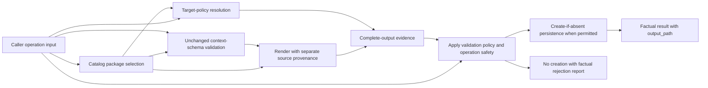

<!-- docs\development\issue460\design-mutation-validation.md -->
<!-- template=design version=5827e841 created=2026-09-03T17:05Z updated= -->
# Issue 460 Mutation and Persistence Design

**Status:** DRAFT  
**Version:** 1.28  
**Last Updated:** 2026-09-10  
**Primary Package:** DI-04  
**Upstream Dependencies:** DI-01/DI-02 resolved templates; DI-05 check evidence  
**Downstream Consumers:** Scaffold and safe-edit callers; DI-07; DI-08  
**Lifecycle Status:** Drafting

---

## Purpose

Define the DI-04 scaffold and safe-edit mutation boundary from the perspective of its callers, configuration owners, validation consumers, and filesystem effects. This package turns an accepted artifact request into one safe, observable mutation without allowing operation controls to become artifact content.

[Execution Adapter Design](design-execution-adapters.md) exclusively owns DI-05 after
the frozen F-20 amendment. This document owns how scaffold/safe-edit consumes check
evidence and permits persistence; it does not own the adapter catalog, process runtime,
role contracts, explicit check/test operations, or fix application.

## Scope

### In Scope

- scaffold operation inputs and result evidence;
- configured workspace and temporary target selection;
- exact file-name ownership;
- force-target behavior within the workspace;
- collision and no-overwrite policy;
- pre-persistence validation consumption;
- filesystem mutation and failure atomicity;
- the distinct safe-edit mutation path.

### Out of Scope

- concrete artifact context fields and renderer prose, owned by DI-03;
- adapter capabilities, output-profile definitions, and check/test/fix execution, owned by DI-05;
- template-suite distribution and renewal, owned by DI-06;
- implementation classes, method bodies, or delivery sequencing.

## Prerequisites

Read these first:

1. [Research](research.md), especially the Approved Strategy for F-03/F-07, F-08/S-14, F-13, F-15, F-19, and F-20, invariants I-16/I-19, and expected results E-03/E-13/E-20/E-23;
2. [Suite Resolution Design](design-suite-resolution.md);
3. [Shared Tool and Schema Contracts Design](design-shared-contracts.md);
4. [Design Intake Map](design-intake-map.md), DI-04 and DI-05.
5. [Execution Adapter Design](design-execution-adapters.md), the separate check contract and consumer boundary.

---

## 1. Consumer Problem

The scaffold caller needs to state six independent facts without learning hidden naming or routing behavior:

1. which template package to use;
2. the exact final file name, including extension;
3. whether to use the configured default directory or request another directory;
4. whether an otherwise disallowed in-workspace directory is intentional;
5. the complete caller-authored context that may affect rendered content;
6. whether output-validation evidence is a blocking write condition or is reported without blocking creation.

The configuration owner needs to say where each package may normally persist. The template author needs the caller context and separately supplied source provenance, but must not see filesystem controls. The validation path needs the complete proposed file and resolved target. The filesystem writer must create a new file without destroying an existing one.

The current implementation does not satisfy that separation. Directory policy lists allowed artifact IDs but has no explicit default; automatic placement uses the first matching directory. An explicit output path bypasses that routing. Temporary persistence uses a hard-coded server-relative directory and generates a random name. Those behaviors are historical evidence, not target-design constraints.

## 2. Operation Boundaries

### 2.1 Scaffold caller input

| Input | Meaning | Consumer | Never used for |
|---|---|---|---|
| artifact_type | Select one package by its `manifest.yaml:template_id` value | immutable resolved catalog | directory naming or renderer branching |
| file_name | Exact final basename, including extension | target resolver and output-profile validation | deriving rendered names |
| target_path | Optional directory request | target resolver | artifact content |
| force_target | Explicit permission to leave the package-configured allowed locations while remaining inside the workspace | target-policy evaluator | overwrite, validation bypass, or path-safety bypass |
| validation | `enforce` by default, or explicit `report`; the output-validation persistence policy defined in §4.4 | mutation-policy evaluator consuming factual evidence | selecting fewer checks, changing their outcomes, bypassing input/path/render safety, or artifact content |
| context | Complete caller-authored render data | selected JSON Schema and renderer | target selection |

`output_path` is not an input alias. It is the canonical workspace-relative path returned as factual operation evidence. The public tool result and its cached MCP resource never expose the absolute workspaceroot.

### 2.2 Resolved catalog input

The selected package supplies its `template_id`, persistence value, output-profile reference, validated renderer/schema graph, package version, resolved package fingerprint, and current source-suite fingerprint. DI-04 consumes these immutable facts; it does not rediscover templates or calculate package policy from file extensions.

Manifest `persistence` declares the package's normal storage intent: workspace or temporary. Project configuration answers where normal workspace persistence may occur; the central server path resolver supplies the derived temporary artifact root (section 3.2). When a workspace-intended package has no location entry, the resolver safely degrades that individual call to temporary persistence rather than inventing a workspace destination or rejecting the package. The operation input answers whether this call accepts normal routing or deliberately requests another directory.

### 2.3 Renderer input

The renderer receives the unchanged schema-validated caller context and a separately composed artifact-source provenance value. It cannot read artifact_type, file_name, target_path, force_target, validation, or output_path. This prevents filesystem and validation-policy choices from silently changing the artifact body.

## 3. Target Policy

### 3.1 Agreed behavior

All configured roots, `target_path` inputs, and `output_path` results use one normalized workspace-relative representation with `/` separators and no drive, root, or escaping `..` prefix. The server resolves an absolute native path internally for containment proof and filesystem I/O, but that physical path is not part of the scaffold tool contract, cached resource, or normal validation feedback. Absolute input is rejected as the wrong contract shape before force policy is considered.

The target decision is deterministic and visible to the caller:

1. If target_path is absent and the selected package has persistence: temporary, use the centrally derived temporary artifact root.
2. If target_path is absent and a workspace-intended package has an artifacts.<template_id> entry, use that entry's default_root.
3. If target_path is absent and a workspace-intended package has no location entry, safely fall back to the centrally derived temporary artifact root. This fallback needs no force_target.
4. If target_path names a configured allowed root for the package, use it without force_target.
5. If target_path is inside the workspace but the package has no location entry, or lies outside its configured allowed roots, accept it only when force_target is true.
6. Reject force_target when target_path is absent because it has no override target and is unnecessary for temporary fallback.
7. Reject every target outside the workspace, including when force_target is true.
8. Combine the accepted directory with the exact file_name; never derive, normalize, prefix, suffix, or replace that name.
9. Reject an existing output path. scaffold_artifact never overwrites.

force_target therefore has one stable meaning: the caller knowingly chooses an explicit in-workspace directory that package location policy does not normally admit. It is not a general force switch and cannot turn absence of a target into another routing mode.

### 3.2 Chosen configuration authority

The legacy template-registry role of `.pgmcp/config/artifacts.yaml` is superseded by self-contained template packages and strict shallow package discovery. The freed file becomes the workspace authority for produced-artifact locations. It references package identities but never defines them:

```yaml
version: "2.0.0"
artifacts:
  <template_id>:
    default_root: "<workspace-relative-path>"
    additional_roots:
      - "<workspace-relative-path>"
```

`<template_id>` is exactly the value authored once as `manifest.yaml:template_id`; the map key is a foreign-key reference rather than a second identity definition. `default_root` is both the omitted-target destination and an allowed root. `additional_roots` admits other normal roots without repeating the default. Target paths at or below those roots need no force; any other in-workspace target requires `force_target`.

The reference is intentionally one-way. Every authored `artifacts` key must resolve to exactly one loaded package, so stale or misspelled configuration fails at startup. The reverse is optional: a loaded package need not have an entry. Such a package remains discoverable and usable; without `target_path` it persists under the centrally derived temporary artifact root, while an explicit workspace target requires `force_target`. No concrete package IDs are used before DI-03 fixes the public catalog.

Human-approved refinement (2026-09-06): remove the previously designed `temporary_root`
field from `artifacts.yaml`. The existing configurable server root remains the single
base. One central resolver derives `resolved_temp_root = resolved_server_root / "temp"`
and the artifact destination beneath it as `artifacts`. Managers and adapters consume
resolved paths rather than repeating path assembly. No independent temp-root or
per-purpose path setting is introduced. Changing `server_root_dir` moves these paths
together; the existing `config_root` override remains unchanged. The default artifact
destination is consequently `.pgmcp/temp/artifacts`, not a separately configured literal.
DI-05 uses the sibling `validation` directory for disposable check inputs; validation
cleanup must never remove persisted artifacts. Explicit target/force rules above and
workspace-relative public path contracts remain unchanged.

### 3.3 `project_structure.yaml` consumer and field audit

The current file is not a project-scaffolding blueprint: loading it neither creates directories nor verifies their existence, and unknown paths resolve to a permissive fallback. The complete production-source scan found these consumers:

| Consumer | Current use | Target disposition |
|---|---|---|
| `ConfigLoader` | loads the file, injects each directory-map key as `path`, and validates artifact and parent references | replace with the artifact-location config loader and catalog cross-validation |
| startup `ConfigValidator` | repeats unknown-artifact and unknown-parent checks | replace only the surviving `artifacts.yaml` versus resolved-catalog coherence checks |
| bootstrap configuration | requires and transports `ProjectStructureConfig` | inject the new read-only artifact-location policy instead |
| `ArtifactManager` | scans allowed directories and chooses the first sorted match as an implicit output location | replace with explicit `template_id` target resolution |
| `DirectoryPolicyResolver` | owns directory lookup, parent walking, inheritance, permissive fallback, and reverse artifact lookup | remove after its only live behavior consumer moves to the new resolver |
| legacy `PolicyEngine` | can query directory artifact permission, but is never constructed or called by production composition | remove its dead directory-policy dependency; do not confuse it with `EnforcementRunner` |
| current `EnforcementRunner` | no dependency on `ProjectStructureConfig`, `DirectoryPolicyResolver`, or any field in the YAML | unchanged |
| tests and active documentation | assert or describe the legacy schema, resolver, first-match placement, and bootstrap wiring | adapt durable target behavior; remove implementation-shaped and obsolete policy claims |

Every authored field and derived compatibility member has also been traced:

| Current member | Actual consumers and effect | Target disposition |
|---|---|---|
| `version` | loader/schema compatibility check | replaced by the version of the new `artifacts.yaml` contract |
| `directories` | schema, loader, validators, and resolver enumeration | replaced by artifact-oriented location entries |
| derived `path` | injected from each directory key; used by resolver matching and policy messages | replaced by explicit workspace-relative roots |
| `parent` | loader/validator reference check and resolver inheritance only | remove with directory inheritance |
| `description` | required by schema and carried into resolved policy/result messages; no live decision depends on it | remove |
| `allowed_artifact_types` | cross-validated at startup; used by `ArtifactManager` reverse lookup and the uncomposed legacy `PolicyEngine` | replace with `artifacts.<template_id>` location ownership |
| `allowed_extensions` | inherited and exposed by `DirectoryPolicyResolver`; no production caller invokes its directory extension check, while `PolicyEngine` checks the separate operation-policy field instead | remove; scaffold file/content compatibility belongs to DI-05 output profiles |
| `require_scaffold_for` | matched only through a resolver method with no production caller | remove; any future enforcement requires an explicit live enforcement consumer |
| `allowed_component_types` | deprecated code alias for `allowed_artifact_types`, used only by the legacy `PolicyEngine` path and tests | remove without a bridge under the approved clean break |
| permissive unknown-path fallback | resolver behavior exercised by tests but not needed by the explicit target contract | remove; target policy fails closed unless `force_target` explicitly admits an in-workspace path |

Removal is therefore not a blind file deletion. Planning must migrate the one live behavioral consumer, replace startup composition and cross-validation, remove the dead legacy policy dependency, and update every enumerated test and active document. Archived documentation remains historical evidence and is not rewritten.

### 3.4 Named removal-completeness inventory

The field/consumer conclusions above are backed by a repository-wide symbol and configuration-reference scan. Planning and implementation must account for this exact active inventory; finding a new active reference expands the migration rather than justifying a compatibility shell.

- Authored configuration: `.pgmcp/config/project_structure.yaml`.
- Production and export surfaces: `mcp_server/bootstrap.py`, `mcp_server/config/loader.py`, `mcp_server/config/validator.py`, `mcp_server/config/schemas/project_structure_config.py`, `mcp_server/config/schemas/__init__.py`, `mcp_server/schemas/__init__.py`, `mcp_server/core/directory_policy_resolver.py`, `mcp_server/core/policy_engine.py`, and `mcp_server/managers/artifact_manager.py`.
- Test and shared-fixture surfaces: `tests/mcp_server/test_support.py`, `tests/mcp_server/config/test_project_structure.py`, `tests/mcp_server/core/test_directory_policy_resolver.py`, `tests/mcp_server/unit/config/test_c_loader_schema_structural.py`, `tests/mcp_server/unit/config/test_label_startup.py`, `tests/mcp_server/unit/config/test_loader_behaviors.py`, `tests/mcp_server/unit/config/test_validator_c3.py`, `tests/mcp_server/unit/config/test_workflow_config_c6.py`, `tests/mcp_server/unit/managers/test_directory_resolution.py`, `test_typescript_dto_scaffold.py`, `tests/mcp_server/unit/server/test_bootstrap.py`, `tests/mcp_server/unit/tools/test_scaffold_artifact.py`, and `tests/mcp_server/integration/test_smoke_all_types.py`.
- Active documentation surfaces: `docs/reference/tools/scaffolding.md`, `docs/reference/TEMPLATE_LIBRARY_USAGE.md`, `docs/reference/mcp_vision_reference.md`, `docs/reference/config-loading-architecture.md`, `docs/manuals/architecture.md`, `docs/manuals/architectural_diagrams/05_config_layer.md`, and `docs/manuals/architectural_diagrams/10_config_consumers.md`.

`mcp_server/managers/enforcement_runner.py` was inspected explicitly because enforcement was the highest-risk suspected hidden consumer. It imports or consumes none of the legacy project-structure types or fields. Archived development documents may continue to name the retired contract as historical evidence.

## 4. Collision and Mutation Safety

### 4.1 Scaffold creation

A successful scaffold creates exactly one previously absent file. The writer performs both an early existence check for actionable feedback and a final create-if-absent operation at the mutation boundary. The final check is authoritative so a concurrent creator cannot be overwritten between validation and persistence.

An existing file returns a collision result and leaves it byte-identical. The caller can choose another file_name or use safe_edit_file for an intentional modification. Neither force_target nor validation policy changes this rule.

### 4.2 Safe edit

safe_edit_file owns intentional modification of an existing file. It constructs complete proposed content, consumes the applicable factual validation evidence, and replaces the target only when its validation policy and independent safety conditions permit. It does not masquerade as scaffolding and does not turn force_target into an overwrite control.

How an existing artifact selects its output profile without hard-coded extension dispatch or parsing persisted provenance remains a joint DI-04/DI-05 decision.

The approved extension-based fallback reads the shared root-level
`checks.yaml:profiles_by_extension` assignment owned by
[DI-05](design-execution-adapters.md#shared-extension-to-profile-assignment), not a
private `safe_edit_file` configuration section. This settles configuration ownership,
not the complete selection contract: DI-05 now owns the approved
[extension lookup](design-execution-adapters.md#extension-lookup-semantics); precedence
between selection sources and the no-profile outcome are specified in §4.6; their complete typed integration remains open.
Section 4.8 now admits a narrow V3 reader for this demonstrated consumer and reconciles
DI-02's conditional no-replacement rule. It does not restore the legacy parser;
exact header recognition and typed reader/writer interfaces remain integration work.

Research-approved scope, independent QA GO reported by the human on 2026-09-07:
both mutation tools accept `validation: enforce|report`, default `enforce`, and return
`validation_policy`. Retire safe-edit `mode`, `strict`, `interactive` and `verify_only`
without aliases, dual reads or a replacement preview/dry-run operation. The earlier
[deferral](deferred-work.md#deferred-work-notice-safe-edit-verify-only-removal) is superseded.
A passing edit proceeds to persistence; read-only checking is not an equivalent proposed-edit
preview. Preserve all four edit operations, complete-content checking, atomic writes,
no-write enforcement and independent safety blockers under both policies.

### 4.3 Failure invariants

- Context, target, render, evidence, collision, and persistence failures remain distinguishable.
- Required validation that does not pass under `enforce` creates or changes no target file for either mutation tool.
- Temporary and workspace persistence use the same path-safety and no-overwrite guarantees.
- A mutation result reports facts; presentation layers decide concise human or agent wording.

### 4.4 Scaffold validation request and result contract

This section owns the scaffold-facing use of DI-05 evidence and its persistence consequences. Section 4.6 applies the same approved policy vocabulary to safe edit; separate check/test/fix operation results retain their own contract boundaries. The accepted F-08/F-19 separation between evidence and policy remains binding within the wider F-20 adapter architecture.

#### 4.4.1 Input policy and naming

The optional input `validation` accepts exactly `enforce` or `report`. Omission means `enforce`; null, booleans, unknown strings, and legacy spelling aliases are invalid inputs. An accepted operation reports the effective value as `validation.policy`, including when the default was used.

| Input value | Meaning | Effect on execution |
|---|---|---|
| `enforce` | Required output evidence must be executed and passing before creation | Collect the selected profile's evidence; block creation unless it passes |
| `report` | Collect and expose output evidence without making a failed or unavailable verdict a write prohibition | Use the same profile and checks; permit creation with failed/unavailable evidence if every independent operation condition succeeds |

Neither value disables validation. There is no `off`, `skip`, dry-run, automatic downgrade, or retry in `report` mode. One failed or unavailable check does not by itself cancel the other independently executable selected checks, under either policy. An operation interruption or internal failure can stop collection, but never silently authorizes writing.

`enforce` and `report` name the caller's requested treatment of evidence. `strict`/`permissive` was rejected for this input because it can suggest different validation rules; `interactive` can suggest a conversation that the scaffolder does not conduct. Both selected policies report the factual outcomes. `force_target` remains an independent location permission.

The policy is an explicit per-call control, not a new manifest field or an inherited package opt-out. Migration must audit the old `strict_validation` declarations and inherited permissive defaults and move deliberate exceptions to explicit caller intent. It must not silently preserve those defaults, infer `report` from artifact identity, or introduce a legacy alias. This makes the historical opt-out visible at the operation boundary without changing validator truth.

#### 4.4.2 Factual outcomes and result-side mirror

Serialization caveat from the 2026-09-07 audit (§4.5): the following `validation.*`
notation records the agreed grouping and semantics, but its direct public-object
projection has an evidenced presentation mismatch. Statuses, the policy mirror and
persistence rules remain decided; the public nesting is not integration-ready and
must not drive a presenter extension or duplicate flat/nested fields by assumption.

The scaffold result contains a `validation` report. Its `policy` is the effective request policy; its `status` summarizes evidence; its `checks` retain the individual selected-check identities, factual statuses, findings, and reasons. The selected profile identity is reported when known. Full check-record types and diagnostic encoding remain DI-05 work; no new public capability IDs are invented here.

| Factual status | Meaning | Must not mean |
|---|---|---|
| `passed` | The check executed and returned a trustworthy accepting verdict | No validator matched, no issues were collected, or writing was permitted |
| `failed` | The check executed and returned a trustworthy rejecting verdict about the proposed artifact | A missing executable, an unparseable execution result, or a filesystem failure |
| `unavailable` | The selected capability could not provide a trustworthy verdict; its reason is retained | The proposed artifact was rejected or validation was deliberately disabled |
| `not_executed` | The operation did not reach the check or was interrupted before that check could produce a verdict; the cause distinguishes not-started from interrupted work | A successful check, a missing provider already established as unavailable, or permission to skip a check |

A defined capability without an available adapter implementation or underlying toolchain is `unavailable` at use. A recognized adapter launch, timeout, or result-decoding failure is likewise unavailable evidence, with its actual reason; a normal negative validation verdict is `failed`. Unexpected orchestration/configuration errors are operation failures, not exceptions to suppress under `report`. DI-05 owns the exact execution-failure classification and must preserve these distinctions.

The [DI-05 adapter-call failure contract](design-execution-adapters.md#pgmcp-owned-adapter-call-failures)
defines launch_failed, timeout, process_failed, invalid_response and response_too_large as PGMCP-owned
observations, separate from adapter-reported reasons. Recognized failures map to
unavailable check evidence with runtime origin preserved; independently executable
checks continue. Operation cancellation, preparation defects and unexpected server
errors remain outside this bounded conversion. Cleanup remains non-blocking.
Under [managed invocation termination](design-execution-adapters.md#managed-invocation-termination),
an unconfirmed stop is also an operation failure: neither enforce nor report permits
persistence, and potentially used temporary inputs are retained. A confirmed timeout
retains ordinary unavailable mapping; a deletion failure alone remains non-blocking.

The summary is deterministic and independent of policy:

1. Any `failed` check makes the summary `failed`.
2. Otherwise, any `unavailable` check makes it `unavailable`.
3. Otherwise, any `not_executed` check, or a validation phase not reached, makes it `not_executed`.
4. Only a non-empty, completely collected set of passing profile obligations makes it `passed`.

This ordering is a summary, not a rewriting of check evidence. For example, a failed check plus an unavailable check summarizes as `failed`, while both original statuses remain in `checks`. No `mixed` status, duplicate pass boolean, or extra persisted summary counters are needed. Presentation must not turn a mixed report into an all-checks-executed claim.

Before profile selection, there are no known check records to fabricate. A failed accepted operation can report `not_executed` with an empty check collection and its independent operation error. Outer MCP input validation or startup failure may prevent this operation report from existing at all, as defined by the shared response contract.

Human-confirmed presentation route (2026-09-06): retain known operation-failure facts
in this complete scaffold output graph, following issues 456/459. Cache the full graph
before presentation; project relevant facts through existing generic mechanisms and
presentation.yaml. Operation-blocking does not itself require a new top-level error
DTO. NoteContext is not the diagnostic channel for this contract. Preserve independent
check evidence and operation/persistence outcomes rather than turning every error into
a check finding. DI-05 records the architectural rationale under
[DTO-independent error presentation](design-execution-adapters.md#dto-independent-error-presentation).

The scaffold manager owns policy and persistence consequences, not the public tool.
It consumes the canonical diagnostics from generic adapter process management unchanged;
the tool transfers that manager result without inferring or formulating failures.
This follows the shared check/test/fix
[responsibility boundary](design-execution-adapters.md#shared-process-diagnostics-and-consumer-ownership).

An empty effective output-profile obligation set is an invalid profile/selection, not a vacuous pass or an opt-out. Static emptiness is rejected with configuration coherence checks; an unexpected empty runtime selection fails the operation. A defined non-empty profile whose providers are absent is instead the supported `unavailable` case. No caller-selectable or profile-based skip path is introduced here.

#### 4.4.3 Complete policy/outcome combinations

For completed, otherwise valid operations, the following table determines whether validation permits creation. The `not_executed` rows explicitly cover operations that did not reach or complete validation. Independent failures in §4.4.4 always take precedence. “Create” means permission to attempt safe creation, not proof that it succeeded; only successful persistence makes the operation successful.

| Effective policy | Reported validation status | Persistence action | Operation outcome |
|---|---|---|---|
| `enforce` | `passed` | Create the artifact | Success; validation passed |
| `enforce` | `failed` | Do not create | Unsuccessful; validation rejected the proposed artifact |
| `enforce` | `unavailable` | Do not create | Unsuccessful; required validation evidence is unavailable |
| `enforce` | `not_executed` | Do not create | Unsuccessful; validation was not reached/completed |
| `report` | `passed` | Create the artifact | Success; validation passed |
| `report` | `failed` | Create the artifact | Success; validation remains failed and findings are returned |
| `report` | `unavailable` | Create the artifact | Success; validation remains unavailable and reasons are returned |
| `report` | `not_executed` | Do not create | Unsuccessful; `report` does not authorize skipping or resuming an aborted operation |

The `not_executed` rows describe an uncompleted operation, not an additional successful validation mode. In this scaffold design there is no independent legitimate skip setting: every selected check is processed or has explicit unavailable evidence. An operation that stops partway through collection does not write under either policy, even if an already obtained failed/unavailable check determines its summary. The independent operation error takes precedence over permission to persist.

No report policy changes a check status. In particular, `report` plus `failed` is not a warning-level pass, and `report` plus `unavailable` is not a validated artifact. Operation success means the requested artifact was created under the effective policy, not that every check passed. These rules apply equally to workspace and temporary persistence.

#### 4.4.4 Independent failure and commit boundaries

| Condition | Validation evidence in a returned operation report | Persistence under either policy |
|---|---|---|
| Invalid outer operation input, including an unknown policy | Normally framework-owned rejection before the scaffold operation runs | No creation |
| Unknown output profile/capability reference or statically empty obligations | Configuration rejection at startup; no fabricated scaffold verdict | No creation |
| Rejected artifact context, unsafe/disallowed target, rendering failure, or early collision | `not_executed` when the output-validation phase was not reached; retain any evidence already obtained | No creation; preserve an existing target |
| Interrupted validation or unexpected orchestration failure | Retain obtained check results; record remaining known checks as `not_executed` with a not-started or interrupted cause | No creation, even with `report` |
| A late create-if-absent collision or persistence failure after validation | Retain the original validation report, including `passed` where true; return a separate operation failure | No successfully created artifact is claimed; collision never alters the competing file |
| Successful create followed by a cache/presentation/transport problem | Validation and committed creation remain facts; delivery trouble does not retroactively undo them | Do not report “nothing created” merely because response delivery failed |
| Detected validation-temp cleanup failure after obtaining valid check evidence | Preserve the verdict and report cleanup separately | Apply the original enforce/report decision unchanged; cleanup alone neither blocks nor authorizes creation |

All known validation and operation-safety blockers are resolved before the target mutation. Persistence failure handling must satisfy the mutation-safety contract; the final writer mechanics are not chosen by this outcome table. Cancellation or connection loss can prevent delivery of any result, especially around the commit boundary. Absence of a response is not evidence that no file exists; a caller must inspect the target before retrying. No automatic retry or new reconciliation protocol is introduced.

The complete cached operation record carries the validation report. Bounded text exposes creation versus rejection and any failed, unavailable, or incomplete evidence; it never labels an artifact “validated” solely because creation succeeded. A context-schema attachment is still returned only for artifact-context failure, not for an output-validation failure or unavailable provider. The shared schema/resource rules remain unchanged.

Cleanup is not an operation-safety blocker in the table above. The
[DI-05 cleanup contract](design-execution-adapters.md#non-blocking-cleanup) owns the
best-effort deletion attempt and separate reporting; residual temp files require no
monitoring or automated recovery.

### 4.5 Public Mutation Response Nesting Audit

**Status:** source-backed Design audit, 2026-09-07; corrections below are proposals,
not an approved replacement wire contract. Scope is scaffold and safe-edit public
operation results, with the shared schema-attachment seam inspected for exceptions.
Internal adapter protocols, native payloads and check/test/fix-wide outputs were not
broadened by this audit. The later Research amendment separately retires `verify_only`.
No runtime tests were executed.

#### Evidence and supported shapes

- [Issue 99 Research](../archive/issue99/research.md) identified client difficulties
  with input-schema `$ref`/`$defs`. Commit `cb054771` (2026-05-08) added the
  [schema resolver](../../../mcp_server/utils/schema_utils.py). Reference inlining
  preserves object structure; it does not require all-flat JSON.
- [Issue 456 §3.4](../issue456/design.md#34-configuration-contracts) deliberately
  limits presentation to direct scalar fields and ordered collections with declared
  children. Commit `3cde6aa9` (2026-08-21) introduced the admission rules. See
  [alignment validation](../../../mcp_server/presenters/text_presenter.py) and
  [collection classification/rendering](../../../mcp_server/presenters/collection_text_renderer.py).
- [Issue 459's alternatives](../issue459/design.md#21-option-a-nested-additive-finding-dto)
  reject flattening findings out of their owning gates. Commit `76393d6e` (2026-08-22)
  adds `gates` → `findings` via YAML children; its
  [recorded validation](../issue459/validation.md) reports unchanged presenter code.
  This supports collection nesting, not arbitrary object traversal.

The current classifier admits `list[T]` or `tuple[T, ...]` where T is one concrete
scalar or Pydantic model type. An `Annotated` discriminated union of model types is
not automatically a supported collection element. Whole structured values are not
scalar placeholders; dotted collection and enum-case selectors are explicitly rejected.
Unrendered nested data can still be serialized into the complete cached DTO.

#### Audited surfaces

| Surface / authority | Consumer need and finding | Proposed disposition |
|---|---|---|
| Scaffold `validation.policy` / `validation.status` / `validation.checks`, §4.4 | Policy, verdict and actionable checks must be visible inline; the singleton object requires unsupported traversal | Direct `validation_policy`, `validation_status`, `profile_id` and `checks`; preserve input `validation` and existing outcome rules |
| Proposed scaffold template/artifact grouping, Q-MUT-03 | Package identity/version/fingerprint and output location have consumers; singleton grouping has no demonstrated presentation benefit | Prefer direct named fields; exact inventory remains open, without adding source-suite fingerprint |
| Safe-edit `validation.selection.source` and later `validation.selected_source`, workshop proposals | Removing `selection` alone leaves the unsupported `validation` singleton | Direct `selected_source`, `profile_id`, conditional `template_id`/`extension`, `validation_status` and `checks`; presence/selection rules remain open |
| Write facts and operation errors | Existing direct `mode`/`written` and result envelope distinguish writing from validation | Keep direct operation facts; no new `result`/`output` singleton or duplicate `passed` beside validation status |
| Per-check decision and process failures, DI-05 | Internal `decision.status` and `failure.reason` wrappers are not automatically inline-renderable public records | Define concrete public check records with direct identity/status/reason facts, preserving origin and meaning; no tool-side inference or presenter DTO dispatch |
| Check-owned findings/diagnostics collections | Nesting preserves which check owns an observation; typed child collections are supported | Retain meaningful ownership nesting where records exist; no unrelated root lists or invented findings parsed from native output |
| Collections of closed variant DTOs | Internal union typing does not prove renderer admission of `tuple[VariantA | VariantB, ...]` | Resolve the public concrete record and its constraints before integration; no generic union-renderer project |
| Native JSON/text evidence and process details, DI-05 | Exhaustive evidence belongs in the cache; arbitrary JSON is not a declarative finding collection | Preserve native structure and cache-only detail; separately resolve minimum actionable inline feedback. JSON-only rejection does not yet prove native reasons can be shown inline |
| Context failure diagnostics and schema attachments, shared contract §7.4 | Bounded location/error facts plus the complete recovery schema serve distinct consumers | Direct typed diagnostic collection where needed; retain the separate embedded schema and cache ownership, without flattening schema properties into operation fields |

This inventories known Design structures, not implemented V3 DTOs. Current
[output schemas](../../../mcp_server/schemas/tool_outputs.py) and
[presentation configuration](../../../.pgmcp/config/presentation.yaml) are V2 evidence,
not authority to retain old vocabulary, boolean-only validation or duplicated schemas.

#### Correction boundary and remaining evidence

Recommendation: direct summary fields plus meaningful typed collections. Do not keep
the same fact in both a public nested graph and flat presentation-only aliases. Internal
contracts may remain nested; narrow structural public projection preserves facts without
recomputing outcomes or constructing competing diagnostic meanings. The cache continues
to store the complete public operation DTO before text projection.

The audit itself did not approve adapter summary fields. The subsequent human decision
requires a factual failed-decision message in DI-05; §4.6 applies that correction without
an extra public `origin` field. The audit does not normalize arbitrary native JSON,
introduce JSONPath/mapping DSLs, disguise singleton objects as one-item lists, or extend
the presenter to accommodate proposed packaging. It does not settle safe-edit policy
combinations; the subsequent Research amendment and §4.6 own that decision.

Agree the direct public field inventory and typed check record next. Later conformance
must prove real-config alignment/rendering for success, rejection, missing profile,
unavailable adapter, runtime failure and persistence failure; preserve origin/reason,
ownership/order, cache completeness and text bounds. Adapt existing
[collection tests](../../../tests/mcp_server/unit/presenters/test_collection_text_renderer.py)
and [real-config rollout tests](../../../tests/mcp_server/unit/config/test_tool_presentation_rollout.py)
for durable gaps. No passing runtime evidence is claimed by this source audit.

### 4.6 Consolidated Public Result Workshop

**Status:** human-approved on 2026-09-07; policy vocabulary reconciled after the human-reported independent Research QA GO.
The direct fields, selection outcomes, check-record combinations, persistence behavior
and channel dispositions below are accepted. This section supersedes §4.4's singleton
`validation.*` serialization, not its factual or persistence semantics. Both mutation
tools use `validation: enforce|report`, default `enforce`, and `validation_policy` output.
The legacy safe-edit mode field and values, including `verify_only`, are removed without
a compatibility bridge or replacement preview. Final diagnostic/provenance carriers and the V3
reader seam remain integration obligations, not newly completed work.

#### Direct operation fields and their consumers

| Field / surface | Purpose and accepted rule | Presentation |
|---|---|---|
| Existing operation success/error envelope | Success means the requested mutation completed under the chosen policy, not validation acceptance; retain the established framework boundary | Concise outcome and actual operation failure inline; complete structured facts cached |
| Scaffold `output_path`; safe-edit `path` | Identify the operation's file without a new singleton wrapper; retain established path-safety/exposure requirements | Inline and cache, never treat the path alone as proof of a write |
| `written` | Actual completed persistence for both consumers; true means create-only scaffold or completed safe-edit write, not necessarily changed bytes | Inline and cache; false on pre-write refusal |
| Safe-edit `content_changed` | Required nullable boolean; after a completed write, compare original decoded text with the proposed text submitted to that successful write; null when no write completed | Inline and cache; prevents a successful no-change write being presented as a text modification |
| `validation_policy` for both mutation tools | Mirror request `validation` as enforce/report, default enforce; safe-edit `mode` and its legacy values are not accepted | Inline and cache |
| `validation_status` | Closed passed/failed/unavailable/not_executed status, independent of mutation success | Inline and cache; replace duplicate validation `passed` boolean |
| `profile_id` | The selected current profile, null if none is established; no duplicated profile contents | Inline and cache |
| Safe-edit `selected_source` | Closed input/metadata/extension/none selection route; null until a usable selection outcome is established | Inline and cache |
| Safe-edit `template_id` or `extension` | The actual selector behind that outcome; no populated unrelated selector | Inline when needed to explain selection, always retained when applicable |
| Scaffold package identity/version/resolved fingerprint | Preserve the shared-contract package facts directly, not under template/artifact wrappers; no source-suite fingerprint in this DTO | Identity inline; version/fingerprint cache by default, without unnecessary routine text |
| `checks` | Ordered tuple of one concrete public check-record model | Bounded records inline, complete ordered records cached |

Not every consumer receives every field. No top-level `validation`, `selection`,
`template`, `artifact` or `output` singleton is introduced for grouping alone. The
shared contract remains authoritative for schema attachments and provenance; exact
package-version/fingerprint field spelling is not independently redefined here.

#### Selection outcomes and field combinations

| Established outcome | selected_source | profile_id | template_id | extension |
|---|---|---|---|---|
| Explicit current template selected | input | Required | Required | null |
| Valid V3 metadata selects a current template | metadata | Required | Required | null |
| Configured suffix selects a profile | extension | Required | null | Required matched configured suffix |
| Lookup completed without a profile | none | null | null | null |
| Selection not reached or aborted | null | null | null | null |

This is a frozen, closed public model with explicit nulls and cross-field validation,
not an unconstrained bag. IDs are nonblank references to the immutable runtime catalog.
No profile contents or hashes are used to infer a current selection. Resolve against
the original file before constructing its proposed edit, not edited metadata or a
temporary filename. Explicit input precedes approved automatic selection; an invalid
explicit ID remains an input error, not a request to try the extension route. Human
refinement, 2026-09-10: missing, V2 or invalid first-line V3 metadata, including an
invalid or unknown metadata template id, establishes no applicable template and uses
the configured extension route without a legacy
alias. Report the actual selected_source, not metadata when recognition was rejected;
retain the rejection reason as factual selection feedback through the existing
structured/declarative presentation boundary, not a synthetic check failure. A valid
header with an id absent from the current catalog has the same selection outcome as
an absent header. Catalog lookup miss is not a broken catalog and is not an operation
failure. This supersedes the earlier separate unresolved-metadata-ID failure rule.
The bounded V3 reader responsibility is approved in §4.8. Invalid public input may be rejected before
any operation DTO exists. Later selection failure retains its separate operation problem.

#### One public check record with closed combinations

Required verdict fields are `check_id`, `status`, `reason`, `message`, and `evidence`;
nullable fields below are explicit null, not omitted accidental defaults. The record
is frozen/strict/extra-forbid. Status is a closed enum; reason is a union of the existing
AdapterUnavailableReason and AdapterCallFailureReason enums plus a closed
CheckNotExecutedReason with `not_started` and `interrupted`. These codes preserve their
owners; no free strings, overlapping reason aliases, or public `origin` are introduced.

| Status | reason | message | evidence |
|---|---|---|---|
| passed | null | null | Existing NativeEvidence or null |
| failed | null | Required NonBlankText from adapter | Required NativeEvidence |
| unavailable, adapter response | Existing adapter-owned enum value | Required original adapter message | NativeEvidence or null |
| unavailable, runtime failure | Existing runtime-owned enum value | Required original runtime message | null; captured bytes are process diagnostics, not accepted adapter evidence |
| not_executed | not_started or interrupted | Required factual consumer-orchestration explanation | null; any partial output remains process diagnostics |

Failed `message` is now part of the approved adapter decision; no extra generic reason
code replaces native diagnostic codes. Do not manufacture a check row when no check
was selected. An unexpected server fault or adapter invalid_request is a separate
operation defect, not a failed-content or permissive-unavailability conversion.
The record is concrete to satisfy existing collection admission; cross-field validation
retains the strict combinations rather than adding a union-renderer framework.

This is the complete verdict-field proposal, not a deletion of other required evidence:
invoked adapter/tool identity and version, adapter fingerprint/contract version, bounded
process capture, input-rejection details and additional lifecycle/cleanup diagnostics
remain in the full cached operation result under their existing owners. Their final
public carrier types must be audited with this record, not silently dropped or copied
into parallel authoritative result graphs. This workshop adds no alternative retention
system and does not relocate native settings into PGMCP config.

#### Persistence outcomes reviewed together

The following table assumes otherwise valid input, completed orchestration and no
independent write/safety blocker. “Write” permits an attempt, not a claimed success.

| Validation situation | Scaffold enforce | Scaffold report | Safe edit enforce | Safe edit report |
|---|---|---|---|---|
| All selected checks passed | Write | Write | Write | Write |
| Completed checks include failed | Refuse | Write | Refuse | Write |
| No failed check, at least one unavailable | Refuse | Write | Refuse | Write |
| No profile found through a completed permitted lookup | Not a valid scaffold case | Not a valid scaffold case | Refuse | Write with explicit no-profile diagnostic |
| Selection aborted, operation interrupted, request/config defect or unconfirmed termination | Refuse | Refuse | Refuse | Refuse |

Safe-edit no-profile is specifically `selected_source=none`, `profile_id=null`,
`validation_status=not_executed`, empty checks and a distinct structured operation
diagnostic. It is not a generic permission to write whenever status is not_executed.
Scaffold always has a manifest profile; missing/broken configured references fail
configuration rather than enabling the safe-edit fallback policy.

Preserve §4.4 summary reduction: failed wins over unavailable, which wins over
not_executed; only a nonempty completely passing obligation set yields passed.
Independent operation blockers still override write permission, even if obtained
check evidence summarizes as failed. Write failure keeps any passed validation intact;
cleanup failure keeps both validation and persistence policy intact. Keep timeout plus
termination_unconfirmed as distinct original/additional facts. Never change a failed
verdict to passed because report allowed persistence.

#### Presentation, ownership and close-out

The consumer manager selects profiles, aggregates facts and owns persistence decisions.
The adapter supplies native verdicts/messages; generic process management supplies its
own failures. The public tool performs structural transfer only. Configured text renders
direct summary fields and direct check-item fields; native evidence and verbose capture
remain cache-only. No generic parser interprets native JSON. Complete DTO caching happens
before bounding text, and failed messages must remain actionable through the existing
collection route. Native rule locations/messages still obey public path-exposure policy.

Context validation failures keep the existing separate embedded schema attachment;
output-check failures do not acquire a context schema. No new response wrapper,
presenter-specific class knowledge, NoteContext diagnostic route or origin field is added.

The human accepted field necessity, explicit-null selection states, check-field
combinations and the narrowly permitted non-blocking no-profile case. Research now also
fixes the shared policy vocabulary and legacy-mode removal. Close the remaining
structured operation-diagnostic/provenance carriers against real presentation alignment.
Do not claim the complete mutation DTO integrated until those carriers, the V3 reader
boundary and lossless cache/inline conformance are resolved. Future workshops should
cover coherent contract surfaces rather than one field or one status per turn.

### 4.7 Safe-Edit Operations, No-Change Results and Failure Boundaries

**Status:** human-approved workshop, 2026-09-07. This section adds only safe-edit
consequences to the shared contract; it does not redesign adapter execution, validation
policy, temporary storage or presentation infrastructure.

#### Preserved operation semantics

| Operation | Preserved behavior | Missing match |
|---|---|---|
| `replace` | Replace the first exact match, optionally within the existing 1-based inclusive search window | Reject the edit |
| `append` | Append at EOF or insert before/after the first exact anchor; preserve existing newline behavior | Reject when an explicitly supplied anchor is absent |
| `rewrite` | Use caller text as the complete replacement of an existing file | Not applicable; identical text is valid proposed content |
| `pattern_replace` | Replace all matches using the existing regex/literal setting | Return unchanged proposed content, not an edit failure |

Keep existing matching cardinality and newline behavior. No require-match switch,
configurable replacement count, fuzzy replacement, or new dry-run operation is introduced.
Similar-text suggestions remain diagnostic only and never authorize an approximate edit.

Evidence: [SafeEditTool operation construction](../../../mcp_server/tools/safe_edit_tool.py)
and [existing public-operation tests](../../../tests/mcp_server/unit/tools/test_safe_edit_tool.py)
cover replacement windows, anchored insertion, full rewrites, regex replacement and
failure feedback. The current no-match regex/literal path returns unchanged text;
direct implementation evidence does not imply that all preservation cases already have tests.

#### Text effect versus writing

The safe-edit output adds required `content_changed: bool | None`, without a default,
to its frozen, strict, extra-forbid contract. It is a direct scalar, not a new result wrapper.

| Actual write outcome | written | content_changed |
|---|---|---|
| Completed write of text different from the original decoded text | true | true |
| Completed write of text identical to the original decoded text | true | false |
| No completed write | false | null |

Enforce these combinations in the typed output model. The consumer manager owns the
comparison and the completed-write fact; tools only transfer them. This compares text,
not original filesystem bytes, encoding, line-ending representation on disk, timestamps,
or later external changes. The evidence identifies the proposed text handed to the writer;
it does not require a second post-write read.

Agents use the field to distinguish a successful write from an effective text change;
declarative presentation exposes that distinction inline and the complete resource
retains it. Do not infer a match count or why the text remained unchanged from this boolean.
Do not add diffs, before/after copies, match counters or another result registry merely
to answer that question. Existing diff-related public surfaces require their already
catalogued disposition; this decision does not reactivate diff production.

Unchanged proposed text follows the same complete-content checks and persistence policy
as other proposed text. No implicit skip-check or skip-write optimization is introduced.

#### Safe-edit-specific failure meaning and feedback

| Failure boundary | Required fact | Validation consequence |
|---|---|---|
| Missing target | Existing file could not be found; creation belongs to scaffolding | No proposed-content check is fabricated |
| Unreadable target | Original text could not be obtained reliably | No proposed-content check is fabricated |
| Missing replacement target | Exact target is absent from the applicable text/search window | Edit construction failed, not content validation |
| Missing insertion anchor | Explicit insertion position cannot be located | Edit construction failed, not content validation |
| Invalid regex operation | Pattern or replacement expression is invalid | Edit construction failed, not content validation |
| Rejected proposed content | A complete proposed result exists but fails its selected checks | Preserve actual check verdicts and apply enforce/report |

The first five boundaries block both enforce and report. Report cannot repair an
invalid editing command. Use closed typed domain reasons, reusing an existing equivalent
failure contract where available; exact carrier/code integration remains Q-MUT-03.
Do not add these reasons to adapter enums or make the presenter classify exception text.
Before checking begins, report not_executed rather than a fabricated failed check;
retain an established profile selection if one already exists. Invalid outer tool input
still follows the existing input-validation boundary.

Retain useful similar-text/context feedback as structured domain facts; presentation
configuration owns bounded rendering. Domain code must not concatenate Markdown previews.
No new universal diagnostics collection is approved by this section.

#### Meaning of validation and profile selection

Checks assess the complete proposed content. A failure does not prove that this edit
introduced the finding. Do not add original-content rechecking, before/after finding
comparison or a claim that existing errors were caused by this edit.

Resolve the profile from explicit input or original-file metadata/extension under §4.6.
Edited metadata cannot change that same call's selection. An explicit template_id selects
a current validation profile; it neither rewrites provenance nor makes an existing file
a newly scaffolded artifact. Adapters own check facts; the consumer manager owns edit
construction and persistence; tools transfer facts and declarative presentation renders them.

#### Preservation evidence

Adapt existing public-operation tests and add durable missing cases for first-versus-all
replacement, window boundaries, missing target/anchor, invalid pattern/replacement,
identical rewrite, same-text replacement, zero-match pattern replacement, and unchanged
append newline behavior. Assert exact proposed text reaches checking and writing;
construction failures never invoke a content adapter or writer. Verify content_changed
null on rejection/write failure, false on successful same-text writes and true on
successful differing-text writes. An unchanged proposal still receives required checks.
Exercise existing-error findings without causal attribution, stable original-file profile
selection and structured bounded suggestions. Prove real-config inline/cache projection
without presenter logic changes. No runtime tests were executed for this Design workshop.

### 4.8 V3 Metadata Selection and Read/Check/Write Consistency

**Status:** human-approved, 2026-09-08. Safe edit is the demonstrated current consumer
that justifies a narrow V3 metadata reader under DI-02's conditional replacement rule.
This does not authorize legacy parsing, history lookup or source-provenance mutation.

#### Reader and selection responsibilities

The human clarified on 2026-09-10 that header reading and writing form one jointly
designed [internal utility](design-suite-resolution.md#joint-internal-header-utility),
not new MCP tools. Safe edit receives its read interface; scaffolding uses header
formatting. Neither interface is the atomic file writer, and safe edit does not acquire
automatic provenance-update behavior from their shared ownership.

The reader consumes original file text and recognizes only the current `pgmcp:v1`
header contract on the first physical line, as one complete native comment. It returns typed
metadata, not a selected template or profile. DI-02 owns the one shared read/write
header contract; DI-04 owns selection from its result. Do not duplicate metadata syntax
inside safe edit or add a second configuration of the same fields.

Validate the syntax of all four fields id/pv/pf/sf. Only id selects a current catalog
template and its output_profile. Never require stored pv/pf/sf to equal the current
catalog, fetch historical suites or recompute a fingerprint from edited content.
Historical provenance is not a compatibility gate or a claim about current content.

| Selection input | Required behavior |
|---|---|
| Explicit valid template_id | Use that current template's profile; automatic metadata selection does not override it |
| No explicit selection; valid V3 header with a known id | Use that current template's profile |
| No current first-line V3 header, including legacy V2 files or a marker only on a later line | Use the approved extension route, without interpreting legacy metadata or searching later lines |
| Invalid first-line V3 header, including invalid field values, length overflow or framing | Reject template recognition as a whole and use the extension route; retain factual rejection feedback, not a blocking metadata error |
| Valid first-line V3 header with unknown id | No applicable template: use the same extension route as for an absent header, not a selection failure |

Header recognition must distinguish the file's own header from examples in its body.
Searching the entire file, skipping blank/shebang lines and joining an overflow line
are rejected. Reuse DI-02's canonical 24-character TemplateId, 11-character SemVer
TemplatePackageVersion and 16-character compact fingerprint types. All four fields
must be valid before any metadata identity is exposed; never salvage a valid-looking
id from an otherwise invalid header. Consume the DI-02
[integrated header contract](design-suite-resolution.md#integrated-header-production-reading-and-selection-contract):
the text-only reader returns the closed recognized/absent/invalid result, recognizes
the supported complete protocol comment forms without an extension-to-language mapping,
and tolerates a leading BOM solely for recognition. It never changes original text.
Content checks, not metadata reading, determine language-specific content correctness.
Do not duplicate the reader's result model, syntax or framing inside safe edit.

Human refinement, 2026-09-10, supersedes the earlier Design-only invalid-header and
unknown-metadata-ID failure rules. For consumer profile selection, an invalid or unknown
metadata template ID is equivalent to no header. A file's header is optional source
evidence, not required workspace config or a promise that its template is installed now.
Parsing and lookup remain separate responsibilities: the reader can return a valid
provenance record whose id is not in today's catalog; the selector then finds no
applicable template and continues. Do not make the reader depend on the catalog merely
to implement this equivalence. Reasons can differ in factual feedback, but never select
a different fallback, validation policy or write permission.
Fallback is explicit and preserves the existing selection outcomes: a matching extension
profile yields selected_source=extension, otherwise selected_source=none. It never
means validation passed, never authorizes a write by itself and never relaxes enforce
or report. Missing profiles and failed/unavailable checks retain their existing policy
effects. Do not catch filesystem/decoding errors, invalid explicit inputs or broken
catalog/profile configuration and reclassify them as invalid optional metadata. An
ordinary lookup miss for a metadata id is explicitly not such a configuration failure.
The internal reader remains reusable, but no new check-tool consumer or public input
is introduced for a hypothetical future use.

#### One original and one proposed content value

Read the original target once for edit construction. Resolve the profile against that
original text and explicit inputs, construct one complete proposed text, check that
same proposed text and submit it unchanged for persistence. Do not re-render, repeat
the replacement or select a new profile between checking and writing. The later
pre-write consistency read below is only a guard, not a replacement source for editing.
content_changed compares the same original/proposed text after a completed write.

The consumer manager owns this orchestration. The adapter sees the proposed content
under the selected check contract; it neither locks nor authorizes replacement of the
authoritative target. Tools and presenters do not perform consistency decisions.

#### Concurrent modification and bounded safety promise

Preserve mutual exclusion for cooperating safe-edit calls. Immediately before replacing
the target, verify that it still matches the original content used for this edit.
A detected intervening modification blocks both enforce and report. Keep already
obtained check evidence: the proposal can pass validation while replacement is refused
because its original basis changed. Report no completed write and null content_changed;
the caller must reread and reassess the requested edit.

Do not automatically merge, rebuild or rerun the edit, or weaken the validation policy.
Comparison evidence is invocation-local; add no persistent fingerprint registry or
caller-supplied version token. The integrated replacement contract below fixes original
bytes as comparison evidence and distinguishes bounded mechanical replacement retries
from forbidden automatic edit reconstruction/revalidation retries.

Atomic replacement prevents partial writes; it does not by itself prevent lost updates.
The existing in-memory lock coordinates calls through one tool instance, not arbitrary
external editors or other server processes. A check immediately before replacement
still has a race window with non-cooperating writers. This design explicitly promises
detection of observed intervening changes, not universal external-writer exclusion or
an atomic compare-and-swap guarantee. No new cross-process lock protocol is approved.

Direct evidence: [SafeEditTool](../../../mcp_server/tools/safe_edit_tool.py) owns per-instance
asyncio locks; [IAtomicFileWriter](../../../mcp_server/core/interfaces/file_writer.py) has no
expected-original input; [AtomicFileWriter](../../../mcp_server/utils/atomic_file_writer.py)
performs temporary-file replacement. Those boundaries require explicit integration,
not an assumption that the current writer already enforces this guard.

#### Required evidence and remaining integration

Prove valid first-line native headers, absent/V2 headers, invalid V3 syntax and unknown ids,
historical-but-well-formed versions/fingerprints, explicit selection precedence and
body examples that are not header records. Prove length-boundary rejection and that
two-line/partially valid metadata cannot supply an id. Invalid metadata must take the
extension or no-profile route with truthful selection feedback under both policies;
unknown metadata IDs must produce the same selected source, profile, validation policy
and write eligibility as absent/invalid headers for the same extension and proposal.
Unknown explicit IDs retain their input-contract failure behavior. Prove an edit to metadata does not alter
the current invocation's selected profile. Check original/proposed identity through
adapter and writer seams, same-file cooperating calls, observed intervening changes,
no automatic retries and retained passed-check evidence on refused replacement.
Do not write tests claiming arbitrary external-writer exclusion. Header utility design
is closed by the integrated DI-02 contract; actual conformance evidence is still required.
The integrated replacement contract below closes comparison representation and
replacement responsibilities. Final mutation result/error carrier declarations remain open; the
approved responsibilities and policy are not open for redesign. No runtime tests were run.

### 4.9 Integrated Original-File and Controlled-Replacement Contract

**Status:** human-approved as one workshop, 2026-09-10. This completes the DI-04
original-file consistency and replacement design nucleus using the existing atomic
writer mechanics. It does not create a general transaction service, backup/history
feature, cross-process locking protocol or stronger external-writer guarantee.

#### One invocation-local original value

The file-read boundary supplies an immutable original value with two required fields:

| Field | Type | Consumer and invariant |
|---|---|---|
| original_bytes | bytes | Exact content basis for the final change guard; no hash, timestamp or size substitution |
| original_text | str | UTF-8-decoded text for metadata selection, edit construction and checks; derived from those same bytes, preserving the current text-reading/newline semantics |

Both fields come from one read, not two independently sampled filesystem views. The
second read at replacement time is a guard only; it never replaces this original value.
Keep this value internal and invocation-local, not in the public DTO, resource cache,
manifest, persistent registry or a caller-supplied concurrency token. The header reader's
BOM tolerance does not strip the marker from original_text or change write encoding.

Byte equality and content_changed answer different questions. The replacement guard
asks whether today's target still contains the exact original bytes; content_changed
retains §4.7's original/proposed decoded-text comparison after successful writing.
A line-ending-only external change can therefore invalidate the original basis even
when text normalization would hide it. Do not silently change content_changed to a
byte/encoding/timestamp comparison or add an encoding-preservation feature here.

#### Manager-owned operation, narrow filesystem operation

The consumer manager owns the whole logical edit: acquire cooperating-call exclusion,
read the original value, select the profile, construct one proposal, check that proposal,
apply enforce/report and, when permitted, request controlled replacement. The tool
transfers structural facts; neither tool nor presenter owns locking, consistency,
profile selection, exception-text classification or persistence decisions.

Expose only the needed filesystem capability to that manager: replace an existing
target with supplied proposed text if it still contains supplied expected original
bytes. This is a narrow checked-replacement operation, not an optional mode on every
generic writer call. Implement it using the existing unique same-directory temporary
file and atomic-replacement mechanics. Keep general write_text/write_json consumers
and scaffold create-only semantics separate; do not globally alter them or reuse a
replacement primitive as permission to overwrite a scaffold target.

The filesystem boundary stages the proposed text and compares target bytes as late as
possible, immediately before each actual replacement attempt. An observed mismatch or
missing target refuses replacement. Do not recreate a disappeared target or its parent
directories, copy staged content over the target as a fallback, or rebase the operation
on newly observed contents. Return the observed outcome to the manager through typed
facts; the manager owns its operation/validation meaning. Exact final result/error
carriers remain part of Q-MUT-03/Q-MUT-06, not presenter-specific dispatch.

This conditional replacement is still a check followed by replacement, not an atomic
filesystem compare-and-swap. The §4.8 race limitation remains explicit: non-cooperating
writers can change/remove a path between the last check and replacement. Promise
refusal of observed changes/disappearance, not detection of every intervening event,
permanent file identity or a universal no-lost-update guarantee.

#### Lock waiting, adapter deadlines and mechanical retry

Current SafeEditTool.execute wraps lock acquisition and the entire edit/check/write
body in asyncio.timeout(0.01), then reports TimeoutError as a busy-file condition.
Do not carry that conflation forward. The lock-wait timeout applies only to acquiring
cooperating-call exclusion; once acquired, exclusion covers the logical operation and
is released on every exit. Existing adapter-call deadlines remain owned by generic
adapter execution. A validation timeout must not become a false lock failure. This
workshop introduces no new configurable timeout or replacement value for the current
lock-wait setting; it fixes responsibility and timeout scope.

Preserve bounded technical retry for transient Windows replacement PermissionError
through the existing writer mechanism. Each actual retry must recheck expected original
bytes, including when an earlier attempt failed before replacement. Changed or missing
content stops the retry. A mechanical retry keeps the same original basis, proposed text
and check evidence; it never reruns selection, edit construction or validation. The
existing replacement retry count/delay is not a new consumer-level retry policy.

#### Independent outcome facts and cleanup

| Observed outcome | Persistence fact | Check facts and recovery boundary |
|---|---|---|
| Original read or proposal construction fails | written=false; content_changed=null | No fabricated adapter verdict; operational failure |
| Required checks block under enforce | written=false; content_changed=null | Preserve actual check results; do not invoke replacement |
| Target observed changed or missing before replacement | written=false; content_changed=null | Preserve existing check results, including passed; caller rereads/reassesses |
| Staging or replacement fails before commit | written=false; content_changed=null | Preserve check evidence and original target as far as this operation's uncommitted writes are concerned; do not overwrite another writer's current contents |
| Replacement completes | written=true; content_changed follows §4.7 | Preserve actual checks even if report permitted a failed/unavailable result |
| Cleanup alone fails | Preserve the already established write/content_changed facts | Report housekeeping separately; do not undo a committed write or relabel a valid check |

Clean up only the temporary files owned by this attempt; cleanup cannot erase the
primary failure or turn an uncommitted attempt into a success. If replacement completed,
later cleanup, cache or presentation problems cannot honestly report that nothing was
written. No backup, historical recovery record, automatic rollback over a committed
target, temp monitoring or automated periodic housekeeping is introduced.

Manager-owned outcome facts follow the existing complete frozen DTO -> resource cache ->
declarative presentation route. presentation.yaml owns wording/projection; generic
presenter code gains no knowledge of new error reasons, DTO classes or tool identities.
Filesystem defects are not adapter check failures, and tools do not formulate domain
problems detected by the manager. The final typed carriers are the next integrated
result-contract task; no universal diagnostics collection is pre-authorized here.

#### Preservation and integration evidence

Adapt the existing safe-edit concurrency, file-error and atomic-writer coverage. Prove:

- original bytes and text describe one sampled content value, not racing reads;
- selection, checks and writing use the same original/proposed pair, including BOM and
  existing newline semantics, while content_changed retains its decoded-text definition;
- changed bytes or observed disappearance before replacement block both policies and
  preserve the external writer's state, without recreating targets/parents;
- staging/replacement failures leave no partial proposed content in the target;
- each transient replacement retry rechecks the original basis without recomputing the
  proposal or repeating adapters; a change during the retry interval stops replacement;
- lock-wait failure, adapter timeout and filesystem failure remain distinct, and the
  lock is released for all completion/failure paths;
- passed check evidence remains passed when replacement is refused or fails;
- cleanup failure preserves both the primary operation outcome and any completed write;
- cache/inline projection preserves actual operation facts without presenter branches.

Use controlled seams/barriers for concurrency evidence rather than assuming a scheduling
delay proves a race. Do not write tests claiming arbitrary external-writer exclusion or
that a successful read/replace sequence is atomic compare-and-swap. Runtime tests were
not run for this documentation-only Design recording.

## 5. Consumer Flow



The target and content paths meet only for output-profile evidence and final persistence. A template never observes how or where its output is stored.

## 6. Owned Decisions

| ID | Decision | Status |
|---|---|---|
| D-MUT-01 | Scaffold input separates package selection, exact file_name, optional normalized workspace-relative directory-valued target_path, force_target, output-validation policy, and unchanged caller context | Decided |
| D-MUT-02 | output_path is result evidence only and uses the canonical workspace-relative representation; absolute workspace paths are internal and absent from the tool result and cached resource | Decided |
| D-MUT-03 | Manifest persistence declares normal workspace or temporary intent; artifacts.yaml owns workspace target policy by template_id; a central resolver derives temp/artifacts from the configured server root, without a temporary_root field | Decided; path-authority refinement approved 2026-09-06 |
| D-MUT-04 | Temporary persistence is configured, with shipped default `.pgmcp/temp/artifacts` | Decided |
| D-MUT-05 | force_target permits only an otherwise disallowed target inside the workspace | Decided |
| D-MUT-06 | force_target never permits overwrite or bypasses schema, render, output-validation, or workspace-containment checks | Decided |
| D-MUT-07 | scaffold_artifact creates only an absent file; existing artifacts are changed through safe_edit_file | Decided |
| D-MUT-08 | Caller content, operation controls, artifact-source provenance, and result evidence remain separate namespaces | Decided |
| D-MUT-09 | Applicable output evidence is consumed before persistence; required validation that does not pass under enforce leaves prior filesystem state unchanged | Decided; shared factual integration remains required |
| D-MUT-10 | Mutation uses an authoritative create-if-absent boundary so a concurrent collision cannot cause overwrite | Decided |
| D-MUT-11 | `project_structure.yaml` and its generic directory resolver retire only through the explicit consumer/field migration in §3.3; `EnforcementRunner` is unaffected | Decided |
| D-MUT-12 | Artifact-location keys are exact references to `manifest.yaml:template_id`; no workspace config defines or aliases template identities | Decided |
| D-MUT-13 | Artifact-location registration is optional in the package-to-config direction, but every configured key must resolve to one loaded package; an unmapped package without target_path safely persists under the global temporary root without force_target | Decided |
| D-MUT-14 | An explicit target_path outside a package's configured roots—including every explicit workspace target for an unmapped package—requires force_target; force_target without target_path is rejected as meaningless | Decided |
| D-MUT-15 | Configured roots, target_path, and output_path are canonical workspace-relative values; absolute input is rejected and normal scaffold tool output, cached evidence, and validation feedback do not expose the physical workspace root | Decided |
| D-MUT-16 | Both mutation tools accept `validation` as default `enforce` or explicit `report`; direct result `validation_policy` mirrors it without changing profile/check execution; remove safe-edit mode and verify_only without replacement preview | Research-approved; §4.2 and §4.6 |
| D-MUT-17 | Validation summaries preserve all per-check evidence and use deterministic failed, unavailable, not-executed, then all-passed reduction; empty evidence cannot prove validity | Decided; §4.4.2; DI-05 adapters remain open |
| D-MUT-18 | The eight policy/status combinations in §4.4.3 govern scaffold persistence; report permits failed/unavailable evidence, never skipped or aborted operations | Decided |
| D-MUT-19 | Operation errors and committed creation remain independent of validation status; response delivery problems cannot turn a committed artifact into a claimed non-creation | Decided; §4.4.4 |

## 7. Open Questions

| ID | Question | Owner |
|---|---|---|
| Q-MUT-03 | What complete immutable mutation result DTO retains operation diagnostics and execution provenance alongside §4.6's approved direct fields? | DI-04/DI-05; no template/artifact singleton grouping |
| Q-MUT-04 | Header recognition is closed by DI-02; §4.9 fixes original bytes/text, narrow checked replacement, lock/deadline separation and per-retry guards. Integrate the final typed operation carriers under Q-MUT-03/Q-MUT-06 without reopening these responsibilities or precedence | DI-02/DI-04/DI-05 |
| Q-MUT-05 | Closed: enforce/report persistence outcomes and default enforce are fixed by Research and §4.6; legacy mode/verify_only removal is required. Remaining DTO integration is Q-MUT-03/Q-MUT-06 | DI-04 |
| Q-MUT-06 | Which direct public fields and concrete check-record shape resolve §4.5 without duplicated facts, native-output normalization or presenter extensions? | DI-04/DI-05; includes actionable inline feedback for native JSON-only rejection |

## 8. Acceptance Evidence

Design-owned behavioral evidence must later prove:

- omitted target_path chooses the package default when configured, otherwise the one global temporary root;
- an unmapped package remains discoverable and scaffolds temporarily without force_target;
- an explicit workspace target for an unmapped package requires force_target;
- stale or unknown artifacts.yaml template_id keys fail at startup while missing reverse entries do not;
- temporary persistence uses the centrally derived temp/artifacts path; a non-default server root moves it accordingly without a separate setting;
- allowed targets require no force and disallowed in-workspace targets require force_target;
- outside-workspace targets always fail;
- exact file_name reaches the resolved target unchanged;
- operation controls are unavailable to the renderer and absent from generated content;
- an existing target remains byte-identical and is never overwritten;
- failed or unavailable required validation under enforce produces no filesystem mutation for either tool;
- both mutation tools default to enforce and return validation_policy; legacy safe-edit mode/strict/interactive/verify_only inputs fail before writes, with no replacement preview route;
- all eight scaffold policy/status combinations in §4.4.3 are covered at the public operation boundary, including unsuccessful not-executed paths;
- omitted validation means enforce; explicit report does not skip checks, change the selected profile, or reach the renderer; null, unknown values, and legacy aliases are rejected;
- a failed and an unavailable check can coexist without either fact disappearing; policy changes persistence only, not the evidence or summary;
- unavailable providers do not prevent startup for dormant packages, but unknown references and empty obligations are configuration failures;
- rejected content is failed evidence, while recognized inability to obtain a verdict is unavailable evidence with its reason;
- independent context/render/target/internal errors and interrupted evidence collection prevent creation under both policies;
- a late collision or write failure preserves the earlier validation result and never reports creation success; a post-commit reporting failure never claims the artifact was not created;
- created artifacts with failed/unavailable report-mode evidence are visibly distinguished from validated creations in text and cached operation data;
- a successful result reports the canonical workspace-relative output_path and does not expose the physical workspace root;
- absolute target_path input and relative traversal outside the workspace fail even with force_target;
- artifact-location map keys resolve only against `manifest.yaml:template_id` values;
- removal of `project_structure.yaml` leaves no production import, bootstrap input, legacy policy dependency, test fixture, or active documentation claim unresolved.

The policy table is a Design-owned behavioral specification, not production code or a new test execution result. Adapt existing valuable coverage in `tests/mcp_server/integration/test_validation_policy_e2e.py` and `tests/mcp_server/unit/tools/test_scaffold_artifact.py`, keeping safe-edit coverage under its separate public contract, and reuse DI-08 fixtures. Do not add template-prose snapshots, per-template policy branches, or permanent example artifacts solely for this matrix. DI-05 still owes independent execution-seam evidence under F-19 rather than relying only on mocked check outcomes.

### Validation-workshop traceability

| Binding input | Owned treatment and proof |
|---|---|
| F-08/S-14; E-03/E-13 | §4.4 fixes blocking-by-default, explicit report opt-out, on-use unavailability, non-vacuous passing evidence, and all persistence combinations |
| F-19; I-16; E-20 | §4.4 consumes truthful capability results without introducing a provider authority; preserves mixed and unexecuted evidence; DI-05 executor/config/result migration and independent proof remain open |
| F-03/F-07; D-MUT-08 | validation is operation-only and cannot modify caller context or enter rendering |
| F-13; DI-04 | Operation success depends on successful creation under the effective policy; validation success and delivery success remain distinct facts |
| XC-01/RC-01; issue 456 | One result report supplies cache/presentation; no status laundering, legacy policy bridge, schema duplication, or quality-operation takeover |

## Related Documentation

- [Research](research.md)
- [Research Findings](research-findings.md)
- [Design Intake Map](design-intake-map.md)
- [Suite Resolution Design](design-suite-resolution.md)
- [Shared Tool and Schema Contracts Design](design-shared-contracts.md)
- [Execution Adapter Design](design-execution-adapters.md)
- [Design Hub](design.md)

---

## Version History

| Version | Date | Author | Changes |
|---|---|---|---|
| 1.20 | 2026-09-07 | @imp designer | Record approval of the consolidated result contract except safe-edit policy names; mark old labels non-authoritative for V3 and retain integration obligations. |
| 1.21 | 2026-09-07 | @imp designer | Resume after human-reported independent Research QA GO; integrate common validation/enforce/report contract, retire legacy safe-edit modes, and close policy-choice questions without claiming complete DTO integration. |
| 1.22 | 2026-09-07 | @imp designer | Record approved safe-edit operation semantics, content_changed with closed write combinations, construction-versus-check failures, structured suggestions and consumer-specific preservation evidence. |
| 1.23 | 2026-09-08 | @imp designer | Record approved narrow V3 reader, syntax-only historical provenance handling, stable original/proposed content and invocation-local pre-write change detection with an explicit external-writer race limitation. |
| 1.24 | 2026-09-10 | @imp designer | Reference jointly designed internal header utility; separate safe-edit reading, scaffold formatting and filesystem persistence without public tools or provenance updates. |
| 1.25 | 2026-09-10 | @imp designer | Apply human-approved first-line-only bounded metadata recognition and explicit invalid-header fallback; preserve explicit-input and valid-but-unresolved-ID failures, validation policy and filesystem safety boundaries. |
| 1.26 | 2026-09-10 | @imp designer | Supersede unresolved metadata ID failures: absent/invalid headers and invalid/unknown metadata IDs are equivalent for applicable-profile selection; preserve independent parsing, catalog lookup and operation safety responsibilities. |
| 1.27 | 2026-09-10 | @imp designer | Consume the approved integrated text-only header reader contract; close framing/result design while retaining original-file consistency, persistence and final operation-result integration as the next combined workshop. |
| 1.28 | 2026-09-10 | @imp designer | Record approved original bytes/text snapshot, manager-owned edit orchestration and narrow checked replacement over existing writer mechanics; distinguish lock waiting, adapter deadlines, per-retry guards and non-blocking cleanup while retaining bounded external-writer guarantees. |
| 1.19 | 2026-09-07 | @imp designer | Consolidate flat result fields, selection states, concrete check records, persistence combinations and channel ownership into one proposed workshop; integrate failed-message/public-origin decisions without claiming complete DTO integration. |
| 1.18 | 2026-09-07 | @imp designer | Record public mutation nesting audit, mark singleton validation projection unresolved, and propose direct fields plus meaningful collections while retaining native evidence and internal/deferred boundaries. |
| 1.17 | 2026-09-07 | @imp designer | Exclude verify_only removal and further mode-specific Design; retain existing behavior and bound any new-functionality conflict to explicit human review. |
| 1.16 | 2026-09-07 | @imp designer | Reference approved DI-05 extension matching while retaining source precedence and missing-profile mode policy as open consumer decisions. |
| 1.15 | 2026-09-07 | @imp designer | Reference shared extension-profile assignment ownership; retain open selection/mode contracts and explicitly flag the separate provenance-reader integration boundary. |
| 1.14 | 2026-09-06 | @imp designer | Include response-size failure in bounded runtime unavailable mapping while preserving the unconfirmed-termination block. |
| 1.13 | 2026-09-06 | @imp designer | Keep scaffold policy in its manager and shared process diagnostics in generic management; limit tools to structural result transfer. |
| 1.12 | 2026-09-06 | @imp designer | Confirm structured scaffold operation diagnostics through the existing output/cache/declarative-presentation route, not notes or a new exception taxonomy. |
| 1.11 | 2026-09-06 | @imp designer | Reference unconfirmed invocation termination as an operation failure, distinct from ordinary timeout and non-blocking cleanup. |
| 1.10 | 2026-09-06 | @imp designer | Reference bounded DI-05 runtime failure types, provenance and unavailable mapping while preserving operation-abort and cleanup distinctions. |
| 1.9 | 2026-09-06 | @imp designer | Preserve scaffold policy decisions on validation-temp cleanup failure; report housekeeping separately and reference DI-05 ownership. |
| 1.8 | 2026-09-06 | @imp designer | Replace the designed temporary_root setting with central server-root-derived temp/artifacts; distinguish DI-05 temp/validation and preserve explicit-target policy. |
| 1.7 | 2026-09-05 | @imp designer | Reconcile DI-04 ownership with the dedicated F-20 adapter document and link its check evidence; preserve all accepted scaffold policy/outcome combinations. |
| 1.6 | 2026-09-03 | @imp designer | Define enforce/report input policy and result mirror, all eight validation outcome combinations, mixed-check reduction, independent failure/commit boundaries, migration rationale, and preservation evidence without changing safe-edit modes or DI-05 execution ownership. |
| 1.5 | 2026-09-03 | @imp designer | Make configured roots, target_path, and output_path canonical workspace-relative values; keep absolute paths internal and exclude the physical workspace root from scaffold results, cached evidence, and normal validation feedback. |
| 1.4 | 2026-09-03 | @imp designer | Resolve optional artifact-location registration: unknown configured keys fail, unmapped packages fall back to the global temporary root without force, explicit unmapped workspace targets require force, and per-template temporary roots remain YAGNI. |
| 1.3 | 2026-09-03 | @imp designer | Add the named repository-wide removal-completeness inventory for the authored config, production/export surfaces, tests/fixtures, active documentation, and explicit `EnforcementRunner` non-consumer proof. |
| 1.2 | 2026-09-03 | @imp designer | Replace the directory-oriented recommendation with artifact-oriented `artifacts.yaml` keyed by `template_id`, and record the exhaustive `project_structure.yaml` field/consumer migration including the unaffected current `EnforcementRunner`. |
| 1.1 | 2026-09-03 | @imp designer | Record the consumer-oriented DI-04 nucleus: explicit operation controls, configured temporary root, bounded force-target behavior, universal scaffold no-overwrite, safe-edit ownership of intentional changes, current-state routing defects, and the remaining target-configuration choices. |
| 1.0 | 2026-09-03 | Agent | Initial draft. |
