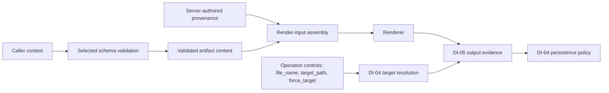

<!-- docs\development\issue460\design-suite-resolution.md -->
<!-- template=design version=5827e841 created=2026-08-27T12:05Z updated=2026-08-27 -->
# Issue 460 Suite Contract and Resolution Design

**Status:** DRAFT  
**Version:** 1.17  
**Last Updated:** 2026-09-10  
**Primary Packages:** DI-01, DI-02  
**Upstream Dependencies:** Research Approved Strategy, XC-01, RC-01  
**Downstream Consumers:** DI-03, DI-04, DI-06, DI-07, DI-08  
**Lifecycle Status:** Drafting

---

## 1. Purpose and Authority

This document owns the target design for:

- the generic concrete-template-package metamodel and JSON Schema caller contract under DI-01;
- startup discovery, resolved Jinja graph, runtime artifact selection, public
  introspection, and provenance under DI-02;
- F-11 dual source provenance that replaces the incomplete current version hash:
  isolated resolved-package identity plus the F-10 complete-suite identity reused only
  as compact persisted source-suite evidence.

The [Design Hub](design.md) owns integration status. The
[Shared Contracts Design](design-shared-contracts.md) owns how a resolved schema is
delivered through tool text, cached DTOs, and embedded MCP resources. Concrete artifact
field semantics remain with the DI-03 documents.

## 2. Scope and Exclusions

### In Scope

- concrete template packages as the extension and ownership unit;
- authored JSON Schema caller contracts;
- manifest-field admission and consumer justification;
- parser-supported startup graph resolution;
- one frozen runtime catalog and one declared renderer per artifact;
- complete, deterministic selected-package provenance over local semantics and
  transitively reachable shared support;
- one deterministic complete-suite identity for the currently supplied suite and
  already available managed upgrade snapshots;
- public schema, purpose, renderer/profile identity, package version, resolved package
  fingerprint, and compact persisted source-suite provenance facts;
- failure semantics for incoherent current-suite state.

### Out of Scope

- concrete document, tracking, code, or test artifact fields and rendering semantics;
- scaffold and safe-edit transaction mechanics;
- output-validator execution and persistence policy;
- distribution checkpoint, component comparison, renewal selection, candidate staging, and activation mechanics;
- repository fixture/helper architecture;
- Planning cycles or implementation sequencing.

## 3. Binding Inputs

- [Research](research.md): F-02, F-04, F-05, F-11, F-16, F-17 and the corrected F-03/F-07 caller-input boundary with their Approved Strategy rows.
- [Research Findings](research-findings.md): evidence for schema/config duplication,
  runtime renderer divergence, incomplete graph analysis, and incomplete provenance.
- [Design Intake Map](design-intake-map.md): DI-01 and DI-02 responsibilities,
  consumers, exclusions, and required proof.
- [Template Suite Catalog](template-suite-catalog.md): current artifact, config,
  template, consumer, and test surfaces.
- [Architecture Principles](../../coding_standards/ARCHITECTURE_PRINCIPLES.md):
  Config-First, DRY, OCP, SRP, DIP, ISP, fail-fast startup, immutable value objects,
  composition-root ownership, and YAGNI.
- [Documentation Standard](../../coding_standards/DOCUMENTATION_STANDARD.md).
- [Pre-Implementation Documentation Contract](README.md).

The clean-break Approved Strategy is binding. No historical registry, implicit DTO
override, compatibility shell, second runtime authority, retention validator, history
scan, archive, or provenance-lookup service is retained or introduced.

## 4. Owned Decisions

| ID | Decision | Status |
|---|---|---|
| D-SUITE-01 | A concrete template package is the scaffold-contract extension and ownership unit; an artifact is its generated result | Decided |
| D-SUITE-02 | Caller contracts are authored directly as JSON Schema files | Decided |
| D-SUITE-03 | Every authored manifest field requires a named runtime, validation, introspection, or distribution consumer | Decided |
| D-SUITE-04 | `contributors` is not an authored manifest field or public contract field | Decided |
| D-SUITE-05 | Startup resolves the complete suite once into one immutable runtime catalog | Decided |
| D-SUITE-06 | The resolved catalog is the only runtime authority for schema, renderer, purpose, profile, graph, and provenance facts | Decided |
| D-SUITE-07 | Public schemas are complete and contain no unresolved `$ref` values | Decided |
| D-SUITE-08 | F-11 produces one deterministic resolved package fingerprint per concrete package over its local semantic contract and transitively reachable shared contributors | Decided; D-SUITE-30 owns the algorithm |
| D-SUITE-09 | Every persisted scaffolded artifact reports package/artifact identity, human package version, resolved package fingerprint, and source suite fingerprint | Decided; D-SUITE-31 owns the compact dialect |
| D-SUITE-10 | F-10 complete-suite identity remains a DI-06 management fact and is reused in persisted artifact metadata solely as source-suite equality evidence; non-artifact tool-output exposure remains YAGNI-bound | Decided |
| D-SUITE-11 | `manifest.yaml` is the semantic template-package SSOT; its physical directory name is non-semantic | Decided |
| D-SUITE-12 | `context.schema.json` and `template.jinja2` are fixed template-package member names | Decided |
| D-SUITE-13 | Each package requires one SemVer-syntax `version` as a human release label, while its computed resolved fingerprint alone establishes effective-content equality; PGMCP infers no bump, ordering, severity, or compatibility policy from either fact | Decided |
| D-SUITE-14 | `output_profile` identifies a resolved evidence selector, not a validator/provider or persistence/quality policy | Decided nucleus; DI-04/DI-05 details open |
| D-SUITE-15 | The minimum authored manifest consists only of `template_id`, `version`, `purpose`, `output_profile`, and `persistence` | Decided; identifier clarified 2026-09-03 |
| D-SUITE-16 | The suite performs no caller-name projection: exact `file_name` is an operation control, while every caller-authored rendered name is an explicit artifact-context field validated in its final representation and rendered unchanged | Decided; supersedes the naming resolver on 2026-09-03 |
| D-SUITE-17 | `persistence: workspace|temporary` replaces misleading `output_type`; DI-04 owns exact target and explicit-path policy | Decided nucleus; DI-04 path mechanics open |
| D-SUITE-18 | The active distribution root is `template_suite/`; `shared/` is the only reserved direct child and every other direct child is one concrete template package that must contain `manifest.yaml` | Decided |
| D-SUITE-19 | `shared/templates/bases/` retains tiered inheritance in one flat, responsibility-named file set headed by `tier0_root.jinja2` | Decided |
| D-SUITE-20 | `shared/templates/patterns/` owns proven multi-template Jinja patterns; concrete packages receive no speculative private `patterns/` directory | Decided |
| D-SUITE-21 | `shared/definitions/` owns proven reusable JSON Schema definitions, including Link, IssueReference, and ChecklistItem; no speculative phase-document namespace is admitted | Decided |
| D-SUITE-22 | The historical TypeScript DTO tier-3 file is consolidated semantically into one concrete TypeScript DTO template, not relocated as a pattern | Decided |
| D-SUITE-23 | The unreachable YAML branch leaves the active suite but remains exactly recoverable through Git and the deferred-work trace | Decided |
| D-SUITE-24 | Dependency direction is concrete package → shared support → shared support; concrete-package-to-concrete-package and shared-to-concrete-package edges are invalid startup state | Decided |
| D-SUITE-25 | A package-local semantic change leaves every other package's version, resolved fingerprint, schema/rendering semantics, and affected-package diagnostics unchanged; newly scaffolded artifacts may still carry the new complete-suite fingerprint as truthful source context | Decided; DI-06 owns comparison/reporting consequences |
| D-SUITE-26 | Concrete package manifests own the only authored template versions; individual package files and shared contributors have no authored versions | Decided |
| D-SUITE-27 | One automatically computed complete-suite fingerprint covers the currently supplied suite; DI-06 may persist separate distribution-only operational component checkpoints without changing either F-11 provenance identity | Decided; D-SUITE-30 owns only the existing provenance algorithms |
| D-SUITE-28 | PGMCP computes and compares identities only from supplied or already available managed snapshots; external/workspace suite owners own historical retention, release versioning, lookup, and reconstruction availability | Decided |
| D-SUITE-29 | No replacement provenance registry, Git/release association registry, retention validator, archive/lookup service, history scan, or missing-history control/evidence state is introduced | Decided |
| D-SUITE-30 | Both identities use domain-separated canonical version-1 records, SHA-256 truncated to 96 bits, and unpadded Base64url as one 16-character representation across all consumers | Decided |
| D-SUITE-31 | Persisted provenance uses `pgmcp:v1` with exactly `id`, `pv`, `pf`, and `sf`; it occupies one physical comment line up to 100 characters or two adjacent comment lines split after `pv`, and generic `created`/`updated` fields are removed | Decided |
| D-SUITE-32 | When a consumer already holds two supplied resolved package records, equality of `version` and fingerprint yields four factual relations—both equal, content-only change, version-only change, or both changed—without a generic comparison service, warning, block, persisted history, or external version-policy enforcement | Decided |
| D-SUITE-33 | Startup performs one deterministic shallow enumeration of direct package directories; no authored `templates.yaml` or other central package inventory is admitted beside package manifests | Decided |

## 5. Responsibilities and Boundaries

### 5.1 Template Suite and Concrete Template Package

An artifact is generated output. A concrete template package is the public
scaffold-contract extension and ownership unit. The complete active and distributable
root is named `template_suite/`:

```text
template_suite/
├── shared/
│   ├── templates/
│   │   ├── bases/
│   │   │   ├── tier0_root.jinja2
│   │   │   ├── tier1_code.jinja2
│   │   │   ├── tier1_document.jinja2
│   │   │   ├── tier1_tracking.jinja2
│   │   │   ├── tier2_python.jinja2
│   │   │   ├── tier2_typescript.jinja2
│   │   │   ├── tier2_markdown_document.jinja2
│   │   │   ├── tier2_markdown_tracking.jinja2
│   │   │   └── tier2_text_tracking.jinja2
│   │   └── patterns/
│   │       ├── markdown/
│   │       ├── python/
│   │       └── testing/
│   └── definitions/
│       ├── link.schema.json
│       ├── issue-reference.schema.json
│       └── checklist-item.schema.json
└── <non-semantic-storage-directory>/
    ├── manifest.yaml
    ├── context.schema.json
    └── template.jinja2
```

`shared/` is the only reserved direct child. Startup enumerates direct children once, in deterministic order; every other direct child is a concrete template package and absence of its fixed `manifest.yaml` is invalid suite state. Enumeration is shallow rather than recursive. The physical package-directory name is not artifact identity, is not validated against `manifest.yaml:template_id`, and does not participate in the fingerprint. Moving or renaming it cannot change semantic identity. Duplicate `template_id` values fail at startup. An authored `templates.yaml` is rejected because it would duplicate package inventory, require coordinated registration beside a self-contained package, and still could not replace complete package loading, graph validation, and fingerprinting.

Each concrete template package has exactly three fixed root members:

- `manifest.yaml`: semantic package description and identity SSOT;
- `context.schema.json`: caller JSON Schema authority;
- `template.jinja2`: the single concrete Jinja template entry point.

No concrete package receives a standard `patterns/` directory. A construct shared by
multiple concrete templates belongs in `shared/templates/patterns/`; artifact-specific
rendering remains in `template.jinja2`. If DI-03 later proves that one concrete
template requires private decomposition, that package must justify and name the
dependency from an actual consumer rather than rely on a speculative generic folder.

The agreed minimum manifest contains exactly five authored keys: `template_id`, `version`, `purpose`, `output_profile`, and `persistence`. Concrete example values are intentionally omitted here: DI-03 owns final artifact IDs and purposes, while DI-05 owns concrete profile identities. An illustrative value must not pre-empt either package decision. File naming is not package metadata: DI-04 receives an exact caller-supplied `file_name` as operation control.

#### Shared tiered template foundation

`shared/templates/bases/` retains the approved tiered inheritance architecture. The
small, finite base set is deliberately flat: tier and responsibility are both present
in each filename, so an extra directory per tier would repeat information without
creating a meaningful collection. `tier0_root.jinja2` owns the universal inheritance
root; it is not an artifact template and does not embed the persistence target.
Tier 1 owns the code, document, and tracking families. Tier 2 owns Python, TypeScript,
Markdown-document, Markdown-tracking, and text-tracking forms.

The reusable former tier-3 macro responsibilities are composition rather than another
inheritance tier. Proven multi-template imports therefore live under
`shared/templates/patterns/markdown/`, `python/`, or `testing/`. The exact retained
set follows Research: portable Markdown patterns plus portable async, logging,
Pydantic, pytest, mocking, and test-structure behavior are adapted; obsolete agent
hints, unreachable assertion/fixture placeholders, and the six S1mpleTrader-owned
patterns are removed.

The historical `tier3_pattern_typescript_dto.jinja2` is not a real shared pattern. It
is an artifact-specific layer with one consumer. DI-03 must redesign its retained
TypeScript DTO semantics into the single concrete TypeScript DTO
`template.jinja2`; implementation may not preserve the pseudo-pattern by merely
moving the file.

#### Shared schema definitions

`shared/definitions/` contains proven reusable JSON Schema documents. Link,
IssueReference, and ChecklistItem are admitted because Research fixes their canonical
meaning and multiple concrete template contracts consume them. Concrete
`context.schema.json` documents may reference their stable schema identities;
startup resolves the complete acyclic schema graph and public exposure remains
reference-free. Physical definition paths are not public schema identity.

No `phase-document/` namespace is admitted yet. DI-03 must first prove which
Research, Design, Planning, and Validation properties have exactly the same semantics.
Other apparently similar code or document shapes remain local until the same
field-to-consumer rule justifies sharing.

#### Naming rationale

| Member | Rationale |
|---|---|
| `template_suite/` | Names the complete managed, fingerprinted, and distributed suite rather than one implementation technology |
| Concrete package directory | Provides storage/discovery only; `manifest.yaml:template_id` remains semantic authority |
| `manifest.yaml` | Names the package-manifest responsibility and supports concise human-owned metadata and comments |
| `context.schema.json` | Is directly validatable and exposable JSON Schema; `context` distinguishes caller data from other definitions |
| `template.jinja2` | States literally that the file is the concrete template; rendering is performed by runtime code |
| `shared/templates/` | Names reusable template sources without encoding Jinja in the management hierarchy |
| `shared/templates/bases/` | Owns the finite templates reached through inheritance |
| `shared/templates/patterns/` | Owns proven reusable imported composition patterns; `importables` would encode only one Jinja mechanism |
| `shared/definitions/` | Compactly names reusable contract definitions; `.schema.json` identifies their technology |
| `tier0_root.jinja2` | Names the universal inheritance root without misclassifying it as a generated artifact |

A directory layer must distinguish a meaningful collection; it is not added merely to
repeat a fact already explicit in a filename. Adding a concrete template requires a
valid package and resolved shared dependencies only. It may not require
artifact-specific Python registration, branches, enums, DTO subclasses, or presenter
logic.

#### Deferred YAML preservation

The unreachable `tier1_base_config.jinja2` and `tier2_base_yaml.jinja2` leave the
active suite under the approved deferred-YAML decision. They are not copied into
`shared/templates/bases/` as dormant executable capability. The deferred-work trace
must retain their exact historical paths, Research disposition, issue reference, and
eventual removal commit or release so a future YAML issue can recover the final source
from Git exactly.

### 5.2 Manifest Admission Rule

A proposed manifest field is admitted only when its design entry identifies:

1. the semantic fact it owns;
2. the component that consumes it;
3. the startup coherence rule that validates it;
4. whether it participates in resolved selected-package provenance;
5. why convention or derivation cannot own the fact instead.

Fields without that evidence are rejected under YAGNI. In particular,
`contributors` is not authored: the resolver already derives graph nodes and edges
from Jinja semantics. A future consumer may receive a derived graph view, but that does
not create a second configuration authority.

#### Minimum admitted fields

| Field | Semantic fact | Primary consumer | Startup coherence | Resolved-package provenance | Why it cannot be derived |
|---|---|---|---|---|---|
| `template_id` | Public template-package identity and artifact-contract selector | Discovery, catalog, and tool selection | Non-empty, unique, and stable independent of directory name | Yes | Directory naming is non-semantic storage |
| `version` | Human-authored template-package release identity | Metadata and affected-package comparison | Valid SemVer | Reported and compared beside the fingerprint; not its content authority | Intentional compatibility/release meaning is not content-derivable |
| `purpose` | Human-readable artifact capability | Selected-artifact introspection | Non-empty normalized text | Yes | Neither ID nor renderer content is an adequate public description |
| `output_profile` | Applicable output-evidence selector | DI-05 profile resolution and per-operation output validation | Reference exists and resolves to a coherent evidence selector; compatible exact file names are checked when an operation supplies one | Yes, including resolved semantics | File extension alone cannot express applicable evidence |
| `persistence` | Intended target lifetime, `workspace` or `temporary` | DI-04 target and persistence policy | Known enum value | Yes | Both modes create files, so lifetime cannot be inferred from the output |

No `naming` field, case vocabulary, affix policy, or generic naming resolver is admitted. Every caller-authored value rendered into content—including a class symbol, title, subject, or body label—belongs to the concrete `context.schema.json`, which validates its final representation. The renderer receives and uses that value unchanged. DI-04 owns the exact `file_name`, `target_path`, and explicit target-policy control as operation inputs; none is template-visible. DI-05 may validate whether the resulting file and content satisfy the selected output profile, but it never generates or rewrites a name.

The following current registry fields do not survive as parallel authorities:

| Current field or group | Target disposition |
|---|---|
| `type_id` | Replaced by manifest `id` |
| `type` | Removed; no target runtime consumer justifies a category field |
| `template_version` | Replaced by SemVer `version` plus resolved selected-package provenance |
| `context_schema`, `required_fields`, `optional_fields`, `context_class` | Replaced by the fixed `context.schema.json` authority |
| `name` | Removed; `template_id` and `purpose` cover identity and introspection without a second display label |
| `description` | Replaced by `purpose` |
| `output_type` | Replaced by `persistence` because all retained scaffold results are files |
| `scaffolder_class`, `scaffolder_module` | Removed with artifact-specific Python dispatch |
| `template_path` | Removed through the fixed `template.jinja2` entry point |
| `fallback_template` | Removed; no runtime fallback authority is retained |
| `name_suffix`, `file_extension` | Removed without a manifest replacement; the caller supplies the exact file name and the selected output profile validates the resulting file contract |
| `generate_test` | Removed; no production consumer justifies automatic companion generation |
| `strict_validation` | Not admitted into this manifest; DI-04 owns mutation policy and must justify any separate policy selector rather than retain the legacy boolean |
| `base_path` | Removed; DI-04 target policy owns paths and the current unmodeled value cannot become authority |
| `state_machine` | Removed; generated-artifact lifecycle is not a generic template-package manifest responsibility |

The clean break prohibits deprecated aliases or dual reads of these fields.

### 5.3 Suite Loader

The suite loader performs filesystem/config parsing and produces raw, presentation-free
template-package definitions plus shared-support nodes. It owns no rendering, tool
output, mutation, or cache behavior.

It receives explicit roots and configuration through constructor injection. It performs
no module-level I/O and has no hidden production-root fallback.

### 5.4 Graph Resolver

The graph resolver:

- parses supported Jinja `extends`, `include`, `import`, and `from ... import`
  semantics;
- resolves logical dependency edges within the configured suite roots;
- detects missing, cyclic, ambiguous, duplicate, or unreachable declared roots;
- associates each artifact with exactly one root renderer, caller schema, purpose, and
  output profile;
- returns immutable resolved nodes and edges;
- supplies the canonical graph material to the fingerprint service.

The resolver derives contributors internally; it does not read an authored contributor
list.

### 5.5 Runtime Catalog

The composition root builds one frozen resolved catalog during startup and injects
narrow read-only views into consumers. Runtime tools do not scan files, reconstruct
graphs, load config, or select an alternate renderer.

Consumer interfaces remain narrow:

- schema introspection reads artifact identity, purpose, and resolved public schema;
- rendering reads the declared renderer and its resolved graph;
- mutation orchestration reads contract/profile facts but does not mutate the catalog;
- distribution consumes suite validation and logical package identities, but owns its
  separate adopted/actual/candidate operational component states, three-way selection,
  checkpoint persistence, and complete-suite activation;
- persisted artifact provenance reads the selected package's precomputed version and
  resolved package fingerprint plus the current precomputed source suite fingerprint;
- package-directed non-artifact consumers receive suite identity only when a concrete
  consumer survives the shared-output YAGNI audit.

The exact interface and DTO names remain implementation-owned, but their responsibilities
and dependency direction are fixed here.

### 5.6 Template-Package Version and Dual Source Provenance

The manifest's required `version` is the single human-authored SemVer release label for a
concrete template package. Individual package files and shared contributors carry no
authored versions. The resolved package fingerprint is machine-computed equality identity
for the selected package's effective semantic closure. Neither replaces or aliases the
other, and PGMCP validates only the version's SemVer syntax rather than its release policy.

A separately computed complete-suite fingerprint identifies the currently supplied
managed suite snapshot. The same value serves F-10 comparison and is persisted in newly
scaffolded artifacts only as source-suite equality evidence. It is not package semantic
identity, a locator, or a promise that historical sources remain available.

Each concrete package owns an isolated provenance closure containing:

- its `manifest.yaml:template_id` and admitted semantic manifest facts other than the separately
  reported human version;
- its canonical caller JSON Schema and exact resolved public schema semantics;
- its `template.jinja2` source;
- every transitively reachable shared base, pattern, definition, and typed dependency
  edge;
- every referenced output-profile identity and resolved semantic configuration;
- the logical relationships required to reproduce that selected package.

The closure excludes:

- every other concrete package and its private schema, template, manifest, and graph;
- shared files that are not transitively reachable from the selected package;
- physical concrete-package directory names and absolute or host-specific paths;
- file modification times and filesystem enumeration order;
- artifact creation/update timestamps, scaffold output paths, caller values, cache IDs,
  process state, and other run-specific facts.

Concrete-package-to-concrete-package and shared-to-concrete-package edges are invalid.
A package-local change therefore changes only that package's version-impact and resolved
fingerprint. A shared change changes the resolved fingerprints of exactly the concrete
packages that reach it transitively. The complete-suite fingerprint changes whenever the
managed suite snapshot changes; that difference is truthful source context in newly
scaffolded artifacts and never reclassifies another package as semantically changed.

Every persisted scaffolded artifact carries package/artifact identity, human package
version, resolved package fingerprint, and source suite fingerprint. `scaffold_schema`
and other non-artifact package-directed DTOs do not acquire suite identity without a
demonstrated consumer; persisted artifact provenance alone does not justify DTO
duplication.

PGMCP validates and fingerprints currently supplied actual, candidate, proposed, and
owner-supplied prior suites at the F-10 boundary. DI-06 owns a separate current adopted
component checkpoint and operational source fingerprints for `shared/` and each manifest
ID. Those distribution facts authorize only whole-component selection into an off-root
proposal; they do not alter package SemVer, resolved package fingerprint, source-suite
fingerprint, artifact metadata, or runtime catalog authority. Only a fully validated
complete proposal may be activated as the sole actual root. External or workspace-owned
suite owners retain historical-source and checkpoint authority under the Distribution
Design. Missing historical sources do not invalidate, mutate, or mark an artifact stale,
and they do not create a provenance lookup service.

#### Fingerprint canonicalization and encoding

Both identities use one canonical version-1 representation everywhere. The resolver
streams deterministic, domain-separated records through SHA-256, takes the first 12
digest bytes, and encodes those 96 bits as 16 unpadded Base64url characters. It does not
retain or expose a parallel full-length digest. The distinct domain prefixes
`pgmcp:resolved-package:v1` and `pgmcp:source-suite:v1` prevent equal record bytes from
collapsing the two identity kinds.

A record contains an explicit kind, stable logical identity, byte length, and value;
records are ordered by kind and logical identity before hashing. JSON and YAML semantic
inputs are parsed and serialized with deterministic object-key order while preserving
array order and scalar values. Jinja and other admitted text sources are UTF-8 without a
byte-order mark, use LF line endings, and otherwise preserve their source text. Absolute
paths, modification times, enumeration order, and host state never enter either record.

The resolved package record contains the admitted manifest facts except `version`, the
canonical caller contract, normalized concrete and reachable shared template sources,
reachable shared definitions, typed graph edges, and the resolved output-profile
semantics. It uses logical identities rather than physical concrete-package directory
names. The complete-suite record contains every admitted suite file under its normalized
suite-relative POSIX path, including manifest versions and packages outside the selected
closure. Consequently, a physical package-directory rename or formatting-only suite
change may change `sf` while leaving an equivalent resolved package `pf` unchanged.
Unknown or inadmissible suite files fail admission rather than being silently omitted.
No per-file digest inventory is persisted.

SHA-256/96 is equality evidence, not authenticity or authorization. At the expected
identity population its accidental-collision margin is ample; a future adversarial
supply-chain trust requirement would require a separate authenticated mechanism rather
than lengthening this provenance line by stealth.

#### Persisted provenance dialect

The logical provenance record has exactly four fields under the `pgmcp:v1` marker:

- `id`: compact persisted alias of `manifest.yaml:template_id`;
- `pv`: the human package version;
- `pf`: the 16-character resolved package fingerprint;
- `sf`: the 16-character source suite fingerprint.

The applicable shared tier base renders the record using the artifact representation's
native comment syntax. `output_profile` validates the resulting content but does not own
comment formatting. When the complete physical comment line is at most 100 characters,
the base emits one line, for example:

```text
<!-- pgmcp:v1 id=typescript-integration-test pv=1.0.0 pf=u7V2q9JmW4cK8nXa sf=A3dP0rT6yN2mQ8kL -->
```

When that line would exceed 100 characters, the base emits exactly two adjacent complete
comment lines with a fixed split after `pv`:

```text
<!-- pgmcp:v1 id=an-incidental-long-template-package-id pv=1.0.0-rc.1 -->
<!-- pgmcp:v1 pf=u7V2q9JmW4cK8nXa sf=A3dP0rT6yN2mQ8kL -->
```

Each physical line must itself fit the 100-character budget; the resolved package fails
startup admission if its ID and version cannot satisfy that budget even in the two-line
form. This is a presentation coherence rule derived from an actual artifact consumer,
not an independent manifest fact.

Generic `created` and `updated` provenance fields are removed. They predate Git-owned
history, have no retained production consumer, and describe lifecycle events rather than
source identity. Artifact-specific authored dates remain ordinary caller content where a
concrete contract requires them. Safe edits do not mutate source provenance as lifecycle
state. The legacy metadata parser/configuration is removed. The human-approved
[safe-edit consumer](design-mutation-validation.md#48-v3-metadata-selection-and-readcheckwrite-consistency)
now demonstrates a read requirement (2026-09-08), admitting only a narrow reader of this
V3 header contract. Reading and writing share the same dialect authority; no legacy
bridge, timestamp lifecycle or history lookup is restored. The reader validates the
four fields syntactically; DI-04 uses id alone for current template/profile selection,
without requiring pv/pf/sf equality with today's catalog. Exact header placement and
framing recognition remain joint DI-02/DI-04 integration work, including rejection of
body examples as file-owned metadata.

#### Joint internal header utility

Human clarification, 2026-09-10: design the header reader and writer together as an
internal utility, not agent-callable MCP tools. DI-02 owns their shared dialect and
round-trip contract; DI-04 consumes the narrow read interface for safe-edit selection.
Scaffolding consumes the write/format interface for generated header content. Separate
consumer-facing interfaces do not imply duplicate implementations of the format rules.

Here header writing means producing header text from the server-supplied typed provenance
record, not opening or replacing an artifact file. File persistence stays with mutation
orchestration and its filesystem boundary. The utility neither computes package/suite
fingerprints, invents provenance, resolves profiles nor updates existing-file lifecycle
metadata. It owns no resource publication or user-facing tool-response presentation.

Reader and writer must share field grammar, marker/version interpretation and the
one/two-line rule. Native comment framing and eligible placement must be designed jointly
with the shared template bases; do not leave a second independent Jinja serialization
beside a Python reader. Exact template integration, framing source and placement rules
remain open, without pre-authorizing a new manifest field or configuration file.

Required evidence includes reading the header emitted by the writer without losing
id/pv/pf/sf, both supported line forms and invalid-header rejection. Round-trip tests
alone are insufficient: independent valid/invalid fixtures must prevent a shared writer
and reader mistake from passing unnoticed. No new public tool, adapter role, header-edit
command or supported legacy metadata bridge is introduced.

Package version and resolved fingerprint remain independently observable facts. When a
consumer already has two supplied resolved package records, their relation is exact:

| Human version | Resolved fingerprint | Factual meaning |
|---|---|---|
| Equal | Equal | Same effective package content under the same release label |
| Equal | Different | Effective package content changed without changing the release label |
| Different | Equal | Release label changed while effective package content stayed equal |
| Different | Different | Release label and effective package content both changed |

This relation is not a compatibility or validation matrix. All four states are allowed.
A repeated version never causes changed content to be treated as equal, because content
equality uses the fingerprint. A version-only change leaves the package fingerprint
unchanged but changes the complete-suite fingerprint because manifest versions are part
of the source-suite record.

A package-local semantic change affects only that package's resolved fingerprint. A
shared change affects exactly the packages whose already resolved closures reach that
shared contributor; their manifest versions need not be edited mechanically. The
resolver derives this affected set from the current graph and creates no persisted
reverse-dependency index.

Startup with one suite validates SemVer syntax and computes current identities; it has no
comparison basis and emits no bump diagnostic. Consumers that already compare two
available snapshots may derive the four relations directly from their existing facts.
PGMCP adds no generic comparison service, warning system, bump requirement, history, or
external version-policy enforcement.

## 6. Options and Rationale

### Option A — Central Registry with External Schemas and Templates

Retain one registry containing IDs and paths, with schemas and templates maintained in
separate trees.

Rejected because ownership remains split, extensions require coordinated edits across
unrelated locations, and registry facts can diverge from the graph actually rendered.

### Option B — Template Suite Resolved Once at Startup

Co-locate each concrete template's manifest, caller schema, and entry point under
`template_suite/`; resolve all template packages and shared-support graphs into one
injected immutable catalog.

Selected because it creates one extensibility unit, supports config-first OCP, makes
coherence fail fast, and supplies one complete input for introspection and provenance.

### Option C — Runtime Discovery on Every Tool Call

Scan template-suite files and resolve schemas/templates whenever a tool executes.

Rejected because runtime state can change between calls, errors arrive too late,
repeated I/O and parsing are unnecessary, and multiple consumers can observe different
suite identities.

### Provenance Alternative — Root-Template Hash

Rejected because it omits schema, imported/included templates, shared primitives,
selection facts, and validation profile semantics. It is the defect underlying F-11,
not an acceptable optimization.

### Provenance Alternative — Complete-Suite Fingerprint as Sole Package Identity

Rejected because one global value cannot say whether the selected package closure is
unchanged across different suite snapshots. The selected design retains both axes:
resolved package fingerprint for package semantic equality and affected-consumer
analysis, plus complete-suite fingerprint in persisted artifacts for truthful source
snapshot context. The suite value is not propagated indiscriminately into non-artifact
package-directed results.

### Fingerprint Representation — Full Hex, Compact Full Digest, or SHA-256/96

Two full SHA-256 hex values were rejected because the 128 digest characters alone make
compact, reviewable one-line provenance impossible. Unpadded Base64url of both complete
256-bit digests still consumes 86 characters before field names, package identity,
version, namespace, and comment delimiters. Persisting a shortened value beside a hidden
full digest was also rejected because it would create two representations of one identity.

The selected SHA-256/96 representation preserves one deterministic identity value across
runtime, comparison, diagnostics, and artifact metadata while fitting the four required
facts on one line for normal package identifiers. The fixed two-line fallback handles
incidental overflow without truncating package identity or version. This trade-off is
appropriate because the fingerprint proves equality of supplied canonical sources and is
not a security signature.

## 7. Detailed Design

### 7.1 Authored and Derived Facts

| Fact | Authority | Authored or Derived | Primary Consumers |
|---|---|---|---|
| Template-package identity and artifact-contract selector | `manifest.yaml:template_id` | Authored once | Discovery, catalog, tools |
| Template-package version | `manifest.yaml:version` | Authored SemVer | Humans, package metadata, affected-package comparison |
| Purpose | `manifest.yaml:purpose` | Authored | Selected-artifact introspection, resolved package provenance |
| Caller shape | `context.schema.json` | Authored | Validation, schema exposure |
| Concrete template selection | Fixed `template.jinja2` convention | Derived by template-package format | Resolver and runtime rendering |
| Jinja dependency nodes/edges | Parser-supported resolver | Derived | Rendering, isolated package closure, diagnostics |
| Contributors | No public authority | Derived internally only | Resolved package provenance and impact analysis |
| Output profile | `manifest.yaml:output_profile` | Authored reference | Resolved output-evidence selection |
| Persistence lifetime | `manifest.yaml:persistence` | Authored enum | DI-04 target and persistence policy |
| Caller-authored rendered names | Concrete `context.schema.json` properties | Authored per artifact call in final form | Renderer only |
| Exact file name and target controls | Scaffold operation envelope | Authored per operation | DI-04 target resolution only |
| Physical template-package directory | Filesystem | Non-semantic | Discovery only |
| Resolved package fingerprint | Selected package closure in the resolved catalog | Derived once per package | Persisted artifact metadata, package-directed operation evidence, affected-package comparison |
| Complete/source-suite fingerprint | Currently supplied suite snapshot | Derived once per suite | Persisted artifact metadata plus DI-06 equality checks over available actual, candidate, proposal, or owner-supplied prior snapshots; never the component checkpoint itself |

### 7.2 JSON Schema Contract

Schemas are authored as JSON, not YAML descriptions of JSON. The same schema document is
used for validation and exposure. Public exposure returns a self-contained view with all
references resolved. Resolution preserves the complete referenced definitions and all
constraints; it is not a summary or selected-property projection.

The canonical authored schema remains the maintenance authority. A flattened schema is
a derived runtime/exposure view and is never written back as a second source file.

### 7.3 Output Profile Reference

`output_profile` identifies a resolved declarative evidence selector for complete
proposed artifact content. It does not identify a provider or executor and does not own
persistence, quality scope, lifecycle, presentation, or autofix policy.

The selected profile states which centrally configured executable capabilities are
applicable or required. Scaffolding consumes the artifact's profile. Safe edit consumes
the same profile boundary through DI-04's explicit/V3-metadata/extension selection.
The narrow V3 reader above does not revive the legacy source-metadata parser or add
hardcoded extension dispatch.
Quality gates use a separate gate-set selector over the same capability authority.

The physical profile configuration, concrete capability IDs, and normalized execution DTO remain DI-05 responsibilities. DI-04 owns the [scaffold validation policy and outcome contract](design-mutation-validation.md#44-scaffold-validation-request-and-result-contract), while the exact safe-edit mapping remains open. This package requires that the manifest reference resolves at startup and that profile identity and resolved semantics participate in every selected package closure that references the profile. At operation time the profile may reject an incompatible caller-supplied exact file name; it does not generate, normalize, prefix, suffix, or otherwise rewrite that name.

### 7.4 Explicit Caller Naming Boundary

There is no universal scaffold `name`, manifest naming policy, or naming resolver.
The caller supplies each value at the boundary that owns its meaning:

```python
class ScaffoldOperationInput:
    artifact_type: str
    file_name: str
    target_path: str | None
    force_target: bool
    validation: str
    context: Mapping[str, JSONValue]


class RenderInput:
    content: Mapping[str, JSONValue]
    provenance: ArtifactProvenance
```

These shapes define responsibility rather than final implementation class names.
The closed values and default for `validation` belong to the linked DI-04 contract;
this operation control never enters `RenderInput` or changes profile selection.
`file_name` is one exact final basename including its extension, never a path.
`target_path` selects a directory and may be omitted when configured persistence
policy supplies the default. `force_target` changes only the configured target-root
policy and never overwrite, schema, render, or output-validation behavior.
`output_path` is the resolved result fact and is not an input alias.

`context` is validated unchanged against the selected package schema. Every
caller-authored value read by a renderer—including a class symbol, title, subject, or
body label—must be a property of that schema in its final representation. The schema
may reject incorrect casing or syntax, but neither the server nor Jinja converts one
caller value into another representation. A file name and a semantically distinct rendered symbol or title may intentionally describe the same concept in different representations. Supplying both records two independent caller decisions rather than duplicate authority; this design deliberately avoids a concrete artifact example until DI-03 fixes the actual package contracts.

The renderer receives only validated `content` plus the server-authored
`provenance` required for the compact metadata header. It cannot access
`artifact_type`, `file_name`, `target_path`, or `force_target`. DI-04 target
resolution receives the operation controls but never parses content to invent a file
name. DI-05 may validate the exact file and content against the selected output
profile; it cannot generate or rewrite naming. Per-operation names do not participate
in template-package fingerprints.

### 7.5 Startup State

Startup is atomic from the perspective of runtime consumers:

1. load the configured `template_suite/` root, its direct concrete template packages,
   and reserved shared support;
2. parse manifests and JSON Schemas;
3. resolve the complete Jinja graph and its declared caller-content and provenance inputs;
4. validate identity, schema, renderer-input, persistence, purpose, and output-profile coherence;
5. derive each concrete package's isolated transitive shared closure;
6. canonicalize and fingerprint each resolved package closure;
7. publish one immutable catalog through the composition root.

Any failure prevents publication. Runtime never operates on a partially resolved or
mixed-version catalog.

## 8. Control, Data, and State Flow

### Successful Startup

Configured `template_suite/` root → loader → raw template packages and shared nodes →
graph/schema resolver → prohibited-edge and coherence validation → isolated package
closures → package fingerprint service → frozen catalog → injected read-only consumers.

### Suite Failure

A missing file, duplicate identity, schema error, unresolved reference, graph cycle,
missing dependency, ambiguous renderer, or incoherent profile produces structured
startup diagnostics with logical identities. No catalog is published and no scaffold
tool becomes available against the invalid suite.

### Runtime Content and Target Flow



The renderer path and target path meet only when complete proposed content and the
resolved output target are submitted for factual output evidence. Operation controls
never enter render input; server provenance cannot override caller content. Context,
target, render, evidence, and persistence failures therefore remain distinct.

### Runtime Reads

Runtime consumers select facts by artifact identity from the injected catalog. Reads
have no filesystem side effects and cannot change suite state. Suite mutations or
renewal become visible only after a successful restart, as required by Approved
Strategy.

## 9. Compatibility, Migration, and Removal

This is a clean break:

- remove the historical registry/hash authority and implicit DTO renderer override;
- remove artifact-specific Python selection, naming branches, schema-default authorities, and the generic envelope `name`;
- replace `output_type` only with `persistence`; remove `name_suffix` and `file_extension` without a manifest replacement because exact file naming is caller-owned operation input; remove every other rejected legacy manifest field listed in §5.2 without aliases;
- remove regex/source-metadata graph inference where parser-supported Jinja resolution
  supersedes it;
- migrate existing suite assets into the complete `template_suite/` topology;
- consolidate the TypeScript DTO pseudo-pattern into its concrete template rather than
  preserving the misplaced tier-3 boundary;
- remove the unreachable YAML bases from the active suite while retaining exact Git
  and deferred-work recovery evidence;
- replace the current incomplete version hash with the selected package version,
  resolved package fingerprint, and complete source-suite fingerprint defined in §5.6;
- persist the four-fact provenance envelope in every scaffolded artifact, while omitting
  source-suite identity from non-artifact operation DTOs until a concrete consumer exists;
- do not retain a compatibility bridge for the superseded single global provenance value.

DI-06 owns operational component checkpointing, three-way selection, staged
distribution, and recoverable complete-tree activation. This document owns resolved
package closures, complete-suite validation inputs, and both existing provenance
fingerprints. DI-06 checkpoint identities remain a separate distribution concern and do
not enter artifact creation. Neither package owns historical retention or reconstruction
of unavailable external suite snapshots.

## 10. Test and Validation Design

Package-owned evidence must prove:

- a new valid concrete template package becomes discoverable without Python changes;
- `shared/` cannot be selected as a concrete template and a physical package-directory
  rename does not change manifest identity;
- the flat shared base set resolves the intended tier-0, tier-1, and tier-2 inheritance
  chain, while shared patterns remain typed import edges rather than a fourth tier;
- the TypeScript DTO graph contains one concrete entry point without the historical
  pseudo-pattern layer;
- the removed YAML bases are absent from the active catalog and recoverable through the
  recorded historical trace;
- missing, duplicate, ambiguous, cyclic, and incoherent states fail at startup;
- manifest fields outside the admitted contract fail rather than being silently
  ignored;
- a new template package requires no Python artifact-specific registration, naming branch, or naming resolver;
- every caller-authored renderer value is present in the selected context schema, validated in final form, and rendered unchanged;
- `file_name`, `target_path`, and `force_target` remain operation controls and are unavailable to templates;
- server provenance occupies a separate renderer namespace and cannot collide with caller content;
- incompatible exact file names or rendered content fail against the selected output profile before persistence;
- workspace and temporary persistence remain distinguishable without treating either
  as inline content;
- schema validation and public exposure use the same authored JSON Schema;
- public schemas contain no unresolved `$ref` and preserve complete definitions;
- runtime renderer selection matches catalog introspection;
- equal selected-package closures under different absolute roots and platform line
  endings produce the same 16-character SHA-256/96 Base64url package fingerprint;
- canonical object-key ordering is stable while ordered arrays and normalized Jinja source
  remain content-significant;
- package and suite records use distinct version-1 domains and the same compact identity
  representation in every consumer;
- manifest package versions reject invalid SemVer syntax, but all four version/fingerprint
  relations are accepted and remain factually distinguishable when two supplied package
  records are compared;
- a version-only package change leaves its resolved fingerprint unchanged while changing
  the complete source-suite fingerprint;
- no startup, scaffolding, or renewal path requires package-version history, generates a
  bump warning, or infers compatibility or SemVer severity;
- a package-local semantic change alters only that package's resolved fingerprint and
  package-semantic evidence; its human version changes only when the suite owner edits the
  manifest, while newly scaffolded artifacts may truthfully carry the new source suite
  fingerprint;
- a shared semantic change alters exactly the resolved fingerprints of its transitive
  concrete-package consumers;
- another package, unreachable shared files, timestamps, output paths, and enumeration
  order do not alter the selected package's fingerprint;
- prohibited package-to-package or shared-to-package edges fail at startup;
- generated artifact metadata carries exactly `id`, `pv`, `pf`, and `sf` under
  `pgmcp:v1`, using the precomputed package and source-suite fingerprints;
- metadata occupies one native comment line when the complete line is at most 100
  characters and otherwise two adjacent native comment lines split after `pv`, with each
  physical line remaining within the same budget;
- generic provenance contains no `created` or `updated` lifecycle fields and requires no
  retained metadata-history parser;
- package-directed non-artifact operation evidence carries suite identity only if a
  demonstrated consumer is admitted explicitly;
- ordinary resolution, introspection, scaffolding, and managed available-snapshot
  comparison require no historical source, lookup service, or retention control;
- no runtime consumer performs fallback discovery or independent fingerprinting.

DI-08 may supply temporary `template_suite/` builders and graph assertion helpers. Behavioral
ownership remains DI-01/DI-02. Tests must assert public catalog/startup behavior rather
than private resolver method structure or full prose snapshots.

## 11. Integration Risks and Open Questions

Q-SUITE-01 is resolved by the corrected D-SUITE-16: the caller supplies one exact `file_name`, optional directory-valued `target_path`, and explicit `force_target`; no derived name or input `output_path` remains. Q-SUITE-02 and Q-SUITE-05 are resolved by D-SUITE-30 and D-SUITE-31. Package version/fingerprint policy is resolved by D-SUITE-13 and D-SUITE-32 without a new open question. Q-SUITE-04 is resolved at its consumer boundary by D-DIST-04–D-DIST-10 in the
[Distribution Design](design-distribution.md): DI-02 supplies logical suite validation
and the existing immutable provenance identities; DI-06 owns distinct operational
component equality, adopted/actual/candidate selection, and complete-proposal activation
without inferring SemVer severity or semantic compatibility. These are no longer open
Suite Resolution choices.

| ID | Item | Owner | Resolution |
|---|---|---|---|
| Q-SUITE-03 | Complete the shared V3 header-recognition contract for DI-04's approved reader; profile configuration/selection remain with DI-04/DI-05 | DI-02/DI-04/DI-05 | No duplicate dialect, extension hardcoding or legacy metadata/history parser revival |
| R-SUITE-01 | Fingerprint input accidentally includes machine-specific state | DI-02 | Canonicalization tests across independent roots and machines |
| R-SUITE-02 | Flattening changes JSON Schema semantics | DI-01 | Reference-resolution tests cover nested, recursive, and shared definitions |
| R-SUITE-03 | `shared/` recreates an unowned global authority | DI-01/DI-02 | Admit only resolved bases, patterns, and definitions with named consumers and graph edges |
| R-SUITE-04 | Consumers confuse source-suite evidence with package semantic identity | DI-02/DI-06 | Give the two fingerprints distinct names and consumers; retain suite identity in persisted artifacts while keeping non-artifact DTO exposure YAGNI-bound |
| R-SUITE-05 | Historical provenance wording creates retention or lookup infrastructure | DI-02/DI-06 | Limit PGMCP to supplied current content and already available managed snapshots; external owners retain their own history |

## 12. Planning Consequences

Planning must later respect these deliverable boundaries:

- template-suite/package metamodel, explicit caller-content versus operation-control boundaries, persistence facts, and legacy-field migration;
- JSON Schema loading, validation, and flattened exposure;
- parser-supported graph resolution and frozen catalog composition;
- domain-separated canonical SHA-256/96 fingerprinting, compact `pgmcp:v1`
  `id`/`pv`/`pf`/`sf` artifact provenance with deterministic line wrapping, independent
  version/fingerprint facts, and graph-derived affected-package evidence over available
  snapshots without bump-policy enforcement;
- removal of generic provenance timestamps and the old registry, metadata-history parser,
  override, hash, and graph-analysis authorities without a
  replacement retention, archive, lookup, history-scan, or missing-history subsystem;
- package-owned startup, public-boundary, migration, and provenance tests.

Planning may order these deliverables but may not introduce a dual runtime authority,
reduce the F-11 fingerprint to a root-template hash, treat source-suite identity as
package semantic identity, or turn external provenance retention into PGMCP behavior.

## 13. Traceability Matrix

| Obligation | Design Coverage |
|---|---|
| F-02 optionality/nullability/defaults | Authored JSON Schema is the single caller-shape authority |
| F-04 runtime renderer divergence | D-SUITE-05 and D-SUITE-06 select one resolved renderer authority |
| F-05 incomplete graph | Parser-supported complete dependency resolution in §5.4 |
| F-11 incomplete version hash | D-SUITE-08 through D-SUITE-10, D-SUITE-24–D-SUITE-32, and §5.6 |
| F-16 purpose loss | Purpose is an admitted manifest fact exposed through selected-artifact introspection |
| F-17 public identity | Template-package identity remains explicit and Design-owned; exact retained/renamed IDs remain DI-03 |
| F-03 caller-input ownership | D-SUITE-16 and §7.4 prohibit caller-authored operation values from entering or deriving rendered content after unchanged context validation |
| F-07 field/render meaning | Every caller-authored renderer value is explicit artifact context; operation controls and server provenance have separate consumers |
| F-15 output path | `persistence` owns lifetime while DI-04 retains target selection and result-evidence authority |
| DI-01 | Template-suite/package metamodel, JSON Schema contract, authored/derived fact ownership |
| DI-02 | Graph resolution, catalog, runtime selection, introspection, provenance |
| XC-01 | Config-first, OCP, SRP, DIP, ISP, fail-fast, immutability, YAGNI |
| XC-02 | Legacy registry/graph/hash removals are identified; final completeness remains DI-08 |
| RC-01 | Clean breaks and restart-stable resolved view preserve Approved Strategy |

## 14. Related Documentation and Version History

### Related Documentation

- [Design Hub](design.md)
- [Shared Contracts Design](design-shared-contracts.md)
- [Distribution Design](design-distribution.md)
- [Pre-Implementation Documentation Contract](README.md)
- [Research](research.md)
- [Research Findings](research-findings.md)
- [Design Intake Map](design-intake-map.md)
- [Template Suite Catalog](template-suite-catalog.md)
- [Architecture Principles](../../coding_standards/ARCHITECTURE_PRINCIPLES.md)
- [Documentation Standard](../../coding_standards/DOCUMENTATION_STANDARD.md)

### Version History

| Version | Date | Author | Changes |
|---|---|---|---|
| 1.15 | 2026-09-03 | `@imp designer` | Reference the DI-04 scaffold validation policy/outcome authority and include validation in the operation-only boundary without copying its enumeration or changing the manifest. |
| 1.14 | 2026-09-03 | `@imp designer` | Clarify the authored identifier as `template_id`, keep compact persisted `id` only as provenance syntax, and fix strict shallow direct-child package discovery without an authored `templates.yaml` inventory. |
| 1.16 | 2026-09-08 | `@imp designer` | Admit the demonstrated safe-edit V3-reader consumer under the conditional replacement rule; retain a shared read/write dialect, syntax-only historical facts and no legacy/history revival. |
| 1.17 | 2026-09-10 | `@imp designer` | Record human clarification: jointly designed internal header reader/writer, separate narrow consumer interfaces, no MCP exposure or filesystem-write authority, and shared-dialect plus independent conformance evidence. |
| 1.13 | 2026-09-03 | `@imp designer` | Remove premature Worker/package naming examples so illustrative values cannot pre-empt DI-03 artifact identities, DI-03 content fields, or DI-05 profile IDs; preserve the abstract five-field manifest and explicit input boundary. |
| 1.12 | 2026-09-03 | `@imp designer` | Reconcile the human-approved F-03/F-07 correction: remove manifest naming and the generic naming resolver, require exact file-name operation input and explicit artifact-local rendered names, isolate server provenance, and supersede the input `output_path`/envelope-name derivation model. |
| 1.11 | 2026-09-03 | `@imp designer` | Close package-version policy: validate SemVer syntax only, use resolved fingerprints for content equality, preserve four factual version/fingerprint relations, derive shared impact from the current graph, and introduce no bump enforcement, warning service, or history. |
| 1.10 | 2026-09-03 | `@imp designer` | Reconcile F-10/S-10 component-aware renewal without changing F-11: DI-06 owns separate operational checkpoints and three-way selection, while DI-01/DI-02 retain complete-suite validation and the two existing artifact-provenance identities. |
| 1.9 | 2026-08-31 | `@imp designer` | Align DI-02 consumers with DI-06 installation semantics: one optional installed-suite checkpoint guards managed-root fast-forward, while candidate staging and complete promotion remain distribution-owned. |
| 1.8 | 2026-08-31 | `@imp designer` | Route actual/candidate shared and package comparison into DI-06 factual reporting, retain one adopted suite checkpoint only as a complete-fast-forward guard, and prohibit package-aware evidence from authorizing partial mutation. |
| 1.7 | 2026-08-30 | `@imp designer` | Fix canonical version-1 SHA-256/96 Base64url identities, exact `id`/`pv`/`pf`/`sf` provenance, a 100-character one-line budget with deterministic two-line fallback, and removal of generic `created`/`updated` lifecycle metadata and its unused history parser. |
| 1.6 | 2026-08-30 | `@imp designer` | Reconcile the independently confirmed two-fingerprint boundary: persist four compact provenance facts, reuse F-10 suite identity only as source context and available-snapshot management evidence, remove file/base versions and external-retention promises, and keep non-artifact DTO exposure YAGNI-bound. |
| 1.5 | 2026-08-29 | `@imp designer` | Reconcile the amended F-10/F-11 authority: isolate resolved package provenance, prohibit lateral package dependencies, limit shared impact to transitive consumers, and return complete-suite management identity to DI-06. |
| 1.4 | 2026-08-28 | `@imp designer` | Fix `template_suite/` with direct concrete template packages, `template.jinja2`, a flat responsibility-named tiered base set, shared patterns and definitions, no speculative private pattern directory, TypeScript DTO consolidation, and historically recoverable deferred YAML removal. |
| 1.3 | 2026-08-27 | `@imp designer` | Close the minimum manifest field audit; replace legacy output/naming fields with `persistence` and a finite naming contract; define one generic resolver and immutable renderer/target boundary while retaining DI-04 explicit-path ownership. |
| 1.2 | 2026-08-27 | `@imp designer` | Make `manifest.yaml` the semantic SSOT, fix template-package member names with rationale, pair SemVer template-package identity with content fingerprinting, and bound `output_profile` to evidence selection while deferring DI-04/DI-05 mechanics. |
| 1.1 | 2026-08-27 | `@imp designer` | Record the initial template-package model, JSON Schema authority, YAGNI field admission, frozen resolution, and the complete F-11 suite fingerprint and metadata contract. |
| 1.0 | 2026-08-27 | `@imp designer` | Scaffold the DI-01/DI-02 package document from the agreed decision nucleus. |
