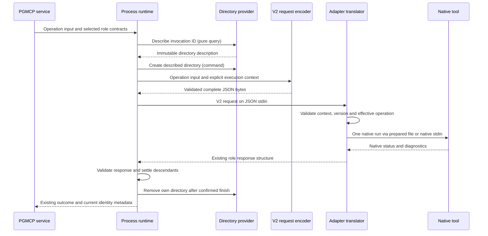

<!-- pgmcp:v1 id=design pv=1.0.0 pf=WCiT2npbapCBexKy sf=9PfER5JkyAoFQLRi -->

# Native adapter robustness: full selection and truthful completion

**Status:** DESIGN — proposed correction; independent QA review pending
**Version:** 1.2
**Last Updated:** 2026-10-01

## Purpose

Define the bounded correction architecture and proportional correctness checks for issues 469, 474 and 475 under the human-approved Research strategy.

## Scope In

Nine bundled packages, ten roles and thirteen capabilities inventoried in Research; target transport, native completion and failure interpretation, supported versions, and PGMCP-owned invocation resources. Issues 474 and 475 retain separate acceptance identities on the issue 469 branch.

## Scope Out

OS isolation, a general write-permission API, security manifests, generic native option parsing, environment sanitization, tool installation, workspace exclusion changes, archive/ACL fixes, filesystem-adapter redesign, and implementation cycle sequencing.

## Prerequisites

- Research B1–B6 and the final replacement B4 are binding. The owner explicitly accepted replacement B4 and authorized Design on 2026-10-01.
- Research 1.4 records the owner's unreleased-development refinement: correct the existing adapter contract in place, retaining internal contract_version 1 and current schema identities. No new v2 family, transition, legacy/compatibility code or external-consumer migration. Preserve public MCP parameters, response structures and outcome vocabulary. Verification is proportional; Planning owns server-health and report-mode edit/restart checkpoints.

## Problem Statement

Large explicit selections become Windows native command lines, so valid requests can fail before analysis. Ruff error classification can confuse verbose configuration chatter with the substantive cause. Mypy's native argument guard permits a successful metadata exit to continue as if analysis occurred. Existing blanket write guards also contradict the approved local-use policy. The correction must preserve native selection and operation semantics while keeping execution ownership in PGMCP.

## Functional Requirements

- RF1 / E469-1: Preserve the complete ordered selection and one native analysis/session; distinguish configured discovery from explicit input. Never truncate, silently filter, batch a whole-program analyzer, or replace an oversized selection with workspace discovery.
- RF2 / E469-2–3: Preserve literal paths and native exclusions; classify access, configuration, usage and execution failures from their substantive cause, with useful messages and native evidence.
- RF3 / E475-1: Metadata and substitute operations cannot become passed check/test evidence. Preserve intentionally supported Ruff exit-zero, Pytest collect-only and Pytest exit 5 semantics.
- RF4 / E474-1: PGMCP owns execution context and allocated temporary resources. Adapters translate native inputs/results. Ordinary native caches and compatible supplemental outputs may use user-configured destinations.
- RF5 / E469-4: Report actual native versions and refuse unsupported versions on use before invoking version-dependent parsing or performing source mutations.
- RF6 / E-CROSS: Preserve response validation, bounded capture, timeout/cancellation, descendant ownership, ordered fix stopping and truthful partial-mutation behavior.
- RF7 / QA P1–P2: Carry all PGMCP-supplied adapter context in the validated JSON input. Directory description is a pure query; creation/removal are commands returning None.

## Nonfunctional Requirements

- Keep package-specific translation local; do not introduce a shared native parser, multi-run reducer or new policy framework.
- Use constructor-injected narrow resource/process interfaces and frozen value objects. Compose concrete filesystem ownership in bootstrap.
- Reuse existing public-boundary adapter/runtime tests and fresh evidence; document unsupported combinations without claiming universal native compatibility.
- Execute operator-admitted tools and deliberate workspace code under the existing host account. Describe that trust model honestly without warning prompts on every call.

## Constraints

- The configured temporary root is already resolved by resolve_temporary_paths(server_root). Reuse its validation_root; add no phase names or separate hardcoded scratch-root setting.
- Caller-controlled response files must not bypass existing role/selection guards. Adapter-generated transport is an internal encoding of an already admitted request.
- Supplemental reports are compatible only when the native status and captured diagnostics still satisfy the result contract. Their location alone does not decide admissibility.
- An operational invocation failure cannot be reported as a successful check/test/fix, and cleanup cannot imply that arbitrary native side effects were undone.

## Options

### 1. Native file/stdin transport with PGMCP resource ownership — selected

Keep one native execution and move scalable input off argv using each tool's supported transport.

**Pros:**

- Removes the target-count command-line cause while preserving joint analysis.
- Retains existing native CLI/configuration behavior and process lifecycle.
- Requires a narrow resource seam and explicit required request context; native formats remain adapter-local.

**Cons:**

- Transport equivalence needs pinned-version evidence.
- Line-oriented formats cannot represent every possible argument; competing native input modes need explicit limits.

### 2. Universal batching

Split selection and aggregate several native runs.

**Pros:**

- Avoids long command lines for simple independent operations.

**Cons:**

- Changes Mypy/Pyright whole-program behavior and Pytest session/plugin behavior.
- Introduces reducers, repeated effects and partial-run states; unnecessary because native scalable transports exist.

### 3. Replace CLI execution with native Python APIs

Use mypy.api.run or a new stdin-fed pytest.main wrapper as the principal transport.

**Pros:**

- Can remove argv pressure for Python-native tools.

**Cons:**

- Adds differing capture/plugin/configuration coupling when existing native argument-file support already preserves the current CLI route.
- Does not solve Ruff or cross-language tools.

### 4. Refuse all oversized selections or use workspace discovery

Retain argv and reject or substitute when launch becomes impossible.

**Pros:**

- Small code change.

**Cons:**

- Leaves standard large selections unsupported or changes their meaning; does not remove the primary defect.

### 5. Restrict all native write destinations

Keep blanket destination refusals or introduce a general adapter permission policy.

**Pros:**

- Can reject particular known options.

**Cons:**

- Contradicts replacement B4 and places execution policy in adapters.
- Cannot confine tools, plugins or configuration code under the host account.

## Decision

Use native scalable transport, PGMCP-owned invocation directories, explicit required execution_context in the existing check/test/fix contract, CQS-separated directory description/create/remove, targeted operation/result guards and package-local supported-version checks. Preserve public MCP tool parameters and response structures; no legacy or compatibility path.

## Rationale

Native argument files and stdin lists remove selection size from the process command line without changing the analysis unit. The narrow PGMCP resource seam separates pure directory description from creation/removal. A validated JSON context makes the location explicit without adapter knowledge of PGMCP roots or a second communication channel. Targeted guards protect the requested operation and truthful result; they do not promise general write prevention.

## Key Decisions

### D1: Single native execution per role

Avoids joint-analysis, collection, plugin and partial-aggregation changes.

**Alternatives:**

- Universal batching
- Silent workspace fallback

### D2: Explicit context in the existing unreleased adapter input

Required execution_context.scratch_directory in each adapter request. PGMCP supplies it through JSON stdin after successful directory creation. No PGMCP-specific environment key or absent-context transport fallback.

**Alternatives:**

- PGMCP environment side channel: rejected by the owner's communication boundary and QA P1.
- Optional context or dual-version bridge: unnecessary complexity under the direct-development correction.
- Adapter-owned temporary directory: violates ownership.

### D3: Preserve native operational state and compatible reports

Destination-independent local-use policy is already approved; retain only guards with a demonstrated operation/input/result-contract reason.

**Alternatives:**

- Universal pre-write refusal
- General security parser

### D4: Native-version declarations remain the package SSOT

Dependency declarations already record supported pins. Actual versions are observed on use; unsupported semantics are not guessed.

**Alternatives:**

- A second central version table
- Permissive parsing of unknown versions

## Production Design

### Ownership and causal seams

| Boundary | Owner and correction | Existing entry point |
|---|---|---|
| Request selection/operation | PGMCP preserves current scope admission and fix re-resolution | [selection](../../../mcp_server/execution/check_selection.py), [fix service](../../../mcp_server/execution/fix_service.py) |
| Process context/deadline/descendants | PGMCP describes and creates one owned invocation directory, includes its context in the JSON request, and manages cleanup | [runtime](../../../mcp_server/execution/process_runtime.py) |
| Resource location/allocation/removal | A narrow injected directory provider uses the existing resolved temporary root | [bootstrap](../../../mcp_server/bootstrap.py), [content ownership precedent](../../../mcp_server/execution/content_input.py) |
| Native encoding, guards and result interpretation | Each package owns its tool-specific translation; Ruff check/fix may share a package-local translation helper | [bundled packages](../../../mcp_server/bundled_adapters) |
| Native caches, configuration, plugins | Preserve admitted native behavior and accepted host-account access | Research replacement B4 |

Keep content-input scratch ownership separate: its snapshot must outlive the corresponding check and must not be removed by native argument-file cleanup. Both providers may use the configured validation root, but own distinct unique child directories. Do not refactor unrelated services into a general resource framework.

### Transport selection

| Package / role | Selected transport | Preservation and bounded limits |
|---|---|---|
| Ruff / check and fix | Native `@file` containing the complete guarded native argument sequence in the owned directory | One lint/format run; existing read-only check overrides and exact fix selection remain. Caller response files stay refused. Certify both lint and format at 0.15.6 |
| Mypy / check | Native `@file` containing admitted options and all targets | One combined analysis; retain configured discovery for empty targets and deliberate supported native expansion; caller response files stay refused |
| Pyright / check | Native `-` filename list on the native child's stdin for nonempty explicit targets | One analysis; empty targets retain configured discovery without injecting an empty stdin selector. Adapter controls stdin; caller replacement `-` remains refused |
| Pytest / test | Native `@file` passed to the existing fresh `--native` child | Keep target/option ordering, pytest.main metadata plugin, collection, xdist and coverage semantics. Preserve previously admitted caller response-file semantics only through the effective native guard |
| Lychee / selection check | Native `--files-from -` with complete escaped literal target list on native stdin when that channel is free | Preserve native link resolution and JSON/text modes. With an effective user/config `files_from`, preserve the existing direct positional route rather than overriding or merging its file contents. That competing mode retains the argv limit; a launch failure must identify this limit, without fallback |
| Lychee / content check | Existing one snapshot path and logical base/remap | No large target list; stdin selector would substitute snapshot intent |
| Python syntax, TypeScript syntax, Markdown preflight / content | Existing snapshot transport | No target-list argv defect; retain capability-specific audit and negative-result evidence |
| Commitlint / content | Existing stdin message transport | No target-list argv defect; preserve native config and metadata guard |

Use native argument-file grammar, not shell quoting. For line-oriented formats, reject unrepresentable tokens (including CR/LF or native blank/comment ambiguity) as unsupported_input rather than splitting, stripping or dropping them. Ordinary empty/whitespace option values need explicit native equivalence evidence. Preserve spaces, Unicode, literal metacharacters and ordering. Absolute admitted filesystem paths prevent leading option/comment markers from becoming control syntax; Lychee retains its existing literal glob escaping. Unknown transport behavior is not grounds for normalization.

Every admitted invocation contains execution_context. Ruff/Mypy/Pytest use its directory for argument files even for bounded selections, avoiding an arbitrary switching threshold. Repository direct-call fixtures provide the same complete request and own the supplied directory's lifetime; no external migration commitment is introduced. Missing/invalid context is invalid_request; there is no direct argv fallback, environment lookup or private temporary allocation. Native stdin remains separate from the adapter's JSON request stdin. Very large argv-only option payloads for stdin-based tools and Lychee's competing files_from mode retain an explicit native launch limit.

### Guard disposition for issue 474

| Native route | Disposition and contract reason |
|---|---|
| Ruff/Mypy caches and configured locations | Preserve; destination alone is not a defect. Do not override native cache settings or delete native cache directories |
| Lychee cache and cookie jar | Remove blanket refusal; these are operational cache/state, compatible with link checking. Preserve native settings and normal precedence |
| Mypy JUnit/report directories, timing/line statistics | Remove blanket side-output refusal where diagnostics/status remain captured. Missing optional report dependencies or native report failures retain truthful native inability |
| Ruff output-file / inherited RUFF_OUTPUT_FILE; Lychee output destination | Retain targeted refusal: these replace captured diagnostics required by the existing result contract. The refusal is about result translation, not destination rights |
| Ruff check fix modes; Ruff fix added sources/stdin source replacement; Mypy shadow-file/command/module/package source replacement | Retain role/selection guards. Checks must not translate into native source fixes; fixes must not gain sources |
| Mypy install-types | Retain unsupported operation: dependency installation is outside this analysis request |
| Lychee dump/dump-inputs/generate; preprocessing replacement; content files-from/base/remap replacement; non-GET/HEAD methods | Retain the existing unsupported alternate operation/input boundary; do not present it as an OS security control |
| Metadata/watch/other operation substitutes | Refuse as unsupported_input when they replace the requested bounded check/test/fix |

Assess effective configuration/environment where the current guard already does so; do not build a second general native parser. Adapt existing tests that equate all side writes with contract violations. No adapter may select a security policy or a supposedly safe cache destination.

### Supported versions and completion

Read the supported main-tool version from each existing package dependency declaration on use: Ruff 0.15.6 and Mypy 1.19.1 requirements, Pyright 1.1.408 and Commitlint 21.2.2 package dependencies, Pytest 9.0.2 requirements, Lychee 0.24.2 dependencies.json. Keep these values out of a second Python registry. Stdlib adapters report their actual runtime and do not acquire an artificial Python pin; TypeScript syntax retains its declared native dependency. Existing Pytest extra/plugin declarations remain prerequisites, not automatic installations or a new universal plugin admission system.

Unavailable/mismatched main tools use the existing dependency_unavailable reason with actual and expected versions in the message and actual external_tools facts where obtainable. Fail before version-dependent native parsing or source mutation. Malformed dependency declarations are package prerequisite failures; an unreadable actual version is not presumed supported.

#### New correction obligations for issue 475 / QA P3

| Package and capability | Research-established defect | Required new guard and regression |
|---|---|---|
| Mypy / types | --help returns passed; parser SystemExit(0) returns None | Treat native metadata early exit as unsupported_input, retain help evidence and prove ordinary analysis still executes |
| Ruff / lint | --help and --show-files return passed without analysis | Add explicit check-role guards; prove refusal for each route through the public package entry point |
| Ruff / format check | --help returns passed without format analysis | Add explicit format-check metadata guard and its own regression; lint coverage cannot stand in for this capability |
| Pyright / types | --help returns passed with metadata output | Add explicit metadata guard and public native regression preserving JSON/text genuine analysis modes |

Help/version aliases that the supported native parser admits must uphold the same requested-operation contract. Assess Ruff show-settings/watch and Pyright verifytypes/watch separately as alternate operations; do not describe these unprobed routes as Research-proven false PASS. Retain existing Pytest, Lychee, Commitlint and Ruff-fix guards and their valuable evidence. Caller response-file/config/environment routes must not bypass the effective guard.

A native exit zero alone does not prove analysis when the chosen mode is metadata. Conversely, preserve deliberately supported Ruff --exit-zero, Pytest collect-only and Pytest exit 5. Do not replace ordinary native verbose/stats/output modes with blanket refusals.

Ruff error classification uses the native error record and causal chain, not the occurrence of 'configuration' or a debug prefix anywhere in output. An actual parse/config diagnostic is invalid_configuration; access/launch/native inability is execution_error; rejected operation/usage is unsupported_input. Skip benign debug preambles when selecting a message while retaining bounded native evidence. A permission failure naming a configuration path is still an access failure. Unknown causes stay honest execution_error rather than invented parser precision.

## Test Design

### Proportional public-boundary checks

Reuse and adapt [Ruff checks](../../../tests/mcp_server/integration/adapters/test_ruff_checks.py), [Ruff fixes](../../../tests/mcp_server/integration/adapters/test_ruff_fixes.py), [Mypy](../../../tests/mcp_server/integration/adapters/test_mypy.py), [Pyright](../../../tests/mcp_server/integration/adapters/test_pyright.py), [Pytest](../../../tests/mcp_server/integration/adapters/test_pytest.py) and [Lychee](../../../tests/mcp_server/integration/adapters/test_lychee.py). Update existing request fixtures to supply execution_context and use the current schemas. Retain meaningful existing coverage; no compatibility, historical-version refusal or exhaustive per-package permutation suite is required.

Use a small direct native check for each actual correction: complete oversized selection with a late diagnostic/change where relevant; ordinary analysis plus refused metadata for the proven false-PASS routes; allowed cache/report effects plus the retained result-changing refusals. Existing native fixtures provide literals, discovery, exclusions, configuration and intentional exit-policy controls. Add a new test only for a concrete uncovered defect or ownership invariant, not to create a RED ceremony or a general proof matrix.

Keep [runtime tests](../../../tests/mcp_server/integration/execution/test_process_runtime.py) and [content-input tests](../../../tests/mcp_server/integration/execution/test_content_input.py) aligned with the injected directory provider and required JSON input. Reuse useful termination/cancellation/cleanup evidence. Focus added ownership coverage on pure description, exclusive-create collision preservation and removal of successfully owned resources after confirmed termination; tests protect observable behavior rather than constructor attributes or private filenames.

Mechanical contract/fixture maintenance requires no artificial failing baseline. Focused functional checks establish that the correction works; server health and working edit/check/test operations establish that the development tooling remains usable. Full configured tests and broader gates stay in Validation, with fresh evidence reused.

## Contracts

### PGMCP directory description and lifecycle / QA P2

The new filesystem interface belongs in [core/interfaces/execution.py](../../../mcp_server/core/interfaces/execution.py). It deliberately separates a frozen description from mutating commands:

```python
@dataclass(frozen=True)
class InvocationDirectory:
    directory: Path

class InvocationScratchDirectories(Protocol):
    def describe(self, invocation_id: UUID) -> InvocationDirectory: ...
    def create(self, directory: InvocationDirectory) -> None: ...
    def remove(self, directory: InvocationDirectory) -> None: ...
```

describe is a pure calculation from an invocation ID and the injected resolved root. It creates no directory, file, reservation, registry entry or persistent state; repeated calls for the same inputs return the same description. A description is not proof of allocation. The runtime obtains a fresh invocation ID once and retains the description across creation, request serialization and removal.

create makes the described unique child exclusively and returns None. A pre-existing directory/symlink or foreign-root description is refused, not adopted. Successful creation establishes runtime cleanup ownership; a failed exclusive creation must not cause removal of a pre-existing path. The provider's creation contract has no fallible post-creation work that loses this ownership fact. Existing shared-root preparation must not make the runtime claim ownership of that root.

remove returns None and operates only on this invocation's successfully created allocation, after process completion is confirmed. No broad sweep or native-cache cleanup occurs. Filesystem failures are exceptions handled by the existing invocation-failure path.

The composition root constructs the provider from resolve_temporary_paths(server_root).validation_root and injects it into AdapterProcessRuntime, alongside its backend. A fresh-ID supplier is injected for deterministic collision/lifecycle tests. Keep content-snapshot ownership separate; the new interface does not copy the older create-and-return pattern.

[AdapterProcessBackend.start](../../../mcp_server/core/interfaces/execution.py) keeps its current launch/workspace signature. The proposed environment_overrides parameter is removed. Inherited native-tool environment/configuration behavior remains as today.

### Required context in the existing adapter input / QA P1

All request variants in the existing check/test/fix schemas require this additional closed object at the request root:

```json
{
  "execution_context": {
    "scratch_directory": "C:\\temporary-root\\invocation-123"
  }
}
```

This fragment augments the existing operation/args and target/content fields; it is not a standalone request. Both the request and context remain additionalProperties=false. The required context definition is:

```json
{
  "type": "object",
  "additionalProperties": false,
  "required": ["scratch_directory"],
  "properties": {
    "scratch_directory": {
      "type": "string",
      "minLength": 1,
      "allOf": [
        {"not": {"pattern": "\\u0000"}},
        {"pattern": "^(?:/|[A-Za-z]:[\\\\/]|\\\\\\\\[^\\\\/]+[\\\\/][^\\\\/]+)"}
      ]
    }
  }
}
```

The executable schemas and strict DTO validators must agree on absolute path syntax and NUL rejection. Filesystem existence and write success are operational checks, not schema purity side effects. PGMCP supplies an absolute existing directory only after its create command succeeds. An adapter validates the complete input before native parsing/analysis or source writes.

| Input condition | Contract behavior |
|---|---|
| Missing execution_context or scratch_directory | Existing invalid_request/missing_field, nested field location, adapter protocol exit 2; no native analysis |
| Null/wrong-type context or directory | Existing invalid_request/wrong_type |
| Unknown context field | Existing invalid_request/unknown_field |
| Empty/relative/NUL-containing path | Existing invalid_request/invalid_value |
| Well-formed path unavailable, not a directory, or failing a required transport-file write | Adapter unavailable/execution_error with actual filesystem cause; no native analysis after failed preparation |
| Valid usable context | Required native translation; the adapter never chooses another root or cleans the allocation |

Content-only/stdin-only roles validate the required context shape but do not invent a write probe or argument file they do not need. Required file-using roles establish usability through their actual transport preparation. These checks provide contract correctness, not proof of PGMCP ownership or OS confinement against a hostile direct caller.

The only knowledge the adapter needs is the supplied location and its role contract. It does not derive PGMCP roots, inspect PGMCP config or read a PGMCP context variable. Ordinary native-tool cache/temp/report variables remain tool configuration under B4. Repository direct callers provide the same required context and own its preparation/lifetime; there is no absent-context fallback.

### Request production and encoding

The runtime owns creation and therefore supplies the execution context before serialization. Services keep resolving their existing immutable operation inputs. A narrow pure request contract in [execution/protocol.py](../../../mcp_server/execution/protocol.py) composes these inputs with the context into the selected frozen wire DTO and returns validated JSON bytes:

```python
class AdapterExecutionContext(BaseModel):
    model_config = ConfigDict(frozen=True, strict=True, extra="forbid")
    scratch_directory: AbsoluteDirectoryPath

class AdapterRequestContract(Protocol[TRequest]):
    def encode(
        self,
        request: TRequest,
        execution_context: AdapterExecutionContext,
    ) -> bytes: ...
```

AbsoluteDirectoryPath is a lexical type with the lexical rules above, not a filesystem permission query. Each wire DTO adds required execution_context to the corresponding existing selection/content/test/fix fields. Internal operation intent and complete wire input are separate types; do not introduce optional context into the wire model to accommodate pre-allocation construction.

AdapterProcessRuntime.invoke gains an injected/passed request_contract alongside its existing request and response_contract. The selected role encoder follows the same model-driven approach as the existing response decoder: no adapter-name/native-option dispatch. Its encode operation is pure and performs no allocation or filesystem writes. CheckService, content check invocation, TestRunManager and FixManager pass the matching request contract through their existing runtime seams. Concrete role contracts are composed at the composition root.

Runtime finalization removes the allocation on an encoding/launch failure as well as normal completion, subject to the same confirmed-termination rules. Unexpected producer serialization/validation failure uses existing InvocationFailed/LAUNCH_FAILED with an explicitly input-preparation message and no child/native completion; do not add a public failure enum in this release. A direct malformed wire request remains the distinct adapter invalid_request response.

### Direct development correction and current participants

The owner explicitly superseded the earlier proposed v2 migration. These schemas and package declarations have not been released. Amend them in place; keep one current request shape and internal contract_version 1. A numeric development identity is not a compatibility promise. Do not add version negotiation, legacy validators, old-version refusal tests or external-consumer migration instructions.

| Repository participant | Required direct correction |
|---|---|
| [Wire schemas](../../../mcp_server/execution/contracts) | Update check_v1.schema.json, test_v1.schema.json and fix_v1.schema.json in place with required context in every request alternative; retain response shapes and existing schema references |
| [Selection models](../../../mcp_server/execution/check_selection.py), [content models](../../../mcp_server/execution/content_input.py), [test/fix models](../../../mcp_server/execution/models.py) | Separate immutable operation intent from complete strict/frozen wire DTOs with required context; retain current version identity |
| [Check service](../../../mcp_server/execution/check_service.py), [test service](../../../mcp_server/execution/test_service.py), [fix service](../../../mcp_server/execution/fix_service.py), [runtime](../../../mcp_server/execution/process_runtime.py), [protocol](../../../mcp_server/execution/protocol.py), [bootstrap](../../../mcp_server/bootstrap.py) | Compose matching request encoders and resource ownership without adding public caller parameters |
| [Manifest admission](../../../mcp_server/config/schemas/adapter_manifest.py), [catalog](../../../mcp_server/execution/catalog.py), all [bundled packages](../../../mcp_server/bundled_adapters) | Update all nine package validators/ten roles for the one required request shape. Existing contract_version 1 admission/declarations remain; avoid version-only churn |
| [Check presentation](../../../mcp_server/services/check_operation.py), [scaffold presentation](../../../mcp_server/services/scaffold_operation.py) | Preserve current result envelopes and internal version metadata; change only code needed for the context/resource correction |
| [Adapter tests](../../../tests/mcp_server/integration/adapters), [process fixture](../../../tests/mcp_server/fixtures/adapter_process.py), [execution tests](../../../tests/mcp_server/integration/execution), [unit execution tests](../../../tests/mcp_server/unit/execution) and template activation/proposal fixtures | Update existing current-request construction. Retain useful invalid-input and operation checks; no separate old-version acceptance/refusal family |
| Active protocol guidance | Describe the one corrected development contract, required context and ownership/native-cache distinction. No external release migration policy |

The python_adapter source template is a generic class template and contains no hardcoded role-wire contract. Do not rewrite it merely because its name mentions adapters.

### Observable result contract

Keep existing role response structures, status/reason vocabulary, exit-code pairing, tool facts, coverage/required-target semantics, bounded evidence and public MCP parameter sets. Internal binding metadata remains contract_version 1 under the explicitly mutable development identity. Operation refusal is unavailable/unsupported_input; unsupported main tool is unavailable/dependency_unavailable; malformed or missing negative-result evidence is unavailable/invalid_result. Malformed wire context follows the existing invalid_request response. Generic PGMCP creation/encoding/launch/cleanup failures use existing invocation-failure envelopes and never fabricate native results.

## Flow



An invalid request or refused operation skips native analysis. The invocation deadline starts before description/creation. Native execution and process settling retain existing monotone execution/stop budgets; request encoding and transport preparation do not create another deadline.

## State and Failures

| Condition | Required observable behavior |
|---|---|
| Directory description/creation fails before launch | Existing InvocationFailed with LAUNCH_FAILED and factual preparation message; no native completion or adoption/removal of a pre-existing directory |
| Missing/invalid required context | Existing invalid_request response with exact nested field/code; no fallback or native analysis |
| Native transport cannot encode a token or conflicts with an owned input channel | Existing adapter unavailable/unsupported_input with useful explanation; no omission or fallback |
| Native file write/read/launch fails | Adapter unavailable/execution_error with native/OS fact; owned directory still belongs to PGMCP |
| Native metadata exits successfully | Operation refusal; help evidence may be retained, never passed analysis |
| Native analysis completes | Validate role response, await descendant finish, then remove owned invocation directory |
| Timeout/cancellation | Preserve process-tree stopping and bounded protected finalization; clean only after termination is confirmed |
| Termination remains unconfirmed | Preserve existing termination_problem and failure/cancellation semantics; retain the directory for the potentially live process and log the owned path |
| Directory removal fails after confirmed finish | Existing InvocationFailed / PROCESS_FAILED with cleanup path/error and the preceding outcome in the message, preserving captured response and any termination fact. Never describe cleanup failure as unconfirmed process termination |
| Fix completed or partially mutated before operational failure | Keep actual disk effects and capture; do not imply rollback or a passed fix |

For a cleanup failure following cancellation, report the cleanup failure and prior cancellation fact together through the existing operational failure envelope. Normal successful cleanup preserves the existing cancellation outcome. No new public cleanup field is needed. Response acceptance/native completion and invocation cleanup are distinct facts; a failed invocation may retain a valid captured adapter response.

## Preservation

| Boundary / Research strategy | Preservation or explicit break |
|---|---|
| Public MCP parameters and role results | Existing parameters, response structures, statuses/reasons and exit pairing preserved; internal binding metadata retains identity 1 |
| Adapter wire input / current B1 refinement | Correct the unreleased check/test/fix contract in place with required context. Update current repository participants; no transition, compatibility path or external migration work |
| Internal runtime input | Explicit selected request_contract plus existing response contract; pure encoding follows directory creation |
| Process backend / native environment | Current start signature and inheritance behavior remain; no PGMCP environment overlay |
| Native selection B2 | Per-package one execution, complete argument vector/list, configured discovery kept distinct; native exclusions/imports/plugins remain authoritative |
| Completion B3 | New Mypy/Ruff-check/Pyright guards and their explicit regressions; existing intentional outcome policies remain |
| Ownership/trust B1/B4 | PGMCP directory lifecycle, explicit JSON location, no blanket native cache destination enforcement or sandbox claim |
| Directory CQS / QA P2 | Frozen pure description; create/remove return None; no ownership of pre-existing paths |
| Dependencies/classification B5/B6 | Package declarations remain SSOT; actual versions and substantive failure reasons remain visible |
| Fix lifecycle | All-input admission, ordered stop and partial mutation contract; no automatic retry or transactional rollback |

Failure of pinned transport equivalence requires a bounded package-design correction within this strategy, not batching or silent selection changes. A change to approved responsibilities or release scope must return to the human decision.

## Development Replacement and Cleanup

Replace the existing request shape directly across schemas, runtime encoders, bundled validators and fixtures. Keep current contract identifiers and one supported shape. No compatibility or rollback subsystem is introduced.

The description stage mutates nothing. Creation is exclusive; cleanup ownership starts only after successful creation. Invocation directories remain distinct from content snapshots. Remove confirmed-finished owned allocations; retain resources when termination is uncertain. Do not sweep other invocation/validation directories or native caches.

Planning owns the concrete edit/restart order and temporary use of validation=report. This mode still executes selected checks and retains request-rejection/preparation/interruption/termination blockers. Do not invent an adapter-free mode or weaken the editor to perform this correction.

## Validation

### V469-transport / RF1

**Method:** Pinned native large-selection and bounded-equivalence tests for Ruff lint/format/fix, Mypy, Pyright, Pytest and ordinary Lychee selection.

**Expected Result:** Every intended sentinel participates in one native analysis/session; unselected sources remain unaffected. Competing Lychee files_from limitation is explicit.

### V469-errors / RF2

**Method:** Public adapter access/config/usage/native-launch cases with quiet/default/verbose and supported JSON/text variation.

**Expected Result:** Substantive class is stable, message identifies cause and evidence is retained; no workspace exclusion workaround.

### V475-completion / RF3

**Method:** Distinct new Mypy help, Ruff lint help/show-files, Ruff format help and Pyright help tests, plus effective metadata/substitute-operation and preserved intentional native success-policy cases.

**Expected Result:** Metadata cannot become passed analysis; genuine pass/failure and supported collect-only/exit-zero/exit5 semantics remain correct.

### V474-effects / RF4

**Method:** Real native operational cache/report/state and targeted contract-refusal tests at admitted test destinations.

**Expected Result:** Permitted destinations work; checks do not become fixes, fixes do not gain sources, required diagnostics remain available. No host-isolation claim.

### V469-prerequisites / RF5

**Method:** Observe installed version and exercise unavailable/mismatched main-tool behavior at package entry points.

**Expected Result:** Actual/expected version is useful and refusal occurs before version-dependent parsing or source mutation.

### V-runtime / RF6

**Method:** Reuse current runtime/descendant/resource and protocol/fix tests with required JSON context; focused pure-description/exclusive-create ownership checks and fresh-server operation smokes. No historical-version refusal matrix.

**Expected Result:** Context is explicit and required, CQS is upheld, current participants agree on one request shape, internal identity stays 1, and deadline/cancellation/cleanup use preserved result structures.

## Risks

### Loaded server and edited adapters can temporarily disagree during development.

Use the existing editor's actual report-mode semantics and a concrete edit/restart order in Planning; restore a coherent running server before functional checks or subsequent cycles. No compatibility code is added.

**Consequence:** A request-rejection blocker is an operational development issue to avoid through edit ordering and restart, not a reason to design a released migration framework.

### Current native transport documentation is not complete pinned equivalence evidence.

Certify each selected transport through real pinned public entry points, including Ruff format/fix and literal-path cases. Do not infer success for one role from another.

**Consequence:** Transport-specific failure requires a bounded design correction; implementation acceptance remains pending.

### Line-oriented transports and a competing Lychee files\_from source are not universally representable.

Explicitly retain supported direct mode for the competing source and report actual argv failure; reject unrepresentable line tokens without truncation.

**Consequence:** These combinations have a documented limit; ordinary large selections must still work.

### Executed tools/tests/plugins/configuration retain host-account access.

Keep operator admission and document the selected personal-use trust boundary in active execution guidance. Do not imply cwd, option guards or owned cleanup confine code.

**Consequence:** Malicious or defective admitted code can read/write host resources or use network/environment access; explicitly accepted residual risk.

### Timeout or cleanup failure can leave an owned directory and a fix can already have changed sources.

Preserve factual capture/outcome, retain resources for unconfirmed live processes, and report cleanup failure without claiming rollback.

**Consequence:** The operator may need to inspect a leftover path or source mutation; no automatic broad cleanup.

## Planning Consequences

Retain separate 469/474/475 acceptance and Research 1.4's direct-development refinement. Update all affected request variants and bundled/current fixtures, without changing contract identity or adding compatibility/external migration work. Keep the required JSON context and CQS/resource boundary. Server health, a workable report-mode edit/restart order, useful existing tests and small defect-specific functional checks are sufficient cycle obligations; no staged RED or broad proof matrix is imposed on mechanical maintenance. Validation owns the full configured suite and broad review, with explicit file-type target selection. Documentation records the current contract and proportional B4 policy. @co aligns issue 474's superseded wording before acceptance/closure.

## QA Verdict Disposition

Historical Design QA in **Beoordeel designplan** raised P1/P2 and P3; Design 1.1 received GO for Design → Planning on commit 288b77ae. Planning 1.0 then received NOGO on e5794187 for edit-preflight sequencing and Python-gate selection. The owner subsequently clarified unreleased development and authorized the current direct-contract/report-mode refinement. These revisions require a fresh independent review; prior verdicts do not approve the revised strategy by inheritance.

| Finding | Design correction | New review / future acceptance evidence |
|---|---|---|
| P1: PGMCP context outside JSON | Required execution_context in the existing check/test/fix request; no PGMCP environment channel; current B1 direct-development decision | Review schema/DTO/runtime/package agreement and focused actual-input behavior; no old-version migration proof |
| P2: allocate mutates and returns | Pure describe(invocation_id) → frozen description; create/remove → None; ownership only after successful exclusive create | Review CQS and failed-creation/collision/cleanup behavior; implementation proves pure query and no adoption/removal of pre-existing paths |
| P3: Ruff/Pyright correction implicit | Distinct new Ruff lint help/show-files, Ruff format help and Pyright help guards/tests, alongside Mypy early-return correction | Review traceability to Research's actual reproduced routes; later tests prove refusal and preserved genuine native outcomes |

Native cache/test temporary configuration remains separate from adapter-prepared argument files. The explicit context governs the latter only; no central redirect of all native scratch output is selected.

## Design Evidence

- Directly inspected the existing runtime/backend, content-input ownership, bootstrap composition, selection/fix admission, package guards and public adapter/runtime regression seams.
- Existing pinned Ruff regression `test_response_file_tokens_do_not_hide_writes_in_pinned_native`: **1 passed, 22 deselected** in **0.53s**, via `run_tests`, target `tests/mcp_server/integration/adapters/test_ruff_checks.py`, native args `-q -n 0 -k response_file_tokens_do_not_hide_writes_in_pinned_native`. Receipt: `pgmcp://cache/runs/395f886ff20f4e4ca4be9c76773f6304`; complete structured evidence inspected.
- That test establishes native Ruff 0.15.6 argument-file interpretation and the existing caller-file refusal. It does **not** certify the proposed owned transport, large-selection equivalence, Ruff format/fix transport or the other packages.
- Historical Design 1.0 document profile and link review passed: 22 successful links, 6 configured offline exclusions and 0 errors; receipt `pgmcp://cache/runs/07fce48be466433d868e93a207497fe9`. This retains its original scope and does not establish the corrected Design 1.1 architecture or its updated links.
- Historical Design 1.1 / Research 1.3 document and focused link-review evidence were recorded with the preceding review request; current Design 1.2 / Research 1.4 receive fresh document checks. No rerun of the unchanged historical Ruff test is needed for documentation edits.
- No production/test implementation was changed. All V469/V474/V475/V-runtime obligations above describe required future acceptance evidence.

## Sources

- [Ruff native argument files (current documentation; pinned lint behavior independently tested)](https://docs.astral.sh/ruff/configuration/#argfile-support)
- [Mypy 1.19.1 native argument files](https://raw.githubusercontent.com/python/mypy/v1.19.1/docs/source/running_mypy.rst)
- [Pyright 1.1.408 command-line stdin and exit semantics](https://github.com/microsoft/pyright/blob/1.1.408/docs/command-line.md)
- [Pytest 9.0 argument files](https://docs.pytest.org/en/9.0.x/how-to/usage.html)
- [Lychee CLI documentation marked 0.24.2](https://lychee.cli.rs/guides/cli/)
- [Windows process command-line bound](https://learn.microsoft.com/en-us/windows/win32/api/processthreadsapi/nf-processthreadsapi-createprocessw)

## Related Documents

- [Approved Research and expected results](research.md)
- [Historical native effects and their limits](effect-probe.md)
- [Architecture contract](../../coding_standards/ARCHITECTURE_PRINCIPLES.md)
- [Documentation phase boundaries](../../coding_standards/DOCUMENTATION_STANDARD.md)


## Bug / Design Hand-over

### Scope

- Correction architecture for issues 469, 474 and 475 under the approved Research strategy.
- Direct correction of the unreleased adapter contract under current B1, public parameter/result preservation, CQS ownership, native translation and proportional correctness checks.
- OS isolation, general permissions, implementation sequencing and unrelated filesystem correctness are excluded.

### Deliverables

- [Design](design.md)
- [Approved Research and expected results](research.md)
- [Historical effects and accepted limits](effect-probe.md)

### Evidence

- Pinned Ruff argument-file regression: 1 passed, 22 deselected; exact call and limited claim are recorded in Design Evidence.
- Historical Ruff and Design 1.0 evidence retains its limited scope. Fresh corrected-document validation is provided with the new QA request.
- Proposed corrections are not implementation evidence or producer authorization.

### Open Work

- Fresh independent review of the development-context refinement and corrected Planning, including report-mode edit/restart sequencing and explicit Python-target gates. Owner authorization is not QA approval.
- Implementation must establish the pinned transport, permitted-effect, completion and runtime obligations; no universal transport/isolation claim is established.
- Coordination must align issue 474's superseded fixed-destination wording before claiming acceptance/closure.

### Review Request

Review requested.


