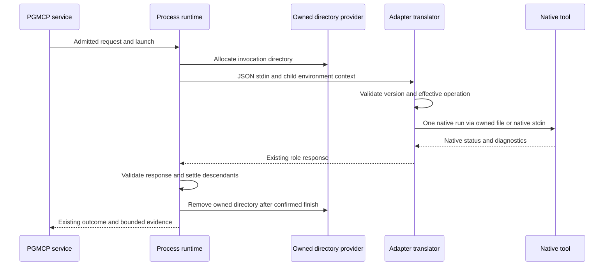

<!-- pgmcp:v1 id=design pv=1.0.0 pf=WCiT2npbapCBexKy sf=9PfER5JkyAoFQLRi -->

# Native adapter robustness: full selection and truthful completion

**Status:** DESIGN — proposed correction; independent QA review pending
**Version:** 1.0
**Last Updated:** 2026-10-01

## Purpose

Define the bounded correction architecture and durable regression obligations for issues 469, 474 and 475 under the human-approved Research strategy.

## Scope In

Nine bundled packages, ten roles and thirteen capabilities inventoried in Research; target transport, native completion and failure interpretation, supported versions, and PGMCP-owned invocation resources. Issues 474 and 475 retain separate acceptance identities on the issue 469 branch.

## Scope Out

OS isolation, a general write-permission API, security manifests, generic native option parsing, environment sanitization, tool installation, workspace exclusion changes, archive/ACL fixes, filesystem-adapter redesign, and implementation cycle sequencing.

## Prerequisites

- Research B1–B6 and the final replacement B4 are binding. The owner explicitly accepted replacement B4 and authorized Design on 2026-10-01.
- Preserve the current public tools and check/v1, test/v1 and fix/v1 JSON contracts. A necessary public/wire break requires reopening that affected strategy boundary.

## Problem Statement

Large explicit selections become Windows native command lines, so valid requests can fail before analysis. Ruff error classification can confuse verbose configuration chatter with the substantive cause. Mypy's native argument guard permits a successful metadata exit to continue as if analysis occurred. Existing blanket write guards also contradict the approved local-use policy. The correction must preserve native selection and operation semantics while keeping execution ownership in PGMCP.

## Functional Requirements

- RF1 / E469-1: Preserve the complete ordered selection and one native analysis/session; distinguish configured discovery from explicit input. Never truncate, silently filter, batch a whole-program analyzer, or replace an oversized selection with workspace discovery.
- RF2 / E469-2–3: Preserve literal paths and native exclusions; classify access, configuration, usage and execution failures from their substantive cause, with useful messages and native evidence.
- RF3 / E475-1: Metadata and substitute operations cannot become passed check/test evidence. Preserve intentionally supported Ruff exit-zero, Pytest collect-only and Pytest exit 5 semantics.
- RF4 / E474-1: PGMCP owns execution context and allocated temporary resources. Adapters translate native inputs/results. Ordinary native caches and compatible supplemental outputs may use user-configured destinations.
- RF5 / E469-4: Report actual native versions and refuse unsupported versions on use before invoking version-dependent parsing or performing source mutations.
- RF6 / E-CROSS: Preserve response validation, bounded capture, timeout/cancellation, descendant ownership, ordered fix stopping and truthful partial-mutation behavior.

## Nonfunctional Requirements

- Keep package-specific translation local; do not introduce a shared native parser, multi-run reducer or new policy framework.
- Use constructor-injected narrow resource/process interfaces and frozen value objects. Compose concrete filesystem ownership in bootstrap.
- Reuse existing public-boundary adapter/runtime tests and fresh evidence; document unsupported combinations without claiming universal native compatibility.
- Execute operator-admitted tools and deliberate workspace code under the existing host account. Describe that trust model honestly without warning prompts on every call.

## Constraints

- The configured temporary root is already resolved by resolve_temporary_paths(server_root). Reuse its validation_root; add no phase names or separate hardcoded scratch-root setting.
- Caller-controlled response files must not bypass existing role/selection guards. Adapter-generated transport is an internal encoding of an already admitted request.
- Supplemental reports are compatible only when the native status and captured diagnostics still satisfy the result contract. Their location alone does not decide admissibility.
- An operational invocation failure cannot be reported as a successful check/test/fix, and cleanup cannot imply that arbitrary native side effects were undone.

## Options

### 1. Native file/stdin transport with PGMCP resource ownership — selected

Keep one native execution and move scalable input off argv using each tool's supported transport.

**Pros:**

- Removes the target-count command-line cause while preserving joint analysis.
- Retains existing native CLI/configuration behavior and process lifecycle.
- Requires one small generic resource seam; native formats remain adapter-local.

**Cons:**

- Transport equivalence needs pinned-version evidence.
- Line-oriented formats cannot represent every possible argument; competing native input modes need explicit limits.

### 2. Universal batching

Split selection and aggregate several native runs.

**Pros:**

- Avoids long command lines for simple independent operations.

**Cons:**

- Changes Mypy/Pyright whole-program behavior and Pytest session/plugin behavior.
- Introduces reducers, repeated effects and partial-run states; unnecessary because native scalable transports exist.

### 3. Replace CLI execution with native Python APIs

Use mypy.api.run or a new stdin-fed pytest.main wrapper as the principal transport.

**Pros:**

- Can remove argv pressure for Python-native tools.

**Cons:**

- Adds differing capture/plugin/configuration coupling when existing native argument-file support already preserves the current CLI route.
- Does not solve Ruff or cross-language tools.

### 4. Refuse all oversized selections or use workspace discovery

Retain argv and reject or substitute when launch becomes impossible.

**Pros:**

- Small code change.

**Cons:**

- Leaves standard large selections unsupported or changes their meaning; does not remove the primary defect.

### 5. Restrict all native write destinations

Keep blanket destination refusals or introduce a general adapter permission policy.

**Pros:**

- Can reject particular known options.

**Cons:**

- Contradicts replacement B4 and places execution policy in adapters.
- Cannot confine tools, plugins or configuration code under the host account.

## Decision

Use native scalable transport, one invocation directory owned by PGMCP, targeted operation/result guards, and package-local supported-version checks. Keep public/wire contracts unchanged.

## Rationale

Native argument files and stdin lists remove selection size from the process command line without changing the analysis unit. The small PGMCP resource seam solves ownership rather than duplicating allocation in adapters. Targeted guards protect the requested operation and truthful result; they do not promise general write prevention.

## Key Decisions

### D1: Single native execution per role

Avoids joint-analysis, collection, plugin and partial-aggregation changes.

**Alternatives:**

- Universal batching
- Silent workspace fallback

### D2: Additive child execution context, unchanged JSON

An invocation-owned directory can be supplied through one reserved environment key without a wire migration or adapter permission interface.

**Alternatives:**

- Adapter-owned tempfile allocation
- New request/manifest policy schema

### D3: Preserve native operational state and compatible reports

Destination-independent local-use policy is already approved; retain only guards with a demonstrated operation/input/result-contract reason.

**Alternatives:**

- Universal pre-write refusal
- General security parser

### D4: Native-version declarations remain the package SSOT

Dependency declarations already record supported pins. Actual versions are observed on use; unsupported semantics are not guessed.

**Alternatives:**

- A second central version table
- Permissive parsing of unknown versions

## Production Design

### Ownership and causal seams

| Boundary | Owner and correction | Existing entry point |
|---|---|---|
| Request selection/operation | PGMCP preserves current scope admission and fix re-resolution | [selection](../../../mcp_server/execution/check_selection.py), [fix service](../../../mcp_server/execution/fix_service.py) |
| Process context/deadline/descendants | PGMCP adds one owned invocation directory and explicit child environment overlay | [runtime](../../../mcp_server/execution/process_runtime.py) |
| Resource location/allocation/removal | A narrow injected directory provider uses the existing resolved temporary root | [bootstrap](../../../mcp_server/bootstrap.py), [content ownership precedent](../../../mcp_server/execution/content_input.py) |
| Native encoding, guards and result interpretation | Each package owns its tool-specific translation; Ruff check/fix may share a package-local translation helper | [bundled packages](../../../mcp_server/bundled_adapters) |
| Native caches, configuration, plugins | Preserve admitted native behavior and accepted host-account access | Research replacement B4 |

Keep content-input scratch ownership separate: its snapshot must outlive the corresponding check and must not be removed by native argument-file cleanup. Both providers may use the configured validation root, but own distinct unique child directories. Do not refactor unrelated services into a general resource framework.

### Transport selection

| Package / role | Selected transport | Preservation and bounded limits |
|---|---|---|
| Ruff / check and fix | Native `@file` containing the complete guarded native argument sequence in the owned directory | One lint/format run; existing read-only check overrides and exact fix selection remain. Caller response files stay refused. Certify both lint and format at 0.15.6 |
| Mypy / check | Native `@file` containing admitted options and all targets | One combined analysis; retain configured discovery for empty targets and deliberate supported native expansion; caller response files stay refused |
| Pyright / check | Native `-` filename list on the native child's stdin for nonempty explicit targets | One analysis; empty targets retain configured discovery without injecting an empty stdin selector. Adapter controls stdin; caller replacement `-` remains refused |
| Pytest / test | Native `@file` passed to the existing fresh `--native` child | Keep target/option ordering, pytest.main metadata plugin, collection, xdist and coverage semantics. Preserve previously admitted caller response-file semantics only through the effective native guard |
| Lychee / selection check | Native `--files-from -` with complete escaped literal target list on native stdin when that channel is free | Preserve native link resolution and JSON/text modes. With an effective user/config `files_from`, preserve the existing direct positional route rather than overriding or merging its file contents. That competing mode retains the argv limit; a launch failure must identify this limit, without fallback |
| Lychee / content check | Existing one snapshot path and logical base/remap | No large target list; stdin selector would substitute snapshot intent |
| Python syntax, TypeScript syntax, Markdown preflight / content | Existing snapshot transport | No target-list argv defect; retain capability-specific audit and negative-result evidence |
| Commitlint / content | Existing stdin message transport | No target-list argv defect; preserve native config and metadata guard |

Use native argument-file grammar, not shell quoting. For line-oriented formats, reject unrepresentable tokens (including CR/LF or native blank/comment ambiguity) as unsupported_input rather than splitting, stripping or dropping them. Ordinary empty/whitespace option values need explicit native equivalence evidence. Preserve spaces, Unicode, literal metacharacters and ordering. Absolute admitted filesystem paths prevent leading option/comment markers from becoming control syntax; Lychee retains its existing literal glob escaping. Unknown transport behavior is not grounds for normalization.

When PGMCP supplies the directory, Ruff/Mypy/Pytest use owned argument files even for bounded selections, avoiding an arbitrary switching threshold. Direct package invocation without that environment key retains the existing bounded argv route; adapters never allocate a private fallback directory. Native stdin remains separate from the adapter's JSON request stdin. Very large non-selection option payloads and Lychee's competing files_from mode retain an explicit native launch limit.

### Guard disposition for issue 474

| Native route | Disposition and contract reason |
|---|---|
| Ruff/Mypy caches and configured locations | Preserve; destination alone is not a defect. Do not override native cache settings or delete native cache directories |
| Lychee cache and cookie jar | Remove blanket refusal; these are operational cache/state, compatible with link checking. Preserve native settings and normal precedence |
| Mypy JUnit/report directories, timing/line statistics | Remove blanket side-output refusal where diagnostics/status remain captured. Missing optional report dependencies or native report failures retain truthful native inability |
| Ruff output-file / inherited RUFF_OUTPUT_FILE; Lychee output destination | Retain targeted refusal: these replace captured diagnostics required by the existing result contract. The refusal is about result translation, not destination rights |
| Ruff check fix modes; Ruff fix added sources/stdin source replacement; Mypy shadow-file/command/module/package source replacement | Retain role/selection guards. Checks must not translate into native source fixes; fixes must not gain sources |
| Mypy install-types | Retain unsupported operation: dependency installation is outside this analysis request |
| Lychee dump/dump-inputs/generate; preprocessing replacement; content files-from/base/remap replacement; non-GET/HEAD methods | Retain the existing unsupported alternate operation/input boundary; do not present it as an OS security control |
| Metadata/watch/other operation substitutes | Refuse as unsupported_input when they replace the requested bounded check/test/fix |

Assess effective configuration/environment where the current guard already does so; do not build a second general native parser. Adapt existing tests that equate all side writes with contract violations. No adapter may select a security policy or a supposedly safe cache destination.

### Supported versions and completion

Read the supported main-tool version from each existing package dependency declaration on use: Ruff 0.15.6 and Mypy 1.19.1 requirements, Pyright 1.1.408 and Commitlint 21.2.2 package dependencies, Pytest 9.0.2 requirements, Lychee 0.24.2 dependencies.json. Keep these values out of a second Python registry. Stdlib adapters report their actual runtime and do not acquire an artificial Python pin; TypeScript syntax retains its declared native dependency. Existing Pytest extra/plugin declarations remain prerequisites, not automatic installations or a new universal plugin admission system.

Unavailable/mismatched main tools use the existing dependency_unavailable reason with actual and expected versions in the message and actual external_tools facts where obtainable. Fail before version-dependent native parsing or source mutation. Malformed dependency declarations are package prerequisite failures; an unreadable actual version is not presumed supported.

Mypy guard SystemExit(0) becomes unsupported_input with its captured help/version evidence. Preserve existing guard handling of other parse/config failures. Other packages retain their effective metadata guards; response-file/config/environment routes cannot circumvent them. A valid native exit zero does not by itself prove the requested analysis if the selected native mode is metadata. Conversely, do not reclassify deliberately supported Ruff --exit-zero or Pytest collect-only/exit 5.

Ruff error classification uses the native error record and causal chain, not the occurrence of 'configuration' or a debug prefix anywhere in output. An actual parse/config diagnostic is invalid_configuration; access/launch/native inability is execution_error; rejected operation/usage is unsupported_input. Skip benign debug preambles when selecting a message while retaining bounded native evidence. A permission failure naming a configuration path is still an access failure. Unknown causes stay honest execution_error rather than invented parser precision.

## Test Design

### Durable public-boundary coverage

Adapt [Ruff checks](../../../tests/mcp_server/integration/adapters/test_ruff_checks.py), [Ruff fixes](../../../tests/mcp_server/integration/adapters/test_ruff_fixes.py), [Mypy](../../../tests/mcp_server/integration/adapters/test_mypy.py), [Pyright](../../../tests/mcp_server/integration/adapters/test_pyright.py), [Pytest](../../../tests/mcp_server/integration/adapters/test_pytest.py) and [Lychee](../../../tests/mcp_server/integration/adapters/test_lychee.py). Invoke package entry points with real pinned tools and validate the response schema. Supply an owned test directory through the execution environment for the new route; separately exercise actual PGMCP runtime ownership. Do not assert a private helper name, exact temporary basename or one chosen internal argv layout.

Large-selection tests must exceed the Windows native command-line capacity and include diagnostic or mutation sentinels near both ends, plus a source outside selection. For whole-program analyzers use cross-file behavior that a split run changes; for Pytest retain one-session fixture/plugin behavior. Compare bounded argv and scalable transport semantics after removing only inherently variable timing/path data. File count or argv length alone does not prove correct analysis.

Use minimal real fixtures for spaces, Unicode, leading punctuation, literal glob characters, native exclusions, directory/config discovery, missing/inaccessible targets and non-Python explicit inputs. Distinguish OS access errors from malformed config while varying verbosity and output modes. A genuine access-denied fixture must prove the process lacks access; do not substitute a missing file or silently skip the promised environment evidence.

Keep and extend the existing negative-contract tests: caller Ruff/Mypy response files, Ruff source mutation switches, fix added sources, metadata through Pytest config/environment/response files and Commitlint config. For Mypy help/version prove refusal with evidence and preserve ordinary clean/error/usage cases. Keep explicit Ruff exit-zero, Pytest collect-only/exit 5 and missing negative-evidence cases.

Split existing all-write-refusal tests into contract-changing refusal and permitted native side-output cases. Exercise CLI/config/environment precedence only where the native tool supports that source. Observe real cache/report/cookie-state effects inside deliberately allocated test destinations outside selected sources and verify source bytes and returned diagnostics. No permanent general sandbox or arbitrary-host-escape test is justified by B4.

Extend [process runtime integration tests](../../../tests/mcp_server/integration/execution/test_process_runtime.py) through invoke and observable process/filesystem behavior: distinct simultaneous directories, explicit child environment overlay without parent mutation, no cross-invocation removal, allocation/write/cleanup failures, cancellation/timeout and descendant completion. Keep [content-input tests](../../../tests/mcp_server/integration/execution/test_content_input.py) proving snapshot lifetime remains separate. Inject narrow failing providers where needed; assert outcome and ownership effects rather than constructor attributes.

Other inventoried roles retain their existing public capability and actual-version tests. Add package-local prerequisite mismatch coverage only for guarded behavior; do not demand every nine-package test permutation when it has no causal relevance.

## Contracts

### Internal PGMCP resource and launch interface

Add the following narrow interface contracts in [core/interfaces/execution.py](../../../mcp_server/core/interfaces/execution.py), with bodies intentionally omitted:

```python
@dataclass(frozen=True)
class OwnedInvocationDirectory:
    directory: Path

class InvocationScratchDirectories(Protocol):
    def allocate(self) -> OwnedInvocationDirectory: ...
    def remove(self, owned: OwnedInvocationDirectory) -> None: ...

class AdapterProcessBackend(Protocol):
    async def start(
        self,
        launch: AdapterLaunch,
        workspace_root: Path,
        *,
        environment_overrides: Mapping[str, str],
    ) -> AdapterProcess: ...
```

AdapterProcessRuntime receives backend and scratch directories by constructor injection. Its public invoke arguments and response union remain unchanged. The provider returns an absolute, unique child of its injected root and removes only its own allocation. Allocation/removal are commands, not hidden query side effects. The backend copies the inherited environment and overlays supplied keys for this child; it never mutates global os.environ.

The composition root constructs the provider from resolve_temporary_paths(server_root).validation_root and a fresh-ID supplier. No tool/service/native-name dispatch chooses a directory. The runtime supplies exactly PGMCP_INVOCATION_TMP for the allocation; it does not rewrite TMP/TEMP/TMPDIR or native cache variables.

### Adapter execution-context contract

PGMCP_INVOCATION_TMP is an additive reserved execution-environment key containing the absolute directory owned by the current invocation. It conveys a location for translation artifacts, not permission to access other paths. The adapter may serialize its native argument file there but cannot select a different root, remove the allocation or clean user-configured caches. No check/v1, test/v1, fix/v1, manifest or public tool parameter is added. Existing direct entry points and inherited environment values remain usable; a newly required shared Ruff package helper must be included in its package manifest. The response file includes only the final admitted argument vector, never unguarded caller tokens.

### Observable result contract

Retain existing response schemas, exit-code pairing, external tool facts, coverage/required-target semantics and bounded evidence. Operation refusal is unavailable/unsupported_input; unsupported main tool is unavailable/dependency_unavailable; malformed or missing negative-result evidence is unavailable/invalid_result. Native failures preserve their actual diagnostics; genuine analysis pass/negative result retains each role's current native outcome policy. Generic PGMCP launch/allocation/cleanup failures use existing invocation-failure envelopes and never fabricate native results.

## Flow



A refused request skips the native analysis run. Version lookup is an observation, not analysis evidence. The invocation deadline starts before allocation. Launch, native execution and process settling retain the existing monotone execution/stop budgets; creating an argument file does not start a second deadline.

## State and Failures

| Condition | Required observable behavior |
|---|---|
| Allocation fails before child launch | Existing InvocationFailed with LAUNCH_FAILED and factual preparation message; no native completion |
| Native transport cannot encode a token or conflicts with an owned input channel | Existing adapter unavailable/unsupported_input with useful explanation; no omission or fallback |
| Native file write/read/launch fails | Adapter unavailable/execution_error with native/OS fact; owned directory still belongs to PGMCP |
| Native metadata exits successfully | Operation refusal; help evidence may be retained, never passed analysis |
| Native analysis completes | Validate role response, await descendant finish, then remove owned invocation directory |
| Timeout/cancellation | Preserve process-tree stopping and bounded protected finalization; clean only after termination is confirmed |
| Termination remains unconfirmed | Preserve existing termination_problem and failure/cancellation semantics; retain the directory for the potentially live process and log the owned path |
| Directory removal fails after confirmed finish | Existing InvocationFailed / PROCESS_FAILED with cleanup path/error and the preceding outcome in the message, preserving captured response and any termination fact. Never describe cleanup failure as unconfirmed process termination |
| Fix completed or partially mutated before operational failure | Keep actual disk effects and capture; do not imply rollback or a passed fix |

For a cleanup failure following cancellation, report the cleanup failure and prior cancellation fact together through the existing operational failure envelope. Normal successful cleanup preserves the existing cancellation outcome. No new public cleanup field is needed. Response acceptance/native completion and invocation cleanup are distinct facts; a failed invocation may retain a valid captured adapter response.

## Preservation

| Boundary / Research strategy | Preservation carrier |
|---|---|
| Public tools and role JSON | No parameter, enum or response-schema migration; existing protocol validation tests |
| Internal process backend | Atomic internal environment-overlay signature change with runtime/composition/test-backend consumers; no public compatibility bridge |
| Package execution environment | Additive reserved key, inherited values preserved; raw bounded direct entry point remains supported |
| Native selection B2 | Per-package single execution, full-vector/list encoding, configured discovery kept distinct; native exclusions/imports/plugins remain authoritative |
| Completion B3 | Metadata refusal corrected; intentionally supported native outcome policies retained |
| Ownership/trust B1/B4 | PGMCP directory lifecycle, no blanket cache destination enforcement, no sandbox claim |
| Dependencies/classification B5/B6 | Package declarations remain SSOT; actual versions and substantive failure reasons remain visible |
| Fix lifecycle | Existing all-input admission, ordered stop and partial mutation contract; no automatic retry or transactional rollback |

A failure of pinned transport equivalence requires reconsidering that package's transport within this strategy; it does not authorize batching, dropping selection or changing public contracts. A required public/wire break must return to the human boundary decision.

## Transition and Cleanup

No migration of stored workflow state, native caches or user configuration is required. Invocation directories are transient and distinct from content snapshots. Remove only confirmed-finished owned allocations; retain potentially live resources when process termination is uncertain. Do not sweep unrelated validation directories or native caches. Reverting the implementation restores previous argv behavior and its known limit; it does not undo native fix mutations or supplemental files. Historical probes remain evidence, not production cleanup machinery.

## Validation

### V469-transport / RF1

**Method:** Pinned native large-selection and bounded-equivalence tests for Ruff lint/format/fix, Mypy, Pyright, Pytest and ordinary Lychee selection.

**Expected Result:** Every intended sentinel participates in one native analysis/session; unselected sources remain unaffected. Competing Lychee files_from limitation is explicit.

### V469-errors / RF2

**Method:** Public adapter access/config/usage/native-launch cases with quiet/default/verbose and supported JSON/text variation.

**Expected Result:** Substantive class is stable, message identifies cause and evidence is retained; no workspace exclusion workaround.

### V475-completion / RF3

**Method:** Effective metadata/substitute-operation regressions and preserved intentional native success-policy cases.

**Expected Result:** Metadata cannot become passed analysis; genuine pass/failure and supported collect-only/exit-zero/exit5 semantics remain correct.

### V474-effects / RF4

**Method:** Real native operational cache/report/state and targeted contract-refusal tests at admitted test destinations.

**Expected Result:** Permitted destinations work; checks do not become fixes, fixes do not gain sources, required diagnostics remain available. No host-isolation claim.

### V469-prerequisites / RF5

**Method:** Observe installed version and exercise unavailable/mismatched main-tool behavior at package entry points.

**Expected Result:** Actual/expected version is useful and refusal occurs before version-dependent parsing or source mutation.

### V-runtime / RF6

**Method:** Runtime invocation/descendant/resource integration coverage and existing protocol/fix regression tests.

**Expected Result:** Deadline, cancellation, cleanup ownership and truthful operational failure use unchanged public/wire outcomes.

## Risks

### Current native transport documentation is not complete pinned equivalence evidence.

Certify each selected transport through real pinned public entry points, including Ruff format/fix and literal-path cases. Do not infer success for one role from another.

**Consequence:** Transport-specific failure requires a bounded design correction; implementation acceptance remains pending.

### Line-oriented transports and a competing Lychee files\_from source are not universally representable.

Explicitly retain supported direct mode for the competing source and report actual argv failure; reject unrepresentable line tokens without truncation.

**Consequence:** These combinations have a documented limit; ordinary large selections must still work.

### Executed tools/tests/plugins/configuration retain host-account access.

Keep operator admission and document the selected personal-use trust boundary in active execution guidance. Do not imply cwd, option guards or owned cleanup confine code.

**Consequence:** Malicious or defective admitted code can read/write host resources or use network/environment access; explicitly accepted residual risk.

### Timeout or cleanup failure can leave an owned directory and a fix can already have changed sources.

Preserve factual capture/outcome, retain resources for unconfirmed live processes, and report cleanup failure without claiming rollback.

**Consequence:** The operator may need to inspect a leftover path or source mutation; no automatic broad cleanup.

## Planning Consequences

Planning must retain distinct issue acceptance obligations and the public/wire preservation boundary. Runtime ownership and each package's transport/completion correction need evidence at their actual public boundaries. Native prerequisite fixtures must make required tools available explicitly; historical probes are not regression suites. Implementation uses the narrow changed-surface gates; branch-wide validation belongs to Validation. Documentation must align the active execution/tool guidance with replacement B4, ordinary operational writes, supported versions and explicit transport limits. GitHub alignment of issue 474's superseded fixed-destination wording belongs to coordination. This document defines no cycles, patch ordering or authorization to enter implementation.

## Design Evidence

- Directly inspected the existing runtime/backend, content-input ownership, bootstrap composition, selection/fix admission, package guards and public adapter/runtime regression seams.
- Existing pinned Ruff regression `test_response_file_tokens_do_not_hide_writes_in_pinned_native`: **1 passed, 22 deselected** in **0.53s**, via `run_tests`, target `tests/mcp_server/integration/adapters/test_ruff_checks.py`, native args `-q -n 0 -k response_file_tokens_do_not_hide_writes_in_pinned_native`. Receipt: `pgmcp://cache/runs/395f886ff20f4e4ca4be9c76773f6304`; complete structured evidence inspected.
- That test establishes native Ruff 0.15.6 argument-file interpretation and the existing caller-file refusal. It does **not** certify the proposed owned transport, large-selection equivalence, Ruff format/fix transport or the other packages.
- The refined document profile passed without issues. Focused run_checks with scope=targets, this document, profile=markdown_link_review and timeout_seconds=60 passed: 28 total links, 22 successful, 6 configured offline exclusions and 0 errors. Receipt: `pgmcp://cache/runs/07fce48be466433d868e93a207497fe9`; complete structured evidence inspected. This checks the local review navigation; it does not validate those excluded external URLs.
- No production/test implementation was changed. All V469/V474/V475/V-runtime obligations above describe required future acceptance evidence.

## Sources

- [Ruff native argument files (current documentation; pinned lint behavior independently tested)](https://docs.astral.sh/ruff/configuration/#argfile-support)
- [Mypy 1.19.1 native argument files](https://raw.githubusercontent.com/python/mypy/v1.19.1/docs/source/running_mypy.rst)
- [Pyright 1.1.408 command-line stdin and exit semantics](https://github.com/microsoft/pyright/blob/1.1.408/docs/command-line.md)
- [Pytest 9.0 argument files](https://docs.pytest.org/en/9.0.x/how-to/usage.html)
- [Lychee CLI documentation marked 0.24.2](https://lychee.cli.rs/guides/cli/)
- [Windows process command-line bound](https://learn.microsoft.com/en-us/windows/win32/api/processthreadsapi/nf-processthreadsapi-createprocessw)

## Related Documents

- [Approved Research and expected results](research.md)
- [Historical native effects and their limits](effect-probe.md)
- [Architecture contract](../../coding_standards/ARCHITECTURE_PRINCIPLES.md)
- [Documentation phase boundaries](../../coding_standards/DOCUMENTATION_STANDARD.md)


## Bug / Design Hand-over

### Scope

- Correction architecture for issues 469, 474 and 475 under the approved Research strategy.
- Public/wire preservation, PGMCP resource ownership, per-package native transport and guard disposition, failure contracts and durable regression design.
- OS isolation, general permissions, implementation sequencing and unrelated filesystem correctness are excluded.

### Deliverables

- [Design](design.md)
- [Approved Research and expected results](research.md)
- [Historical effects and accepted limits](effect-probe.md)

### Evidence

- Pinned Ruff argument-file regression: 1 passed, 22 deselected; exact call and limited claim are recorded in Design Evidence.
- Document profile passed without issues; markdown_link_review passed with 22 successful links, 6 configured offline exclusions and 0 errors. Exact scope and receipt are recorded in Design Evidence.
- Proposed corrections are not implementation evidence or producer authorization.

### Open Work

- Independent Design review and the owner's opportunity to adjust the proposed choices.
- Implementation must establish the pinned transport, permitted-effect, completion and runtime obligations; no universal transport/isolation claim is established.
- Coordination must align issue 474's superseded fixed-destination wording before claiming acceptance/closure.

### Review Request

Review requested.
