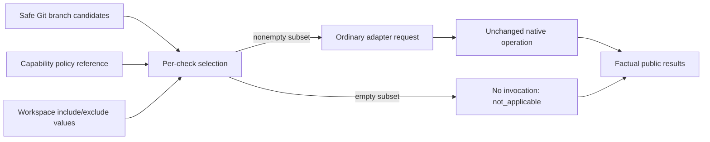

<!-- pgmcp:v1 id=design pv=1.0.0 pf=YApsrGTQgBUKFez2 sf=5--KpGf2wHUv2qAj -->

# Issue \#482 — Declarative branch preselection for selection checks

**Status:** Prepared for independent Design → Planning review  
**Version:** 0.1  
**Last Updated:** 2026-10-06

## Purpose

Define the smallest coherent implementation of the owner-approved configured_targets strategy. A capability declares its policy reference; PGMCP filters branch candidates using that policy and preserves the ordinary adapter/native call.

## Scope In

Selection-check capability metadata, workspace policy values, deterministic branch filtering, explicit descendant preservation, per-check no-applicable execution/results, and coherent migration of affected declarations and consumers.

## Scope Out

Native configuration interpretation or discovery equivalence; force-exclude; adapter intent fields; native entrypoint changes; branch test/fix scope; test-impact analysis; compatibility bridges; new permanent regression harnesses.

## Prerequisites

- Research 0.14 at commit 1993f80f454c199f49a404cadc8af4f9466cc11f; independent QA returned GO for Research → Design, and the owner authorized Design.

## Problem Statement

The branch selector currently offers every changed file to every selected check. Mixed Python, Markdown and workflow changes consequently reach inappropriate tools. Native configured discovery is not a uniform resolver contract, and the owner explicitly chose authored check-specific branch preselection instead. Empty per-check subsets must never turn into native configured discovery or a fabricated native pass.

## Functional Requirements

- Filter safe existing branch candidates independently for each selected selection-check capability using its declared include/exclude policy.
- Use the same adapter request and native invocation for identical effective operation, targets and args, regardless of whether targets originated from branch or explicit targeting.
- Preserve configured/workspace/targets scopes and content/test/fix roles; preserve explicitly targeted descendants beside their parent directory.
- Represent preselection with no applicable candidates without invoking an adapter, and distinguish it from native success, incomplete execution and an empty Git selection.
- Reject missing, invalid or unresolved active policy declarations at startup; permit all-through behavior only through explicit include=["**"], exclude=[].

## Nonfunctional Requirements

- No adapter IDs, language roots, native suffix/default lists or native configuration interpretation in generic production logic.
- One authoritative policy value location; frozen strict metadata; ConfigLoader remains the sole configuration reader.
- Filtering examines only supplied Git candidates; no filesystem enumeration, native probe, subprocess or additional source transport.
- Keep evidence proportional and reuse valid Research evidence. Design introduces no production/test changes or test execution.

## Options

### 1. Inline workspace patterns in reusable adapter manifests

Put include/exclude values directly in each package capability.

**Pros:**

- Few schema fields.

**Cons:**

- Repository roots become package facts; repository customization would require package modification or a second override source.

### 2. Capability reference with workspace-owned values — selected

A selection capability declares configured_targets as a named target-set reference. Existing checks.yaml owns the corresponding include/exclude values.

**Pros:**

- Keeps reusable packages free of repository paths.
- Uses existing generic configuration/catalog boundaries and one policy value source.
- Allows capabilities with equal policy to share one explicitly named set.

**Cons:**

- Requires startup cross-validation of the reference and a coherent declaration migration.

### 3. Package defaults plus workspace/native overrides

Resolve several policy layers.

**Pros:**

- More customization paths.

**Cons:**

- Unnecessary precedence and merge machinery; conflicts with the approved single-source, explicit-policy direction.

## Decision

Use named workspace target sets referenced by public selection-check capability metadata. Apply one common matcher only in run_checks branch scope; represent an empty subset as a planned non-invocation.

## Rationale

The adapter declares which standardized policy it requires; the workspace authors paths it owns. The generic core reads only a reference and include/exclude values. Tool-specific choices remain in configuration, while native commands remain untouched.

## Questions

## Production Design

| Responsibility | Owner / dependency |
| --- | --- |
| Capability declaration | Existing CheckCapability in adapter_manifest.py: configured_targets reference; no workspace paths or file reads. |
| Policy values and syntax | Existing ChecksConfig in checks_config.py: named immutable ConfiguredTargets values; pure syntax validation. |
| Reading and reference validation | ConfigLoader reads the existing files; ConfigValidator validates configured selection bindings against the admitted catalog and policy map at startup. |
| Matching | New generic configured-target matcher in execution; injected workspace root and read-only filter interface. No native/tool knowledge. |
| Scope resolution | Existing ScopeResolver/FileScopePaths retain Git/path safety and canonical paths; exact deduplication replaces directory covering. |
| Per-check plan | CheckSelector creates either a runnable existing request or an explicit no-applicable item, retaining selected-check order and effective args. |
| Execution and aggregation | CheckExecutor skips no-applicable items and returns factual rows; no native lifecycle is synthesized. |
| Public projection | Existing check_operation.py and execution_outputs.py project and validate the non-invoked variant and aggregate status. |
| Presentation | Existing run_checks configuration shows row reason as well as status; no new user-facing prose in the core. |
| Composition | bootstrap.py injects the matcher and loaded policy data through the existing construction path. |

## Test Design

Design adds or runs no tests and approves no new permanent regression harness. Existing authored fixtures and consumer setups invalidated by the clean break must be adapted coherently; that is caller migration, not authorization for broad regression execution. Planning must define the smallest evidence for the obligations below, preferably a disposable observable selection/process demonstration plus targeted schema/code gates. Native preservation can reuse valid Research evidence where the changed surface does not invalidate it; no configured full-suite run is implied by this Design.

## Contracts

### 1. Public metadata and one value source

All models remain frozen, strict and extra-forbid. These are field contracts, not implementation bodies:

| Model | New/changed field | Contract |
| --- | --- | --- |
| CheckCapability | configured_targets: ConfiguredTargetSetId or None | A nonempty symbolic name is mandatory when inputs contains selection. The field must be absent for content-only capabilities. No default policy; mixed content/selection still preserves requires_file. |
| ChecksConfig | configured_targets: mapping[ConfiguredTargetSetId, ConfiguredTargets] | Required map, represented with the existing immutable mapping convention. An explicit empty map is valid only when no configured check needs a selection policy. |
| ConfiguredTargets | include: tuple[str, ...] | Required, nonempty, unique valid patterns. |
| ConfiguredTargets | exclude: tuple[str, ...] | Required, unique valid patterns; [] is valid and means no exclusions. |

ConfiguredTargetSetId uses the existing symbolic-identifier convention, without enumerating adapter/tool names. Values live only under configured_targets in .pgmcp/config/checks.yaml. Manifests contain references, never duplicated path lists. There is no package fallback, override, merge, inheritance or native synchronization.

ConfigLoader performs the existing schema reads. ConfigValidator.validate_checks_config resolves every configured selection-capable binding, including bindings outside the default profile, and requires its reference to exist. Syntax-invalid target sets fail even if unused. An admitted but unconfigured package need not have its references resolved against this workspace. Loader/validator diagnostics identify the source declaration; pure models do not acquire config-root/path dependencies.

### 2. Initial capability references and workspace policy

The following are deliberate workspace preselection values, not copies of native resolved configuration. Patterns are literal under contract 3.

| Capability | configured_targets reference | include | exclude |
| --- | --- | --- | --- |
| ruff / format | python_format_sources | **/*.py; **/*.pyi; **/*.ipynb | Ruff exclusion list below |
| ruff / lint | python_lint_sources | **/*.py; **/*.pyi; **/*.ipynb; **/pyproject.toml | Same authored Ruff exclusion list |
| mypy / types | python_production_sources | mcp_server/**/*.py; mcp_server/**/*.pyi | **/__pycache__/**; **/.pytest_cache*/** |
| pyright / types | python_production_sources | Shared value above | Shared value above |
| lychee / links | markdown_sources | **/*.md | [] |

The single authored Ruff exclusion list is tests/mcp_server/validation_fixtures/**, docs/development/archive/**, **/.pytest_cache*/**, **/__pycache__/**. The two Ruff sets reuse that one YAML list via an ordinary anchor/alias, not custom merge behavior. The shared production set also avoids duplicate Mypy/Pyright values. Each policy is independent of native exclusions: native code and settings retain their ordinary meanings after candidates are offered.

No additional archive exclusion is introduced for typechecking: mcp_server/#Archief remains admitted by the production set. The Markdown policy deliberately admits Markdown; it does not reproduce every native Lychee extension. Explicit targets bypass these policies and remain subject to existing adapter/native guards.

### 3. Common pattern, candidate and ordering contract

| Aspect | Exact rule |
| --- | --- |
| Candidate | Existing safe canonical absolute Path returned by scope resolution, expressed relative to the injected canonical workspace root using /. Existing outside-workspace, missing/removed and invalid-path behavior is preserved. Symlink aliases match their resolved in-workspace path, not an unchecked Git spelling. |
| Anchoring | Every pattern matches the complete workspace-relative path. No implicit search at every directory level. |
| Case | Case-sensitive Unicode matching on every platform; no case folding or native glob dialect. |
| * | Zero or more characters within one path component, never /. |
| ? | Exactly one character within one path component, never /. |
| ** | Only legal as a complete component; zero or more complete components. ** matches every candidate; **/*.py matches root and nested Python files; mcp_server/**/*.py includes direct children. |
| Literal syntax | Other ordinary characters are literal. Brackets/braces/backslash/NUL and control characters are rejected; no character classes, brace expansion, escaping or negation language. |
| Admission | Nonempty relative patterns only: reject absolute/drive/UNC paths, empty components, . or .. components, trailing / and embedded ** inside a component. Whitespace and Unicode filename characters are not trimmed or normalized. |
| Include/exclude | At least one include must match; any exclude match wins. Dot-prefixed paths are ordinary paths. |
| Order | Retain the scope resolver's deterministic sorted canonical candidate order in every subset; retain requested/profile check order. Pattern order has no precedence. |
| Duplicates/directories | Deduplicate exact canonical path identities using existing host Path equality. Preserve explicitly supplied directories and their explicit descendants. Never scan, expand or replace a directory in the generic layer. |

The matcher consumes already validated paths and immutable policy values. A narrow ConfiguredTargetFilter interface in core/interfaces exposes select(targets: tuple[Path, ...], *, policy: ConfiguredTargets) -> tuple[Path, ...]. Its concrete execution implementation receives workspace_root at construction. The composition root passes the same canonical root used by FileScopePaths; the selector never accesses another object's private path state.

### 4. Scope, plan and ordinary request contracts

| Route | Behavior |
| --- | --- |
| run_checks / branch | Resolve Git candidates once; apply the selected capability's referenced policy per check. Create SelectionCheckRequest only for a nonempty subset. |
| run_checks / targets | Preserve deliberate targets and explicit descendants; do not apply configured_targets. |
| run_checks / configured | Preserve empty target tuple meaning native configured invocation. |
| run_checks / workspace | Preserve workspace-root target meaning. |
| Content validation, run_tests, apply_fixes | No policy evaluation, route or native request changes. |

CheckSelectionPlan replaces its calls carrier with checks: tuple[SelectedCheckCall | NotApplicableCheck, ...]. SelectedCheckCall retains its existing request/timeout/args-source fields. New frozen NotApplicableCheck carries check_id, binding, effective_args, args_source and the resolved timeout_seconds, with no request or native identity. This variant is produced only for a nonempty branch candidate set whose per-check subset is empty. There is no runnable empty branch request.

CheckSelector receives ConfiguredTargetFilter through constructor injection. SelectionCheckRequest operation/targets/args and adapter contract_version=1 remain unchanged. The native entrypoints receive no scope, intent, policy, manifest extension or alternate source channel. An applicable branch call and explicit call with identical effective request values must have identical adapter/native call construction.

A globally empty branch keeps the current empty_selection plan and no rows. A known no-applicable item remains no-applicable even if another check later stops execution; later applicable checks retain not_started behavior.

### 5. Per-check public result and aggregate contract

Extend the existing internal CheckExecution not_executed reason with not_applicable. A preselected no-applicable row has invocation=None and that internal reason; a native refusal still has its actual invocation/response. Do not extend shared test/fix reason models.

| Public field | Preselected no-applicable value |
| --- | --- |
| check_id | Original selected check ID |
| status / reason | not_executed / not_applicable |
| args_source / effective_args | Resolved configured/caller facts |
| message | None; no invented native explanation |
| adapter / capture / external_tools | None |
| evidence / coverage | None |
| termination_problem / request_rejection | None |
| required_targets | [] |

SelectionCheckResult admits this non-attempted not_applicable variant only with the facts above. Its existing attempted native not_applicable variant still requires actual adapter/capture/external-tool/message facts and remains incomplete. The non-attempted variant is permitted only in branch outputs. No native run/capture/coverage/external-tool identity is created.

Add not_applicable to SelectionStatus, used by SelectionExecution, and to RunChecksOutput aggregate run_status. Both executor aggregation and public aggregate validation use this same contract:

| Situation, in precedence order | run_status |
| --- | --- |
| Existing operational refusal, unavailable execution, interruption, unconfirmed termination, native refusal or applicable check not started | Preserve existing error/result rules; incomplete where execution results exist |
| Otherwise any executed native failed check | failed |
| Otherwise at least one executed native passed check; other rows may be preselected no-applicable | passed |
| Nonempty branch candidates; every selected check preselected no-applicable | not_applicable |
| Globally empty Git branch selection, no rows | empty_selection |

success continues to describe the existing operational envelope; no-applicable has success=true and error_code/error_details=None, but makes no quality-success claim. Adding the aggregate literal is an explicit public schema change. Existing native lifecycle, rejection/termination facts and native response wire are preserved.

Presentation retains the current aggregate template and adds reason={reason} to the configured check-row template so the routine tool summary exposes not_applicable. The structured output remains authoritative.

### 6. Coherent clean-break admission and migration

The public metadata extension is mandatory for selection capabilities. Missing-policy compatibility, implicit allow-all and legacy selector aliases are excluded. The four affected bundled packages (Ruff, Mypy, Pyright, Lychee) migrate to package version 2.0.0 because their required public declarations change; native dependency pins and role contract_version=1 remain unchanged. Their existing native files/entrypoints are preservation surfaces. Content-only packages, Pytest and fix-role capability declarations acquire no selection-policy field.

Migrate existing strict-schema consumers and authored fixtures/builders that construct selection capabilities, ChecksConfig, CheckSelectionPlan or aggregate outputs. Remove directory-covering expectations for explicit targeting; replace calls-field consumers coherently rather than maintaining a parallel alias. Installed-distribution/configuration evidence must still show the same manifest and workspace policy values are shipped and read through the existing catalog/loader paths.

Active execution-adapter and quality-tool references must document required policy references, the pattern language, branch-only behavior and no-applicable outcomes in Documentation. Historical issue artifacts remain context. Planning must enumerate actual impacted consumers before editing, without expanding into native-adapter repair.

## Flow

## State and Failures

Policy syntax/reference errors fail startup through existing configuration diagnostics. Scope/Git errors keep existing refusals. Native failures and source restrictions retain their present facts. The new no-applicable state is a successful selection decision with no native work, and cannot be used to hide an attempted refusal.

## Preservation

Preserve native dependency versions, entrypoints, subprocess construction, configuration precedence, source guards, configured discovery and all adapter request/response DTOs. Preserve other role/scope semantics and effective args/timeout selection. Preserve native Ruff corrections and their fresh passing evidence from Research. The intended behavioral changes are branch per-check subsets, explicit descendant retention, required metadata admission and truthful no-applicable reporting.

## Transition and Cleanup

Apply the admitted metadata/configuration/selector/result contract as one coherent clean break. Do not ship old/new policy paths, optional legacy admission, a calls alias, adapter intent flags or a native resolver route. Workspace-specific policy values remain outside reusable packages. An incompatible external selection package must supply the new required declaration before admission; no automatic migration is invented.

## Validation

### Metadata/schema/reference admission

**Method:** Inspect/adapt existing schema consumers; demonstrate missing selection policy, invalid pattern and unknown active reference rejection through the public loader/startup path.

**Expected Result:** Fail-fast errors; valid content-only and mixed capabilities retain their established admission rules.

### Mixed branch and deterministic matching

**Method:** Use one isolated demonstration with root/nested Python, stub, notebook, pyproject.toml, production/test Python, Markdown, archive/cache candidates and a third unrelated file type.

**Expected Result:** Each capability receives exactly its declared subset in stable order; production roots and Ruff exclusions differ intentionally.

### Explicit targeting and native preservation

**Method:** Compare observed ordinary requests/call construction for equal branch/targets effective inputs; demonstrate parent directory plus explicitly supplied descendant.

**Expected Result:** Identical native request semantics and no dropped descendant; configured/workspace/content/test/fix behavior preserved.

### Empty and mixed results

**Method:** Observe adapter-call count and public DTO for all-no-applicable, native pass plus no-applicable, failure plus no-applicable, attempted native refusal, later not-started and globally empty Git cases.

**Expected Result:** No call for preselected emptiness; exact row facts and aggregate precedence; no fabricated native PASS or identity.

### Packaging and active consumers

**Method:** Inspect installed-distribution manifest/configuration contracts and actual affected consumer inventory; use focused applicable gates under the eventual approved plan.

**Expected Result:** Required metadata, policy values and new aggregate schema remain coherent without compatibility shims.

## Risks

### Declared policy can differ from native discovery or become stale.

Document it as independent workspace intent; author changes explicitly. Do not promise native equality or synchronize implicitly.

**Consequence:** Native tools may still follow imports or refuse offered sources under their ordinary rules.

### Generic glob dialect or platform behavior can become ambiguous.

Use contract 3 rather than OS/native glob matching; validate before startup and demonstrate boundary examples.

**Consequence:** Case-sensitive patterns require the workspace's actual candidate spelling.

### Package policy references introduce an explicit workspace configuration obligation.

Resolve all configured selection bindings at startup and document required target-set names.

**Consequence:** Old selection package declarations fail admission; clean break is intentional.

### No-applicable rows could accidentally become configured discovery or quality success.

Represent them without a request; preserve attempted/native distinction and validate aggregate consistency.

**Consequence:** Public consumers must recognize the new aggregate literal.

## Planning Consequences

Planning must inventory coupled callers and define a bounded coherent implementation, document active reference updates and select proportional evidence per file type. Keep Python checks on appropriate Python targets, Markdown on document checks, and honor phase-owned workspace verification. It must not revive native resolution, add adapter flags/entrypoint changes, launch broad regression runs or invent a second policy source.

## Related Documents

- [Approved Research strategy and native evidence](<research.md>)
- [Architecture contract](<../../coding_standards/ARCHITECTURE_PRINCIPLES.md>)
- [Documentation standard](<../../coding_standards/DOCUMENTATION_STANDARD.md>)
- [Execution adapters reference](<../../reference/execution-adapters.md>)
- [Quality tools reference](<../../reference/tools/quality.md>)

## Version History

| Version | Date | Author | Changes |
| --- | --- | --- | --- |
| 0.1 | 2026-10-06 | @imp designer | Define policy ownership, exact matching, no-applicable results and coherent clean-break migration within the approved Research strategy. |
