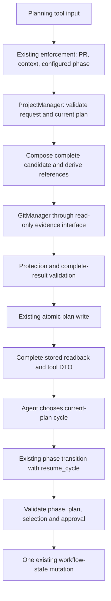

<!-- pgmcp:v1 id=design pv=1.0.0 pf=YApsrGTQgBUKFez2 sf=5--KpGf2wHUv2qAj -->

# Issue \#491 — Planning creation, whole-block mutation and cycle resumption

**Status:** DRAFT — independent Design review requested  
**Version:** 1.0  
**Last Updated:** 2026-10-09

## Purpose

Define concrete interfaces and responsibility boundaries for the owner-approved strategy, without implementation bodies or an execution plan.

## Scope In

Planning save/update/readback, whole-block operations, stored names and references, common result validity, captured-HEAD execution evidence, explicit cycle resumption, rejection-before-write initialization, shared scope grammar, targeted injection cleanup and configuration/instruction coherence.

## Scope Out

Compatibility aliases or migration tools; completion tracking; a general mutation/deletion language; independent cycle plans per phase; new resume tools or transaction infrastructure; historical commit rewriting; broad test or instruction rewrites.

## Prerequisites

- Independent Research GO on 4206b4827a6635cedaed54d9c14240396266fe86; owner approved Design on 2026-10-09.
- Research v1.15 resolves the P3 stale intermediate wording. Approved Strategy is authoritative; earlier options are historical.

## Problem Statement

Creation validates one complete plan, but update persists a partial merge without validating its complete result. Caller totals/identifiers, ignored names, partial additions and incompatible glob rules obscure the contract. Removing or renumbering uncommitted cycles can also leave execution pointers stale. Git metadata currently cannot round-trip an independent cycle and subphase, and initialization can overwrite planning before rejecting existing branch state.

## Functional Requirements

- Keep write-once initial save and separate update. Replace/add complete phase or cycle blocks; remove only through explicit operations.
- Derive total and all numeric references on the server, persist them and expose the same values through complete readback.
- Apply the same complete-result validity boundary to save and update before writing. Failed admission, protection or validation does not change the plan.
- Protect issue-attributed execution cycles and their numbers using complete active-branch HEAD ancestry. Retry even with force; force only overrides continued evidence uncertainty.
- Constrain public planning-content commands to configured Planning through existing enforcement. Keep Hotfix/Chore compact and non-cycle-based.
- Validate explicit current-plan cycle selection before any phase-state mutation on re-entry; retain C_1 as the first entry.
- Reject same-branch initialization before project persistence; retain valid bootstrap and verified post-PR recovery.
- Use one lossless configured scope contract, remove passive decoding injections, normalize duplicate matching issue markers and retain dir/pattern as the sole glob form.

## Nonfunctional Requirements

- Keep config names out of Python policy branches. Pure frozen planning/scope/evidence values perform no filesystem, state, Git or config loading.
- Inject narrow read-only evidence dependencies; ProjectManager never depends on PhaseStateEngine and never writes workflow state.
- Use existing AtomicJsonWriter and WorkflowStateMutator. Do not claim cross-file or cross-process atomicity.
- Prefer adapting existing public behavior tests and helpers; add only coverage for material gaps. No content assertions or legacy-behavior tests.

## Constraints

- At most one cycle_based phase per configured workflow; zero is allowed. ConfigLoader remains the sole config reader.
- No Design approval is claimed. Signatures and field declarations below specify contracts, not executable implementations.
- Commit existence means execution evidence, not completion. State entry alone does not protect a cycle.
- The new planning layout is a clean break; other workspaces may be manually adjusted. No old-format fallback is part of the planning contract.

## Options

### 1. Retain partial per-ID merges

Rejected: permits incomplete new blocks, makes deletion/renaming ambiguous and repeats composition logic.

**Pros:**

- Small local patch surface.

**Cons:**

- Does not meet complete-block intent or complete-result validity.

### 2. Replace the entire plan on every update

Rejected: expands deletion risk and requires every caller to resupply unrelated phases and cycles.

**Pros:**

- One complete payload.

**Cons:**

- Loses the owner-selected block resolution and explicit removal intent.

### 3. Typed block operations with one resulting-plan boundary

Selected: five explicit operation shapes, initial-snapshot targeting, server-owned ordering/references and one validated persistence effect.

**Pros:**

- Preserves unrelated blocks and exposes exact intent.
- Fits existing manager, models, enforcement and Git seams.

**Cons:**

- Breaking DTO/readback changes and bounded new local Git IO.

## Decision

Use typed complete-block operations and separate input/stored value models. Existing ProjectManager owns plan commands; GitManager supplies narrowly exposed read-only cycle evidence; PhaseStateEngine owns phase entry and execution pointers.

## Rationale

This resolves the demonstrated creation/update mismatch without a generic patch language or a new lifecycle architecture. One shared scope grammar supports trustworthy evidence, while explicit phase re-entry handles changed cycle numbering without coupling planning writes to state writes.

## Key Decisions

### An operations list replaces the partial-update payload.

Intent is visible in a discriminated op; replacing a block never silently creates an existing-cycle target.

### Store phase blocks under a phases mapping keyed by configured phase name.

Removes the hardcoded design/validation/documentation merge set. Names are validated against the selected project's configured phase list; this is a DTO/layout change within the approved clean break.

### Keep cycle order server-owned: original survivor order followed by explicitly appended blocks.

The requested mutation needs replacement, append and removal, not a general insert/reorder API.

### Put execution-evidence interpretation in GitManager behind ICycleEvidenceReader.

Uses the existing Git layer and one narrow interface; no extra evidence service is required.

### Compose phase transition and cycle-entry state in one existing mutator application.

Prevents the current phase-write-before-entry-validation failure without introducing a transaction framework.

## Production Design

| Owner | Target responsibility | Dependency / boundary |
|---|---|---|
| Planning schemas | Admit complete request blocks and validate stored structure/reference consistency | Pure frozen values; no IO/config loader |
| ProjectManager | Compose a candidate plan, derive references, enforce evidence protection and persist once | Injected ContractsConfig and ICycleEvidenceReader; no state writer |
| GitAdapter | Capture local branch/HEAD and read issue-prefiltered reachable commit metadata | Native Git/GitPython only; no phase/cycle interpretation |
| GitManager | Qualify metadata by issue and shared scope grammar, return completeness and protected cycles | GitConfig, ScopeEncoder/ScopeDecoder and existing adapter |
| ScopeContract | Define and validate the one scope grammar over injected phase/subphase vocabulary | WorkphasesConfig value; no IO |
| PhaseStateEngine | Validate entry and atomically change execution state through existing mutator | Current plan query and configured cycle_based policy |
| Tools / presenter | Admit DTOs, invoke commands, query stored results and present structured diagnostics | Existing tool factory, enforcement and presentation configuration |
| ConfigLoader / bootstrap | Validate configuration and wire instances once | Existing composition root |

Keep manager commands returning None and queries returning values. Tool command responses are assembled from the complete stored-plan query, not reconstructed from summaries. The same numbering/composition value path is used for initial save and update; no independent output-only numbering.

## Test Design

Test through public commands, queries and phase APIs. Use actual value models and isolated files for planning behavior; inject a frozen-evidence fake to control complete/unavailable/positive states without needing Git in every manager test. Put one native temporary Git repository at the history qualification boundary to prove deep ancestry, issue/phase qualification and real codec use. Existing E2E scope coverage is adapted, not duplicated.

| Existing surface | Proportional behavior to prove |
|---|---|
| test_project_manager.py / test_project_tools.py | Initial numbering/name/reference readback; write-once save; complete phase/cycle replacement, append/removal and unrelated-block preservation; invalid result leaves bytes unchanged |
| Planning update coverage | Original-snapshot multi-target semantics, duplicate/missing targets; protected deletion and renumbering; force retries and preserves positive protection |
| Existing schema/checker tests | One admitted/saved dir+pattern rule executes through the actual public gate/resolver route |
| test_scope_encoder.py / test_phase_detection.py / existing cycle E2E | Lossless phase/cycle/subphase combinations, unknown result and canonical configured vocabulary; no assertions that obsolete formats fail |
| Existing Git manager/adapter tests | More than five reachable commits, exact issue attribution, relevant execution phase, unavailable/shallow evidence; matching title normalization preserves other issue/body text |
| test_transition_phase_tool.py / state engine tests | First C_1 entry, valid explicit re-entry after compaction, missing/invalid selection causes no phase/pointer/history/context mutation; both normal and forced paths |
| test_initialize_project_tool.py | Existing branch state rejects before any project overwrite; ordinary bootstrap/recovery admission still works |
| Existing config/enforcement tests | Multiple cycle-based phases reject; alternative configured cycle-phase name works; decorated save/update wrong-phase calls cannot reach the command |

Adapt valuable fixtures to complete blocks once; do not rewrite 28 helper caller files solely because they use shared constructors. Keep a small shared evidence fake and update actual helper signatures/wiring; no catch-all mock that invents complete evidence by default. Remove obsolete compatibility/content-only tests only when reached by the changed surface; no new reject-old-behavior suite.

Assertions observe returned plans, persisted valid models, unchanged bytes on rejection, real Git output or public state transitions. No private methods, Python/YAML source text or documentation contents are test subjects. Planning sets the executable test selection; no tests were run or added in Design.

## Contracts

### Public input values and block operations

All request/stored planning models use ConfigDict(frozen=True, extra="forbid"). Names, descriptions and exit criteria must contain non-whitespace text; strict integer/boolean admission prevents coercion. JSON arrays remain request arrays; the frozen result model is not mutated during composition.

The declarations below are interface contracts. Configured phase-name admission is exposed by the tool input_schema and checked again at the command boundary; pure models do not load configuration. The MCP cycles property is omittable but non-null: input_schema removes its internal null/default representation, and a pure before-validator rejects an explicitly supplied null. Internal None represents omission only. Runtime validation and the exposed schema must agree; do not collapse explicit null with model_dump(exclude_none=True).

```python
CycleRef = Annotated[str, Field(pattern=r"^C_[1-9][0-9]*$")]

class DeliverableInput(BaseModel):
    deliverable_name: str
    description: str
    validates: ValidatesModel | None = None

class CycleInput(BaseModel):
    cycle_name: str
    deliverables: list[DeliverableInput] = Field(min_length=1)
    exit_criteria: str

class PhaseBlockInput(BaseModel):
    deliverables: list[DeliverableInput] = Field(min_length=1)

class CyclesInput(BaseModel):
    cycles: list[CycleInput] = Field(min_length=1)

class SavePlanningModel(BaseModel):
    cycles: CyclesInput | None = None
    phases: dict[str, PhaseBlockInput] = Field(default_factory=dict)

class SavePlanningDeliverablesInput(BaseModel):
    issue_number: int = Field(gt=0)
    planning_deliverables: SavePlanningModel

class AppendCycle(BaseModel):
    op: Literal["append_cycle"]
    cycle: CycleInput

class ReplaceCycle(BaseModel):
    op: Literal["replace_cycle"]
    cycle_id: CycleRef
    cycle: CycleInput

class RemoveCycle(BaseModel):
    op: Literal["remove_cycle"]
    cycle_id: CycleRef

class SetPhase(BaseModel):
    op: Literal["set_phase"]
    phase: str
    block: PhaseBlockInput

class RemovePhase(BaseModel):
    op: Literal["remove_phase"]
    phase: str

PlanningOperation = Annotated[
    AppendCycle | ReplaceCycle | RemoveCycle | SetPhase | RemovePhase,
    Field(discriminator="op"),
]

class UpdatePlanningDeliverablesInput(BaseModel):
    issue_number: int = Field(gt=0)
    operations: list[PlanningOperation] = Field(min_length=1)
    force: bool = False
```

| Input rule | Contract |
|---|---|
| Initial save | At least one block; cycles required when the configured workflow has its sole cycle-based phase, forbidden when it has none |
| Omitted phase/cycle targets in update | Unchanged; there is no implicit whole-plan replacement |
| Null block or operation | Rejected; null is not removal. An omitted validates or validates=null in a complete replacement means that deliverable has no rule |
| Target names | Phase names belong to the project's configured required phase list; its cycle-based phase uses cycles, not a duplicate phase block |
| replace_cycle / remove_cycle | Target an existing original-snapshot C_n; missing targets reject the entire call |
| set_phase | Explicitly creates or replaces that complete phase block; no per-deliverable merge |
| remove_phase | Explicitly removes an existing phase block; missing target rejects |
| Duplicate target | Reject multiple operations on the same original cycle or phase; no last-operation-wins ambiguity |
| Append order | New cycles append after surviving original cycles in request order; no insert/reorder language |
| Final plan | Nonempty, contiguous cycles when required, valid complete blocks and references; removal of the last required cycle is invalid |

All targets resolve against the plan at call start. Removing C_2 and replacing C_3 in one request therefore targets the original C_3, even if it will become C_2. Only after resolving operations does the server derive the new numbering. Names need not be globally unique and are never lookup keys.

Example update:

```json
{
  "issue_number": 491,
  "operations": [
    {"op": "remove_cycle", "cycle_id": "C_2"},
    {
      "op": "replace_cycle",
      "cycle_id": "C_3",
      "cycle": {
        "cycle_name": "Finish tool integration",
        "deliverables": [
          {"deliverable_name": "Public mutation route", "description": "The complete-block route is usable through MCP."}
        ],
        "exit_criteria": "The public behavior is demonstrated."
      }
    }
  ],
  "force": false
}
```

This example succeeds only if commit protection permits deleting C_2 and renumbering the original C_3. force does not change that condition.

### Stored planning, shared validation and readback

Input and stored models are distinct. Generated reference fields and total are never writable request fields.

```python
class StoredDeliverable(DeliverableInput):
    deliverable_id: str

class StoredCycle(BaseModel):
    cycle_id: CycleRef
    cycle_number: int = Field(gt=0)
    cycle_name: str
    deliverables: list[StoredDeliverable] = Field(min_length=1)
    exit_criteria: str

class StoredCycles(BaseModel):
    total: int = Field(gt=0)
    cycles: list[StoredCycle] = Field(min_length=1)

class StoredPhaseBlock(BaseModel):
    deliverables: list[StoredDeliverable] = Field(min_length=1)

class StoredPlanningModel(BaseModel):
    cycles: StoredCycles | None = None
    phases: dict[str, StoredPhaseBlock] = Field(default_factory=dict)
```

Stored invariants: total equals cycle count; cycle_number equals 1-based list position; cycle_id equals C_<cycle_number>; cycle deliverables use D_<cycle_number>.<position>; phase deliverables use local D_<position>. These references identify positions in the current enclosing block, not immutable cross-version deliverable entities. A replacement may remove/reorder deliverables and regenerates its local references. Unchanged blocks retain their values. Cycle references of evidenced survivors may not change.

A direct file read and get_project_plan return this same shape:

```json
{
  "cycles": {
    "total": 1,
    "cycles": [{
      "cycle_id": "C_1",
      "cycle_number": 1,
      "cycle_name": "Planning mutation",
      "deliverables": [{
        "deliverable_id": "D_1.1",
        "deliverable_name": "Whole-block update",
        "description": "Replace and remove complete blocks explicitly."
      }],
      "exit_criteria": "The agreed public behavior is demonstrated."
    }]
  },
  "phases": {
    "validation": {
      "deliverables": [{
        "deliverable_id": "D_1",
        "deliverable_name": "Validation report",
        "description": "Record actual required verification."
      }]
    }
  }
}
```

The enclosing project envelope/metadata and its existing envelope version remain unchanged; this is a breaking nested planning contract, admitted by StoredPlanningModel. No extra migration marker is needed. Existing saved planning must be manually adjusted before use; initialized projects without planning remain readable. Query validation never writes a backup or repairs input.

Intrinsic shape/reference invariants belong to the stored value model. ProjectManager validates workflow-dependent membership and cycle requirements from its injected ContractsConfig. Save and update both pass the complete candidate through this same boundary before existing atomic persistence; update also validates its existing stored plan before composition.

get_project_plan uses StoredPlanningModel. The planning-command response retains total_cycles and total_deliverables, extends cycle summaries with cycle_id and cycle_name, and includes the complete stored planning_deliverables for reference discovery. Both commands use one shared response assembler. Failures have no fabricated successful plan. The concrete PlanningDeliverablesOutput adds planning_deliverables: StoredPlanningModel | None and error_code: str | None, retaining issue_number, total_cycles, total_deliverables and cycles: list[PlannedCycleSummary]. PlannedCycleSummary contains cycle_id, cycle_number, cycle_name and deliverables_count. On rejected commands, planning_deliverables is None, counts are zero and the structured error identifies the failure; complete current content remains available through get_project_plan. The existing presentation config renders the current identifiers/names; no presenter/cache architecture change.

PhaseContractResolver reads phases[phase] and deliverable_id; cycle consumers continue to use the persisted cycle_number and total. Discovery, task DTOs, cycle-name lookup, contracts and direct helper fixtures move to the new field names. Research's consumer register is the complete impact index, not a mandate to edit every helper caller.

### Git execution evidence and protection

Expose only the new read-only contract to the planning command:

```python
@dataclass(frozen=True)
class CycleEvidence:
    status: Literal["complete", "unavailable"]
    branch: str | None
    head_sha: str | None
    execution_phase: str | None
    protected_cycle_numbers: tuple[int, ...]
    reason_code: str | None = None
    diagnostic_commit_sha: str | None = None

class ICycleEvidenceReader(Protocol):
    def read_cycle_evidence(
        self, issue_number: int, execution_phase: str | None
    ) -> CycleEvidence: ...

@dataclass(frozen=True)
class CommitRecord:
    sha: str
    subject: str

@dataclass(frozen=True)
class CommitHistorySnapshot:
    branch: str
    head_sha: str
    shallow: bool
    records: tuple[CommitRecord, ...]

class GitAdapter:
    def read_issue_history(self, marker: str) -> CommitHistorySnapshot: ...

class GitManager:
    def read_cycle_evidence(
        self, issue_number: int, execution_phase: str | None
    ) -> CycleEvidence: ...

class ProjectManager:
    def save_planning_deliverables(
        self, issue_number: int, planning_deliverables: SavePlanningModel
    ) -> None: ...
    def update_planning_deliverables(
        self, issue_number: int, operations: Sequence[PlanningOperation], context: NoteContext,
        *, force: bool = False
    ) -> None: ...
```

GitAdapter captures the active named branch and HEAD, then uses that exact SHA as the sole traversal start. Native fixed-string issue-marker preselection traverses all reachable parents with no count cutoff, first-parent restriction, all-refs scan, merge-base dependency or network fetch. It returns SHAs and subjects, not a bounded recent-subject list. Existing get_recent_commits retains its unrelated display responsibility.

GitManager implements ICycleEvidenceReader; it owns title attribution and scope interpretation. ProjectManager supplies the name of the workflow's single configured cycle-based phase, or None. It never passes a hardcoded implementation name. Exact canonical terminal issue attribution is required; markers only in a body or noncanonical unrelated title are not qualifying evidence.

| Completeness condition | Outcome |
|---|---|
| Named branch matches the requested issue through GitConfig, captured ancestry is fully readable, checkout is not shallow, every exactly attributed subject can be classified | complete |
| Qualified scope belongs to another configured phase | Does not protect a cycle |
| Qualified execution-phase scope has a valid distinct cycle | Add that number to protected evidence |
| Exactly attributed subject cannot be decoded reliably, or an execution scope lacks its cycle | unavailable; absence cannot prove unexecuted work |
| Git/HEAD unavailable, shallow/truncated ancestry or traversal error | unavailable with machine-readable reason |
| Some positive evidence was observed before another classification failed | Preserve known protected numbers in unavailable evidence |

The canonical issue filter relies on the existing structured commit-issue contract. It is not a heuristic for arbitrary manually authored unlabelled commits. No historical-format guessing is introduced. GitConfig exposes shared pure canonical-marker/title-attribution helpers so evidence and title normalization do not define divergent rules.

For every update, attempt fresh evidence before persistence, including force=true. Apply any known positive protection first: removed evidenced cycles or renumbered evidenced survivors always reject. Complete evidence applies normal protection. Unavailable evidence rejects by default; force may permit writing despite that uncertainty, while preserving known protection and all plan/phase validity.

Emit structured evidence status/head/reason through the existing per-call NoteContext on the update response. An accepted uncertainty override is explicit as evidence_overridden=true in those operation facts and is rendered through the existing presentation configuration. It does not turn unavailable into complete. No persistent evidence cache or completion registry.

Protection concerns cycle deletion/numerical identity. Replacing a protected cycle's complete content is allowed while retaining its original cycle identity/number; renaming or revising deliverables is not independently frozen. Stable current-branch issue identity and snapshot/candidate validity remain preconditions; force does not authorize mutation of another issue or stale/concurrently replaced planning.

ProjectManager's command returns None and publishes those machine-readable facts through the supplied existing NoteContext, as other command paths already do. The tool queries only the stored plan after success. Do not introduce a mutable last-result cache, rerun evidence to reconstruct the outcome, or return a domain query result from the persistence command. The evidence note is an operational result; durable QA evidence records the actual call/outcome rather than treating a transient note/cache identifier as proof. Evidence-attempt diagnostics may accompany a rejected call, but publish an accepted-override note only after successful persistence. Do not display a successful uncertainty override after a write failure.

### Shared scope codec and issue title convention

Use one pure ScopeContract for syntax and configured phase/subphase validation. ScopeEncoder and ScopeDecoder delegate to it; independent regular expressions or vocabulary lists are removed. Bootstrap creates the shared contract from injected WorkphasesConfig and wires the wrappers into GitManager. No config file is read by a codec.

| Admitted semantic values | Canonical emitted scope |
|---|---|
| Phase only | P_RESEARCH |
| Phase and cycle | P_IMPLEMENTATION_C2 |
| Phase and subphase | P_IMPLEMENTATION_SP_GREEN |
| Phase, cycle and subphase | P_IMPLEMENTATION_C2_SP_GREEN |

Grammar: P_<configured phase token>[_C<positive integer>][_SP_<configured subphase token>]. The cycle segment is independent of the subphase segment. Configured vocabulary supplies the canonical returned names; tokens are case-normalized for the canonical scope. WorkphasesConfig's model-validator invokes the shared pure vocabulary-admission rule to reject ambiguous normalized names/reserved-delimiter combinations before tool publication, rather than accepting a grammar that cannot round-trip. Keep that shared rule free of config loading and avoid a runtime schema/core import cycle; the codec consumes already admitted vocabulary. No phase or subphase list is duplicated in code.

```python
@dataclass(frozen=True)
class ScopeFields:
    workflow_phase: str
    cycle_number: int | None
    sub_phase: str | None

class ScopeContract:
    def __init__(self, workphases_config: WorkphasesConfig) -> None: ...
    def encode(self, fields: ScopeFields) -> str: ...
    def decode(self, scope: str) -> ScopeFields | None: ...

class ScopeEncoder:
    def __init__(self, contract: ScopeContract) -> None: ...
    def generate_scope(
        self, phase: str, sub_phase: str | None = None, cycle_number: int | None = None
    ) -> str: ...

@dataclass(frozen=True)
class PhaseDetectionResult:
    workflow_phase: str | None
    cycle_number: int | None
    sub_phase: str | None
    source: Literal["commit-scope", "unknown"]
    confidence: Literal["high", "unknown"]
    raw_scope: str | None
    error_code: str | None

class ScopeDecoder:
    def __init__(self, contract: ScopeContract) -> None: ...
    def detect_phase(self, commit_message: str | None) -> PhaseDetectionResult: ...
```

A successful decode reproduces the canonical configured phase, distinct cycle and subphase including absence. Unknown/malformed input returns a structured unknown result with no guessed cycle/phase; user-facing recovery text belongs to presentation. Update the directly affected typed result fixtures, wrapper unknown construction and real E2E consumers. Keep CommitPhaseDetector as its separately tested wrapper; remove only its unused injection/construction in WorkflowStatusResolver/bootstrap. Do not reinject the decoder into state/status for the new evidence use.

GitManager normalizes the caller's first-line title before appending one canonical (#issue_number). Remove only standalone matching #N or (#N) references for the structured issue, trim their separator whitespace, preserve different issue numbers/larger numeric references and preserve the message body. Shared GitConfig helpers define matching/attribution. GitAdapter treats the final message as opaque. Scope encoding and issue attribution remain distinct contracts.

Only current phase-instruction commit examples lose their duplicate issue-marker requirement. No commit history rewrite, old-scope fallback, mandatory subphase or phase-name special case.

### Explicit cycle re-entry and mutation-free validation

Add the same optional field to the existing normal and forced phase input models:

```python
resume_cycle: CycleRef | None = Field(
    default=None,
    description="On re-entry to a cycle-based phase, select an existing cycle_id from the current project plan."
)

class PhaseStateEngine:
    def transition(
        self, branch: str, to_phase: str, human_approval_message: str | None = None,
        *, resume_cycle: str | None = None
    ) -> dict[str, Any]: ...
    def force_transition(
        self, branch: str, to_phase: str, skip_reason: str,
        human_approval_message: str | None = None, *, resume_cycle: str | None = None
    ) -> dict[str, Any]: ...
```

| Entry situation | Required behavior |
|---|---|
| Target phase not cycle-based | No resume_cycle admitted; retain existing non-cycle phase behavior |
| First entry, no prior current_cycle/history | Validate the complete current plan and start C_1; resume_cycle may be omitted. If supplied, only C_1 is valid |
| Re-entry with prior current_cycle/cycle history | Require resume_cycle and resolve it against the complete current plan; no retained-pointer or first/previous-cycle fallback |
| Missing target, invalid plan or missing selection | Reject before any state mutation, including exit hooks, transition/history append and context reset |
| Valid re-entry | Set current_cycle to selected number, last_cycle=None and current_sub_phase=None; preserve existing cycle_history |
| Forced entry | May skip exit gates with existing approval/reason, but cannot skip target membership, plan validity or selection checks |

Re-entry does not depend on detecting a plan revision. Requiring a selection whenever prior cycle state exists avoids adding revision tracking to determine whether a changed plan invalidated a pointer. Entered/active state does not block planning mutations.

PhaseStateEngine uses the current-plan query only; ProjectManager does not call back into it. Resolve target membership, approval, entry plan/selection and normal exit-gate requirements before the first state mutation. Apply exit-pointer effects, target phase, selected cycle, subphase reset and transition audit in one existing WorkflowStateMutator.apply call. Its fresh-state callback revalidates transition assumptions before returning the new BranchState. Reset loaded context only after a successful state mutation.

The phase transition audit records the chosen resume_cycle when present. Preserve past history as factual events; do not rewrite old cycle numbers/names or infer completion. The old independently writing cycle-entry/exit hooks are folded into this transition composition; their direct unit tests move to the real public phase-transition boundary. No separate resume operation or new state field is required.

Normal later cycle transitions retain their existing ordered progression and populate last_cycle. A caller with no remaining cycle work uses the already-approved forced phase route; the server does not silently decide to skip Implementation.

### Initialization, configuration and glob admission

Expose a narrow query on the existing state engine:

```python
class PhaseStateEngine:
    def validate_branch_initialization(self, branch: str) -> None: ...
```

It performs the current same-branch-state rejection without writing. InitializeProjectTool calls it before ProjectManager.initialize_project; initialize_branch also uses it so direct callers retain the guard. Existing valid absent/other-branch/recovery admission remains. A detected initialized same-branch state fails before either project or state persistence. This corrects the demonstrated ordering defect, not every possible later IO failure; do not describe two files as transactionally atomic.

Open-PR enforcement still runs before the public initialization tool. Retain the verified close-PR → bootstrap → restore branch-local artifacts → forced repair route. Reinitialization is not an open-PR unlock.

| Config / value boundary | Concrete contract |
|---|---|
| WorkflowEntry | Validate zero or one cycle_based phase, reporting conflicting entries; no hardcoded phase name |
| Hotfix contracts | cycle_based=false; retain useful subphases/proportional checks; remove instructions requiring a plan/cycle progression |
| Chore contracts | Existing non-cycle compact route retained |
| Save/update enforcement | Add existing check_phase_readiness pre-actions with configured policy=planning; no new Python handler |
| Instruction changes | Commit examples omit caller issue marker; phase guidance describes complete blocks/current identifiers and explicit re-entry only where needed |
| Glob values | file_glob requires nonempty dir and pattern; file is not its admitted alternative |

ValidatesModel gains dir/pattern and a type-specific required/allowed-field check; the existing other validation kinds retain their field meanings. Missing/irrelevant fields reject admission. An admitted glob serializes its dir/pattern through PhaseContractResolver/CheckSpec to the unchanged DeliverableChecker. No force_exclude, native check adapter, new glob library or content-scanning feature is involved.

Use existing composition-root injection. Remove passive ScopeDecoder parameters/fields from PhaseStateEngine and passive CommitPhaseDetector parameters/fields from WorkflowStatusResolver, and adjust their actual bootstrap/direct helper callers. Fix record_sub_phase's docstring to describe pre-commit registration and existing rollback; do not change that behavior. The new read-only evidence dependency goes to ProjectManager, not to pure schemas or the state engine.

Composition contracts: ProjectManager receives a required keyword-only cycle_evidence_reader: ICycleEvidenceReader. GitManager receives the shared ScopeEncoder and ScopeDecoder instances. The existing bootstrap graph creates ScopeContract once from loaded WorkphasesConfig, then the wrappers, GitManager, ProjectManager and state engine in dependency order. Constructor/factory test helpers supply the same narrow dependencies; execute methods instantiate nothing.

## Flow



Save does not need execution evidence because it cannot overwrite an existing plan. Every update invokes evidence reading, including phase-only updates and force=true. Git reads are local; no fetch/network operation is added.

## State and Failures

| Outcome | Persisted effect | Force/recovery |
|---|---|---|
| Invalid DTO, empty operations, duplicate/missing target, unknown phase or invalid complete result | No plan write | Correct input; force cannot bypass |
| Known commit-protected deletion/renumbering | No plan write | Revise the mutation; force cannot bypass |
| Evidence unavailable | No plan write by default | Investigate; a later force call retries and may explicitly accept continued uncertainty |
| Valid candidate and accepted evidence outcome | One plan write; workflow pointers/history unchanged | Query returns the stored reference contract |
| Invalid resume/approval/target plan | No workflow-state mutation | Read current plan and retry with valid input |
| Same-branch initialization rejection | Neither project metadata nor branch state is written | Use the existing lifecycle recovery route when appropriate |
| Existing atomic persistence/IO failure | Report actual failure; do not claim success or a cross-file rollback | Inspect persisted state through the existing query/recovery tools |

Use structured error codes/details for invalid planning, invalid target, protected cycle, unavailable evidence and invalid resumption. Domain/adapter code produces facts; tool-specific failure/recovery presentation belongs in existing presentation.yaml/operation-note configuration. Existing tool error adapters remain the transport boundary. The save/update presentation entries use their existing template_failure capability to render error_code, with per-call recovery notes for details. PhaseTransitionOutput adds the same optional error_code field for structured entry rejection; ForcePhaseTransitionOutput inherits it. Tools map domain failures to those DTO fields and existing notes, so there is no new presenter dispatch or hardcoded domain recovery prose. A post-command readback failure is reported as a readback failure requiring inspection, not as evidence that the preceding successful write was rolled back.

Serialized branch workflow calls are the operational model. This issue does not provide cross-process isolation or a Git/file transaction. Do not reuse cached evidence across calls. Any detected branch/plan/state conflict rejects rather than being hidden by force.

## Preservation

| Existing supported behavior / approved change | Target contract / evidence |
|---|---|
| Initial registration and write-once save | Retained; duplicate save leaves the stored plan unchanged |
| Complete get_project_plan and no-planning project | Retained; stored model changes without query repair |
| Whole-block mutation | Complete explicit typed operations; unrelated blocks retained |
| Server-owned order and references | Contiguous generated persisted values; counts/readback agree |
| Git-backed protection | Configured execution phase plus exact issue attribution; complete ancestry |
| Force policy | Every invocation retries; only unavailable evidence may be overridden |
| State SSOT and configured phase semantics | No commit-driven status reconstruction; explicit configured entry |
| Useful subphases and phase-only Ready commits | Shared codec supports each independent combination |
| Existing pre-commit subphase rollback | Behavior retained; misleading docstring corrected |
| Split glob checker semantics | Unchanged executor; admission matches it |

Clean break applies to public planning DTOs, stored/readback shape and scope/result consumers. There is no period with both old and new planning formats or scope contracts. Supported ownership and runtime behaviors above remain; obsolete partial-update fixtures/tests are replaced or removed rather than preserved.

## Transition and Cleanup

| Affected surface | Cutover / removal |
|---|---|
| deliverables.py and project tools/outputs | Replace partial UpdateCycle/UpdateCycles/UpdatePlanning models and per-ID merges with complete input/stored models and operations. Remove caller total/numeric IDs from creation |
| Planning consumers | Read phases mapping, cycle_name/deliverable_name and generated identifiers; no fallback to name/id or fixed phase fields |
| Git/codec | Shared syntax, frozen decoded result and local complete-history method; retain bounded recent-commit display helper |
| State transition composition | Replace separate phase/entry/exit writes with one existing mutator command after validation; adapt direct hook tests to phase APIs |
| Unused injection setup | Remove state/status decoder/detector setup in bootstrap, test_support.py, test_workflow_status_resolver.py, test_consumers_c4.py and test_c260_c2_state_root_injection.py |
| Config/docs | Narrow enforcement, Hotfix, commit examples, planning/phase reference and presentation updates; no repeated instruction policy across unrelated files |

Other workspaces are updated manually as approved. Active source/templates/examples used by planning calls must use the new DTO and identifier convention. Historical closed-issue artifacts and commits remain unchanged. A complete actual changed-file inventory belongs to Implementation review; Research's inventory bounds discovery and avoids a speculative broad rewrite.

## Validation

### Plan validity and identifiers

**Method:** Adapt existing save/update/readback public tests with focused complete-block fixtures.

**Expected Result:** Same complete result model accepts save/update, and stored/readback identifiers and totals agree.

### Protection and override semantics

**Method:** Controlled evidence fake plus one native temporary Git history fixture.

**Expected Result:** Known positive protection always wins; every force invocation retries; unavailable remains explicitly unavailable.

### Phase entry and initialization reject before writes

**Method:** Existing public tool/engine tests with isolated stored plans/state and failing selections.

**Expected Result:** Rejected calls leave relevant files and history/context unchanged.

### Shared codec and configured policy

**Method:** Adapt existing round-trip/E2E/config/enforcement tests, including a synthetic configured cycle-phase name.

**Expected Result:** Independent phase/cycle/subphase values round-trip; no phase-name special case.

### Design artifact quality

**Method:** Scaffold validation and independent Design QA against Research, current sources and the declared interfaces.

**Expected Result:** No unresolved strategy, ambiguity or architectural boundary violation; implementation evidence remains future work.

## Risks

### Current numeric references can change when unworked cycles compact.

Resolve operation targets against the original snapshot; protect evidenced numbers; require explicit current-plan cycle selection at phase re-entry.

**Consequence:** Documentary references to unworked blocks may need manual adjustment; no historical-reference migration.

### Issue-attributed metadata may be incomplete or undecodable.

Return unavailable with reason, preserve positive evidence, reject by default and retry before any force override.

**Consequence:** Some justified repairs need investigation and explicit override.

### The DTO/storage break affects tests, templates and direct callers.

Use the verified consumer index and shared fixture migration; retain no alias or partial-merge bridge.

**Consequence:** Manual workspace upgrades are required as owner-approved.

### Validation ordering could still mutate phase state before a rejected resume.

Validate before exit/entry effects and compose one fresh-state mutation through the existing mutator.

**Consequence:** Both normal and forced paths require real failure-state behavior coverage.

### Native history traversal has nonzero local cost.

Issue-prefilter complete captured-HEAD ancestry with no network IO; do not cache protection across calls or add speculative timeout/chunk frameworks.

**Consequence:** Research timings establish feasibility, not a latency guarantee.

## Planning Consequences

Planning must choose proportional slices around the actual dependency seams (value contracts/consumers, codec and Git evidence, command/enforcement wiring, state entry and cleanup). This Design does not prescribe cycle counts or commit sequencing. Keep focused checks on changed Python targets; Markdown uses document checks. Validation owns the required configured full checks and test suite; do not substitute narrow runs for that contract.

## Sources

- [Planning values](<../../../mcp_server/schemas/deliverables.py>)
- [ProjectManager](<../../../mcp_server/managers/project_manager.py>)
- [Project tools](<../../../mcp_server/tools/project_tools.py>)
- [Phase tools](<../../../mcp_server/tools/phase_tools.py>)
- [PhaseStateEngine](<../../../mcp_server/managers/phase_state_engine.py>)
- [WorkflowStateMutator](<../../../mcp_server/managers/workflow_state_mutator.py>)
- [ScopeEncoder](<../../../mcp_server/core/scope_encoder.py>)
- [ScopeDecoder](<../../../mcp_server/core/phase_detection.py>)
- [GitManager](<../../../mcp_server/managers/git_manager.py>)
- [GitAdapter](<../../../mcp_server/adapters/git_adapter.py>)
- [Contracts models](<../../../mcp_server/config/schemas/contracts_config.py>)
- [PhaseContractResolver](<../../../mcp_server/managers/phase_contract_resolver.py>)
- [Composition root](<../../../mcp_server/bootstrap.py>)
- [Enforcement config](<../../../.pgmcp/config/enforcement.yaml>)
- [Workspace contracts](<../../../.pgmcp/config/contracts.yaml>)
- [Verified Ready recovery](<../issue460/validation.md>)

## Related Documents

- [Research and Approved Strategy](<research.md#approved-strategy>)
- [Architecture contract](<../../coding_standards/ARCHITECTURE_PRINCIPLES.md>)
- [Documentation standard](<../../coding_standards/DOCUMENTATION_STANDARD.md>)

## Version History

| Version | Date | Author | Changes |
| --- | --- | --- | --- |
| 1.0 | 2026-10-09 | @imp designer | Define the approved clean-break planning, Git evidence, codec, initialization and explicit cycle-resumption contracts. |
