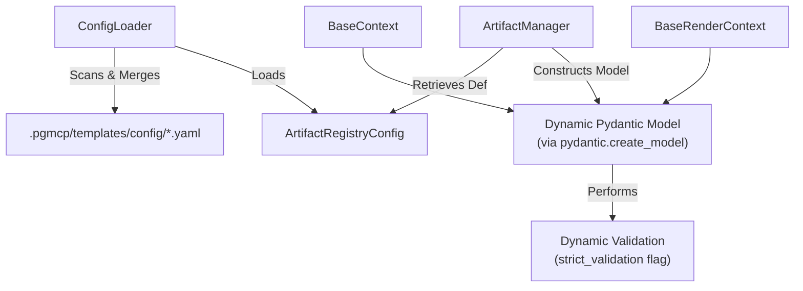
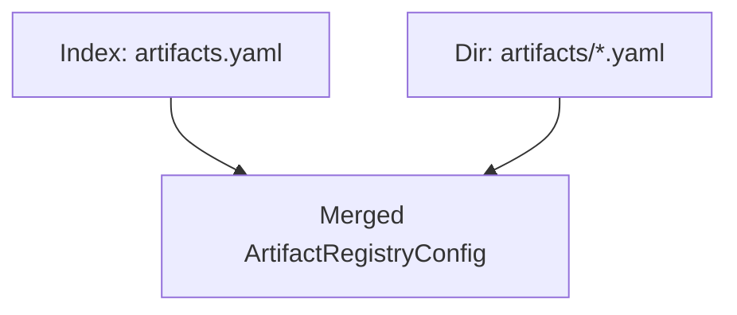
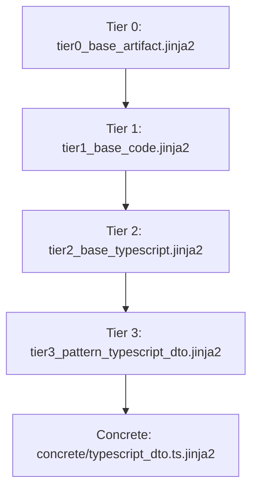

<!-- docs/development/schema-template-maintenance.md -->
<!-- template=reference version=349a0001 created=2026-02-18T22:17Z updated=2026-07-16 -->
# Scaffolding Architecture Guide

**Status:** DEFINITIVE  
**Version:** 3.0  
**Last Updated:** 2026-07-16  

**Source:** [mcp_server/config/schemas/](file:///C:/temp/pgmcp/mcp_server/config/schemas/) | [mcp_server/scaffolders/](file:///C:/temp/pgmcp/mcp_server/scaffolders/)  
**Tests:** [tests/mcp_server/unit/config/test_modular_loader.py](file:///C:/temp/pgmcp/tests/mcp_server/unit/config/test_modular_loader.py) | [tests/mcp_server/unit/managers/test_artifact_manager.py](file:///C:/temp/pgmcp/tests/mcp_server/unit/managers/test_artifact_manager.py)

---

## 1. Dynamic YAML Schema Validation

In the V3 scaffolding architecture, Python-based static context schema classes are completely eliminated (Clean Break strategy). The scaffolding trinity is resolved dynamically from modular YAML configurations and Jinja2 templates.



### 1.1. Dynamic Pydantic Model Generation
Instead of locating a static class in python modules, `ArtifactManager` parses the declarative `context_schema` within the artifact's YAML definition and builds a frozen Pydantic model at runtime using `pydantic.create_model`.

All dynamically generated models inherit from:
1. **`BaseContext`** (for caller-provided fields).
2. **`BaseRenderContext`** (inherits `LifecycleMixin` to enrich validation with system-managed fields).

### 1.2. Lifecycle Fields
The following system fields are injected dynamically during context enrichment and are never provided directly by the user:

| Field | Type | Description |
|---|---|---|
| `output_path` | `Path` | Target path where the artifact is written. |
| `scaffold_created` | `datetime` | UTC timestamp of artifact creation. |
| `template_id` | `str` | Unique template identifier. |
| `version_hash` | `str` | 8-character version hash representing template provenance. |

---

## 2. Modular Configuration Merging

The monolithic `artifacts.yaml` configuration is replaced by a modular structure. Config files are loaded dynamically from the `.pgmcp/templates/config/` directory and merged.



### 2.1. Merging & Validation Rules
- **Version Index**: The root `artifacts.yaml` serves as the version index (e.g. `version: 1.0.0`) and must not contain inline configurations.
- **Fail-Fast Loader**: `ConfigLoader` scans `.pgmcp/templates/config/` for all `.yaml` / `.yml` files. It parses each file and merges their definitions. If any file has invalid YAML syntax or invalid `SchemaFieldDef` structures, a `ConfigError` is raised immediately on startup.
- **Strict Validation Policies**: If `strict_validation` is set to `true` for a code artifact, any validation failure blocks the file write. For document artifacts, validation errors trigger warnings rather than failures.

---

## 3. Tiered Scaffolding Pipeline

The scaffolding pipeline uses Jinja2 template inheritance to ensure DRY compliance and decouple logic from presentation.

### 3.1. Template Tiers

| Tier | Description | Examples |
|---|---|---|
| **Tier 0** | Base templates (no dependencies) | `tier0_base_artifact.jinja2` |
| **Tier 1** | Templates with includes | `tier1_base_code.jinja2` / `tier1_base_document.jinja2` |
| **Tier 2** | Templates with inheritance | `tier2_base_python.jinja2` / `tier2_base_typescript.jinja2` |
| **Tier 3** | Templates with pattern macros | `tier3_pattern_*.jinja2` |
| **Concrete** | Artifact outputs | `concrete/*.jinja2` |

### 3.2. TypeScript DTO Tiered Case Study
To demonstrate language-agnostic extensibility, a tiered TypeScript DTO template inherits down the pipeline:



---

## 4. Developer Guide: Adding a New Artifact Type

To add a new template, follow these steps. **No Python code changes are required.**

### Step 1: Create the Modular Configuration
Create a new YAML file under `.pgmcp/templates/config/<type_id>.yaml`:
```yaml
type: code
type_id: my_artifact
name: My New Artifact
description: Generates a custom worker component
output_type: file
scaffolder_class: GenericScaffolder
scaffolder_module: mcp_server.scaffolders.generic_scaffolder
template_path: concrete/my_artifact.py.jinja2
file_extension: .py
strict_validation: true
base_path: src/workers/
context_schema:
  fields:
    field_name:
      type: string
      title: Field Name
      description: Name of the generated field
      required: true
state_machine:
  states:
    - CREATED
  initial_state: CREATED
  valid_transitions: []
```

### Step 2: Create the Jinja2 Template
Create the concrete Jinja2 template under `.pgmcp/templates/concrete/my_artifact.py.jinja2`. Use `` to hook into the tiered pipeline.

```jinja
{#- concrete/my_artifact.py.jinja2 -#}

```

---

## Version History

| Version | Date | Author | Changes |
|---------|------|--------|---------|
| 3.0 | 2026-07-16 | Agent | Complete rewrite: repurposed to Scaffolding Architecture Guide for Issue #349. Documented modular YAML config loader and dynamic validation model. |
| 2.0 | 2026-06-26 | Agent | Refactored V2 scaffolding pipeline terminology to neutral schema-based naming |
| 1.0 | 2026-02-18 | Agent | Initial draft |

## Strict Version Pairing
Configuration files loaded by the system must specify a `template_version`. The system centrally validates this version against the `{#- Version: X.Y.Z -#}` header in the corresponding Jinja2 template. A major version mismatch will trigger a strict fail-fast error, preventing invalid templating results.
