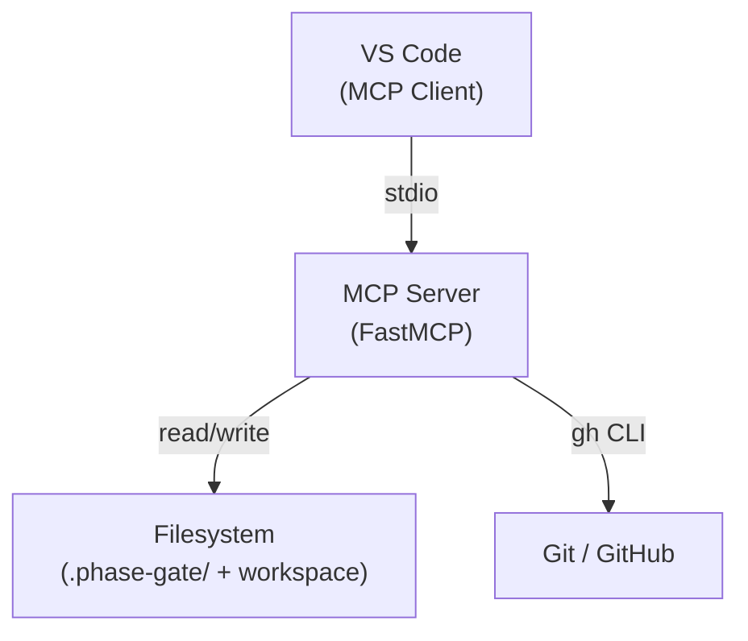
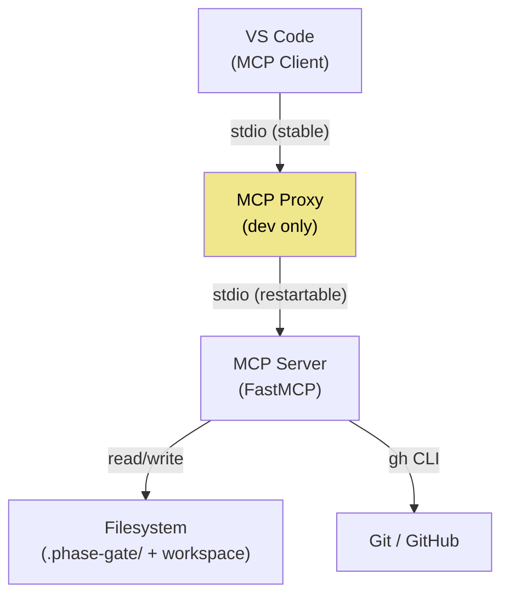

<!-- docs/mcp_server/architectural_diagrams/00_system_context.md -->
<!-- template=architecture version=8b924f78 created=2026-03-13T19:05Z updated=2026-03-13 -->
# System Context

**Status:** DRAFT
**Version:** 1.0
**Last Updated:** 2026-03-13

---

## Purpose

Show the MCP Server as a black box within its environment: which external actors communicate
with it and through which channels. Two runtime variants exist — production and local development.

## Scope

**In Scope:** External actors, communication channels, runtime context (production vs. development)

**Out of Scope:** Internal component structure (see 01_module_decomposition.md and further)

---

## 1. Production Context

In production, VS Code communicates directly with the MCP Server over stdio. The server reads
and writes to the filesystem (`.phase-gate/` state files and workspace files) and calls GitHub via
the `gh` CLI. There is no HTTP layer — stdio is the only entry point into the server.

---

## 2. Development Context (with Proxy)

During local development a transparent restart proxy (`MCPProxy`) sits between VS Code and the
server. VS Code maintains a stable stdio connection to the proxy; the proxy can restart the MCP
Server process without requiring VS Code to reconnect. The yellow node marks the dev-only
component — see `07_dev_infrastructure.md` for the restart flow.

All tool calls pass through the proxy transparently. The only observable effect is a ~2.3 s
restart latency when `restart_server` is invoked.

---

## Constraints & Decisions

| Decision | Rationale | Alternatives Rejected |
|----------|-----------|----------------------|
| stdio as transport | MCP standard; no network configuration required | HTTP/SSE transport (more overhead, unnecessary for local use) |
| Proxy in dev only | Hot-restart without VS Code reconnect; production has availability risk via `restart_server` | Proxy always active (increases attack surface) |

---

## Related Documentation

- **[docs/mcp_server/architectural_diagrams/01_module_decomposition.md][related-1]**
- **[docs/reference/mcp/proxy_restart.md][related-2]**

[related-1]: docs/mcp_server/architectural_diagrams/01_module_decomposition.md
[related-2]: docs/reference/mcp/proxy_restart.md

---

## Version History

| Version | Date | Author | Changes |
|---------|------|--------|---------|
| 1.0 | 2026-03-13 | Agent | Initial draft |
