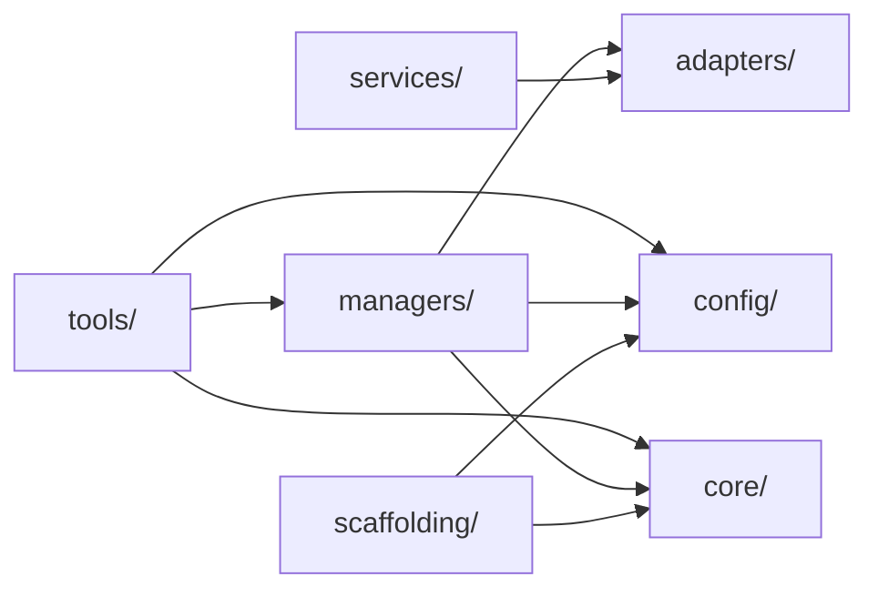

<!-- docs/mcp_server/architectural_diagrams/01_module_decomposition.md -->
<!-- template=architecture version=8b924f78 created=2026-03-13T19:05Z updated=2026-03-13 -->
# Module Decomposition

**Status:** DRAFT
**Version:** 1.1
**Last Updated:** 2026-03-13

---

## Purpose

Show the internal module layout of the MCP Server, the allowed dependency directions
between modules, and the key classes inside each module.

## Scope

**In Scope:** Top-level modules, their responsibilities, primary classes, and dependency direction

**Out of Scope:** Class implementation detail (see 02–05 and 09–10), external actors (see 00)

---

## 1. Module Map

The diagram below keeps one node per module. Arrows show allowed import directions —
dependencies flow inward. `tools/` is the only public interface exposed to MCP clients.

---

## 2. Module Responsibilities

| Module | Files | Primary Responsibility |
|--------|-------|------------------------|
| `tools/` | 22 | MCP tool implementations (ICoreTool implementations) |
| `managers/` | 10 | Domain logic: phase state, git, GitHub, QA, artifacts |
| `adapters/` | 3 | External system isolation: filesystem, git CLI, GitHub API |
| `config/` | 16 | Pydantic settings and workflow definitions |
| `core/` | 8 | Shared infrastructure: exceptions, logging, proxy, interfaces |
| `services/` | 2 | Document indexing and search |
| `scaffolding/` | 7+ | Jinja2 template engine and artifact scaffolding |

---

## 3. Managers — Classes and Tool Consumers

Each manager has one primary responsibility. The "Used by" column lists the tool files
that import the manager directly.

| File | Primary Class | Responsibility | Used by (tools/) |
|------|--------------|----------------|-----------------|
| `phase_state_engine.py` | `PhaseStateEngine` | Branch state machine, phase transitions, on_exit hooks | `phase_tools`, `project_tools`, `discovery_tools`, `git_tools`* |
| `state_repository.py` | `FileStateRepository` | Load/save `.phase-gate/state.json` | via PSE only |
| `phase_contract_resolver.py` | `PhaseContractResolver` | Resolve `phase_contracts.yaml` → `CheckSpec` list | `git_tools` (commit-type only) |
| `deliverable_checker.py` | `DeliverableChecker` | Run `CheckSpec` file-exists checks | `cycle_tools` (direct), via PSE (internal) |
| `enforcement_runner.py` | `EnforcementRunner` | Pre/post hook dispatch from `enforcement.yaml` | via server (wraps all tools) |
| `git_manager.py` | `GitManager` | Git CLI operations (commit, branch, push, etc.) | `git_tools`, `git_fetch_tool`, `git_pull_tool`, `git_analysis_tools`, `project_tools`, `cycle_tools`, `discovery_tools` |
| `github_manager.py` | `GitHubManager` | GitHub API (issues, labels, milestones, PRs) | `issue_tools`, `label_tools`, `milestone_tools`, `pr_tools`, `discovery_tools` |
| `project_manager.py` | `ProjectManager` | Workflow init, project plan, phase orchestration | `project_tools`, `phase_tools`, `discovery_tools` |
| `qa_manager.py` | `QAManager` | Run ruff/mypy/pylint, quality gate results | `quality_tools`, `validation_tools` |
| `artifact_manager.py` | `ArtifactManager` | Template scaffolding pipeline (context → Jinja2 → file) | `scaffold_artifact` |

*`git_tools` instantiates PSE directly as a third instantiation route (see 04).

---

## 4. Services — Classes and Tool Consumers

| File | Class | Responsibility | Used by |
|------|-------|----------------|---------|
| `document_indexer.py` | `DocumentIndexer` | Indexes workspace docs into searchable structure | `SearchService` |
| `search_service.py` | `SearchService` | Full-text search over indexed documents | `discovery_tools` (`search_documentation`) |

---

## Constraints & Decisions

| Decision | Rationale | Alternatives Rejected |
|----------|-----------|----------------------|
| No circular imports | Clean layering; each layer tests independently | Bidirectional imports (creates tight coupling) |
| `config/` isolates settings | Managers receive config via constructor injection, not global imports | Global settings singleton (hard to test) |

---

## Related Documentation

- **[docs/mcp_server/architectural_diagrams/00_system_context.md][related-1]**
- **[docs/mcp_server/architectural_diagrams/02_workflow_state_subsystem.md][related-2]**
- **[docs/mcp_server/architectural_diagrams/09_scaffolding_subsystem.md][related-3]**
- **[docs/mcp_server/architectural_diagrams/10_config_consumers.md][related-4]**

[related-1]: docs/mcp_server/architectural_diagrams/00_system_context.md
[related-2]: docs/mcp_server/architectural_diagrams/02_workflow_state_subsystem.md
[related-3]: docs/mcp_server/architectural_diagrams/09_scaffolding_subsystem.md
[related-4]: docs/mcp_server/architectural_diagrams/10_config_consumers.md

---

## Version History

| Version | Date | Author | Changes |
|---------|------|--------|---------|
| 1.1 | 2026-03-13 | Agent | Added managers table, services table, simplified diagram |
| 1.0 | 2026-03-13 | Agent | Initial draft |
