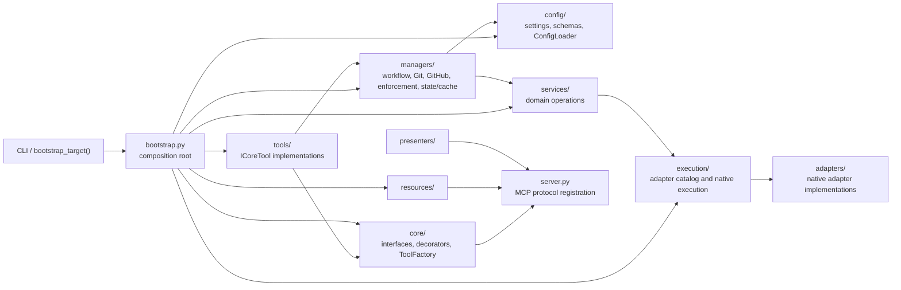

<!-- docs/manuals/architectural_diagrams/01_module_decomposition.md -->
<!-- template=architecture -->
# Module Decomposition

**Status:** Current architecture overview

## Purpose and scope

This diagram summarizes the active V3 runtime responsibilities and dependency direction. It is a boundary overview, not a complete package, class, or tool inventory. The target composition root is `mcp_server/bootstrap.py`; the CLI enters it through `ServerBootstrapper.bootstrap_target()`.

## 1. Runtime responsibility map

```mermaid
graph LR
    CLI["CLI / bootstrap_target()"]
    Bootstrap["bootstrap.py<br/>composition root"]
    Config["config/<br/>settings, schemas, ConfigLoader"]
    Managers["managers/<br/>workflow, Git, GitHub, enforcement, state/cache"]
    Services["services/<br/>domain operations"]
    Execution["execution/<br/>adapter catalog and native execution"]
    Adapters["adapters/<br/>native adapter implementations"]
    Tools["tools/<br/>ICoreTool implementations"]
    Core["core/<br/>interfaces, decorators, ToolFactory"]
    Server["server.py<br/>MCP protocol registration"]
    Resources["resources/"]
    Presenters["presenters/"]

    CLI --> Bootstrap
    Bootstrap --> Config
    Bootstrap --> Managers
    Bootstrap --> Services
    Bootstrap --> Execution
    Bootstrap --> Tools
    Bootstrap --> Resources
    Managers --> Config
    Managers --> Services
    Services --> Execution
    Execution --> Adapters
    Tools --> Core
    Tools --> Managers
    Bootstrap --> Core
    Core --> Server
    Resources --> Server
    Presenters --> Server
```

The graph shows the main composition path, not every permitted import. Bootstrap loads validated configuration, builds manager/service and execution dependencies, assembles supported and active tools, wraps active tools, and creates the MCP server with its resources and presenter.

## 2. Ownership boundaries

| Boundary | Responsibility |
|---|---|
| `config/` | Environment-backed runtime settings, typed workspace declarations, and template/config loading |
| `bootstrap.py` | Runtime composition: `ConfigLayer`, `ManagerGraph`, `ToolAssembly`, tool wrappers, resources, and server |
| `managers/` | Workflow/state, Git and GitHub operations, enforcement, and runtime caches |
| `services/` | Focused domain operations composed by bootstrap or managers |
| `execution/` and `adapters/` | Adapter discovery/trust, native process execution, and adapter implementations |
| `tools/` | Typed MCP-facing operations implementing `ICoreTool` |
| `core/`, `server.py` | Core tool contracts/wrappers and MCP protocol handlers |
| `resources/`, `presenters/` | Resource reads and presentation of server/tool results |

Configuration selects declared operations and policy; it does not install or probe native dependencies. Template package identity and content belong to the resolved template suite and its manifests, not to a duplicated diagram inventory.

## Related diagrams and references

- [Workflow state subsystem](02_workflow_state_subsystem.md)
- [Scaffolding subsystem](09_scaffolding_subsystem.md)
- [Configuration consumers](10_config_consumers.md)
- [Configuration and template loading](../../reference/config-loading-architecture.md)
