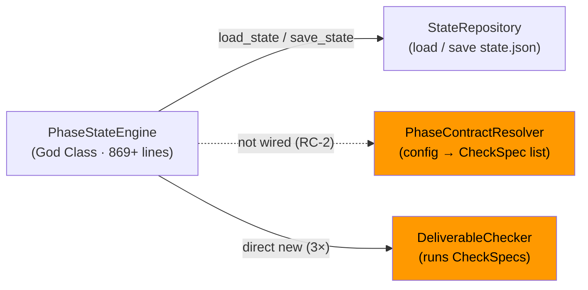
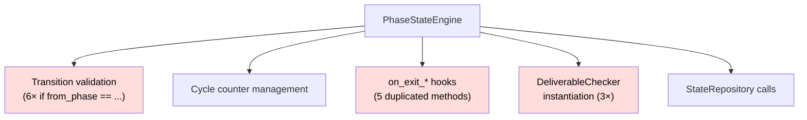

<!-- docs/mcp_server/architectural_diagrams/02_workflow_state_subsystem.md -->
<!-- template=architecture version=8b924f78 created=2026-03-13T19:05Z updated=2026-03-13 -->
# Workflow State Subsystem

**Status:** DRAFT
**Version:** 1.0
**Last Updated:** 2026-03-13

---

## Purpose

Show the four core components of the workflow-state subsystem, their relationships, and the
integration gap between the built components and their actual wiring.

## Scope

**In Scope:** PhaseStateEngine, StateRepository, PhaseContractResolver, DeliverableChecker and
their mutual relationships

**Out of Scope:** Tool layer on top of PSE (see 03), config layer (see 05)

---

## 1. Component Relationships

Four components form the workflow-state subsystem. Solid arrows represent active, wired
relationships. The dashed arrows mark the integration gap (RC-2): `PhaseContractResolver` and
`DeliverableChecker` were built as proper SRP components but are not yet connected to
`PhaseStateEngine` via dependency injection. Orange nodes indicate components affected by the gap.

---

## 2. PhaseStateEngine Internals (God Class)

`PhaseStateEngine` currently holds five distinct responsibilities in a single class. This
diagram shows what it does and which responsibilities should be extracted.

Red nodes indicate code that violates OCP, DRY, or DIP and should be refactored.

---

## Constraints & Decisions

| Decision | Rationale | Alternatives Rejected |
|----------|-----------|----------------------|
| StateRepository encapsulates all state I/O | Single place for `.phase-gate/state.json` read/write; tools and managers must not bypass it | Direct JSON file access from tools |
| PCR and DeliverableChecker as SRP components | Each has one reason to change; enables independent testing | Inlining both into PSE (already the current debt) |

---

## Known Architectural Issues

| ID | Component | Issue | Severity |
|----|-----------|-------|----------|
| RC-2 | PCR | Built and tested but not wired into PSE exit-hooks | High |
| RC-2 | DeliverableChecker | Instantiated directly 3× inside PSE instead of injected | High |
| A-02 | StateRepository | `cycle_tools.py` calls `state_engine._save_state()` — private method called from outside | Medium |
| Gap-3 | PSE | 6× `if from_phase ==` chains — OCP violation | Medium |
| Gap-4 | PSE | 5× duplicated `on_exit_*_phase` methods — DRY violation | Medium |
| Gap-5 | PSE | `logger.info(f"...")` throughout — f-string logging anti-pattern | Low |

---

## Related Documentation

- **[docs/mcp_server/architectural_diagrams/01_module_decomposition.md][related-1]**
- **[docs/mcp_server/architectural_diagrams/03_tool_layer.md][related-2]**
- **[docs/development/issue257/GAP_ANALYSE_ISSUE257.md][related-3]**

[related-1]: docs/mcp_server/architectural_diagrams/01_module_decomposition.md
[related-2]: docs/mcp_server/architectural_diagrams/03_tool_layer.md
[related-3]: docs/development/issue257/GAP_ANALYSE_ISSUE257.md

---

## Version History

| Version | Date | Author | Changes |
|---------|------|--------|---------|
| 1.0 | 2026-03-13 | Agent | Initial draft |
