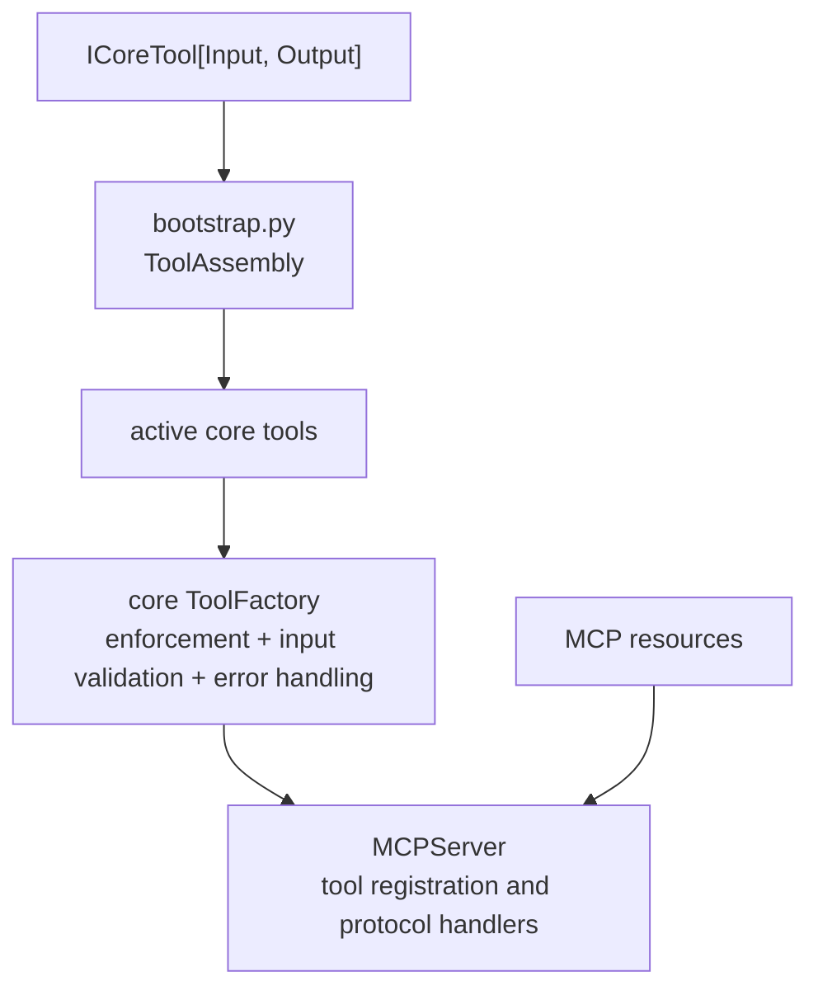

<!-- docs/manuals/architectural_diagrams/03_tool_layer.md -->
<!-- template=architecture -->
# Tool Layer

**Status:** Current architecture overview

## Purpose and scope

This page describes the MCP tool boundary and how the active runtime composes it. It does not enumerate every tool, schema, or policy row; those contracts belong to the tools, their schemas, and configuration owners.

## 1. Core tool and runtime composition

Each core tool implements the generic `ICoreTool[Input, Output]` contract. The target composition root constructs the supported set and its settings-dependent active subset in `ToolAssembly`. The assembly validates unique names, derives output contracts, and requires every active tool to be among the supported tools.

The assembly is explicit in `ServerBootstrapper.bootstrap_target()`. The core `ToolFactory` wraps each active core tool with enforcement, input validation, and error handling before `MCPServer` registers it. Resources are composed separately from tools.

## 2. Functional tool boundaries

The current target contains several functional groups rather than one quality-gate runner:

- Workflow, project, Git, GitHub, health, and administration tools implement their respective user-facing operations.
- `run_checks` selects configured checks; `run_tests` runs configured test bindings; `apply_fixes` applies configured fixes through the execution boundary.
- Scaffold and safe-edit tools use the resolved template catalog and mutation operations.
- Discovery tools expose work context; they do not define a second inventory or schema authority.

The tool classes define public names and request/response models. Workspace configuration selects named operations and policy; native adapter settings and executable behavior remain adapter-owned.

## 3. Related diagrams and references

- [Workflow state subsystem](02_workflow_state_subsystem.md)
- [Enforcement layer](04_enforcement_layer.md)
- [Naming landscape](08_naming_landscape.md)
- [Tool reference index](../../reference/tools/README.md)
