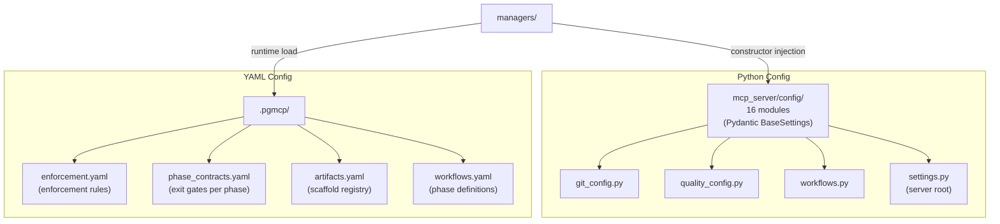

<!-- docs/mcp_server/architectural_diagrams/05_config_layer.md -->
<!-- template=architecture version=8b924f78 created=2026-03-13T19:06Z updated=2026-03-13 -->
# Config Layer

**Status:** DRAFT
**Version:** 1.0
**Last Updated:** 2026-03-13

---

## Purpose

Show the config layer: which configuration files exist, where they live, and which components
load them.

## Scope

**In Scope:** `mcp_server/config/` Python modules, `.pgmcp/` YAML files, load relationships

**Out of Scope:** Pydantic schema detail, template system (`scaffolding/`)

---

## 1. Two Config Domains

Two distinct configuration domains exist side by side. The Python domain contains stable
server-wide settings; the YAML domain contains per-project, per-branch configuration that
changes without server restarts.

Changes to `.pgmcp/` YAML files take effect without a server restart. Changes to
`mcp_server/config/` require a restart (or `restart_server` in dev).

---

## 2. Load Relationships

| Consumer | Loads from Python config | Loads from YAML |
|----------|--------------------------|-----------------|
| `PhaseStateEngine` | `WorkflowsConfig` | `phase_contracts.yaml`, `workflows.yaml` |
| `EnforcementRunner` | — | `enforcement.yaml` |
| `ArtifactManager` | `ArtifactRegistryConfig` | `artifacts.yaml` |
| `ProjectManager` | `ProjectStructureConfig` | `workflows.yaml` |
| `GitManager` | `GitConfig` | — |
| `QAManager` | `QualityConfig` | — |

---

## Constraints & Decisions

| Decision | Rationale | Alternatives Rejected |
|----------|-----------|----------------------|
| Two config domains intentionally separated | Python config for deployment settings; YAML for project behaviour | Single YAML for everything (loses type-safety) |
| Constructor injection for Python config | Managers are testable without global state | `from mcp_server.config import settings` everywhere |

---

## Known Architectural Issues

| ID | Component | Issue | Severity |
|----|-----------|-------|----------|
| RC-6 | `phase_contracts.yaml` | Hardcoded `docs/development/issue257/planning.md` and `design.md` — works only for issue #257, breaks for every other branch | High |

---

## Related Documentation

- **[02_workflow_state_subsystem.md][related-1]**
- **[04_enforcement_layer.md][related-2]**

[related-1]: 02_workflow_state_subsystem.md
[related-2]: 04_enforcement_layer.md
---

## Version History

| 1.1 | 2026-07-08 | Agent | Reconcile `.phase-gate` with `.pgmcp` and fix relative links (#420) |
| 1.0 | 2026-03-13 | Agent | Initial draft |
