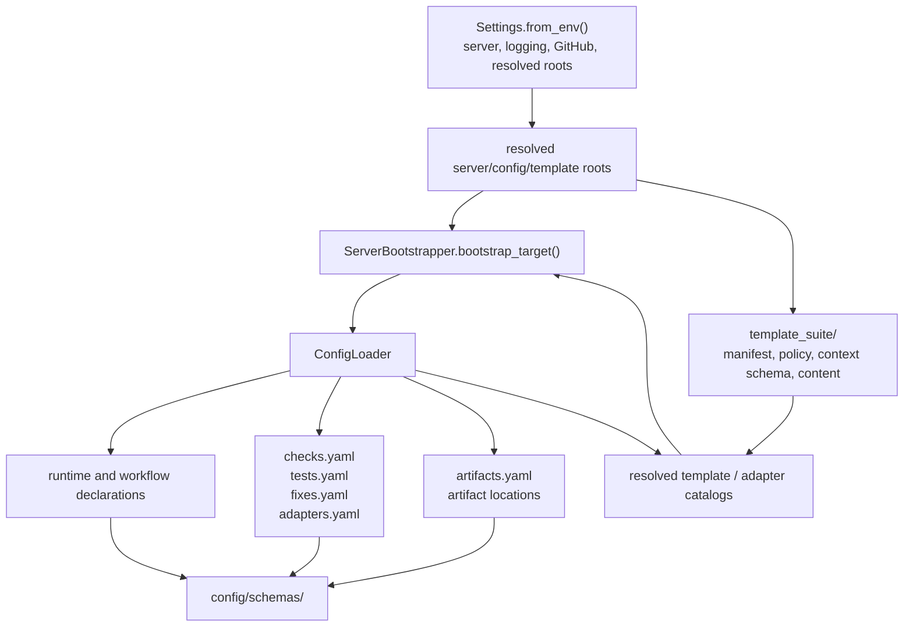

<!-- docs/manuals/architectural_diagrams/05_config_layer.md -->
<!-- template=architecture -->
# Configuration Layer

**Status:** Current architecture overview

## Purpose and scope

Configuration has distinct runtime, workspace-declaration, and template-package owners. This diagram describes how the active V3 bootstrap selects them; the schemas and manifests remain the field-level authority.

## 1. Configuration ownership and loading

```mermaid
graph TD
    Settings["Settings.from_env()<br/>server, logging, GitHub, resolved roots"]
    Root["resolved server/config/template roots"]
    Bootstrap["ServerBootstrapper.bootstrap_target()"]
    Loader["ConfigLoader"]
    Runtime["runtime and workflow declarations"]
    ExecutionConfig["checks.yaml<br/>tests.yaml<br/>fixes.yaml<br/>adapters.yaml"]
    ArtifactConfig["artifacts.yaml<br/>artifact locations"]
    Templates["template_suite/<br/>manifest, policy, context schema, content"]
    Schemas["config/schemas/"]
    Catalog["resolved template / adapter catalogs"]

    Settings --> Root
    Root --> Bootstrap
    Bootstrap --> Loader
    Loader --> Runtime
    Loader --> ExecutionConfig
    Loader --> ArtifactConfig
    Runtime --> Schemas
    ExecutionConfig --> Schemas
    ArtifactConfig --> Schemas
    Root --> Templates
    Templates --> Catalog
    Loader --> Catalog
    Catalog --> Bootstrap
```

`Settings.from_env()` owns deployment settings and root resolution. Bootstrap passes the selected configuration and template roots to `ConfigLoader`. The loader validates workspace declarations against typed schemas. Template manifests and package files define scaffold package identity, policy, context schema, and content; discovery and resolution build the runtime catalogs.

## 2. Change and authority boundaries

| Input | Owner and effect |
|---|---|
| Environment and optional settings overlay | Runtime settings and resolved roots, owned by the settings models |
| Workspace YAML declarations | Workflow/lifecycle policy and named check, test, fix, adapter-trust, and artifact-location choices; validated by `ConfigLoader` and schemas |
| Native executable settings | Native tool/adapter owner; PGMCP declarations do not install or probe executables |
| Template package files | Manifest-defined package identity, policy, schema, and rendered content |

These inputs are loaded during target startup; editing YAML does not imply hot reload. Existing workspace configuration remains owner-controlled. V3 uses explicit configuration roots and does not activate legacy `quality.yaml` or `QualityConfig` as a generic parser or runtime authority.

## Related diagrams and references

- [Workflow state subsystem](02_workflow_state_subsystem.md)
- [Enforcement layer](04_enforcement_layer.md)
- [Configuration consumers](10_config_consumers.md)
- [Configuration and template loading](../../reference/config-loading-architecture.md)
