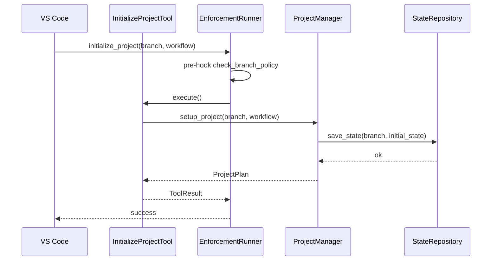
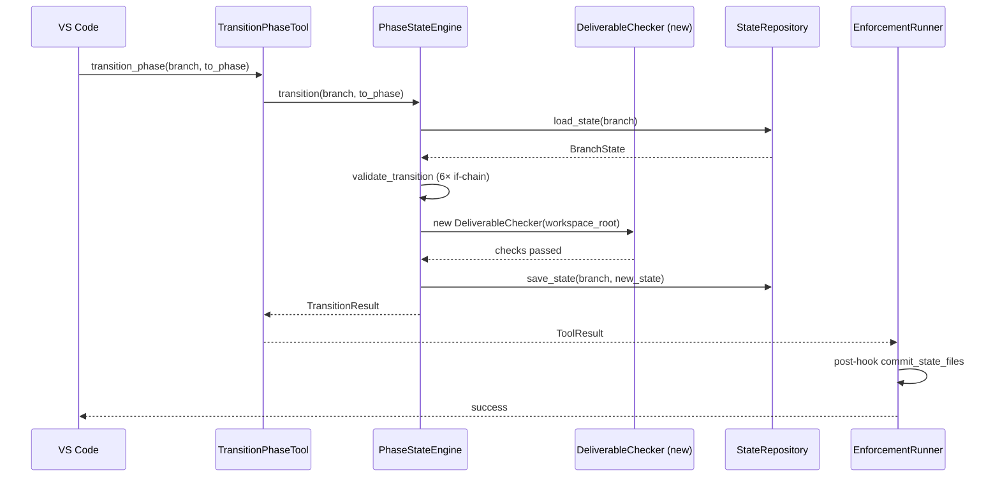
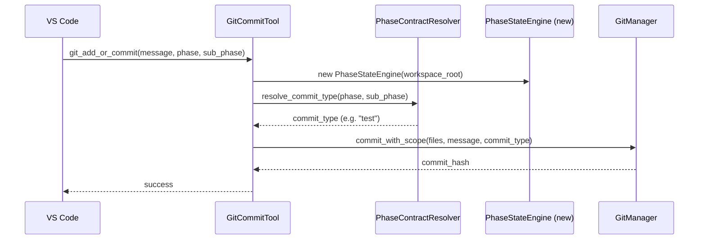

<!-- docs/mcp_server/architectural_diagrams/06_runtime_flows.md -->
<!-- template=architecture version=8b924f78 created=2026-03-13T19:06Z updated=2026-03-13 -->
# Runtime Flows

**Status:** DRAFT
**Version:** 1.0
**Last Updated:** 2026-03-13

---

## Purpose

Show three critical runtime flows as sequence diagrams: `initialize_branch`,
`transition_phase`, and `git_add_or_commit`.

## Scope

**In Scope:** Three runtime flows at sequence level

**Out of Scope:** All other flows, detailed error paths

---

## 1. Flow: `initialize_branch`

`InitializeProjectTool` sets up the initial branch state in `.phase-gate/state.json`. The
`EnforcementRunner` pre-hook runs `check_branch_policy` before the tool executes.

---

## 2. Flow: `transition_phase`

`TransitionPhaseTool` delegates to `PhaseStateEngine`. The PSE runs `on_exit_*` hooks
(which currently instantiate `DeliverableChecker` directly). After the tool completes,
the `EnforcementRunner` post-hook auto-commits `.phase-gate/state.json`.

The `new DeliverableChecker(...)` call in the middle is the DIP violation (RC-2).

---

## 3. Flow: `git_add_or_commit`

`GitCommitTool` resolves the commit type via `PhaseContractResolver` (the only productive
use of PCR today), then delegates to `GitManager`. Note the third PSE instantiation route.

The `new PhaseStateEngine(...)` on line 2 is the third instantiation route (see 04).

---

## Constraints & Decisions

| Decision | Rationale | Alternatives Rejected |
|----------|-----------|----------------------|
| EnforcementRunner wraps tool execute | Tools are unaware of pre/post logic | Each tool calls enforcement manually |
| PCR for commit-type resolution | Only productive integration of PCR in the current codebase | Hardcoded commit-type map in GitCommitTool |

---

## Known Architectural Issues

| ID | Component | Issue | Severity |
|----|-----------|-------|----------|
| RC-2 | `transition_phase` flow | `DeliverableChecker` instantiated directly inside PSE instead of injected | High |
| RC-7 | `git_add_or_commit` flow | Third `PhaseStateEngine` instantiation route in `GitCommitTool` | Medium |

---

## Related Documentation

- **[docs/mcp_server/architectural_diagrams/02_workflow_state_subsystem.md][related-1]**
- **[docs/mcp_server/architectural_diagrams/04_enforcement_layer.md][related-2]**

[related-1]: docs/mcp_server/architectural_diagrams/02_workflow_state_subsystem.md
[related-2]: docs/mcp_server/architectural_diagrams/04_enforcement_layer.md

---

## Version History

| Version | Date | Author | Changes |
|---------|------|--------|---------|
| 1.0 | 2026-03-13 | Agent | Initial draft |
