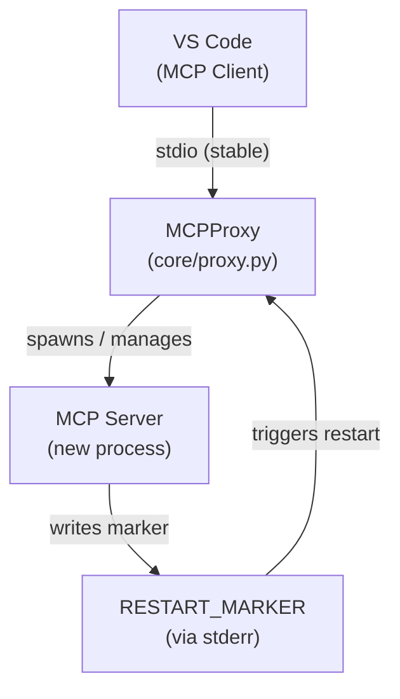
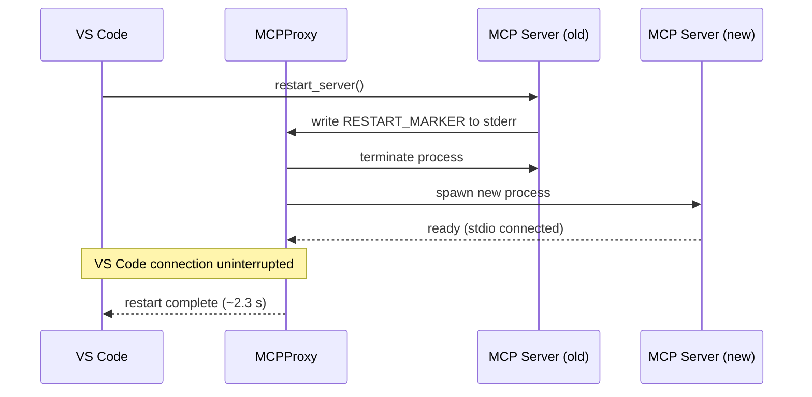

<!-- docs/mcp_server/architectural_diagrams/07_dev_infrastructure.md -->
<!-- template=architecture version=8b924f78 created=2026-03-13T19:06Z updated=2026-03-13 -->
# Dev Infrastructure

**Status:** DRAFT
**Version:** 1.0
**Last Updated:** 2026-03-13

---

## Purpose

Show the development infrastructure: the hot-restart proxy, its restart flow, and the
recommended dev/production boundary.

## Scope

**In Scope:** `MCPProxy`, `restart_server` tool, restart flow, dev/prod boundary

**Out of Scope:** Production deployment (proxy not present)

---

## 1. Proxy Architecture

`MCPProxy` maintains a stable stdio connection to VS Code while managing the MCP Server
process lifecycle. When the server needs to restart (e.g. after code changes), the proxy
terminates the old process and spawns a new one without dropping the VS Code connection.

`RESTART_MARKER = "__MCP_RESTART_REQUEST__"` is written to stderr by the `restart_server`
tool. The proxy monitors stderr and triggers a process restart on detection.

---

## 2. Restart Sequence

The restart completes in approximately 2.3 s. Wait at least 3 s before calling the next
tool after a `restart_server` invocation.

---

## 3. Dev / Production Boundary

The proxy and `restart_server` tool are classified as **development-only**. In production
the proxy is not present and `restart_server` must not be exposed.

| Component | Dev | Production | Risk if used in prod |
|-----------|-----|------------|---------------------|
| `core/proxy.py` | ✅ Active | ❌ Not present | Adds unnecessary process layer |
| `admin_tools.py` `restart_server` | ✅ Active | ❌ Must be removed | Any MCP client can crash the server |

**Recommendation:** move `proxy.py` and `restart_server` to a `mcp_server/dev/` module to
make the boundary explicit in the project structure.

---

## Constraints & Decisions

| Decision | Rationale | Alternatives Rejected |
|----------|-----------|----------------------|
| Proxy as separate process layer | VS Code need not reconnect after server restart | Restart via OS signal (VS Code loses connection) |
| `RESTART_MARKER` via stderr | No extra communication channel needed; proxy already monitors stderr | Named pipe or socket (more infrastructure) |

---

## Related Documentation

- **[docs/mcp_server/architectural_diagrams/00_system_context.md][related-1]**
- **[docs/reference/mcp/proxy_restart.md][related-2]**

[related-1]: docs/mcp_server/architectural_diagrams/00_system_context.md
[related-2]: docs/reference/mcp/proxy_restart.md

---

## Version History

| Version | Date | Author | Changes |
|---------|------|--------|---------|
| 1.0 | 2026-03-13 | Agent | Initial draft |
