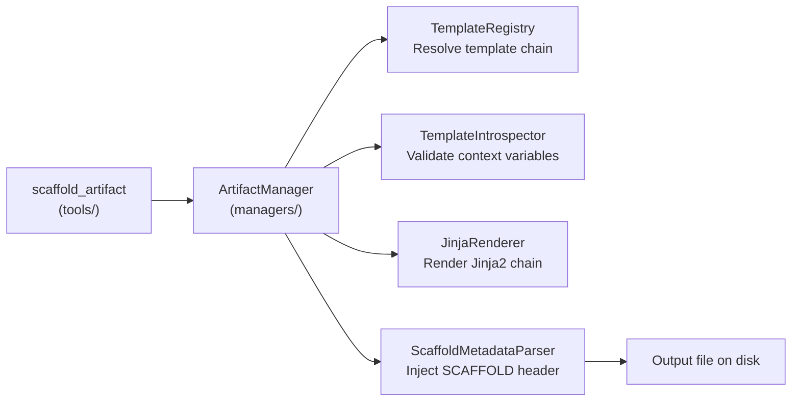
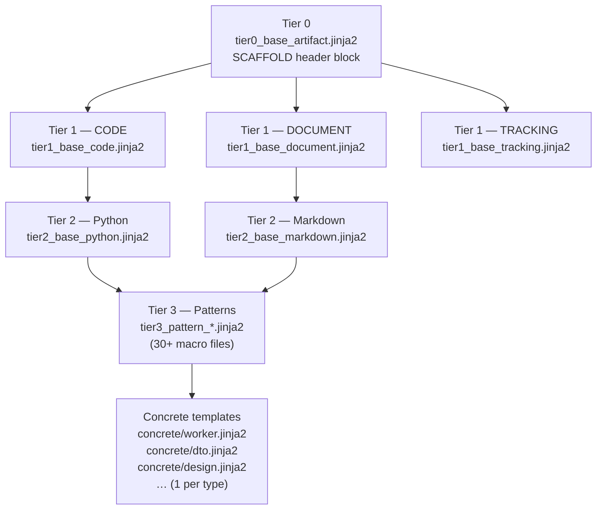

# Scaffolding Subsystem
<!-- template=architecture version=8b924f78 created=2026-03-13T19:20Z updated=2026-03-13 -->

**Status:** DRAFT
**Version:** 1.0
**Last Updated:** 2026-03-13

---

## Purpose

Document the internal architecture of the scaffolding subsystem: how an incoming
`scaffold_artifact` tool call is transformed into a rendered file on disk using
Jinja2 template inheritance.

## Scope

**In Scope:** `managers/artifact_manager.py`, `scaffolding/`, template hierarchy, component scaffolders, metadata injection

**Out of Scope:** Config layer (see 10), tool-layer entry point (see 03), runtime flows (see 06)

---

## 1. Pipeline Overview

Every `scaffold_artifact` call follows a single path through five stages.



`ArtifactManager` is the single orchestrator. All other scaffolding classes are called exclusively through it.

---

## 2. Source Directory Layout

```
mcp_server/
├── managers/
│   └── artifact_manager.py   ← Entry point / orchestrator
└── scaffolding/
    ├── base.py                ← BaseScaffolder, ComponentScaffolder (Protocol), ScaffoldResult
    ├── renderer.py            ← JinjaRenderer
    ├── template_registry.py   ← TemplateRegistry (version hash → tier chain)
    ├── template_introspector.py ← TemplateIntrospector, TemplateSchema
    ├── metadata.py            ← ScaffoldMetadataParser
    ├── utils.py               ← Path helpers
    ├── version_hash.py        ← Deterministic version computation
    └── components/            ← 11 concrete ComponentScaffolder implementations
        ├── adapter.py         worker.py
        ├── doc.py             tool.py
        ├── dto.py             test.py
        ├── generic.py         service.py
        ├── interface.py       schema.py
        └── resource.py

*Note: Template files are stored outside the package in the Git-tracked workspace root under `.pgmcp/templates/`.*

---

## 3. Template Tier Hierarchy

Templates inherit using Jinja2 `` — a concrete template only overrides
the blocks it needs; all shared structure comes from parent tiers.



---

## 4. Component Scaffolders

Each file in `scaffolding/components/` implements the `ComponentScaffolder` Protocol.
The scaffolder defines the `artifact_type`, the required context keys, and any
file-naming conventions for the output and its companion test file.

| Scaffolder file | Artifact type(s) | Language | Notes |
|-----------------|-----------------|----------|-------|
| `adapter.py` | `adapter` | Python | Generates `adapters/` impl + test |
| `doc.py` | `doc` | Markdown | Generic markdown document |
| `dto.py` | `dto` | Python | Data-only class + test |
| `generic.py` | `generic` | Python/MD | Fallback when no specific type matches |
| `interface.py` | `interface` | Python | Abstract base / Protocol |
| `resource.py` | `resource` | Python | MCP resource handler |
| `schema.py` | `schema` | Python | Pydantic model |
| `service.py` | `service` | Python | Service class + test |
| `test.py` | `test` | Python | Standalone test file |
| `tool.py` | `tool` | Python | MCP tool implementation |
| `worker.py` | `worker` | Python | Worker class + test |

Document artifacts (design, architecture, planning, research, tracking) are handled
via `doc.py` with differing context schemas.

---

## 5. SCAFFOLD Header

Every file artifact carries a compact provenance comment at the top (line 1–2):

```python
# path/to/generated_file.py
# template=worker version=a3f9b21c created=2026-03-13T10:00Z updated=
```

Ephemeral artifacts (issue body, tracking) use an HTML comment instead:
```html
<!-- template=tracking version=a3f9b21c -->
```

The `ScaffoldMetadataParser` reads existing headers during re-scaffolding to
detect drift and preserve `created` timestamps.

---

## Known Architectural Issues

| ID | Severity | Description |
|----|----------|-------------|
| SC-1 | Medium | `ArtifactManager` instantiates the scaffolding classes directly rather than receiving them via DI, making unit testing harder |
| SC-2 | Low | No public API for listing available artifact types; callers must read `.pgmcp/templates/config.yaml` directly |
| SC-3 | Low | `generic.py` scaffolder acts as catch-all but has no strict schema — context errors surface only at render time |

---

## Constraints & Decisions

| Decision | Rationale | Alternatives Rejected |
|----------|-----------|----------------------|
| 4-tier template inheritance | Zero duplication across 35+ templates; change once in tier propagates everywhere | Flat templates per artifact (massive duplication) |
| `ArtifactManager` as single entry point | One place to add validation, logging, metadata | Direct JinjaRenderer calls in tools (bypasses metadata) |
| Version hash on concrete template | Detect template drift between generation runs | Git hash of file (breaks on checkout, env-dependent) |

---

## Related Documentation

- **[docs/mcp_server/architectural_diagrams/01_module_decomposition.md][related-1]**
- **[docs/mcp_server/architectural_diagrams/03_tool_layer.md][related-2]**
- **[docs/mcp_server/architectural_diagrams/10_config_consumers.md][related-3]**

[related-1]: docs/mcp_server/architectural_diagrams/01_module_decomposition.md
[related-2]: docs/mcp_server/architectural_diagrams/03_tool_layer.md
[related-3]: docs/mcp_server/architectural_diagrams/10_config_consumers.md

---

## Version History

| 1.1 | 2026-07-08 | Agent | Update template paths to Git-tracked `.pgmcp/templates` outside python package (#420) |
| 1.0 | 2026-03-13 | Agent | Initial draft — full scaffolding subsystem documentation |
