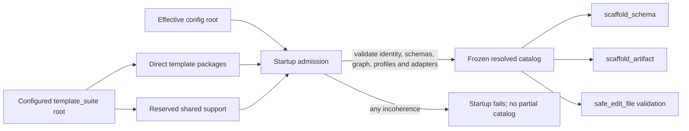

<!-- docs/manuals/architectural_diagrams/09_scaffolding_subsystem.md -->
# Scaffolding Subsystem

**Status:** Current runtime overview; exact contracts remain in the linked design and tool schemas.
**Last Updated:** 2026-09-24

## Purpose and boundary

Describe how the installed server admits a template suite at startup and serves generic
schema discovery, scaffolding, and refinement operations. This is a responsibility
diagram, not a second package inventory or schema/policy authority.

## Startup: resolve once, publish one catalog

The configured `template_suite/` root contains direct concrete template packages and
the reserved `shared/` support tree. A concrete package owns its `manifest.yaml`
(identity and purpose), `context.schema.json` (caller-input contract),
`template.jinja2` (rendering entry point), and required version/policy metadata.
Shared templates, definitions, bases, and patterns are resolved as dependencies.

```mermaid
flowchart LR
    Root[Configured template_suite root] --> Packages[Direct template packages]
    Root --> Shared[Reserved shared support]
    Config[Effective config root] --> Admission[Startup admission]
    Packages --> Admission
    Shared --> Admission
    Admission -->|validate identity, schemas, graph, profiles and adapters| Catalog[Frozen resolved catalog]
    Admission -->|any incoherence| Fail[Startup fails; no partial catalog]
    Catalog --> Discovery[scaffold_schema]
    Catalog --> Scaffold[scaffold_artifact]
    Catalog --> Refine[safe_edit_file validation]
```

At startup, the composition root reads the effective configuration and suite, validates
package identity, schemas, template graph and output-profile references, and assembles
the adapter catalog under the configured trust policy. It publishes one immutable
resolved catalog to its consumers only after admission succeeds. An invalid or incomplete
suite prevents publication; runtime consumers do not independently scan a mutable
registry or resolve different suite snapshots.

## Runtime operations

`scaffold_schema` exposes the selected package's admitted schema and identifying
metadata. `scaffold_artifact` validates caller-provided context against that package's
schema, renders the validated content with server-authored provenance, resolves the
output target using the package persistence policy, and applies the configured output
profile checks. The operation returns structured execution details through the normal
tool-result/cache boundary.

`safe_edit_file` uses the same resolved package/profile facts when validation applies.
The editor constructs the requested change under its enforce/report policy; validation
does not invent missing context, rewrite native source semantics, or grant target-path
authority. A validation report describes the check result; it does not itself mean the
artifact passed.

JSON Schema validates the declared input shape. It does not parse or certify native
Python or TypeScript syntax. Package templates own faithful language rendering, while
configured output checks provide any applicable syntax evidence.

## Ownership

- The template suite owns package schemas, manifests, policies, templates, and shared
  template dependencies.
- The effective configuration root owns check/test/fix selections, adapter bindings,
  trust, and other runtime settings.
- The composition root owns startup admission and dependency injection.
- Generic services own rendering, validation orchestration, target resolution, and
  persistence; artifact-specific Python registration is not the package extension path.

See [template suite resolution](../../development/issue460/design-suite-resolution.md),
[code and test artifact contracts](../../development/issue460/design-code-test-artifacts.md),
[scaffolding tools](../../reference/tools/scaffolding.md), and
[configuration consumers](10_config_consumers.md) for their respective authorities.

## Related architecture

- [Module decomposition](01_module_decomposition.md)
- [Tool layer](03_tool_layer.md)
- [Configuration consumers](10_config_consumers.md)
