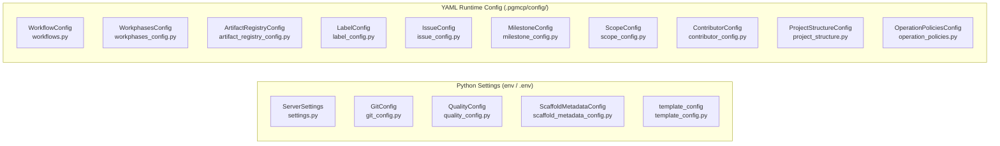

# Config Consumers
<!-- template=architecture version=8b924f78 created=2026-03-13T19:25Z updated=2026-03-13 -->

**Status:** DRAFT
**Version:** 1.0
**Last Updated:** 2026-03-13

---

## Purpose

Document every config class in `mcp_server/config/` and identify which managers and
tools consume it — providing a full cross-reference for impact analysis when a config
class changes.

## Scope

**In Scope:** All 16 config files, their primary classes, and their consumers (managers + tools)

**Out of Scope:** Config file format details, Pydantic field definitions, runtime load order

---

## 1. Two Config Domains

The config layer splits into two domains with different load mechanisms.

---

## 2. Full Consumer Matrix

### Python Settings

| Config Class | File | Primary Consumer(s) |
|-------------|------|---------------------|
| `ServerSettings` / `settings` | `settings.py` | `test_tools`, `code_tools`, `discovery_tools`, `ArtifactManager` |
| `GitConfig` | `git_config.py` | `GitManager`, `PhaseStateEngine`, `git_tools`, `issue_tools`, `pr_tools`, `cycle_tools`, `git_analysis_tools` |
| `QualityConfig` | `quality_config.py` | `QAManager` |
| `ScaffoldMetadataConfig` | `scaffold_metadata_config.py` | `ScaffoldMetadataParser` (scaffolding layer) |
| `template_config` (module) | `template_config.py` | `ArtifactManager`, `issue_tools` |

### YAML Runtime Config

| Config Class | YAML File | Primary Consumer(s) |
|-------------|-----------|---------------------|
| `WorkflowConfig` | `.pgmcp/config/workflows.yaml` | `PhaseStateEngine`, `ProjectManager`, `project_tools`, `issue_tools` |
| `WorkphasesConfig` | `.pgmcp/config/workphases.yaml` or similar | `PhaseStateEngine`, `PhaseContractResolver` |
| `ArtifactRegistryConfig` | `.pgmcp/templates/config.yaml` | `ArtifactManager` |
| `LabelConfig` | `.pgmcp/config/labels.yaml` | `label_tools`, `issue_tools` |
| `IssueConfig` | `.pgmcp/config/issue_config.yaml` | `issue_tools` |
| `MilestoneConfig` | `.pgmcp/config/milestone_config.yaml` | `issue_tools` |
| `ScopeConfig` | `.pgmcp/config/scope_config.yaml` | `issue_tools` |
| `ContributorConfig` | `.pgmcp/config/contributors.yaml` | `issue_tools` |
| `ProjectStructureConfig` | `.pgmcp/config/project_structure.yaml` | `ProjectManager` |
| `OperationPoliciesConfig` | `.pgmcp/config/operation_policies.yaml` | `QAManager` (indirect) |

---

## 3. Per-Manager Config Usage

Shows which config classes each manager directly imports.

| Manager | Config imports |
|---------|---------------|
| `GitManager` | `GitConfig` |
| `PhaseStateEngine` | `GitConfig`, `WorkflowConfig`, `WorkphasesConfig` |
| `PhaseContractResolver` | `WorkphasesConfig` |
| `ProjectManager` | `WorkflowConfig`, `ProjectStructureConfig` |
| `QAManager` | `QualityConfig`, `OperationPoliciesConfig` |
| `ArtifactManager` | `ArtifactRegistryConfig`, `ServerSettings`, `template_config` |
| `GitHubManager` | *(GitHub token from env, no typed config class)* |
| `EnforcementRunner` | *(reads enforcement.yaml via GitConfig path)* |
| `DeliverableChecker` | *(receives CheckSpec list from PhaseContractResolver — no direct config import)* |

---

## 4. Per-Tool Config Usage

Tools that bypass managers and import config directly.

| Tool file | Direct config imports |
|----------|-----------------------|
| `git_tools` | `GitConfig` |
| `issue_tools` | `WorkflowConfig`, `LabelConfig`, `IssueConfig`, `MilestoneConfig`, `ScopeConfig`, `ContributorConfig`, `template_config` |
| `pr_tools` | `GitConfig` |
| `cycle_tools` | `GitConfig` |
| `git_analysis_tools` | `GitConfig` |
| `test_tools` | `ServerSettings` |
| `code_tools` | `ServerSettings` |
| `discovery_tools` | `ServerSettings` |
| `label_tools` | `LabelConfig` |
| `phase_tools` | *(via managers only)* |
| `quality_tools` | *(via QAManager only)* |
| `validation_tools` | *(via QAManager only)* |
| `scaffold_artifact` | *(via ArtifactManager only)* |

---

## Known Architectural Issues

| ID | Severity | Description |
|----|----------|-------------|
| RC-6 | High | `GitConfig` is consumed by tools directly, bypassing manager abstraction — changes to git config propagate unpredictably |
| RC-1 | Medium | No single registry maps config class → all consumers; this document is the only cross-reference |
| CFG-1 | Low | `GitHubManager` reads the GitHub token from env rather than a typed `GitHubConfig` class, making it invisible in this matrix |
| CFG-2 | Low | `issue_tools` imports 6 separate config classes directly — the largest direct-config consumer; candidate for consolidation into a manager |

---

## Constraints & Decisions

| Decision | Rationale | Alternatives Rejected |
|----------|-----------|----------------------|
| Constructor injection for all managers | Testable; config can be mocked per test | Global singleton (hard to override in tests) |
| YAML files loaded at startup, not per-call | Avoids repeated I/O on every tool invocation | Per-call load (performance penalty on high-frequency calls) |
| Pydantic for Python settings | Type-safe, validated on startup, env-var override support | `configparser` / raw dict (no validation) |

---

## Related Documentation

- **[01_module_decomposition.md][related-1]**
- **[05_config_layer.md][related-2]**
- **[09_scaffolding_subsystem.md][related-3]**

[related-1]: 01_module_decomposition.md
[related-2]: 05_config_layer.md
[related-3]: 09_scaffolding_subsystem.md
---

## Version History

| 1.1 | 2026-07-08 | Agent | Reconcile `.phase-gate` with `.pgmcp/config` and fix relative links (#420) |
| 1.0 | 2026-03-13 | Agent | Initial draft — full config consumer cross-reference |
