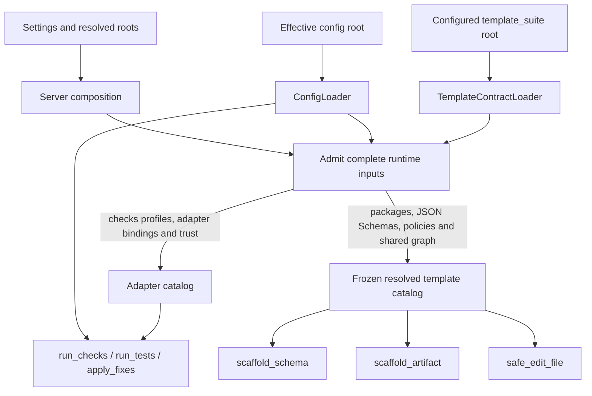

<!-- docs/manuals/architectural_diagrams/10_config_consumers.md -->
# Configuration Consumers

**Status:** Current runtime overview; this is not an exhaustive consumer registry.
**Last Updated:** 2026-09-24

## Purpose and boundary

Show the configuration and template-suite dependencies for V3 discovery, validation,
rendering, and execution. The diagram summarizes the relevant composition seam; exact
fields and package inventory remain owned by their schemas and configuration files.

## Resolved startup dependencies

The server resolves workspace, server-data, configuration, and template-suite roots
from settings. An explicit configuration or suite root remains the selected root; there
is no second mutable artifact registry or scaffold-metadata side channel.

```mermaid
flowchart TD
    Settings[Settings and resolved roots] --> Bootstrap[Server composition]
    Bootstrap --> Admission[Admit complete runtime inputs]
    Config[Effective config root] --> Loader[ConfigLoader]
    Loader --> Admission
    Suite[Configured template_suite root] --> Contracts[TemplateContractLoader]
    Contracts --> Admission
    Admission -->|checks profiles, adapter bindings and trust| Adapters[Adapter catalog]
    Admission -->|packages, JSON Schemas, policies and shared graph| Catalog[Frozen resolved template catalog]
    Catalog --> Discovery[scaffold_schema]
    Catalog --> Scaffold[scaffold_artifact]
    Catalog --> Edit[safe_edit_file]
    Loader --> Checks[run_checks / run_tests / apply_fixes]
    Adapters --> Checks
```

`ConfigLoader` reads the modular check, test, and fix configuration and package
contracts against the selected roots. Startup admission verifies that every referenced
output profile and adapter capability is available, applies explicit workspace-adapter
trust, resolves the suite graph, and publishes one coherent catalog and adapter
capability set. A failure blocks publication; tools do not fall back to legacy
`quality.yaml`, template-registry, or per-call configuration reads.

## Consumer responsibilities

| Consumer boundary | Consumes | Responsibility |
|---|---|---|
| `scaffold_schema` | Frozen template catalog | Discover one admitted package's identity, purpose, version, fingerprint, and JSON Schema |
| `scaffold_artifact` | Frozen catalog, artifact identity, check service, target resolver | Validate inputs, render content with provenance, check the configured profile, and persist according to target policy |
| `safe_edit_file` | Frozen catalog/profile selection and validation service | Construct the requested edit and apply its enforce/report validation policy |
| `run_checks`, `run_tests`, `apply_fixes` | Modular config and adapter capabilities | Execute only configured bindings under their tool-specific scope and outcomes |

These rows are a focused dependency view, not an exhaustive list of settings, tools, or
all consumers. GitHub, workflow, and logging configuration continue to have their
independent owners and are outside this scaffolding/configuration seam.

## Source references

- [Config loader](../../../mcp_server/config/loader.py)
- [Server bootstrap composition](../../../mcp_server/bootstrap.py)
- [Suite-resolution design](../../development/issue460/design-suite-resolution.md)
- [Configuration and execution design](../../development/issue460/design-execution-adapters.md)
- [Scaffolding subsystem](09_scaffolding_subsystem.md)
- [Config layer overview](05_config_layer.md)
