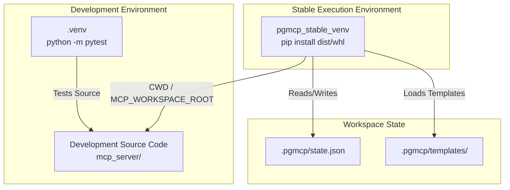

<!-- docs\setup\dev-isolation.md -->
<!-- template=generic_doc version=43c84181 created=2026-07-08T05:42Z updated= -->
# Developer Isolation

**Status:** APPROVED  
**Version:** 1.0  
**Last Updated:** 2026-07-08

---

## Purpose

Establish development isolation where the active running server instance operates from a packaged wheel installed in a stable virtual environment, completely decoupled from the active development codebase python source files.

## Prerequisites

Read these first:
1. Python 3.10+
2. pip
3. build package installed
---

## Summary

This guide documents the developer isolation setup, virtual environment separation, env variables configuration, and the workflow loop to build and run the MCP server hermetically.


---

## Architecture

The developer isolation model ensures the active running server instance operates from a stable python environment while interacting with the active development repository.



## Step-by-Step

Follow these steps to configure isolation:

1. Create the stable execution environment:
   ```powershell
   python -m venv pgmcp_stable_venv
   ```
2. Build the server wheel package from the development repository:
   ```powershell
   python scripts/build_package.py
   ```
3. Install the wheel into the stable execution environment:
   ```powershell
   ./pgmcp_stable_venv/Scripts/pip install dist/phase_gate_mcp-1.0.0-py3-none-any.whl --force-reinstall
   ```
4. Setup settings in your IDE to point the MCP server configuration to the stable python executable while setting the CWD or workspace root environment variable to the development repository directory.

## Environment Variables

| Variable | Value | Purpose |
| --- | --- | --- |
| `MCP_WORKSPACE_ROOT` | Path to dev workspace | Ensures the server acts on the codebase under development. |
| `MCP_SERVER_PROJECT_DIR` | `.pgmcp` | Directs the server state directory within the workspace. |
| `PYTHONPATH` | *Empty* / *Unset* | Prevents stable server from importing local un-packaged Python source files. |

## Development Workflow

Maintain isolation using this workflow cycle:
1. Edit code and tests in the dev workspace.
2. Run unit and integration tests locally in `.venv`:
   ```powershell
   pytest tests/
   ```
3. Run linter and quality checks:
   ```powershell
   run_quality_gates
   ```
4. Re-compile package assets and rebuild the wheel:
   ```powershell
   python scripts/build_package.py
   ```
5. Re-install the new wheel in the stable environment:
   ```powershell
   ./pgmcp_stable_venv/Scripts/pip install dist/phase_gate_mcp-1.0.0-py3-none-any.whl --force-reinstall
   ```

## Related Documentation
- **[docs/coding_standards/DOCUMENTATION_STANDARD.md][related-1]**
- **[docs/development/issue420/research.md][related-2]**
- **[docs/development/issue420/design.md][related-3]**

<!-- Link definitions -->

[related-1]: docs/coding_standards/DOCUMENTATION_STANDARD.md
[related-2]: docs/development/issue420/research.md
[related-3]: docs/development/issue420/design.md

---

## Version History

| Version | Date | Author | Changes |
|---------|------|--------|---------|
| 1.0 | 2026-07-08 | Agent | Initial draft |