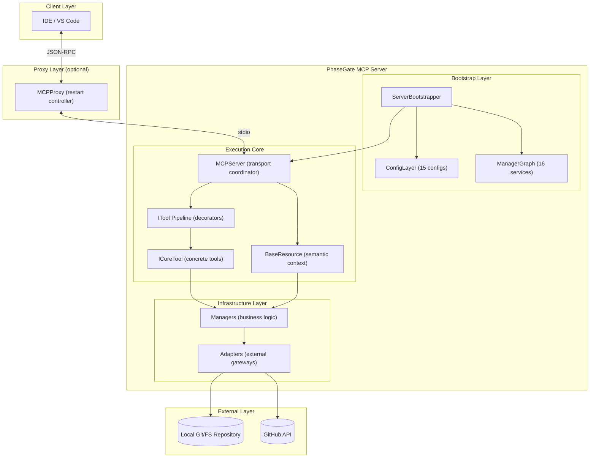
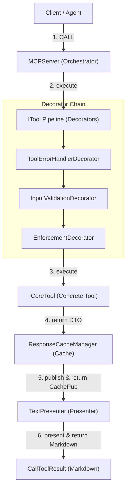
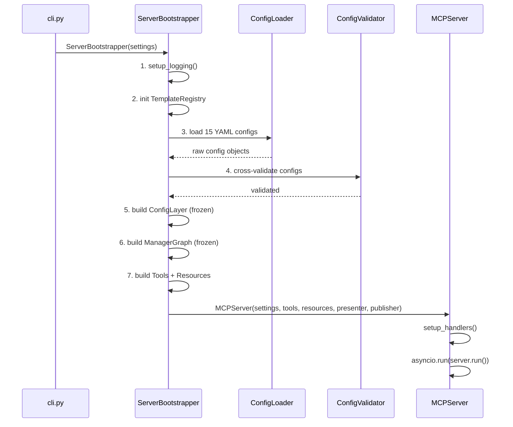
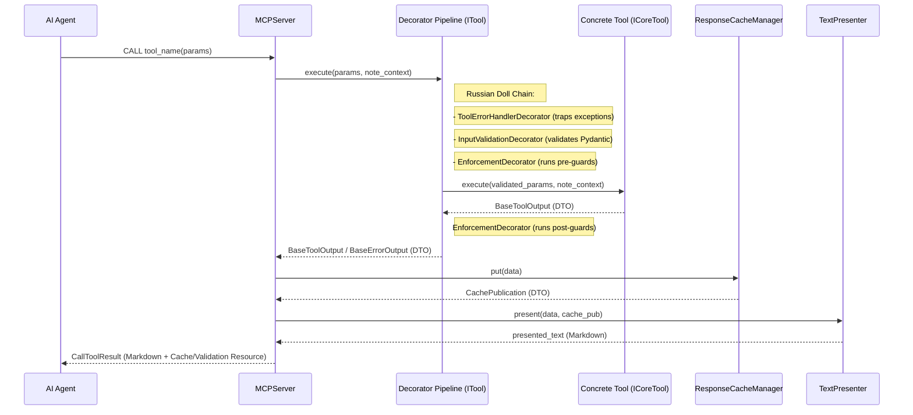
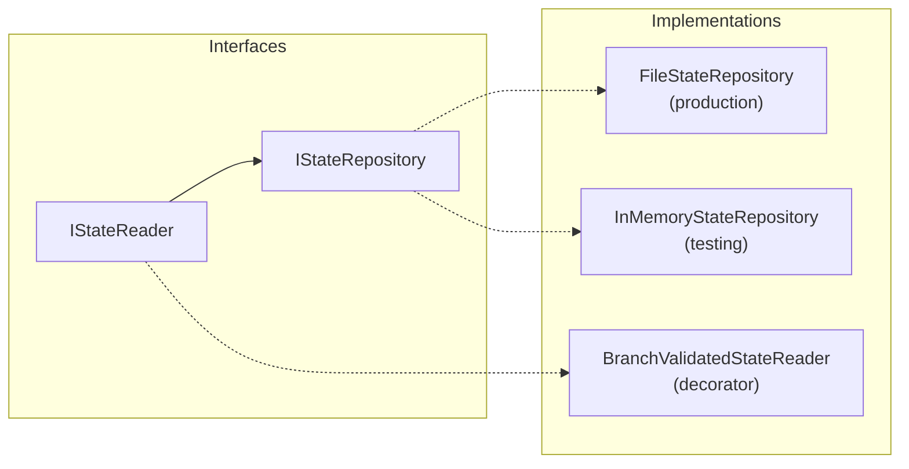

# PhaseGate MCP Server — Architecture

**Status:** Current  
**Version:** 3.1  
**Last Updated:** 2026-06-24

---

## 1. Overview

### 1.1 Purpose

The **PhaseGate MCP Server** is a Model Context Protocol (MCP) server that orchestrates
workflow-driven software development. It acts as an intelligent bridge between AI agents
and a project's development environment, enforcing phase-gated workflows with built-in
quality gates, Git conventions, and GitHub integration.

### 1.2 Core Capabilities

| Capability | Description |
|------------|-------------|
| **Workflow Enforcement** | Phase-gated development lifecycles with configurable workflows (feature, bug, hotfix, refactor, docs, epic, custom) |
| **Semantic Context** | Exposes project status, coding standards, and GitHub issues as structured MCP Resources |
| **Tool-Based Operations** | 50 tools encapsulating Git, GitHub, QA, scaffolding, and project management operations |
| **Quality Gates** | Automated linting (ruff), type-checking (pyright), and test execution with configurable thresholds |
| **Template Scaffolding** | 4-tier Jinja2 template system for generating code, tests, and documentation |
| **Enforcement System** | Pre/post enforcement rules that block unsafe operations (e.g., branch mutation while PR is open) |

### 1.3 Design Principles

> For the full binding architecture contract, see
> [ARCHITECTURE_PRINCIPLES.md](../coding_standards/ARCHITECTURE_PRINCIPLES.md).

| Principle | Application |
|-----------|-------------|
| **Constructor Injection** | All dependencies wired in `__init__`, never instantiated inside methods |
| **Configuration-Driven** | Behavior controlled via 15 YAML files under `.phase-gate/config/`, not hardcoded |
| **Immutable State** | All value objects and config layers use `frozen=True` |
| **Interface Segregation** | Narrow `Protocol` interfaces (e.g., `IStateReader` vs `IStateRepository`) |
| **CQS** | Methods either query state or mutate it, never both |
| **Registry / Config-Driven Dispatch** | No if-chains on phase names; use config lookups or registries |

### 1.4 Workflow Lifecycle

The server supports multiple workflow types, each with its own phase sequence defined in
`contracts.yaml`. There is no single fixed lifecycle.

| Workflow | Phases | Use Case |
|----------|--------|---------|
| `feature` | research → design → planning → implementation → validation → documentation → ready | New feature development |
| `bug` | research → design → planning → implementation → validation → documentation → ready | Bug fixes |
| `refactor` | research → planning → implementation → validation → documentation → ready | Code refactoring |
| `docs` | planning → documentation → ready | Documentation-only changes |
| `hotfix` | implementation → validation → documentation → ready | Emergency fixes |
| `epic` | See `contracts.yaml` for the full epic phase order | Multi-issue features |
| `custom` | User-defined | Custom workflows |

> **Detailed phases and transitions:** See [PHASE_WORKFLOWS.md](./PHASE_WORKFLOWS.md).

---

## 2. Tech Stack

### 2.1 Runtime Dependencies

| Package | Version | Purpose |
|---------|---------|--------|
| Python | ≥ 3.11 | Runtime |
| `mcp` | ≥ 1.0.0 | MCP SDK (stdio transport) |
| `pydantic` | ≥ 2.5.0 | Schema validation, config models |
| `gitpython` | ≥ 3.1.0 | Git operations |
| `PyGithub` | ≥ 2.0.0 | GitHub API integration |
| `pyyaml` | ≥ 6.0.1 | YAML config loading |

### 2.2 Development Dependencies

| Package | Purpose |
|---------|---------|
| `pytest` + `pytest-asyncio` + `pytest-xdist` | Testing (parallel, async) |
| `pyright` | Static type checking |
| `ruff` | Linting and formatting |
| `pytest-cov` | Coverage (≥ 90% branch target) |

---

## 3. System Architecture

### 3.1 High-Level Overview



### 3.2 Detailed Execution Flow

For a detailed view of how the execution pipeline runs and interacts with the caching and presentation engines, see the sequence diagram in §6.2. The block diagram below illustrates the path of a tool call through the Russian Doll decorator chain:



### 3.2 Layer Responsibilities

| Layer | Components | Responsibility |
|-------|------------|----------------|
| **Composition Root** | `ServerBootstrapper`, `ConfigLayer`, `ManagerGraph` | Config loading, DI wiring, server construction |
| **Runtime** | `MCPServer`, `NoteContext` | MCP protocol handling, tool dispatch coordination |
| **Tools** | 50 `ICoreTool` instances wrapped in a decorator pipeline | Delegate business logic to managers and return semantic DTOs |
| **Resources** | 4 `BaseResource` subclasses | Expose read-only project context via `pgmcp://` URIs |
| **Managers** | 18 manager classes | Business logic, workflow state, quality gates |
| **Adapters** | `FilesystemAdapter`, `GitAdapter`, `GitHubAdapter` | External system integration |

---

## 4. Module Structure

```
mcp_server/
├── __init__.py
├── __main__.py                    # Entry point: python -m mcp_server
├── cli.py                         # CLI with argparse
├── server.py                      # MCPServer class (400 lines)
├── bootstrap.py                   # ServerBootstrapper + ConfigLayer + ManagerGraph (632 lines)
├── py.typed                       # PEP 561 marker
│
├── adapters/                      # External system adapters (3 files)
│   ├── filesystem.py              # File read/write operations
│   ├── git_adapter.py             # GitPython wrapper
│   └── github_adapter.py          # PyGithub wrapper
│
├── config/                        # Configuration loading
│   ├── loader.py                  # ConfigLoader (central YAML reader)
│   ├── settings.py                # Settings (Pydantic, from env vars)
│   ├── validator.py               # Cross-config validation
│   └── schemas/                   # 16 Pydantic config schema files
│       ├── __init__.py            # Re-exports all 46+ config types
│       ├── git_config.py
│       ├── workflows.py
│       ├── workphases.py
│       ├── quality_config.py
│       ├── contracts_config.py
│       └── ...                    # 11 more schema files
│
├── core/                          # Core infrastructure
│   ├── exceptions.py              # MCPError hierarchy
│   ├── error_handling.py          # General error handling
│   ├── logging.py                 # Structured logging + audit log
│   ├── operation_notes.py         # NoteContext + generic Note class
│   ├── phase_detection.py         # ScopeDecoder
│   ├── policy_engine.py           # PolicyEngine
│   ├── proxy.py                   # MCPProxy (transparent restart)
│   ├── scope_encoder.py
│   ├── commit_phase_detector.py
│   ├── directory_policy_resolver.py
│   ├── tool_factory.py            # ToolFactory composition root
│   ├── decorators/                # Russian Doll execution decorators
│   │   ├── __init__.py            # Re-exports all decorators
│   │   ├── enforcement_decorator.py
│   │   ├── input_validation_decorator.py
│   │   └── tool_error_handler_decorator.py
│   └── interfaces/
│       ├── __init__.py            # Re-exports interfaces facade
│       ├── itool.py               # Pure execution interface ITool
│       ├── icore_tool.py          # Generic execution interface ICoreTool
│       ├── ipresenter.py          # IPresenter interface
│       ├── itool_response_cache.py # CQRS segregated cache interfaces
│       ├── gate.py                # GateReport and workflow gate runner interfaces
│       ├── state.py               # State reader and repository interfaces
│       ├── git.py                 # Git context reader interfaces
│       ├── ipr_status.py          # PR status reader and writer interfaces
│       ├── ipytest_runner.py      # Pytest runner interface
│       ├── quality.py             # Quality state repository interface
│       ├── workflow.py            # Workflow state mutator interface
│       └── context.py             # Context loaded reader and writer interfaces
│
├── managers/                      # Business logic (18 files)
│   ├── git_manager.py
│   ├── github_manager.py
│   ├── qa_manager.py
│   ├── artifact_manager.py
│   ├── phase_state_engine.py
│   ├── project_manager.py
│   ├── state_repository.py        # FileStateRepository + BranchState
│   ├── workflow_state_mutator.py
│   ├── workflow_status_resolver.py
│   ├── workflow_gate_runner.py
│   ├── enforcement_runner.py
│   ├── phase_contract_resolver.py
│   ├── state_reconstructor.py
│   ├── pytest_runner.py
│   ├── quality_state_repository.py
│   ├── deliverable_checker.py
│   └── branch_parent_reader.py
│
├── tools/                         # MCP tool implementations (22 files)
│   ├── base.py                    # BaseTool + BranchMutatingTool ABCs
│   ├── tool_result.py             # ToolResult value object
│   ├── git_tools.py               # 11 Git tools
│   ├── git_analysis_tools.py      # ListBranches, Diff
│   ├── git_fetch_tool.py
│   ├── git_pull_tool.py
│   ├── issue_tools.py             # 5 Issue tools
│   ├── pr_tools.py                # 4 PR tools
│   ├── label_tools.py             # 6 Label tools
│   ├── milestone_tools.py         # 3 Milestone tools
│   ├── phase_tools.py             # Phase transition tools
│   ├── cycle_tools.py             # Cycle transition tools
│   ├── project_tools.py           # Project init, planning deliverables
│   ├── quality_tools.py           # RunQualityGates
│   ├── test_tools.py              # RunTests
│   ├── discovery_tools.py         # SearchDocumentation, GetWorkContext
│   ├── safe_edit_tool.py          # SafeEdit
│   ├── scaffold_artifact.py       # ScaffoldArtifact
│   ├── scaffold_schema_tool.py    # ScaffoldSchema
│   ├── template_validation_tool.py
│   ├── health_tools.py
│   └── admin_tools.py
│
├── resources/                     # MCP resources (5 files)
│   ├── base.py                    # BaseResource ABC
│   ├── cache.py                   # pgmcp://cache/runs/{run_id}
│   ├── standards.py               # pgmcp://rules/coding_standards
│   ├── status.py                  # pgmcp://status/phase
│   └── github.py                  # pgmcp://github/issues
│
├── state/                         # State DTOs and caches (6 files)
│   ├── context.py                 # SessionContext
│   ├── context_loaded_cache.py    # ContextLoadedCache (ISP split)
│   ├── pr_status_cache.py         # PRStatusCache
│   ├── quality_state.py           # QualityState (frozen)
│   ├── workflow_status.py         # WorkflowStatusDTO (frozen)
│   └── github_read_models.py
│
├── schemas/                       # Scaffold context schemas
│   ├── base.py
│   ├── contexts/                  # 25 context schema files
│   ├── mixins/                    # Shared schema mixins
│   └── render_contexts/           # 22 render context files
│
├── scaffolders/                   # Scaffolding executors
│   ├── base_scaffolder.py
│   ├── scaffold_result.py
│   └── template_scaffolder.py
│
├── scaffolding/                   # Template engine
│   ├── base.py
│   ├── renderer.py
│   ├── metadata.py
│   ├── template_registry.py
│   ├── template_introspector.py
│   ├── version_hash.py
│   ├── utils.py
│   ├── components/                # 8 component files
│   └── templates/                 # 4-tier template hierarchy
│       ├── tier0_base_artifact.jinja2
│       ├── tier1_*.jinja2          # Format bases
│       ├── tier2_*.jinja2          # Language bases
│       ├── tier3_*.jinja2          # Pattern fragments
│       └── concrete/              # 22 final templates
│
├── services/                      # Application services
│   ├── document_indexer.py
│   ├── search_service.py
│   └── template_engine.py
│
├── validation/                    # Template validation (9 files)
│   ├── layered_template_validator.py
│   ├── markdown_validator.py
│   ├── python_validator.py
│   ├── template_analyzer.py
│   └── ...                        # 5 more validation files
│
├── integrations/                  # Reserved for future use
│
└── utils/                         # Shared utilities
    ├── atomic_json_writer.py      # Atomic file writes
    ├── path_resolver.py
    ├── schema_utils.py
    └── template_config.py
```

### Module Counts

| Category | Files |
|----------|-------|
| Tool implementations | 22 |
| Managers | 18 |
| Config schemas | 16 |
| Validation | 9 |
| Scaffolding engine | 16 |
| Templates (Jinja2) | 54 |
| State / caches | 6 |
| Resources | 4 |
| Adapters | 3 |

---

## 5. Startup & Bootstrap

### 5.1 Entry Points

| Command | Path | Purpose |
|---------|------|---------|
| `python -m mcp_server` | `__main__.py` → `cli.main()` → `server.main()` | Standard server start |
| `python -m mcp_server.core.proxy` | `proxy.main()` → `MCPProxy` | Transparent restart proxy |

### 5.2 Bootstrap Sequence



### 5.3 ConfigLayer (Frozen Dataclass)

15 immutable config objects loaded from `.phase-gate/config/` YAML files:

| Config | Source YAML | Purpose |
|--------|-------------|--------|
| `git_config` | `git.yaml` | Branch naming, commit conventions |
| `workflow_config` | `workflows.yaml` | Workflow type definitions |
| `workphases_config` | `workphases.yaml` | Phase catalog |
| `contracts_config` | `contracts.yaml` | Phase contracts, deliverables, merge policy |
| `quality_config` | `quality.yaml` | Quality gate thresholds |
| `label_config` | `labels.yaml` | GitHub label definitions |
| `issue_config` | `issues.yaml` | Issue type definitions |
| `scope_config` | `scopes.yaml` | Scope definitions |
| `milestone_config` | `milestones.yaml` | Milestone config |
| `contributor_config` | `contributors.yaml` | Contributor entries |
| `artifact_registry` | `artifacts.yaml` | Artifact type registry |
| `project_structure_config` | `project_structure.yaml` | Directory policies |
| `operation_policies_config` | `policies.yaml` | Phase-based operation restrictions |
| `enforcement_config` | `enforcement.yaml` | Tool enforcement rules |
| `presentation_config` | `presentation.yaml` | Note presentation templates, recovery hints, and link formats |

### 5.4 ManagerGraph (Frozen Dataclass)

16 service instances wired via pure constructor injection:

| Service | Key Responsibilities |
|---------|---------------------|
| `git_manager` | Git operations (branch, commit, push, merge) |
| `github_manager` | GitHub API (issues, PRs, labels, milestones) |
| `qa_manager` | Quality gate execution (ruff, pyright) |
| `artifact_manager` | Template scaffolding orchestration |
| `phase_state_engine` | Phase/cycle transition logic |
| `project_manager` | Project initialization, planning deliverables |
| `workflow_state_mutator` | Atomic state mutations |
| `workflow_status_resolver` | Derive current workflow status |
| `workflow_gate_runner` | Evaluate phase/cycle exit gates |
| `state_repository` | Persisted branch state (state.json) |
| `state_reconstructor` | Reconstruct state for orphaned branches |
| `phase_contract_resolver` | Resolve phase contracts from config |
| `quality_state_repository` | Quality baseline state |
| `enforcement_runner` | Pre/post tool enforcement rules |
| `context_loaded_cache` | Track `get_work_context` invocation |
| `pr_status_cache` | Cache PR open/absent status per branch |

### 5.5 DI Pattern

No DI container or framework. All wiring is explicit in
`ServerBootstrapper._build_manager_graph()`. The `ManagerGraph` is a plain frozen
dataclass — no service locator, no lazy resolution.

> **Detailed config loading architecture:** See
> [config-loading-architecture.md](../reference/mcp/config-loading-architecture.md).

---

## 6. Tool Execution

### 6.1 Tool Architecture

Instead of inheriting from a monolithic base class, all tools implement the narrow, generic `ICoreTool` protocol. This protocol defines the metadata and execution boundary for a tool call:

```python
@runtime_checkable
class ICoreTool(Protocol, Generic[TInput, TOutput]):
    @property
    def name(self) -> str:
        """Name of the tool shown to the client."""
        ...

    @property
    def description(self) -> str:
        """Description of the tool shown to the client."""
        ...

    @property
    def args_model(self) -> type[BaseModel] | None:
        """Pydantic input validation model."""
        ...

    async def execute(self, params: TInput, context: NoteContext) -> TOutput:
        """Execute the contract operation."""
        ...
```

All concrete tools are registered in the `ServerBootstrapper` as raw `ICoreTool` implementations. At startup, the `ToolFactory` wraps them in the modular Russian Doll decorator pipeline (`ToolErrorHandlerDecorator`, `InputValidationDecorator`, `EnforcementDecorator`), converting them into executable `ITool` instances.

### 6.2 Tool Dispatch Flow



### 6.3 Tool Categories (50 tools)

| Category | Count | Examples |
|----------|-------|---------|
| Git operations | 15 | `create_branch`, `git_add_or_commit`, `git_checkout`, `git_push`, `git_merge`, `git_stash`, `git_restore`, `git_fetch`, `git_pull`, ... |
| GitHub Issues | 5 | `create_issue`, `get_issue`, `list_issues`, `update_issue`, `close_issue` |
| GitHub PRs | 4 | `list_prs`, `get_pr`, `merge_pr`, `submit_pr` |
| GitHub Labels | 5 | `list_labels`, `create_label`, `delete_label`, `add_labels`, `remove_labels` |
| GitHub Milestones | 3 | `list_milestones`, `create_milestone`, `close_milestone` |
| Phase / Cycle | 4 | `transition_phase`, `force_phase_transition`, `transition_cycle`, `force_cycle_transition` |
| Project Management | 4 | `initialize_project`, `get_project_plan`, `save_planning_deliverables`, `update_planning_deliverables` |
| Quality & Testing | 3 | `run_quality_gates`, `run_tests`, `validate_template` |
| Scaffolding | 2 | `scaffold_artifact`, `scaffold_schema` |
| Discovery | 2 | `search_documentation`, `get_work_context` |
| File Editing | 1 | `safe_edit_file` |
| Admin | 2 | `health_check`, `restart_server` |

### 6.4 Tool Registration

Tools are **not** auto-discovered. They are explicitly instantiated in
`ServerBootstrapper._build_tools()` with all dependencies injected via constructors.
GitHub-dependent tools (PRs, labels, milestones) are conditionally registered
only when `settings.github.token` is set.

### 6.5 Enforcement System

Configured via `enforcement.yaml`. Pre/post enforcement rules are dispatched by
tool name or tool category. Four built-in action types:

| Action | Purpose |
|--------|---------|
| `check_branch_policy` | Validates branch creation base |
| `check_pr_status` | Blocks branch-mutating ops when PR is open |
| `check_phase_readiness` | Blocks tools when in the wrong workflow phase |
| `check_context_loaded` | Blocks tools until `get_work_context` has been called |

### 6.6 NoteContext System

Per-tool-call bidirectional notes bus. Operates on a single generic `Note(key, params)`
dataclass (legacy subclasses like `ExclusionNote`, `RecoveryNote`, etc. have been removed).
Notes are formatted, prioritized, and grouped by the `TextPresenter` using templates
defined in `presentation.yaml` under the `notes` configuration section before being
returned in the final tool response.

---

## 7. Resource System

### 7.1 URI Schemes

The MCP server exposes various resources and validation schemas via the following URI patterns:

| Type | Resource / Schema | URI | Description | Condition |
|------|-------------------|-----|-------------|-----------|
| Resource | Standards | `pgmcp://rules/coding_standards` | Coding standards and guidelines | Always |
| Resource | Status | `pgmcp://status/phase` | Current workflow phase and status | Always |
| Resource | Issues | `pgmcp://github/issues` | Open GitHub issues | When `GITHUB_TOKEN` set |
| Resource | Cache Run | `pgmcp://cache/runs/{run_id}` | Cached tool execution results (DTO payloads) | Always |
| Schema | Validation Schema | `schema://validation` | Pydantic validation input schemas (inline payload) | Always (on ValidationError) |

### 7.2 BaseResource

```python
class BaseResource(ABC):
    uri_pattern: str
    description: str = ""
    mime_type: str = "application/json"

    @abstractmethod
    async def read(self, uri: str) -> str

    def matches(self, uri: str) -> bool  # Exact URI match
```

---

## 8. Configuration

### 8.1 Settings (Environment Variables)

| Variable | Required | Default | Description |
|----------|----------|---------|-------------|
| `MCP_WORKSPACE_ROOT` | ❌ | cwd | Workspace root directory |
| `MCP_SERVER_PROJECT_DIR` | ❌ | `.phase-gate` | Server root directory name |
| `MCP_SERVER_NAME` | ❌ | `phase-gate-mcp` | Server display name |
| `GITHUB_TOKEN` | ❌ | — | GitHub PAT (enables GitHub tools) |
| `GITHUB_OWNER` | ❌ | — | GitHub repository owner |
| `GITHUB_REPO` | ❌ | — | GitHub repository name |
| `LOG_LEVEL` | ❌ | `INFO` | Log level |
| `MCP_CONFIG_PATH` | ❌ | — | Override config YAML path |

### 8.2 YAML Configuration Files

All config files reside in `.phase-gate/config/`. See §5.3 for the full mapping.

> **Detailed config-loading architecture:** See
> [config-loading-architecture.md](../reference/mcp/config-loading-architecture.md).

### 8.3 Cross-Config Validation

`ConfigValidator` runs at startup to enforce consistency:
- Phase contracts reference only known phases from `workphases.yaml`
- Operation policies reference only valid phases
- Project structure artifact types match the artifact registry
- Merge policy phases are valid workflow phases

---

## 9. State Management

### 9.1 Persisted State

| File | Model | Contents |
|------|-------|----------|
| `.phase-gate/state.json` | `BranchState` | Branch, issue number, workflow, current phase, cycle, transitions, parent branch |
| `.phase-gate/quality_state.json` | `QualityState` | Baseline commit SHA, failed files list |
| `.phase-gate/template_registry.json` | — | Template version tracking |

### 9.2 State Repository Pattern



- **`FileStateRepository`** — Filesystem-backed, uses `AtomicJsonWriter` for safe writes
- **`BranchValidatedStateReader`** — Decorator that enforces branch identity on load
- **`InMemoryStateRepository`** — For unit tests

### 9.3 State Mutation

`WorkflowStateMutator.apply(branch, mutate_fn)` provides atomic read-mutate-write
with coordination lock. The `BranchState` model is frozen (`frozen=True`); mutations
produce new instances via `.with_updates(**kwargs)`.

### 9.4 In-Memory Caches

| Cache | Purpose | ISP Split |
|-------|---------|----------|
| `ContextLoadedCache` | Tracks if `get_work_context` was called per branch | `IContextLoadedReader` + `IContextLoadedWriter` |
| `PRStatusCache` | Caches PR open/absent status per branch | `IPRStatusReader` + `IPRStatusWriter` |

---

## 10. Error Handling

### 10.1 Exception Hierarchy

```
MCPError (base, code="ERR_INTERNAL")
├── ConfigError (code="ERR_CONFIG")
├── ValidationError (code="ERR_VALIDATION")
│   └── MetadataParseError
├── PreflightError (code="ERR_PREFLIGHT")
├── ExecutionError (code="ERR_EXECUTION")
└── MCPSystemError (code="ERR_SYSTEM")
```

### 10.2 Error Response Pattern

All tool errors and platform/decorator exceptions are caught by `ToolErrorHandlerDecorator` and converted to structured DTOs (inheriting from `BaseErrorOutput` or `ValidationErrorOutput`), which are then published to the cache and formatted into markdown by `TextPresenter`.
The presented markdown text:
- Displays a clean error summary without python tracebacks
- Appends recovery hints and a reference to the cache resource (`pgmcp://cache/runs/{run_id}`)

---

## 11. Security

| Aspect | Implementation |
|--------|----------------|
| **Transport** | stdio (local only) — inherits OS-level security |
| **GitHub Token** | Environment variable; never logged; scoped to repo |
| **File Access** | Sandboxed to workspace root |
| **Audit Logging** | All tool executions logged with structured metadata |

---

## 12. Proxy Architecture

`MCPProxy` (`core/proxy.py`) is an optional transparent proxy between the IDE and
the MCP server subprocess. Features:

- Captures `initialize` handshake for replay on restart
- Monitors stderr for `__MCP_RESTART_REQUEST__` marker
- Spawns new server process and replays init transparently
- UTF-8 enforcement and Unicode surrogate pair fixing on Windows
- Structured audit logging

Entry point: `python -m mcp_server.core.proxy`

---

## 13. Extension Points

### 13.1 Adding a New Tool

1. Create a new class implementing `ICoreTool[MyToolInput, MyToolOutput]` where `MyToolInput` is a Pydantic model and `MyToolOutput` is a DTO inheriting from `BaseToolOutput`.
2. Define `name`, `description`, `args_model` (pointing to `MyToolInput`), and optionally `tool_category` (for enforcement).
3. Implement `execute(self, params: MyToolInput, context: NoteContext) -> MyToolOutput`.
4. Register the core tool in `ServerBootstrapper._build_tools()`. It will be automatically decorated and wrapped at runtime by the `ToolFactory` composition root.
5. Optionally add enforcement rules in `enforcement.yaml`.

```python
# mcp_server/tools/my_tool.py
from mcp_server.core.interfaces.icore_tool import ICoreTool
from mcp_server.schemas.tool_outputs import BaseToolOutput
from mcp_server.core.operation_notes import NoteContext
from pydantic import BaseModel, Field

class MyToolInput(BaseModel):
    value: str = Field(description="Some input value")

class MyToolOutput(BaseToolOutput):
    result: str = Field(description="The outcome result")

class MyNewTool(ICoreTool[MyToolInput, MyToolOutput]):
    name = "my_new_tool"
    description = "Description shown to the AI agent."
    args_model = MyToolInput
    tool_category = "utility"

    def __init__(self, some_manager: SomeManager) -> None:
        self._manager = some_manager

    async def execute(self, params: MyToolInput, context: NoteContext) -> MyToolOutput:
        result_str = self._manager.do_something(params.value)
        return MyToolOutput(success=True, result=result_str)
```

### 13.2 Adding a New Resource

1. Create a class extending `BaseResource`
2. Define `uri_pattern`, `description`, and implement `read()`
3. Register in `ServerBootstrapper._build_resources()`

### 13.3 Adding a New Scaffold Template

1. Create a Jinja2 template in `mcp_server/scaffolding/templates/concrete/`
2. Register the artifact type in `.phase-gate/config/artifacts.yaml`
3. Create a context schema in `mcp_server/schemas/contexts/`
4. Use via `scaffold_artifact(artifact_type="...", name="...", context={...})`

---

## 14. Testing

### 14.1 Test Structure

Tests reside under `tests/mcp_server/` (not inside the package).

| Category | Location | Count | Purpose |
|----------|----------|-------|---------|
| Unit | `tests/mcp_server/unit/` | ~100+ | Manager logic, tool validation, config schemas |
| Integration | `tests/mcp_server/integration/` | 28 | End-to-end tool execution, workflow flows |
| Acceptance | `tests/mcp_server/acceptance/` | 1 | Full scenario verification |

### 14.2 Test Configuration

- **Framework:** pytest + pytest-asyncio (strict mode)
- **Parallelism:** pytest-xdist (`-n auto`)
- **Markers:** `slow`, `manual` (`RUN_MANUAL_TESTS=1`), `asyncio`
- **Coverage:** Branch coverage ≥ 90% (enforced via quality gate)
- **Strict mode:** `--strict-markers`, `--tb=short`

---

## 15. Deployment

### 15.1 Package

- **Name:** `phase-gate-mcp`
- **Version:** `1.0.0`
- **Build:** setuptools + wheel
- **Python:** ≥ 3.11

### 15.2 Installation

```bash
# From source
pip install -e .

# From wheel
pip install phase_gate_mcp-1.0.0-py3-none-any.whl
```

### 15.3 IDE Integration

```json
{
  "mcpServers": {
    "phase-gate-mcp": {
      "command": "python",
      "args": ["-m", "mcp_server.core.proxy"],
      "cwd": "${workspaceFolder}",
      "env": {
        "GITHUB_TOKEN": "${GITHUB_TOKEN}"
      }
    }
  }
}
```

---

## 16. Related Documentation

- **[ARCHITECTURE_PRINCIPLES.md](../coding_standards/ARCHITECTURE_PRINCIPLES.md)** — Binding architecture contract
- **[config-loading-architecture.md](../reference/mcp/config-loading-architecture.md)** — Config loading, Settings, DI map
- **[TOOLS.md](./TOOLS.md)** — All 50 MCP tools with parameters
- **[RESOURCES.md](./RESOURCES.md)** — MCP resource specifications
- **[PHASE_WORKFLOWS.md](./PHASE_WORKFLOWS.md)** — Workflow phase definitions
- **[GITHUB_SETUP.md](./GITHUB_SETUP.md)** — GitHub configuration

---

## Version History

| Version | Date | Changes |
|---------|------|---------|
| 3.1 | 2026-06-24 | Separated ICoreTool/ILegacyTool interfaces, removed retired tools, corrected architectural diagrams, and documented cache run resource and validation schema URIs |
| 3.0 | 2026-06-10 | Complete rewrite reflecting actual architecture: ServerBootstrapper composition root, 50 class-based tools, 15 YAML configs, enforcement system, proxy architecture |
| 2.0 | 2025-12-08 | Original draft (now superseded) |
| 1.0 | 2025-12-08 | Initial architecture |
